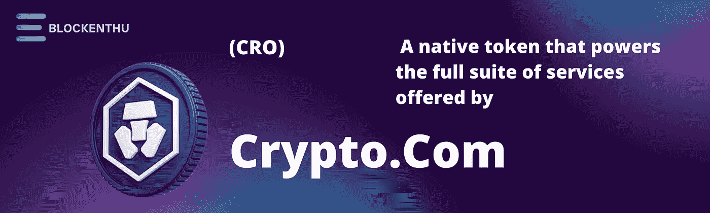
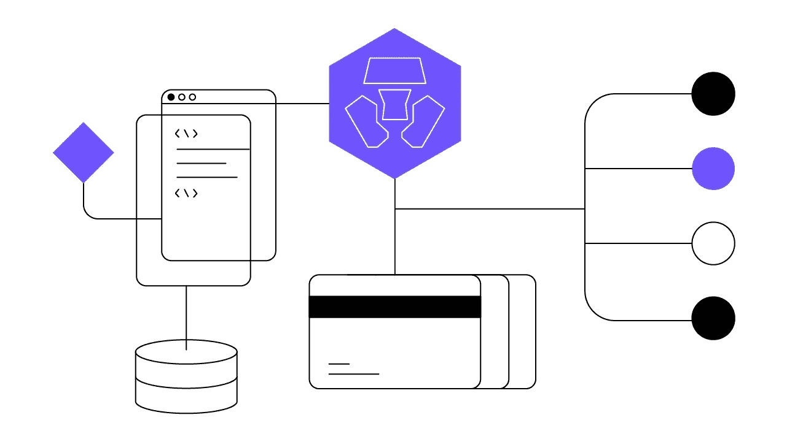
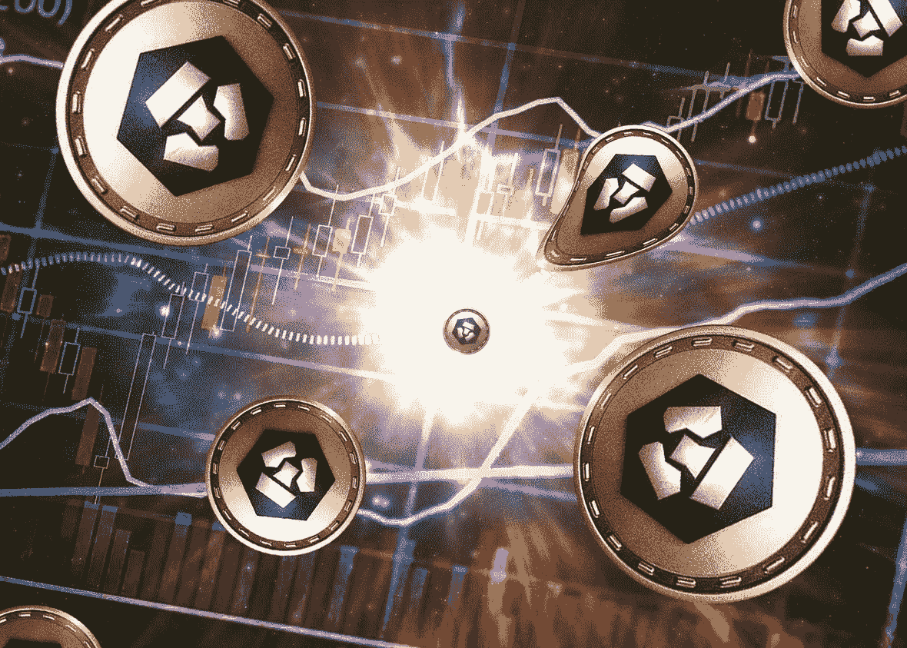

# 克罗诺斯(CRO)

> 原文：<https://medium.com/coinmonks/cronos-cro-5a7931ef65db?source=collection_archive---------30----------------------->

> 一家支付、交易和金融服务初创公司创建了一个去中心化、开源的区块链。

自 2022 年 2 月 23 日更名为**克罗诺斯(CRO)以来，Crypto.com 硬币一直备受关注。**在超级碗和 NBA 赛事期间采取了一系列营销举措后，Crypto.com 在比特币行业变得咄咄逼人。当美国演员**马特·达蒙**同意成为比特币宣传的代言人时，它受到了推动。

自俄罗斯入侵乌克兰以来，比特币市场尤其动荡。事实上，俄罗斯和乌克兰危机已经导致全球市场下跌。然而，**CRO 加密货币仍然在市场上表现良好。增长 10%以上，成交量增长 2%以上。**

# **简介**

**CRO** 是 Cronos Chain 的原生加密货币令牌，Cronos Chain 是一个由支付、交易和金融服务公司 Crypto.com 创建的去中心化、开源的区块链。

Cronos Chain 是 Crypto.com 的解决方案之一，旨在加速加密货币的全球使用，作为一种增加个人对金钱的控制，保护用户数据和保护用户身份的方法。CRO 区块链主要用于支持 Crypto.com 支付移动支付应用。

Crypto.com 打算在未来扩大 CRO 平台的覆盖范围，以支持其其他产品。

2018 年 11 月和 12 月，CRO 上线。

# **克罗诺斯链**

Cronos 是第一个**兼容以太坊的**区块链网络，基于 **Cosmos SDK。** Cronos 是一个开源、无权限的第 1 层链，旨在通过允许开发人员快速从其他链移动应用和加密资产，同时享受低交易成本、高吞吐量和快速终结，来快速扩展 DeFi、GameFi 和整个 Web3 用户社区。

尽管最近首次亮相，但总价值锁定(TVL)增长呈爆炸式增长，在不到三个月的时间内达到 20 多亿美元的峰值。这可能部分归功于 Particle B 的 1 亿美元 CRO·EVM 基金，该基金鼓励开发者在 Cronos 上进行开发。自首次亮相以来，CRO 代币的价值已经增长了近 350%，达到 0.96 美元的高点。在不久的将来，以太坊和宇宙之间有望架起一座桥梁。

# **克罗诺斯有什么区别？**

CRO 区块链主要是为了让 Crypto.com 的支付、交易和金融服务产品的用户受益。

CRO 持有者可以将他们的硬币放在 Cronos 链上作为验证器，并收取处理网络交易的费用。CRO 硬币也可以用来结算克罗诺斯链上的加工费。

Crypto.com 支付应用的用户在 CRO 向商户支付时可以获得高达 20%的返现，在购买礼品卡和向其他用户进行点对点转账时可以获得高达 10%的返现。在交易方面，Crypto.com 应用程序允许用户通过押注 CRO 获得某些上市的象征性奖励。

此外，**顾客可以通过在 Crypto.com**交易所应用程序或 Crypto.com 的金属 Visa 卡上下注，赚取高达 10-12%的 Crypto.com 硬币年利率。

总体而言，CRO 是 Crypto.com 在全球推广加密货币应用的驱动力。因此，该公司一直在寻找和开发新的用例，让消费者能够利用加密货币来获得对他们的金钱、数据和身份的更多控制。

## 【Crypto.com Visa 借记卡的

> Crypto.com 提供预付费 Visa 借记卡

不需要加载和消费法币(如澳元、加元、欧元、英镑、新加坡元、美元)，也不需要获取和存储任何加密货币。没有年费。返现从 0.5%到 5%不等，取决于使用的卡。免费机场休息室、亚马逊 Prime、网飞和 Spotify 都是可用的激励措施。因为它不绑定到银行账户，所以被称为预付。这也意味着它不会出现在信用记录上。

您收到的卡(和奖品)取决于您下注的 CRO 金额。Crypto.com 建立了加密货币 CRO。赌注包括把钱给 Crypto.com，然后忘掉这件事；在锁定时间到期之前，您无法将其恢复。股份的价值可能上升也可能下降。

他们提供免费的入口。

对于其他阶段，你必须在至少 6 个月内持有一定数量的 CRO。6 个月之后，你可以继续把你的钱押在赌注上，保持所有的优势，或者你可以提取你的钱，你得到的回报将会减少。

## 借记卡的类型:

黑曜石、磨砂玫瑰金和冰白色、皇家靛蓝和翡翠绿色、红宝石钢、午夜蓝

# 【Crypto.Com Nft 市场

Crypto.com NFT 市场是 Crypto.com 的一部分，是市场上最大的加密货币交易所之一。大多数交易者听说过 Crypto.com，它在收费和用户友好方面享有盛誉。鉴于 NFTs 的巨大人气，Crypto.com 选择在 2021 年 3 月在 Cronos 链上创建自己的市场。

要使用 Crypto.com NFT 市场，Crypto.com 用户必须先注册一个额外的账户，这需要几分钟时间。用户可以在创建 NFT 账户后，通过应用程序将其与 Crypto.com 交易账户关联起来，从而自动验证其账户。总的来说，这一过程很快，并允许客户利用 Crypto.com 生态系统中的可用功能。

市场本身有各种各样的顶级 NFT 可以购买，包括艺术、游戏、体育、音乐等等。每一个 NFT 都会以固定价格或通过定期拍卖进行广告宣传，为买家和卖家提供选择。有趣的是，Crypto.com 的非正规金融服务可以用信用卡或借记卡快速获得。相比之下，其他几个 NFT 市场要求使用加密货币进行支付。

最后，Crypto.com NFT 市场简化的 NFT 交易方式使其非常受欢迎。用户可以使用基于浏览器的平台或 Crypto.com NFT 的应用程序进行投资，因此每个人都有适合自己的东西。最后，Crypto.com 刚刚表示，该网站现在将启用基于以太坊的 NFTs，大大增加了可能的宇宙。

# **CRO 令牌及其令牌组学**

CRO 最近已经成为一个强有力的象征。它一直呈上升趋势，最近有显著增长。代币目前市值排名第 18。在撰写本文时，CRO 代币的交易价格为 0.19 美元(15.5 印度卢比)，市值为 50 亿美元，有 250 亿 CRO 硬币在流通。

随着加密市场稳步复苏，CRO 硬币在危机中的表现令人鼓舞。

# 加入我们，轻松进入 WEB 3.0

> *我们的社区*

# WHATSAPP

 [## BLOCKENTHU

### WhatsApp 群邀请

chat.whatsapp.com](https://chat.whatsapp.com/FTKme4XzkOU73ZDv99Oatj) 

# 电报

 [## ⚡·布洛克登胡·⚡

### 可以马上查看并加入@blockenthu。

t.me](https://t.me/blockenthu) 

# 商务化人际关系网

 [## Blockenthu | LinkedIn

### LinkedIn 上有 519 名粉丝。“面向大众的 Web 3.0 福利”加密和区块链| BlockEnthu 是社区…

www.linkedin.com](https://www.linkedin.com/company/blockenthu/) 

# INSTAGRAM

【https://www.instagram.com/blockenthu/ 

使用印度最安全的外汇货币

 [## CoinDCX -加密交易所|购买、出售和交易比特币和顶级替代币

### CoinDCX 是印度最大、最安全的加密货币交易所，在这里你可以买卖比特币和其他…

coindcx.com](https://coindcx.com/) 

# blockenthu # ETH # BTC # coincxpathbreaker #比特币#以太坊#cronos #cro #crypto.com

> 加入 Coinmonks [电报频道](https://t.me/coincodecap)和 [Youtube 频道](https://www.youtube.com/c/coinmonks/videos)了解加密交易和投资

# 另外，阅读

*   [3 商业评论](/coinmonks/3commas-review-an-excellent-crypto-trading-bot-2020-1313a58bec92) | [Pionex 评论](https://coincodecap.com/pionex-review-exchange-with-crypto-trading-bot) | [Coinrule 评论](/coinmonks/coinrule-review-2021-a-beginner-friendly-crypto-trading-bot-daf0504848ba)
*   [莱杰 vs Ngrave](/coinmonks/ledger-vs-ngrave-zero-7e40f0c1d694) | [莱杰 nano s vs x](/coinmonks/ledger-nano-s-vs-x-battery-hardware-price-storage-59a6663fe3b0) | [币安评论](/coinmonks/binance-review-ee10d3bf3b6e)
*   [Bybit Exchange 评论](/coinmonks/bybit-exchange-review-dbd570019b71) | [Bityard 评论](https://coincodecap.com/bityard-reivew) | [Jet-Bot 评论](https://coincodecap.com/jet-bot-review)
*   [3 commas vs crypto hopper](/coinmonks/3commas-vs-pionex-vs-cryptohopper-best-crypto-bot-6a98d2baa203)|[赚取加密利息](/coinmonks/earn-crypto-interest-b10b810fdda3)
*   最好的比特币[硬件钱包](/coinmonks/hardware-wallets-dfa1211730c6) | [BitBox02 回顾](/coinmonks/bitbox02-review-your-swiss-bitcoin-hardware-wallet-c36c88fff29)
*   [BlockFi vs 摄氏](/coinmonks/blockfi-vs-celsius-vs-hodlnaut-8a1cc8c26630) | [Hodlnaut 点评](/coinmonks/hodlnaut-review-best-way-to-hodl-is-to-earn-interest-on-your-bitcoin-6658a8c19edf) | [KuCoin 点评](https://coincodecap.com/kucoin-review)