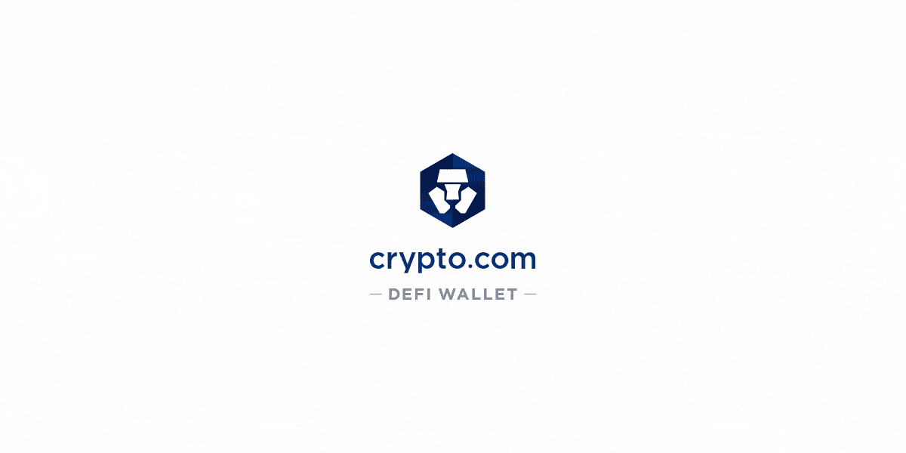

# 克罗诺斯(CRO)——寻找最高赌注 APY 的初学者指南

> 原文：<https://medium.com/coinmonks/cronos-cro-a-beginners-guide-on-finding-the-highest-staking-apy-668e7ed92867?source=collection_archive---------12----------------------->

[https://www.fxempire.com/](https://www.fxempire.com/)

在过去的 12 个月里，Crypto.com 交易所的本土股票 CRO 的市值大幅增长。随着多项体育合作伙伴关系和交易的达成，再加上更多的交易，CRO 在未来有很大的上升潜力。对某些人来说，购买 CRO 可能是明智的投资。在 CRO 投资时，为什么不下注来赚取更多的被动收入呢？让我们来看看所有你可以让你的 CRO 代币发挥作用的方法，让你的资产获得尽可能高的 APY。

**1。Crypto.com—交易所**

Crypto.com

Crypto.com 本身提供了强大的 APY，如果你想尽量减少许多应用程序的使用，它是最容易使用的。对于那些想通过简单的方式获得被动 CRO 代币的人，我推荐 Crypto.com 应用。以下是使用该应用程序时可能获得的费率明细。

Crypto.com

Crypto.com 有“锁定”期，锁定 CRO 代币的时间越长，当资产完全到期(锁定期结束)时，您获得的收益率就越高。Crypto.com 还激励那些注册 crypto.com 卡的人，让他们的资产获得更高的 APY。

**2。Crypto.com—DeFi 钱包**

[https://blog.crypto.com/introducing-in-app-browser-in-the-crypto-com-defi-wallet/](https://blog.crypto.com/introducing-in-app-browser-in-the-crypto-com-defi-wallet/)

Crypto.com 凭借其独立的 DeFi 钱包应用程序位居榜单第二。DeFi wallet 应用程序是一个完全独立于 crypto.com 应用程序的应用程序，提供自己的特价。

crypto.com DeFi 钱包应用程序上的利率比交易所高得多。一个重要的信息是，利率不是一成不变的，总是在变化，但不断变化的利率将永远比 exchange 应用程序高得多(10-16%)。如果您选择使用 DeFi 应用程序，还将有 28 天的锁定期，在此期间您将无法访问您的资产。

**有两种方法让 CRO 赌上 DeFi 钱包**

**选项#1:**

人们可以在任何交易所购买 CRO 令牌，并使用 ERC-20 标准将其发送到钱包应用程序(确保您在 DeFi 应用程序上选择了以太坊区块链以接收 CRO)。一旦转移，CRO 必须转换到 CRO 区块链网络。从 ERC 20 号公路上的 CRO 到 CRO 区块链的换乘将会花费以太币汽油费。这一过程并不理想，但对那些不介意支付汽油费的人来说是一个选择。

**选项 2:**

crypto.com 交易所应用程序和 Crypto.com DeFi 钱包应用程序可以通过 DeFi 钱包应用程序主屏幕上的选项链接在一起。

Crypto.com

连接后，您可以在 Crypto.com 交易所购买 CRO，并将资产转移到 DeFi 钱包，几乎不收取任何费用(0.001 CRO)。确保 CRO 硬币不是通过 ERC-20 标准发送，而是通过 CRO 选项发送。这将允许您的 CRO 被发送到区块链，我们可以使用的赌注。如果你不小心通过 ERC-20 路径发送，你将不得不完成一次交换并支付以太币汽油费。

**3。构造**

Tectonic.finance

“构造是一个分散的非托管算法货币市场协议。用户可以存入资产以赚取被动收入，或者借入资金以释放其资产中的流动性*”

“大地构造”由 Cronos 提供支持，允许用户下注他们的 CRO 代币，并以 tonic 代币支付，如果需要，可以出售给 CRO 代币。平均 APY 在 4-13%之间。大地构造也是一个借贷平台。随着越来越多的用户从 Tonic 借钱，所有资产的 APY 利率也会上升。

Tectonic.finance

在这个例子中，利率已经下降到略低于 5%。随着市场波动，我们进入更多的看涨情绪，你会看到 APY 利率上升。值得注意的是滋补品的 APY 仍然保持在 37%!

 [## 构造|跨链货币市场|赚取高收益并在 Cronos 上借入贷款

### 构造是一个跨链的货币市场，赚取被动收益和获得即时担保贷款储蓄产生…

建筑.金融](https://tectonic.finance/) 

当我们等待 CRO 创造新的历史新高时，为什么不把你的钱用在赌博上呢？如果操作正确，赌注不会带来任何风险和回报。期待 CRO 有一天在自己的大生态系统中崛起和繁荣，但现在，祝你快乐！

免责声明:以上文章不是财务建议。请做出自己明智的投资。

> 加入 Coinmonks [电报频道](https://t.me/coincodecap)和 [Youtube 频道](https://www.youtube.com/c/coinmonks/videos)了解加密交易和投资

# 另外，阅读

*   [3 商业评论](/coinmonks/3commas-review-an-excellent-crypto-trading-bot-2020-1313a58bec92) | [Pionex 评论](https://coincodecap.com/pionex-review-exchange-with-crypto-trading-bot) | [Coinrule 评论](/coinmonks/coinrule-review-2021-a-beginner-friendly-crypto-trading-bot-daf0504848ba)
*   [莱杰 vs n rave](/coinmonks/ledger-vs-ngrave-zero-7e40f0c1d694)|[莱杰 nano s vs x](/coinmonks/ledger-nano-s-vs-x-battery-hardware-price-storage-59a6663fe3b0) | [币安评论](/coinmonks/binance-review-ee10d3bf3b6e)
*   [Bybit Exchange 审查](/coinmonks/bybit-exchange-review-dbd570019b71) | [Bityard 审查](https://coincodecap.com/bityard-reivew) | [Jet-Bot 审查](https://coincodecap.com/jet-bot-review)
*   [3 commas vs crypto hopper](/coinmonks/3commas-vs-pionex-vs-cryptohopper-best-crypto-bot-6a98d2baa203)|[赚取秘密利息](/coinmonks/earn-crypto-interest-b10b810fdda3)
*   最好的比特币[硬件钱包](/coinmonks/hardware-wallets-dfa1211730c6) | [BitBox02 回顾](/coinmonks/bitbox02-review-your-swiss-bitcoin-hardware-wallet-c36c88fff29)