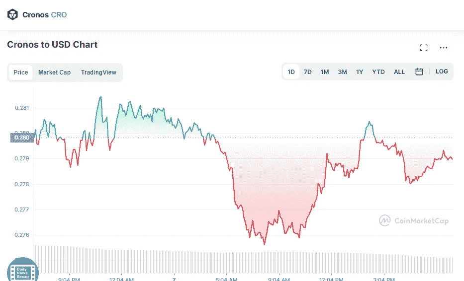

# 克罗诺斯·CRO 和 XRP 5 月 7 日价格分析

> 原文：<https://medium.com/coinmonks/cronos-cro-and-xrp-price-analyse-on-7th-of-may-eabce670b724?source=collection_archive---------27----------------------->

# 克罗诺斯 CRO 公司(0.08%)

Source photo [Cronos price today, CRO to USD live, marketcap and chart | CoinMarketCap](https://coinmarketcap.com/currencies/cronos/)

# 市值 70.48 亿美元

Cronos 目前的价格为 0.282 美元，24 小时交易量为 3227 万美元。

在过去的 24 小时里，Cronos 的使用率下降了 0.08%。