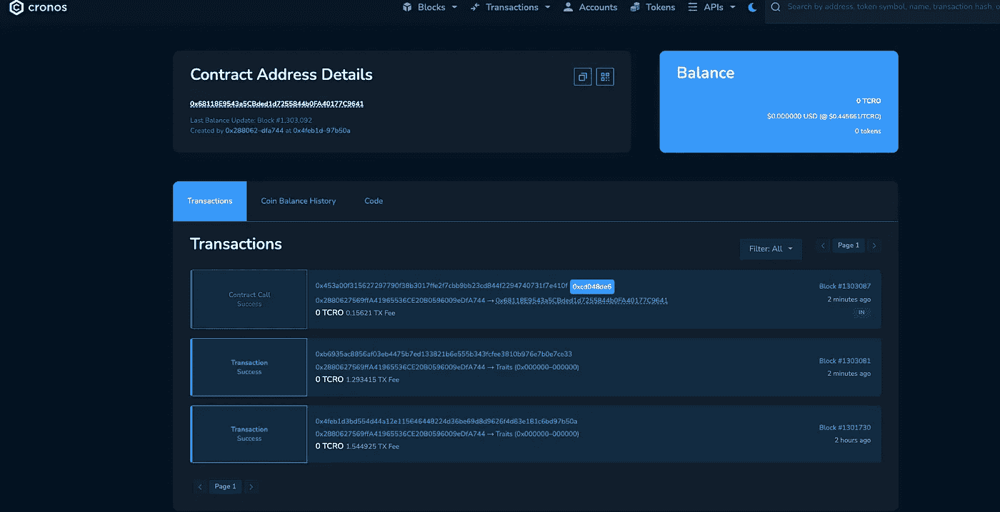

# Cronos Testnet 部署

> 原文：<https://medium.com/coinmonks/cronos-testnet-deployment-57f390fc8ab5?source=collection_archive---------1----------------------->


Photo by [Billy Huynh](https://unsplash.com/@billy_huy?utm_source=medium&utm_medium=referral) on [Unsplash](https://unsplash.com?utm_source=medium&utm_medium=referral)

在本文中，我们将探讨如何将一个简单的 storgage 契约从 Truffle 部署到 Cronos testnet。

# 关于

Truffle 是一个在以太坊区块链上编写智能合同的开发环境。它允许开发人员:

*   汇编合同
*   测试合同
*   部署合同
*   调试合同

Cronos Chain 是一个 EVM，与 Crypto.org 的区块链并行运行

它提供了许多可用性，包括:

*   EVM 兼容性
*   快速高效的可扩展性
*   易于从以太网和其他 EVM 兼容链移植 Dapps

您可以在此了解更多信息:

[松露套装](https://www.trufflesuite.com/docs/truffle/overview)

[克罗诺斯链](https://cronos.crypto.org/)

# 项目设置

我们需要做的第一步是在开始编写智能合同之前，用 Truffle 建立一个项目。

*   转到您希望项目所在的文件夹

```
mkdir <project name>
```

*   然后移动到刚刚创建的文件夹中

```
cd <project name>
```

现在，我们将使用以下命令将 Truffle 安装到我们的项目中:

```
truffle init
```

您应该会得到类似的输出

```
Starting init...================> Copying project files to /Users/Desktop/cronos-truffle-exampleInit successful, sweet!Try our scaffold commands to get started:$ truffle create contract YourContractName # scaffold a contract$ truffle create test YourTestName         # scaffold a testhttp://trufflesuite.com/docs
```

接下来安装 npm，这样我们可以添加一些依赖项。

使用以下命令安装 npm。

```
npm i -y
```

> 你可以使用 ***npm i*** ，我选择使用 ***-y*** 来绕过安装过程中的每个安装步骤问题

一旦我们安装了 npm，我们将导入两个将用于我们项目的依赖项。

*   dotenv(隐藏我们的私钥)
*   [Truffle 的 HDWalletProvider](https://trufflesuite.com/docs/truffle/reference/configuration.html) (作为 Web3 提供商)

运行以下命令来安装它们

```
npm i dotenv @truffle/hdwallet-provider
```

# 撰写智能合同

在 contracts 目录中，创建一个新文件，并将其命名为***simple storage . sol***

然后将以下代码放入文件中

> 我们不会深入太多的代码，因为本教程更多的是关于使用 Truffle 将契约部署到 Cronos Testnet。以下是使用 [***可靠性***](https://docs.soliditylang.org/en/latest/) 撰写智能合约的信息

接下来，我们必须编写一个迁移脚本。

在 ***migrations*** 目录中，添加另一个文件并命名为***2 _ deploy _ simple storage . js***

现在，在文件内部，编写以下代码:

> 点击了解更多关于松露迁徙的信息

# Cronos 测试网络配置

现在我们有了一个智能合约，我们首先必须配置网络，然后才能将它部署到 testnet。

让我们通过进入***truffle-config . js***文件来设置 Cronos testnet 配置

有很多关于如何使用这个文件的信息，但我们将简化它。

在 ***的正上方，我们将添加以下内容:***

```
require("dotenv").config();const HDWalletProvider = require('@truffle/hdwallet-provider');
```

在这里，我们得到了 ***dotenv*** 包，以便稍后隐藏我们的私钥，并且还得到作为 Web3 提供者的***hdwallet provider***

接下来，我们将设置 Cronos testnet 配置。

在 ***网络中:{*** 找到 rospten 网络，并用以下代码替换它:

```
cronosTestnet: {provider: () => new HDWalletProvider(process.env.PRIVATE_KEY, "https://cronos-testnet-3.crypto.org:8545"),network_id: "*",       // Cronos's testnet idskipDryRun: true},
```

这段代码将 Cronos testnet 地址**【https://cronos-testnet-3.crypto.org:8545】T21**添加到配置文件中，并使用***HDWalletProvider***通过使用帐户中给定的私钥来连接。

简单来说，整个文件和代码应该如下所示:

# 设置测试帐户

在部署我们的契约之前，我们首先必须将我们的钱包连接到 testnet。为此，我们将使用元掩码对其进行配置。

你可以找到更多关于[元掩码](https://metamask.io/)的信息

*   登录元掩码
*   在顶部网络菜单下，点击**到*按钮添加网络*到**
*   输入以下信息以添加新网络:

```
Network Name: <Name to call Cronos Testnet>- RPC Url : https://cronos-testnet-3.crypto.org:8545/- ChainId: 338- Symbol: tCro- Block Explorer URL: https://cronos.crypto.org/explorer/testnet3/
```

一旦 testnet 被添加到 Metamask，我们就用一些测试 Cronos 填充它。

去[水龙头](https://cronos.crypto.org/faucet)给你将要测试的账户注入资金。

现在我们已经设置了我们的测试网络，并且有了 ***tCro*** ，在部署我们的契约之前，我们需要做的最后一件事是在我们的***truffle-confi***g 文件中传递我们帐户的私钥。

为了更安全地做到这一点，我们将把私钥存储在一个 ***中。env* 文件**文件。

在项目的根目录中，键入以下命令:

```
touch .env
```

这将创建一个名为 ***的文件。根目录下的 env*** 。

在这个目录中，我们将为变量 ***分配一个私有密钥=*** 我们的私有密钥

要获取私钥，请转到您用于测试的元掩码帐户，当您单击它旁边的 3 个点时，选择 ***帐户详细信息***

选择 ***导出私钥*** 按钮。Metamask 将询问您的帐户密码，一旦您输入密码，您将获得私钥。现在把这把钥匙复制到**中*。env*** 文件。

它应该类似于下面的内容。

```
PRIVATE_KEY=e902eef0dd0a0c03845b9b743c7834839
```

> 请注意，这不是真正的私有，而是用于演示目的

因为我们已经在***HD wallet-provider***方法的 ***truffle-config*** 文件中声明了这个变量，所以我们不需要做任何其他事情。

```
provider: () => new HDWalletProvider(process.env.PRIVATE_KEY, `https://cronos-testnet-3.crypto.org:8545`),
```

# 部署智能合同

现在我们已经:

✔️是一份聪明的合同

✔️网络配置设置

✔️将元掩码帐户连接到测试网

✔️用测试代币给账户注资

我们能够将我们的合同部署到测试网:

在项目的根目录中，我们可以运行下面的 truffle 命令来部署我们的契约:

```
truffle deploy --network cronosTestnet
```

您应该在终端中得到类似的输出

```
Compiling your contracts...===========================> Everything is up to date, there is nothing to compile.Starting migrations...======================> Network name:    'cronosTestnet'> Network id:      338> Block gas limit: 81500000 (0x4db9760)1_initial_migration.js======================Deploying 'Migrations'----------------------> transaction hash:    0x5be6f16117df6f65b170af759df881be8afc8f6b144790cec2fe26dc2ee8eeb7> Blocks: 0            Seconds: 4> contract address:    0xAAEc9B476c0897d7A4b80Cdd61314446A402237e> block number:        1301726> block timestamp:     1641843771> account:             0x2880627569ffA41965536CE20B0596009eDfA744> balance:             98.74523> gas used:            250954 (0x3d44a)> gas price:           5000 gwei> value sent:          0 ETH> total cost:          1.25477 ETH> Saving migration to chain.> Saving artifacts-------------------------------------> Total cost:             1.25477 ETH2_deploy_SimpleStorage.js=========================Deploying 'SimpleStorage'-------------------------> transaction hash:    0x4feb1d3bd554d44a12e115646448224d36be69d8d9626f4d83e181c6bd97b50a> Blocks: 1            Seconds: 5> contract address:    0x68118E9543a5CBded1d7255844b0FA40177C9641> block number:        1301730> block timestamp:     1641843795> account:             0x2880627569ffA41965536CE20B0596009eDfA744> balance:             96.97724> gas used:            308985 (0x4b6f9)> gas price:           5000 gwei> value sent:          0 ETH> total cost:          1.544925 ETH⠋ Saving migration to chain.
```

您还应该注意到，您的测试令牌数量已经减少。

最后，您可以通过获取部署时在终端输出中创建的合同地址，并将其粘贴到 Cronos 的 testnet 块资源管理器 [***此处***](https://cronos.crypto.org/explorer/testnet3/) ，来检查合同是否已部署到 Cronos 的 testnet

结果应该类似于以下内容:



您可以看到合同已经创建，并且在 Cronos testnet 上对合同进行了一次交易。

感谢阅读这篇文章，我希望你会觉得有用。

敬请关注更多关于区块链、智能合约等的文章！

> 加入 Coinmonks [电报频道](https://t.me/coincodecap)和 [Youtube 频道](https://www.youtube.com/c/coinmonks/videos)了解加密交易和投资

## 也阅读

[](https://blog.coincodecap.com/blockfi-review) [## BlockFi 评论 2021:利弊和利率| CoinCodeCap

### 今天，我们提出了一个全面的 BlockFi 评论，这是一个成立于 2017 年的加密贷款平台，拥有其…

blog.coincodecap.com](https://blog.coincodecap.com/blockfi-review) [](/coinmonks/buy-bitcoin-in-india-feb50ddfef94) [## 如何在印度购买比特币？2021 年购买比特币的 7 款最佳应用[手机版]

### 如何使用移动应用程序购买比特币印度

medium.com](/coinmonks/buy-bitcoin-in-india-feb50ddfef94) [](/coinmonks/best-crypto-tax-tool-for-my-money-72d4b430816b) [## 加密税务软件——五大最佳比特币税务计算器[2021]

### 不管你是刚接触加密还是已经在这个领域呆了一段时间，你都需要交税。

medium.com](/coinmonks/best-crypto-tax-tool-for-my-money-72d4b430816b) [](https://blog.coincodecap.com/crypto-to-buy-in-2022) [## 9 个 2022 年最值得购买的密码| CoinCodeCap

### 2021 年对于加密货币、比特币、NFT 或不可替代代币、元宇宙等等来说是很棒的一年。这一年…

blog.coincodecap.com](https://blog.coincodecap.com/crypto-to-buy-in-2022) [](https://blog.coincodecap.com/best-hardware-wallet-bitcoin) [## 存储比特币的最佳加密硬件钱包[2021] | CoinCodeCap

### 保管您的数字资产很容易，但找到正确的存储方式却是一项繁琐的任务。在线钱包有一个风险…

blog.coincodecap.com](https://blog.coincodecap.com/best-hardware-wallet-bitcoin) [](/coinmonks/pionex-review-exchange-with-crypto-trading-bot-1e459d0191ea) [## Pionex 评论 2021 |免费加密交易机器人和交换

### Pionex 是为交易自动化提供工具的后起之秀。Pionex 上提供了 9 个加密交易机器人…

medium.com](/coinmonks/pionex-review-exchange-with-crypto-trading-bot-1e459d0191ea) [](/coinmonks/top-3-telegram-channels-for-crypto-traders-in-2021-8385f4411ff4) [## 2022 年密码交易员的三大电报渠道

### 加密信号是来自专业交易者的交易想法，以特定的价格或价格买卖特定的加密货币

medium.com](/coinmonks/top-3-telegram-channels-for-crypto-traders-in-2021-8385f4411ff4) [](https://blog.coincodecap.com/free-crypto-portfolio-trackers) [## 2022 年 5 个最佳免费加密投资组合追踪器

### 加密投资组合追踪器是作为一个解决方案创建的，既费时又令人困惑的家务提供一个…

blog.coincodecap.com](https://blog.coincodecap.com/free-crypto-portfolio-trackers)