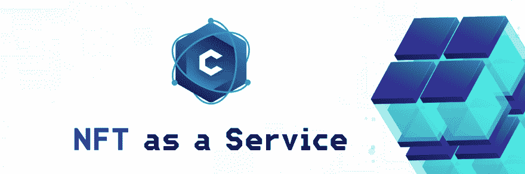
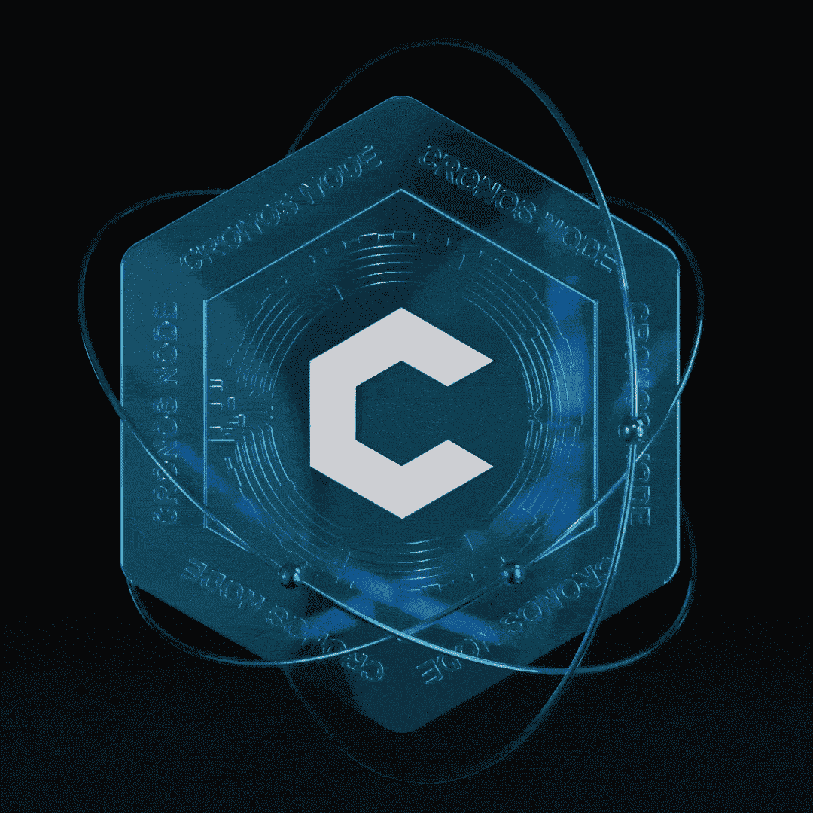
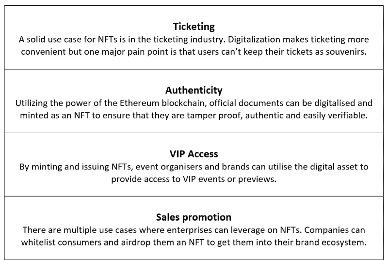
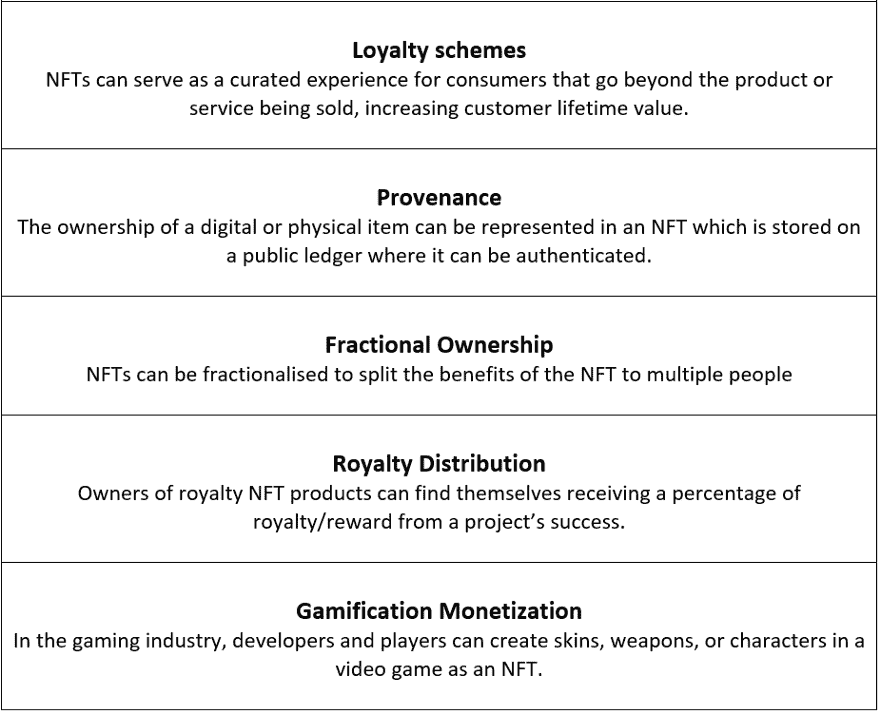

# 克洛诺斯节点。NFT 即服务项目

> 原文：<https://medium.com/coinmonks/cronosnode-an-nft-as-a-service-project-60ea8396990b?source=collection_archive---------13----------------------->

您可能最近已经了解到 CronosNode 项目一直在谈论成为 NFT 即服务(NFTaaS)项目，但是什么是 NFTaaS，我们可能会从中看到什么变化？

# 什么是 NFTaaS？

NFTaaS 将基本艺术品、产品服务和产品安全之间的鸿沟弥合起来，通过将所有项目合并成一个不可变的项目，您会发现自己拥有一个 NFTaaS 产品。

NFT 已经被用来创造可收藏的数字艺术和其他形式的艺术，但公司和项目现在认为 NFT 的可能性不仅仅是艺术品。名人、数字艺术家、游戏公司、票务公司、医疗服务以及其他日常企业都利用了这项技术，并将 **NFTaaS** 视为 Crypto/Web3 领域的下一波浪潮。

**所有权:**NFT 是传递所有权的数字资产。这些资产可以是虚拟的，也可以是物理的。像分散土地中的土地这样的虚拟不动产可以被购买，所有者拥有元宇宙的那块土地。同样，数字资产可以成为游戏中的独特武器。音乐会门票或房子等现实世界的资产也可以在数字空间中表示为令牌。所有权是完全可追溯和清晰的，因为它被记录在公共账上。

**坚不可摧:**通过使用智能合约，NFT 的数据被存储在区块链上。这确保了每个 NFT 是坚不可摧的，不可移动的和无法伪造的。

**不可变:**通过购买 NFT，个人拥有并占有其个人钱包中的数字资产。因此，NFT 不归创建它的公司/项目所有。

# 在 CronosNode 项目中，我们可能会期待什么样的变化？

这是一个我们确信每个人都会想到的问题，简单的事实是，它不会改变什么，因为我们的节点在构建时已经考虑到了安全性。从 CronosNode 项目开始，我们的节点就被构建为 NFT。

你**可能**看到的项目**可能**的两(2)个主要变化如下:

*   NFT 节点的最大整体项目薄荷帽
*   增加 NFT 节点使用案例以提高燃烧率。这反过来将使集合成为一个通货紧缩的 NFTaaS 项目

CronosNode NFT Imagery (GIF)

# CronosNode NFT 节点提供被动收入，一旦我们铸造了所有的 NFT，额外的钱从哪里来？

*   我们的 CroSwap DEX 会将一定比例的资金转入我们的 USGF，这将补贴 CronosNode LP 的一部分。
*   NFT 市场:来自我们市场的一定比例的销售额也将进入 LP。此外，随着越来越多的 NFT 节点被烧毁，他们将不可避免地增加稀缺性/价值，增加销售价值，从而增加市场费用。
*   奖励申请:目前只有一小部分来自我们 dApp 的申请会被提交给 LP
*   节点解锁费用
*   劫持游戏化启用费用
*   正在考虑其他项目。

# 其他 NFTaaS 上市路线

非专利技术及其在主流业务中的增长在最近几年呈指数增长，从 2020 年的约 1 亿美元增长到 2021 年底的约 410 亿美元。

NFTaaS 有多种上市途径。这些包括但不限于:

**CronosNode NFTaaS Socials**

[@CronosNode](https://twitter.com/CronosNode)

[https://discord.gg/cronosnode](https://discord.gg/cronosnode)