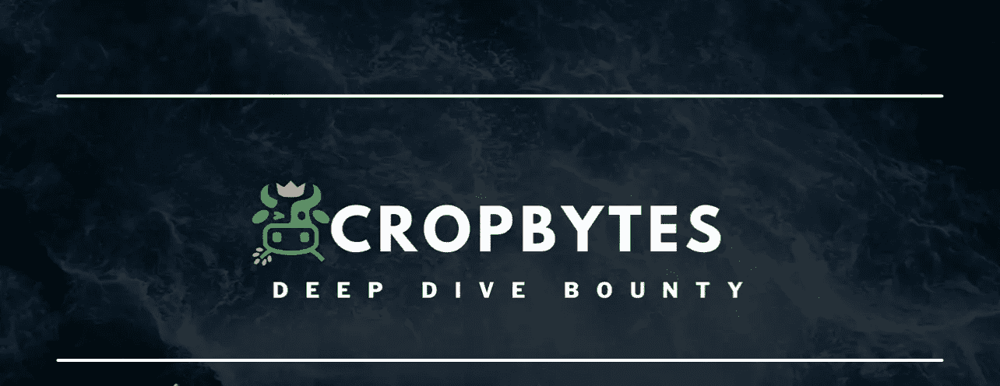
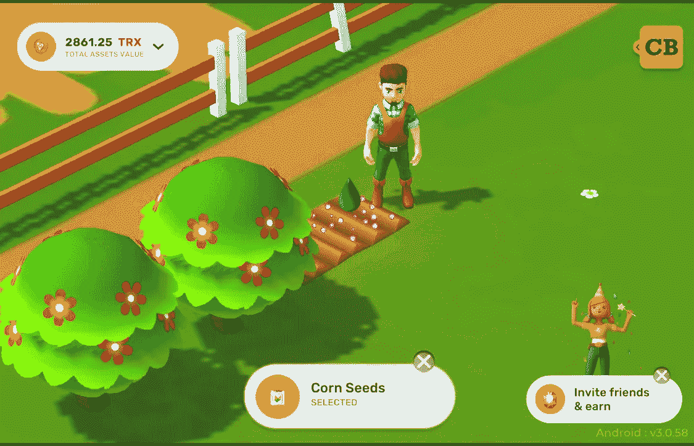
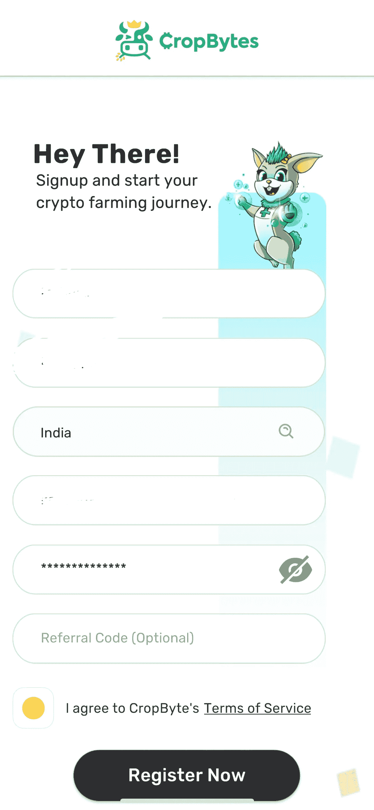
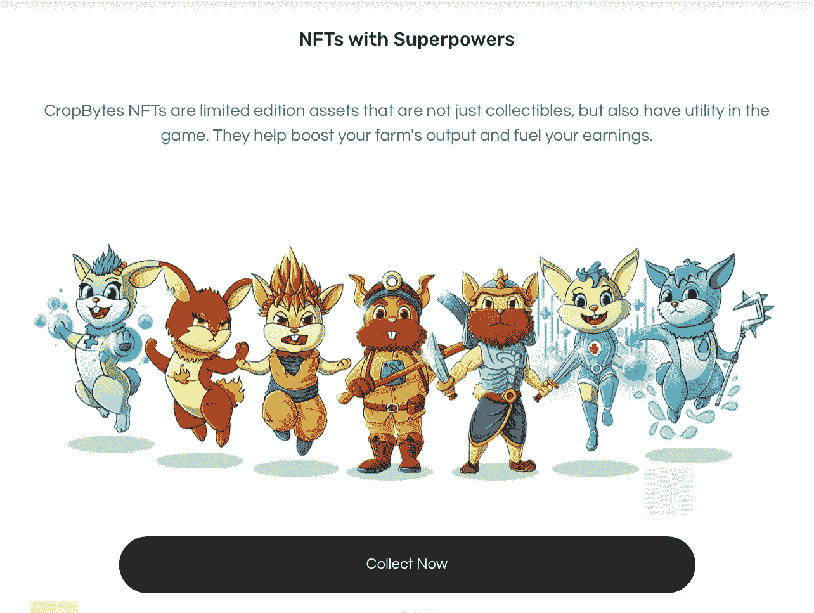

# 农作物:耕种元宇宙

> 原文：<https://medium.com/coinmonks/cropbytes-farming-deep-dive-1d90226664e1?source=collection_archive---------27----------------------->

# CoinDCXpathbreaker

P2E 空间以最疯狂的方式改变了玩家的生活。我们从来没有想到，在区块链，休闲游戏从第一天起就能产生收入流，支持人们的生计。今天我们将看看 **CropBytes** ，它已经巩固了其在 P2E 领域的领先地位…

## P2E 博彩业是如何运作的？

顾名思义， **P2E** 游戏让玩家可以玩区块链上的加密游戏，并从中赚取收入。这种收入通常以项目本地令牌的形式分配。在我们的项目中，玩 **CropBytes** 将使玩家获得 **CBX** 代币。

**P2E** 游戏并不意味着整个项目仅限于游戏，而是可以整合多种其他功能，使整个生态系统更加身临其境&引人入胜。最好的例子就是在游戏中加入 **NFTs。与入门级或中级玩家相比，开发者可以为玩家提供更高级别的、更多的角色功能。**

现在我们已经对 P2E 的实际运作有了一个基本的了解，我们现在将开始谈论这个项目的细节。

# 关于 CropBytes 的一切🐮🐐

## 游戏结构和机制

**CropBytes** 游戏结构非常简单，但可玩性非常深入。该游戏的开发团队专注于可持续的游戏经济，这反过来有助于为加密玩家建立一个长期的游戏。CropBytes 的开发对游戏经济有着清晰的愿景，并强调项目在牛市中的生存能力。

在当前的市场形势下，大多数零售交易商已经变得悲观和恐惧，NFT 空间已经看到了 ETH 底价的下跌——大多数 P2E 游戏都遭受了低流动性和资产膨胀，大多数承诺独一无二的 3D 游戏的项目已经完全从场景中消失，其本地令牌下降了 80 %- 90%以上，但在游戏经济早期实施的 **CropBytes** &的开发过程中，这一点被牢记在心。

玩这个游戏非常直观，而且 **CropBytes** 为玩家提供了许多功能，例如:

*   **平衡经济**
*   **真实所有权**
*   **公开市场交易**
*   **基于效用的游戏**

## 路线图和发展

**Q1 2022**

路线图的这一阶段见证了一些功能的实现，如赌注、象征性激励和贷款。这为现有玩家和新玩家创造了更强大的游戏经济，通过游戏生态系统获得稳定的收入流。

**Q2 2022**

路线图的这一阶段将见证以下在 **CropBytes** 生态系统中的实施

*   资产铸造
*   玩家对玩家钓鱼小游戏
*   创造服务经济(农民和工人)
*   用户界面革新
*   $CBX 代币解锁时间表
*   游戏中动物的冬眠

你可以通过专门的视频[在这里](https://blog.cropbytes.com/roadmap-2022/)了解更多细节

## CropBytes 游戏评论

探索元宇宙的 CropBytes:一个未来的前瞻性加密游戏，实现真正的经济和身临其境的图形输出

倒数第二个农业梦想随着元宇宙的种植而实现

CropBytes 现在是一款已有四年历史的元宇宙游戏，为全球成千上万的玩家提供了绝对独特的农业体验。世界各地的玩家都喜欢模拟游戏，农业模拟也有一个庞大的用户群。CropBytes 的 USP 在于，它不仅提供了简单的农业基本乐趣体验，还提供了资产所有权作为主要的游戏机制，使农场所有者能够将他们的时间投资货币化，并同时获得被动收入。

## CropBytes 的游戏体验

当我开始在自己的农场上从事这种深潜赏金游戏时，我就开始了与 CropBytes 的游戏经历。我不能对游戏的早期版本发表评论，只能谈谈我对最新版本的体验。

*我在一台 iPhone 12 Pro Max 上玩游戏。所以图形可能是设备&平台的主观死。*

根据我对旧版本的研究，新更新中的许多元素都与以前的版本保持同步，但这个农场看起来很有吸引力——现在请不要指望它看起来像 AAA 下一代游戏机。这是一款最好的手机游戏。句号。

## 如何开始玩 CropBytes

注册过程非常简单，我在下面附上截图供你参考…

Click on Get Started

Fill in the details

Enter the OTP

就是这样。你将可以开始玩 CropBytes，而不需要任何初始投资。

CropBytes 为新注册用户提供了一个免费试用包，玩家可以用它来感受一下 CropBytes 生态系统的游戏性。

## 实施非功能性测试

让整个 CropBytes 游戏世界更加有趣的是培育超级英雄的能力。CropBytes 超级英雄是一组 NFT 超级英雄动物，可以使用**特殊品种食物**进行繁殖。每个 NFT 超级英雄都有一个独特的指挥范围来提高农场的性能:他们都有独特的游戏功能，并提高农场的生产力。**每个 NFT 超级英雄的原价是 18000 CBX(目前 USDT 的价格是 2754 美元)。**

## 结论

那么开始玩 CropBytes 值得吗？依我看，是的。仅仅是因为这个游戏提供了更多的东西，甚至包括超级英雄 NFTs，而且 CBX 仍然没有在许多集中交易市场上市。增加你的$CBX 筹码的唯一途径是通过 CropBytes 市场。我真的相信 CBX 在未来几年有巨大的增长潜力。

总的来说，CropBytes 是一个出色实现的游戏元宇宙，有了一个坚实的路线图，我相信生态系统将继续增长。P2E 游戏是加密领域的前进方向，他们的积极发展只会让这个领域更进一步，让玩家和社区更好。

为# CoinDCXpathbreaker 计划向[coincx](https://medium.com/u/a30fa2b03c2f?source=post_page-----1d90226664e1--------------------------------)大声疾呼，并支持为社区创建教育加密内容🚀🌝

…

源链接:

 [## 玩游戏、投资和交易，赚取每日加密| CropBytes

### 投资、经营和交易 CropBytes，这是一款基于现实世界农业经济的世界领先的加密游戏…

www.cropbytes.com](https://www.cropbytes.com/)  [## CoinDCX -加密交易所|购买、出售和交易比特币和顶级替代币

### CoinDCX 是印度最大、最安全的加密货币交易所，在这里你可以买卖比特币和其他…

coindcx.com](https://coindcx.com/) 

[www.twitter.com/txbcryptoindia](http://www.twitter.com/txbcryptoindia)

> *加入 Coinmonks* [*电报频道*](https://t.me/coincodecap) *和* [*Youtube 频道*](https://www.youtube.com/c/coinmonks/videos) *了解加密交易和投资*

# 另外，阅读

*   [3 商业评论](/coinmonks/3commas-review-an-excellent-crypto-trading-bot-2020-1313a58bec92) | [Pionex 评论](https://coincodecap.com/pionex-review-exchange-with-crypto-trading-bot) | [Coinrule 评论](/coinmonks/coinrule-review-2021-a-beginner-friendly-crypto-trading-bot-daf0504848ba)
*   [莱杰 vs Ngrave](/coinmonks/ledger-vs-ngrave-zero-7e40f0c1d694) | [莱杰 nano s vs x](/coinmonks/ledger-nano-s-vs-x-battery-hardware-price-storage-59a6663fe3b0) | [币安评论](/coinmonks/binance-review-ee10d3bf3b6e)
*   [Bybit Exchange 评论](/coinmonks/bybit-exchange-review-dbd570019b71) | [Bityard 评论](https://coincodecap.com/bityard-reivew) | [Jet-Bot 评论](https://coincodecap.com/jet-bot-review)
*   [3 commas vs crypto hopper](/coinmonks/3commas-vs-pionex-vs-cryptohopper-best-crypto-bot-6a98d2baa203)|[赚取加密利息](/coinmonks/earn-crypto-interest-b10b810fdda3)
*   最好的比特币[硬件钱包](/coinmonks/hardware-wallets-dfa1211730c6) | [BitBox02 回顾](/coinmonks/bitbox02-review-your-swiss-bitcoin-hardware-wallet-c36c88fff29)