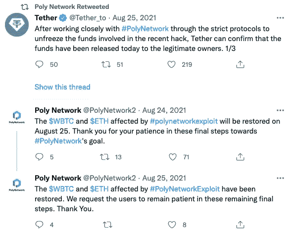
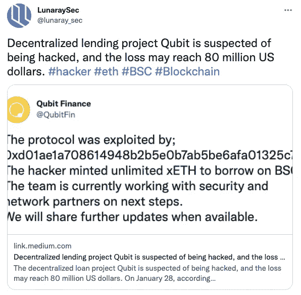
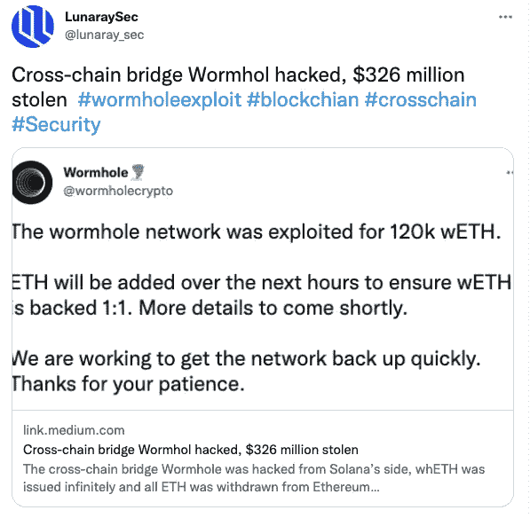
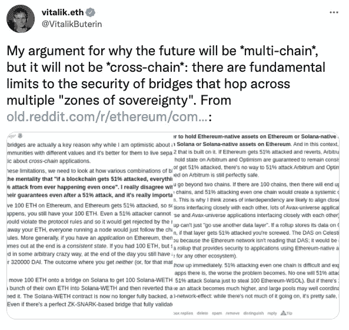

# 跨链桥接协议，为什么它总是吸引黑客

> 原文：<https://medium.com/coinmonks/cross-chain-bridge-protocol-why-it-always-attracts-hackers-b4afe09dbedf?source=collection_archive---------17----------------------->

跨链桥允许加密货币、**智能合约**指令和区块链之间的数据传输。尽管两个区块链可能有不同的协议、规则和治理模型，但是跨链桥可以通过互操作性将它们安全地连接在一起。随着区块链的快速发展，公共连锁店层出不穷。不同的公有链有不同的资产和应用。跨链桥可以将资产从 A 链转移到 b 链。

跨链桥是一种链到链的桥工具，允许资产从一个链转移到另一个链。两个链可以有不同的协议、规则和治理模型，而桥提供了一种相互通信和兼容的方式，以便在两端安全地操作。

## 下面是几个跨链网桥协议事件的回顾

2021 年 8 月，跨链协议**聚网**遭到攻击，近 6 亿美元资金被盗。

2022 年 1 月，跨链协议**量子位金融**被黑，损失 800 万美元。

2022 年 2 月，跨链协议**虫洞**被黑，损失 3.2 亿美元

**跨链桥安全吗？跨链协议真的更容易受到攻击吗？**
跨链协议攻击频发的主要原因是链内积累的巨额资产。面对巨大的诱惑，黑客必然会想方设法攻击。另外，由于跨链项目不仅是链上的**智能合约**还有带链外的代码，所以无论项目哪个环节出了问题，都会被黑客利用。

以太坊创始人 **Vitalik Buterin** 在一次网络访谈节目中，再次强调跨链存在安全问题。他提到，在单链中，恢复链非常方便，每个人都可以将资产恢复到初始状态。。但如果在多个链条的情况下资产出现问题，链条的回收将是一个大问题。他表示反对以太坊和其他区块链使用跨链解决方案，并在 Twitter 中支持多链。

任何新兴技术都会有一定的缺陷。虽然容易被攻击，但是现在的跨链桥可以解决很多问题。除了在资产引渡中占据重要地位，还可以解决底层公链性能不足的问题。

1)降低气费，加快交易速度。

2)用户资产可以自由交互，提供良好的用户体验。

3)提高现有加密资产的生产率和效用。

4)更好的安全性和私密性。

交叉链桥适用于以下情况:

1)以太坊与二层网络之间的令牌交换，资产在链间互通，更快更容易的资金存入，资产提取降低运营复杂度。

2)投资者在投资一个新的链时，可以使用跨链桥来加快速度，但他们必须首先检查它的完整机制和安全性。

3)通过分散交易所的乐观、仲裁和多边形进行套利交易。

技术上，项目方必须在项目上线前做好项目的代码审计工作。跨链项目的安全性考虑不能仅限于智能合约级别。链上的智能合约代码和链下的其他部分代码需要引起足够的重视。，只有做好整个项目所有节点的安全防范措施，项目才能安全运行。

ref:[https://old . Reddit . com/r/ether eum/comments/rwojtk/ama _ we _ are _ the _ EFS _ research _ team _ pt _ 7 _ 07 _ January/hrngyk 8/](https://old.reddit.com/r/ethereum/comments/rwojtk/ama_we_are_the_efs_research_team_pt_7_07_january/hrngyk8/)

> 加入 Coinmonks [电报频道](https://t.me/coincodecap)和 [Youtube 频道](https://www.youtube.com/c/coinmonks/videos)了解加密交易和投资

# 另外，阅读

*   [加拿大最佳加密交易机器人](https://coincodecap.com/5-best-crypto-trading-bots-in-canada) | [KuCoin 评论](https://coincodecap.com/kucoin-review)
*   [火币加密交易信号](https://coincodecap.com/huobi-crypto-trading-signals) | [HitBTC 审核](/coinmonks/hitbtc-review-c5143c5d53c2)
*   [如何在 FTX 交易所交易期货](https://coincodecap.com/ftx-futures-trading) | [OKEx vs 币安](https://coincodecap.com/okex-vs-binance)
*   [OKEx vs KuCoin](https://coincodecap.com/okex-kucoin) | [摄氏替代品](https://coincodecap.com/celsius-alternatives) | [如何购买 VeChain](https://coincodecap.com/buy-vechain)
*   [ProfitFarmers 回顾](https://coincodecap.com/profitfarmers-review) | [如何使用 Cornix Trading Bot](https://coincodecap.com/cornix-trading-bot)