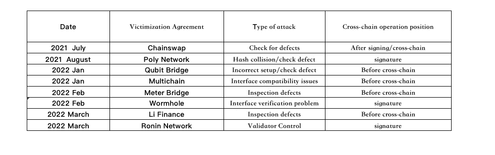
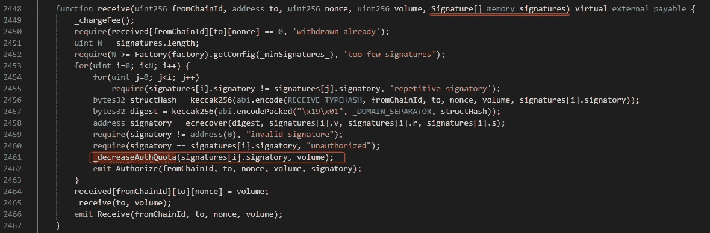
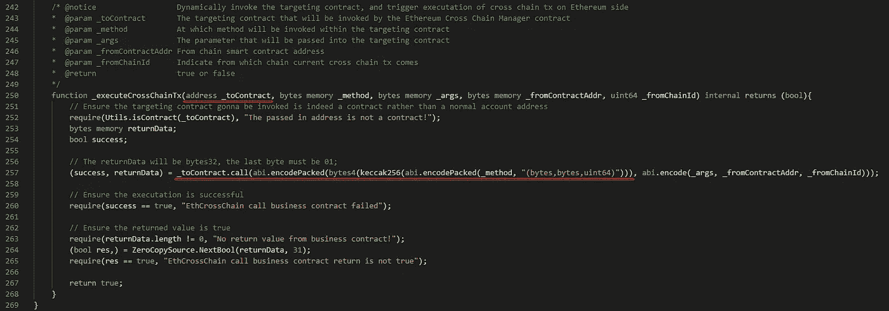
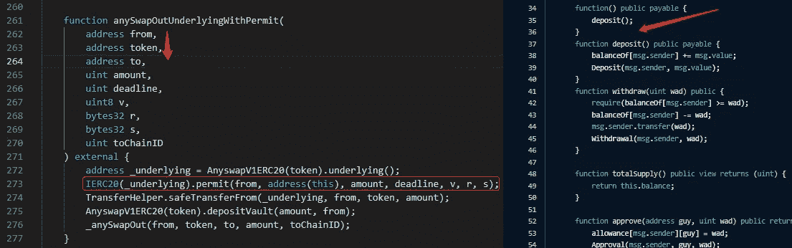
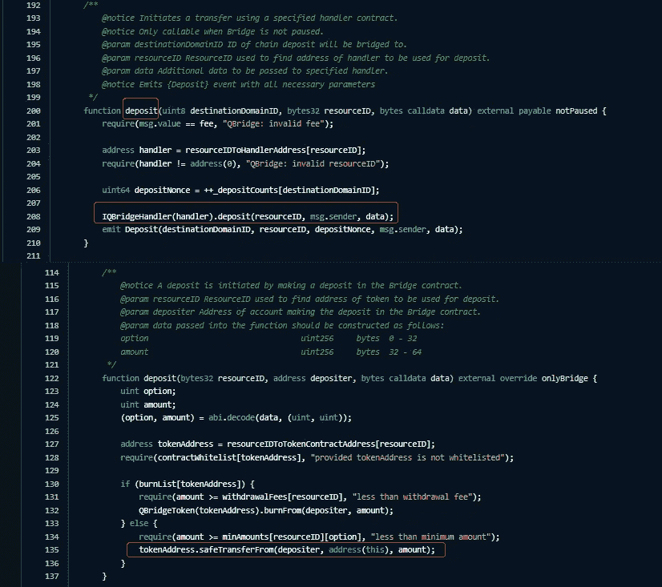
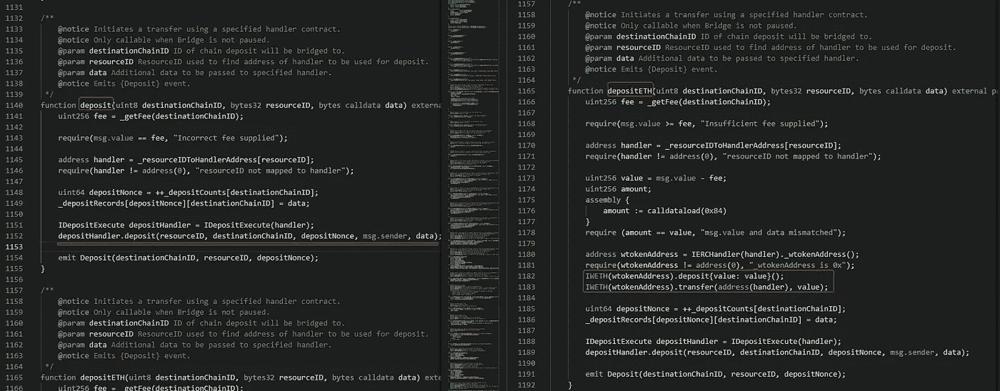
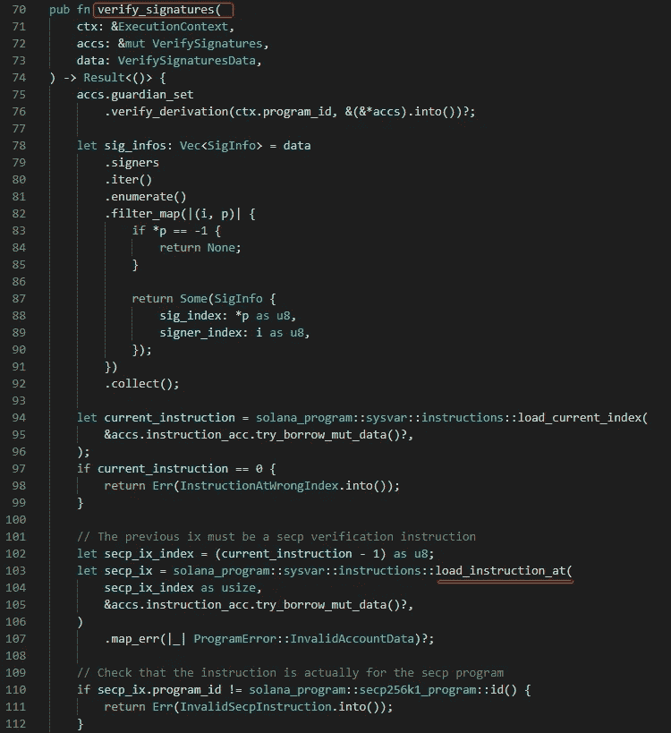
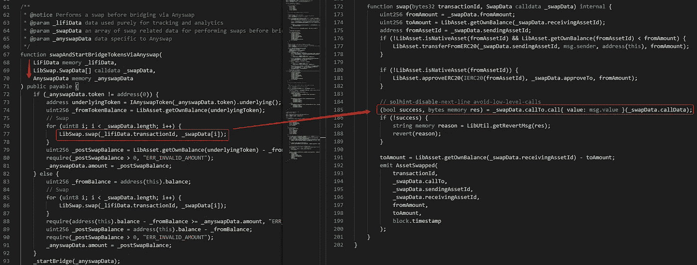

# 跨链桥漏洞摘要

> 原文：<https://medium.com/coinmonks/cross-chain-bridge-vulnerability-summary-f16b7747f364?source=collection_archive---------5----------------------->

## 0x01 背景

随着**区块链**和上链节目的增长，对多链项目的需求很高，跨链桥业务也会相应增加。哪里有生意，哪里就有安全问题。跨链网桥在为用户提供便利的同时，也可能为黑客提供便利，而在聚网攻击后，跨链网桥的安全问题也应运而生。

## 0x02 什么是跨链桥？

区块链桥，也称为跨链桥，连接两个区块链，允许用户从一个链向另一个链发送加密货币。
跨链桥通过启用**令牌转移**、**智能合约**和**数据交换**，以及其他两个独立平台之间的反馈和指令，实现资金的跨链操作。

**常见的交叉链桥操作如下:**

*   用户将资产 A 发送到原链上的存款地址，支付过桥费用；
*   资产 A 被智能合约中随机选择的验证者或受信任的托管者锁定；
*   在目标链上发放相同数量的资产 A1，并将资产 A1 发送到目标链上的用户地址。

## 0x03 跨链桥中出现的漏洞

## 0x04 跨链桥常见漏洞分析

**链锯攻击事件:**

2021 年 7 月，跨链资产桥项目 ChainSwap 遭到攻击。跨链桥上的二十多个项目受到攻击，损失了近 800 万美元的资产，并导致十多个项目暴跌 99%。
该攻击主要是由于协议没有严格检查签名的有效性，使得攻击者可以使用自己生成的签名对交易进行签名。

## 工厂合同

上图 receive 方法的主要作用是将用户跨链后的资金转移到目标链的用户地址，需要验证发送链的签名。当前要验证的签名数量是 1。

由于 receive 方法和被调用的 **ecrecover** 的逻辑， **_decreaseAuthQuota** 方法没有严格检查被调用的签名，攻击者传入了自己生成的签名，后续的契约逻辑也没有严格判断签名的映射值和其他计算。导致攻击者成功执行 receive 方法，为自己的转账资金签名。

## 聚网络攻击事件

2021 年 8 月，跨链互操作协议聚网突然遭到黑客攻击。使用这种协议的 O3 交换遭受了重大损失。以太坊、币安智能链和多边形三个网络上的资产几乎被洗劫一空。1 小时内分别有 2.5 亿、2.7 亿、8500 万美元的加密资产被盗，总损失高达 6.1 亿美元。

这种攻击主要是由于替换了中继链验证器的公钥。即交叉链的中间验证者由攻击者代替，由自己控制。

**协议内部关系:**

中继链验证器的公钥存在于 **EthCrossChainData** 合同中；

EthCrossChainData 合同所有者是 EthCrossChainManager 合同；

EthCrossChainData 协定的 putCurEpochConPubKeyBytes 方法可以修改中继链验证程序角色。

EthCrossChainManager 合同:

上图中， **_executeCrossChainTx** 方法没有对传入参数进行严格限制，导致攻击者传入 toContract，方法参数由攻击者控制。由于协议的内部关系，攻击者在哈希冲突后传入与**putCurEpochConPubKeyBytes**方法相同的方法签名。成功调用 **EthCrossChainData** 契约的**putCurEpochConPubKeyBytes**方法，直接修改中继链验证器的公钥使其可控，然后利用验证器签署恶意资金转移，获取大量资金。

**多链(AnySwap)攻击事件**

2022 年 1 月，Multichain 官方表示，协议的跨链桥存在安全风险，部分令牌存在被黑客攻击的风险，并敦促用户尽快取消授权。

事件的核心原因:协议调用的底层令牌契约没有实现 **permit 方法**，但是包含了回退功能，所以调用 permit 方法的契约运行正常。

左**any swapv 4 外**合同，右**wet9**合同。

在上图的**anyswapoutunderlyingwithpree**方法中，前三个参数都是由调用者传入的，**即**、 **from** ，token 等参数都是攻击者可以控制的。当参数可控时，攻击者部署攻击契约来转移受影响的令牌。约定地址被设置为底层令牌参数。

核心问题是，由于**wet9**没有 permit 方法，但是会调用**wet9**的 fallback 方法进行存款操作，调用不会出错(交易不会回滚)，所以当用户将资金授权给协议时，攻击者会快速转移用户资金。

**量子比特桥攻击事件**

2022 年 1 月，**量子比特金融**跨链桥以太坊-币安被黑，损失超过 8000 万美元。

核心问题:当**存款**方法中的资金地址为**地址(0)** 时，不会出现 safeTransferFrom 错误，导致存款功能正常执行。

**QBridge 合同**

在上图中，**存款**是一种普通的存款方式。调用 **IQBridgeHandler(处理程序)时。存款**该方法中，当用户传入的 **resourceID** 映射 **tokenAddress** 地址为 **0** 地址时，后续的**token address . safetransform(存款人，地址(本)，金额)**；转账会正常执行，导致方法和事件正常运行，调用者可以存款成功。

这里更重要的是官方 **tokenAddress** 的 **ETH** 零地址是官方做的(官方已经声明存款功能是一个被忽略的废弃功能)。

**米桥攻击分析**

2022 年 2 月，Meter.io 跨链协议被攻击，合同没有阻止封装的 ERC20 令牌与 native gas 令牌的直接交互，造成了约 430 万美元的损失。

事件的核心问题:存款方法在进行存款时不验证 **WBNB** 存款情况，导致攻击者绕过判断条件，不进行任何存款即可正常获取资金。

**桥梁合同**

在上图中，存款和存款方法都是存款方法，但是当存款方法存款时，不验证存款是否是本机令牌。当攻击者使用存款进行存款时，WBNB 地址被传入。由于该方法不验证 WBNB 存款，因此资金不会被存储和转移，然后调用 depositHandler.deposit 方法成功绕过判断条件。最后，攻击者利用这个漏洞成功获取大量资金。

**虫洞攻击分析**

2022 年 2 月，**以太坊**和**索拉纳**两大区块链的重要桥梁(虫洞)被黑，损失超过 3.2 亿美元。

漏洞的核心原因:在 **verify_signatures** 调用的 **load_instruction_at** 方法中没有验证指令的有效性，使得攻击者能够伪造并使用验证签名获取资金。

**verify_signature.rs** 接口契约

上图中的 **verify_signatures** 方法是跨链验证时调用的签名方法。由于 **verify_signatures** 方法调用 l **oad_instruction_at** 方法，因此 **load_instruction_at** 方法是协议更新后被放弃的方法。这种方法对传入的指令没有进行严格的检查，导致攻击者在传入一个可控的值后，攻击者利用这种签名方法对自己的跨链请求进行签名，获得大量资金。

**李金融攻击分析**

2022 年 3 月，李。以太坊上的分布式跨链协议 Finance 受到了攻击。攻击者执行了 37 次呼叫注入，并在多个钱包中获得了约 60 万美元的资产(204 ETH)。
这种攻击的核心问题是对传入的外部数据没有严格限制，导致攻击者传入自己可控的调用逻辑。

**CBridgeFacet 合同**

在上图的**swapAndStartBridgeTokensViaCBridge**方法中，传入的 **_swapData** 参数没有严格的限制。在同一个 **LibSwap.swap** 调用中，值没有严格限制。结果在交换方法中， **_swapData** 可以成功调用**调用**方法进行恶意操作。攻击者利用这一缺陷进行多次呼叫以获取资金。

**浪人网络攻击分析**

2022 年 3 月， **Axie Infinity** 侧链 Ronin 验证器节点和 Axie DAO 验证器节点被攻破，导致 173，600 ETH 和 2550 万美元 USDC 在两次交易中从 Ronin 桥接。

**攻击原因:**

Sky Mavis 的 Ronin 链目前由 9 个验证器组成。为了识别存款事件或取款事件，需要九个验证者签名中的五个。攻击者控制了四个 Sky Mavis 的 Ronin 验证器和一个由 Axie DAO 运行的第三方验证器。(2021 年 11 月-12 月，Axie DAO 允许 Sky Mavis 代表其签署各种交易，在事件停止后，没有撤销 allowlist 访问权限，攻击者获得了对 Sky Mavis 系统的访问权限，并使用 Axie DAO validator 的无气体 RPC 来获取签名)。

## 0x05 摘要和建议

从以上跨链桥攻击事件中可以发现，从去年两次重要的跨链桥攻击到今年，已经发生了多次跨链桥攻击。跨链桥攻击次数明显增多，被盗资金也相当多。黑客已经瞄准了跨链桥这块肥肉。从表格总结来看，攻击主要发生在跨链前和签名处，一般是合同漏洞，也有官方不小心导致的盗窃事件。对于越来越多的跨链项目和项目合同安全，以下是建议:

在项目启动前完成合同的安全审计

合同调用接口需要严格检查其适应性

当版本更新时，需要重新评估相关接口和签名安全性

*   需要对跨链签名者进行严格的审查，以确保签名不被恶意的人控制

> 加入 Coinmonks [电报频道](https://t.me/coincodecap)和 [Youtube 频道](https://www.youtube.com/c/coinmonks/videos)了解加密交易和投资

# 另外，阅读

*   [AscendEx 保证金交易](https://coincodecap.com/ascendex-margin-trading) | [Bitfinex 赌注](https://coincodecap.com/bitfinex-staking) | [bitFlyer 点评](https://coincodecap.com/bitflyer-review)
*   [Bitget 回顾](https://coincodecap.com/bitget-review)|[Gemini vs block fi](https://coincodecap.com/gemini-vs-blockfi)cmd |[OKEx 期货交易](https://coincodecap.com/okex-futures-trading)
*   [AscendEx Staking](https://coincodecap.com/ascendex-staking)|[Bot Ocean Review](https://coincodecap.com/bot-ocean-review)|[最佳比特币钱包](https://coincodecap.com/bitcoin-wallets-india)
*   [霍比审核](https://coincodecap.com/huobi-review) | [OKEx 保证金交易](https://coincodecap.com/okex-margin-trading) | [期货交易](https://coincodecap.com/futures-trading)
*   [网格交易机器人](https://coincodecap.com/grid-trading) | [Cryptohopper 审查](/coinmonks/cryptohopper-review-a388ff5bae88) | [Bexplus 审查](https://coincodecap.com/bexplus-review)