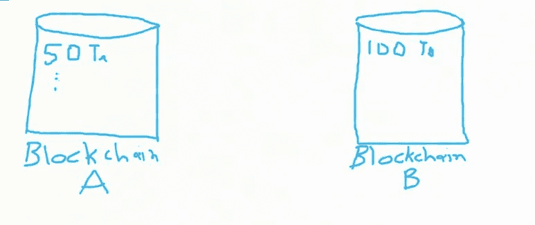

# 跨链加密货币令牌——它们是如何工作的？

> 原文：<https://medium.com/coinmonks/cross-chain-cryptocurrency-tokens-how-do-they-work-558d68e167d2?source=collection_archive---------5----------------------->

随着越来越多的区块链项目出现，越来越多的应用程序基于它们构建，迁移的必要性有时会出现。无论是因为一个新的区块链比你开始的那个更有优势，还是因为这个社区似乎更符合你的个人意识形态，你可能会发现自己想要转换你的代币。我们已经在奇点网的 AGIX 令牌中看到了这一点，它可以在以太坊和卡尔达诺区块链之间来回转换，目前在 [testnet](https://testnet.agix-converter.iohk.io/) 上。另一个例子是 dcSpark 的 [Milkomeda](https://dcspark.gitbook.io/milkomeda/) ，在区块链之间创建侧链，人们可以运行在两条链上执行的智能合同。他们正在关注支持 Solidity(大多数以太坊智能合约都是用这种编程语言编写的)的 Cardano、Solana 和其他连锁店。推出 Cardano 的 IOG 公司也在研究一种分散式侧链解决方案， [Mamba](https://iohk.io/en/blog/posts/2022/01/14/how-we-re-scaling-cardano-in-2022/) 。

在本文中，我将解释第一种解决方案是如何工作的，以及为什么它不是最好的方法。

Image 1 — Initial state

我们假设在区块链 A 上，有人有 100 个 tokens，Ta，有人有 50Ta 等等。100 Ta 的主人厌倦了在发送令牌时支付大量费用，想迁移到另一个区块链 B，那里费用更便宜。Ta 的创建者希望赋予 token T 价值，让它跨平台、跨链，在其他区块链上可用。但是令牌 T 的数量必须是恒定的，不管它位于哪个链上。创建者可以在区块链 A 上运行智能合约，该合约将执行以下操作:

1.  将 100Ta 令牌锁定到只有智能合约可以控制的地址。
2.  铸造 100Tb 代币，在区块链 b 上。

相反，从区块链 B 回到区块链 A 将会是:

1.  在区块链 B 上烧 n 个数量的代币 Tb
2.  向区块链 A 上的智能合约提供烧录证明
3.  智能合同将解锁 n 个令牌 Ta 给已烧毁令牌的证明的提供者。

Image 2 — A Smart Contract can facilitate the conversion of the tokens between blockchains

让我们检查一些用例和缺点。第一种情况很简单，转换前总共有 150 个令牌，转换后有 150 个令牌。这 100 个 Ta 被锁定在智能合约中，其他任何人都无法访问它们。

Image 3 — Migrate 100 T from A to B

现在，100 Tb 的所有者意识到他们需要将 20 个令牌放回区块链 a。他们将烧掉 20Tb，并提供证据证明来自铸造的具有相同策略 ID 的完全相同的令牌被烧掉。智能合约将解锁 100Ta 令牌中的 20 个，并将它们发送给原始所有者。

总供应量没变，还是 150 代币，Ta 和 Tb。

这种方法非常简单，容易实现，但是存在一些信任问题:

*   UI(用户界面)可能位于中央服务器上，由令牌的创建者控制。它可能会遭到破坏，用户会将令牌发送到黑客的地址，而不是智能合同地址。大多数人使用 UI 而不是命令行界面来输入命令。这是加密货币的一个非常普遍的问题，并不是我们的用例所特有的。
*   智能合约本身可能隐藏了恶意内容，比如在造币阶段创建额外的令牌。这可能会被审计发现。
*   新令牌的真实性。谁说别人不创建另一个做同样事情的智能合约，而是在区块链 b 上铸造 Tb2 代币，即使代币数量 T 仍然不变，交易所平台认可哪些代币？Ta，Tb，Tb2？更糟糕的情况是，另一个智能合约在区块链 B 上铸造的令牌数量是它在区块链 a 上锁定的两倍。

总结就是，为了在链之间转换令牌，需要一个更加分散的、不可信的解决方案。

如果您觉得这篇文章有用，可以考虑将一些 ADA 委派给我们的 Cardano 池。用小池下注有助于网络的分散化。我们还将利润的 10%捐赠给一名对卡尔达诺协议研究最出色的 NTUA 学生:
阿达·斯克普斯—ASKP
https://skepsispool.com
https://www.youtube.com/CryptoSkepsis

> 加入 Coinmonks [电报频道](https://t.me/coincodecap)和 [Youtube 频道](https://www.youtube.com/c/coinmonks/videos)了解加密交易和投资

## 也阅读

 [## 杠杆代币[多头代币]终极指南

### 杠杆化令牌是具有杠杆化风险敞口的 ERC20 令牌，不考虑保证金、要求、管理…

medium.com](/coinmonks/leveraged-token-3f5257808b22)  [## 最佳加密交易所| 2022 年十大加密货币交易所| CoinCodeCap

### 哪一个是最好的加密交换？在本文中，我们将根据多种加密货币列出 10 大加密货币交易所

coincodecap.com](https://coincodecap.com/crypto-exchange)  [## 2022 年最佳加密交换平台| CoinCodeCap

### 随着时间的推移，我们大多数人将转向 dex 以获得更好的安全性和隐私。因此。在这里，我们将讨论…

coincodecap.com](https://coincodecap.com/best-swap-platforms)  [## 2022 年最佳加密和比特币赌场(美国批准，存款奖励)

### 接收、支付和赚取加密货币| |有各种各样的最佳在线赌场可供选择，有可能…

coincodecap.com](https://coincodecap.com/best-online-casinos)  [## 2021 年最佳加密借贷平台| 6 大比特币借贷平台

### 获得比特币和其他加密货币的最佳贷款利率

medium.com](/coinmonks/top-5-crypto-lending-platforms-in-2020-that-you-need-to-know-a1b675cec3fa)  [## 加密交易机器人——19 款最佳免费加密交易机器人

### 2022 年币安、比特币基地、库币和其他密码交易所的最佳密码交易机器人。四进制，位间隙…

medium.com](/coinmonks/crypto-trading-bot-c2ffce8acb2a)