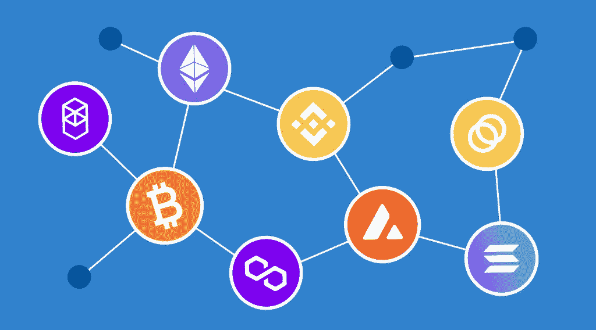

# 交叉链平台:交叉链桥是如何工作的？

> 原文：<https://medium.com/coinmonks/cross-chain-platforms-how-do-cross-chain-bridges-work-ba20c3dfdaa5?source=collection_archive---------36----------------------->

交叉链是一种增强区块链网络互连的技术。跨链平台使得在区块链之间交换信息、NTFs 和价值成为可能。这种类型的平台有时被称为“跨链桥”，因为它们是各种系统之间的一种桥梁。它还支持数据和令牌在数据集群之间流动。它们的首次出现是因为对不同的基于区块链的 web 3.0 技术的需求持续增长，而许多区块链网络和加密货币继续使用不同的区块链技术，包括比特币、以太坊、索拉纳等。互连的需要最终导致了跨链桥的产生，互操作性成为了今天跨链加密区块链的关键特征之一。

# 跨链交易

跨链掉期是跨链交易的一种特殊形式。在跨链交换中，每个边缘转移源已经拥有的资产。然而，一般来说，跨链交易涉及每个区块链的一系列交换。要进行交换，用户可能需要按顺序执行步骤，而不是执行单个独立的交换。

以下是跨各种链隔离交易的一些最常见且广为人知的方法:

*   ***原子互换:*** 这些是交换服务商，使两个不同的当事人能够在多个区块链上交易他们的代币。这种机制不需要集中的第三方来促进交易。相反，它允许用户在对等的基础上直接交易他们的代币。
*   ***中继:*** 中继使区块链网络能够保持对其他链上发生的交易和事件的检查。它们在链到链的基础上工作，不涉及分布式节点，便于单个契约充当多个链上其他节点的中央客户端。区块链交易的全部历史都是可以考证的。
*   ***合并共识:*** 这些方法是健壮的，通过中继链提供链间的双向互操作性。宇宙和以太坊项目利用了合并共识。
*   ***【无状态简化支付验证(SPV)】***与中继相比，无状态简化支付验证的运行成本更低，智能合同可以验证一部分工作证明起源历史。无状态 SVP 通过仅发送事务的必要报头来运行。接收链不必保存完整的报头记录，这大大减少了存储需求。这种方法只适用于电力系统。
*   ***联盟:*** 联盟允许可信的团体在一个链上验证另一个链上的事件。这也是一种稳健的方法，但它依赖于第三方或中介，这在某些情况下可能是一种限制。

# 跨链桥是如何工作的？

比如说，你有比特币，你想把它转换成 Chainlink。您只需将$BTC 存入桥上，然后选择在$LINK 提款。该桥将锁定智能合约中的$BTC，并在以太坊区块链上铸造等量的$链接。

如果没有跨链掉期，你可以选择通过集中交易所(CEX)来“桥接”你的$BTC。你要做的是把$BTC 转换成 CEX，以$LINK 卖出，然后再把它转出。或者，你可以像 Exodus 一样进行钱包互换，但费用可能会高得多。事实上，通过 CEX 或钱包来桥接你的密码比仅仅使用区块链桥要乏味、耗时和/或昂贵得多。一般来说，区块链桥有助于以低成本将代币从一个区块链快速转移到另一个。

# 交叉链平台的类型

多链桥是最著名的跨链桥之一，它是双向的，也就是说你可以自由地在区块链之间转换资产。然而，还有许多其他具有各种特征的平台。

例如，一些被称为单向或单向网桥的网桥只允许您将资产移植到目标区块链，而不是相反。对于比特币，这可能是最知名的加密货币，最常见的桥梁是使用包装比特币(WBTC)。包裹比特币允许你将比特币发送到以太坊区块链，但不允许你将以太发送到比特币区块链。所有包装好的比特币(WBTC)由 BitGo 托管，使其成为一个集中的桥梁。你可以在我们之前的文章中读到更多关于 WBTC 的信息。

## 币安大桥

币安大桥与币安智能链区块链项目有关，该项目于 2022 年 2 月更名为 BNB 链。然而，币安桥并不局限于单一的区块链。它支持以太坊、索拉纳、BNB 链和创区块链网络以及大量代币，包括比特币、以太坊、Chainlink、Cardano 等。

## 虫洞桥

虫洞通过智能合约锁定一个原始令牌，将硬币包裹在目标区块链上的虫洞铸造令牌中。它支持 Solana、Ethereum、Terra、BNB 链、Polygon、Avalanche、Oasis 和 Fantom 区块链网络，以及 USD Coin、Tether、FTX 令牌、Ethereum、Serum、MakerDAO、TerraUSD、币安 USD、Huobi Global、OKEx、Huobi BTC、Synthetix、Shiba Inu、Axie Infinity、SushiSwap、分散地、沙盒和 Uniswap 等令牌。

在其他最流行的跨链加密桥中，你可以找到 ZeroSwap 和 Celer cBridge。

# 结论

区块链技术有潜力改善各种 IT 领域，但是，它必须进一步发展，以提供更广泛的应用。跨链技术实现了区块链网络之间的资产无缝转移，同时降低了流量和燃气成本。它还促进了开发者的协作，促进了更快的交易处理速度和不同令牌之间的即时交换。

如果你正在寻找一个地方开始你的跨链加密之旅，并购买或交换硬币， [StealthEX](https://stealthex.io/) 在这里可以帮助你。你可以私下做这件事，不需要注册服务。我们的加密收藏有 400 多种不同的硬币，您可以立即进行钱包到钱包的转账，没有任何问题。

## 如何购买 Crypto？

很简单！只需去 [StealthEX](https://stealthex.io/) 并遵循这些简单的步骤:

1.  选择要兑换的货币对和金额。比如， [BTC](https://stealthex.io/coin/bitcoin) 到 [WBTC](https://stealthex.io/coin/wrapped-bitcoin) 。
2.  按下“开始交换”按钮。
3.  提供要将您的加密传送到的收件人地址。
4.  处理交易。
5.  接收您的加密硬币。

在 [Medium](https://stealthex-io.medium.com/) 、 [Twitter](https://twitter.com/Stealthex_io) 、 [Telegram](https://t.me/StealthEX) 、 [YouTube](https://www.youtube.com/channel/UCeES_XBesX76ge7xf1meuSw) 和 [Reddit](https://www.reddit.com/user/Stealthex_io) 上关注我们，了解关于 [StealthEX.io](https://stealthex.io/) 和其他加密世界的最新消息。

在购买任何密码之前，不要忘记做你自己的研究。本文表达的观点和意见仅代表作者个人。

*原载于 2022 年 6 月 10 日*[*https://stealthex . io*](https://stealthex.io/blog/2022/06/10/cross-chain-platforms-how-do-cross-chain-bridges-work/)*。*

> *加入 Coinmonks* [*电报频道*](https://t.me/coincodecap) *和* [*Youtube 频道*](https://www.youtube.com/c/coinmonks/videos) *了解加密交易和投资*

# 另外，阅读

*   [3 商业评论](/coinmonks/3commas-review-an-excellent-crypto-trading-bot-2020-1313a58bec92) | [Pionex 评论](https://coincodecap.com/pionex-review-exchange-with-crypto-trading-bot) | [Coinrule 评论](/coinmonks/coinrule-review-2021-a-beginner-friendly-crypto-trading-bot-daf0504848ba)
*   [莱杰 vs n rave](/coinmonks/ledger-vs-ngrave-zero-7e40f0c1d694)|[莱杰 nano s vs x](/coinmonks/ledger-nano-s-vs-x-battery-hardware-price-storage-59a6663fe3b0) | [币安评论](/coinmonks/binance-review-ee10d3bf3b6e)
*   [Bybit Exchange 审查](/coinmonks/bybit-exchange-review-dbd570019b71) | [Bityard 审查](https://coincodecap.com/bityard-reivew) | [Jet-Bot 审查](https://coincodecap.com/jet-bot-review)
*   [3 commas vs crypto hopper](/coinmonks/3commas-vs-pionex-vs-cryptohopper-best-crypto-bot-6a98d2baa203)|[赚取加密利息](/coinmonks/earn-crypto-interest-b10b810fdda3)
*   最好的比特币[硬件钱包](/coinmonks/hardware-wallets-dfa1211730c6) | [BitBox02 回顾](/coinmonks/bitbox02-review-your-swiss-bitcoin-hardware-wallet-c36c88fff29)
*   [BlockFi vs 摄氏度](/coinmonks/blockfi-vs-celsius-vs-hodlnaut-8a1cc8c26630) | [Hodlnaut 审核](/coinmonks/hodlnaut-review-best-way-to-hodl-is-to-earn-interest-on-your-bitcoin-6658a8c19edf) | [KuCoin 审核](https://coincodecap.com/kucoin-review)