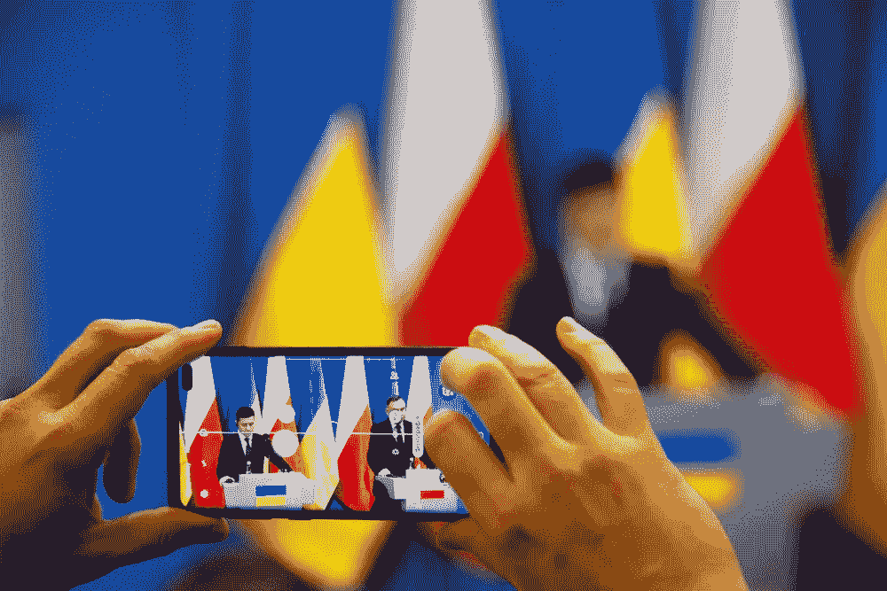
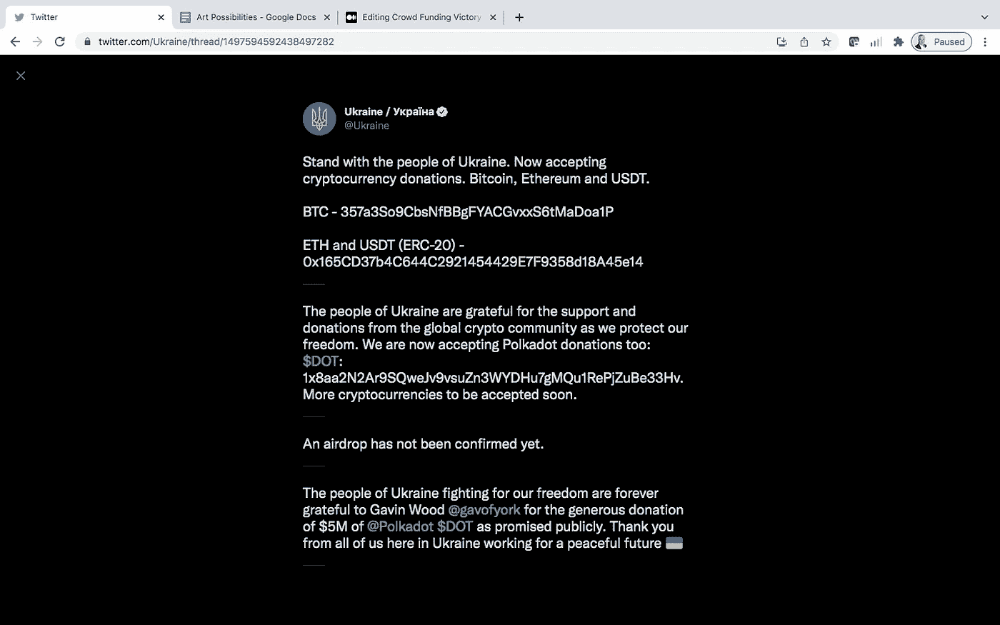

# 乌克兰众包

> 原文：<https://medium.com/coinmonks/crowd-funding-ukraine-eb3d912d2bde?source=collection_archive---------41----------------------->

*全世界集会支持…..Web3 风格*

这场战争开始不到一周。

而且，在这段时间里，我们正成群结队地赶往援助乌克兰的事业。Web3 加密货币功能现在已经过测试和应用，有望通过对乌克兰、欧洲和世界的积极结果来帮助解决这场可怕的冲突。我们的愿望正通过网络 3 的代理在战场上得到体现。

普京似乎严重低估了乌克兰人民的决心。全世界对乌克兰的迅速支持，以及通过新时代的通信网络和货币兑换筹集援助的即时性，都产生了影响。这种影响正在挫败普京迅速获胜的愿望，甚至可能是任何胜利。

秘密捐款滚滚而来:

这是一种不断发展的个人关系，乌克兰和世界之间有一个开放的沟通渠道。直接。通过 Twitter，捐款可以通过 crypto 立即获得。

你的 Metamask 钱包是一种战争武器。你的推特账户是一个不间断的军事通信网络。

这种情况既可怕，也令人惊讶。看到全世界团结起来支持乌克兰，看到这种支持给普京带来的压力，令人振奋。这让我对人类充满希望。

对和平充满希望。

以及我们对乌克兰危机的全球反应可能对未来这种规模的冲突解决方案产生的影响。

看到俄罗斯街头挤满反对自己领导人行动的抗议者的现场视频绝对令人震惊。看到它通过 Twitter 瞬间从一部 iPhone 传到所有其他 iPhone，真是太壮观了。

从某种意义上说，这是一种新的民主形式。全球社区通过社交媒体投票，并通过加密捐款立即为该事业做出贡献。对一个正在采取全世界都不同意的行动的民族国家施加沉重的政治压力。

100 年前，伍德罗·威尔逊领导了国际联盟，后来国际联盟改名为联合国。这一切都很好，而且可能在过去几年里帮助推进了人类的事业。但是他们行动太慢，而且有政治动机，就像包括冲突国家在内的联合国成员国一样。

现在我们有一个网络 3 公民联盟。这个联盟像闪电一样移动。比普京试图部署的闪电战战术还要快。在 Web3 中可以听到所有的声音。每个声音都很重要。我们会被倾听。一次又一次。

乌克兰的未来仍然非常不明朗。对于这个星球来说，这是自冷战结束以来我们所经历的最可怕的时刻。

但是，感觉有些不同，不是吗？

好像我们很重要。我们有发言权。就像我们与乌克兰的同胞有着真正的联系一样，甚至对于可怜的俄罗斯士兵和人民来说，他们自己也将为一个人的行为付出可怕的代价。

我们可以梦想各种可能性，对吗？

也许，仅仅是也许这种由 Web3 技术促成的快速反应，正在向我们展示一条前进的道路。也许我们是在向未来的暴君发出警告，当他们决定攻击一个不情愿的敌人时，全世界都在看着，并将努力保护脆弱的人，使他们不那么脆弱。

因此，也许从一开始就阻止下一个暴君行动。

这叫做世界和平。

我们可以做梦。