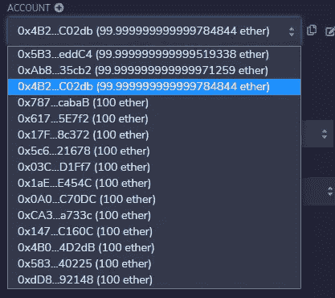

# 使用 Solidity 的众筹智能合约

> 原文：<https://medium.com/coinmonks/crowdfunding-smart-contract-using-solidity-33be93acee90?source=collection_archive---------10----------------------->


这篇文章最初发布在 [Hackmamba](https://hackmamba.io/blog/2022/05/create-a-crowdfunding-smart-contract-using-solidity/) 上。

智能合同是部署在区块链上的弹性和高度安全的应用程序。

我们将建立一个智能的活动合同，用于众包项目，并跟踪`crowdsourcer`的消费习惯。

# 先决条件

*   [混音](https://remix.ethereum.org/#optimize=false&runs=200&evmVersion=null&version=soljson-v0.8.7+commit.e28d00a7.js)
*   很少或根本不了解坚固性

# 个案研究

在开始之前，我们先来看一个 [Kickstarter](https://www.kickstarter.com/) 的案例研究。Kickstarter 是一个众包网站，任何人都可以在这里提出自己的想法，让人们通过众包来完成他们的项目。

虽然这是一个美丽的想法，但如果我们使用区块链技术建立这种合同，我们会在 Web3 上遇到问题。

# 问题

*   谁批准释放资金池内的资金？
*   业主众包后骗了所有人，带着全部资金跑路怎么办？
*   我们如何交叉检查项目，看众包者是否有进展？

虽然这可能感觉是一项大任务，但我们将创建一个智能合同，将所有这些都考虑在内，并确保捐助者的资金根据协议得到利用。

怎么会？

首先，看看这张我们打算建造的图表。


经理打电话合同要求出资者共同集资。众包之后，经理调用一个必须有超过 50%的贡献者批准的支出请求，但是如果经理调用一个请求到他的钱包呢？

我们如何补救这种情况？

当请求支出请求时，在结构中填写供应商帐户，一旦批准，就发送给该供应商，而不是经理。

保障了出资人资金的可问责性和安全性。

我们将使用 Remix IDE 来编写我们的智能合约，所以点击[这里](https://remix.ethereum.org/#optimize=false&runs=200&evmVersion=null&version=soljson-v0.4.17+commit.bdeb9e52.js&language=Solidity)开始。

```
//SPDX-License-Identifier: MIT
    pragma solidity ^0.4.17;
```

第一行告诉我们正在使用的许可证，MIT 免费许可证。如果我们没有这样做，我们的代码将抛出一个错误。


`Pragma solidity`告诉我们正在开发的版本；注意这个版本必须和我们的编译器匹配，否则我们会得到一个错误符号。

在本文中，我们将使用版本`0.4.17`。

```
contract CrowdSource{
     address public manager;
     uint public MinimumContribution;
     address[] public approvals;
```

我们可以通过调用函数`contract`并给出`**CrowdSource**`来创建契约。使用花括号打开它。

我们称这个变量为 manager，因为它是`crowdsourcer`和合同调用者。

`Uint`是类似于`uint256`的无符号变量；我们公开这个函数，因为我们希望任何人在贡献`MinimumContribution`时都可以调用它。

我们创建了另一个名为`address approvals`的函数，但是有了`[ ]`，每个完成`MinimumContribution`的人都将被保存在批准列表中。我们将尽快移除它，因为它运行起来既昂贵又耗油。

```
function campaign(uint minimum)public{
        manager = msg.sender;
        MinimumContribution = minimum;
      }
```

# 构造函数

`Constructor`或`function`活动是第一个运行的功能，因为我们希望确保只有经理可以调用合同。

注意，我们让`public`去见合同的调用者。

`msg.sender`是我们赋给经理的一个通用变量，`manager = msg.sender;`无论什么时候这样调用合同，调用合同的人就是经理。

我们称之为`(uint minimum)public{`，它是一个无符号整数，表示成为贡献者所需的金额，我们可以有一个不同的最小值或创建一个静态金额。

然后我们可以调用函数`MinimumContribution = minimum;`,这样任何对合同有贡献的人都会被添加到这里`uint public MinimumContribution;`

# 批准过程

当贡献者向合同支付`payable`最低金额时，将调用 approvals 函数。

```
function contribute() public payable{
        require(msg.value > MinimumContribution);
        approvals.push(msg.sender);
      }
```

`require`功能将没有给`minimumContribution`增加价值的人踢出去，并将贡献者推到批准列表中。

接下来，我们将介绍 payable 函数和 approval 变量，我们将了解为什么它们在智能合同中起着重要作用。

# 申请资金

贡献者可以向我们的合同中发送资金，但是我们不能从请求功能中提取资金，这导致我们创建了一个`struct`。结构是具有不同类型的键值对的集合。

```
contract CrowdSource{
      struct request{
        string description;
        uint value;
        address recipiant;
        bool complete;
    }
```

*   **描述** : `string`:请求的目的。
*   **值** : `Uint`:需要的钱数。
*   **收件人** : `address`:厂商地址

我们创建一个 struct 作为请求，贡献者在将它发送给供应商之前批准它，它也是一个 struct 类型。

Struct 不是一个实例，而是我们可以在项目中多次使用的类型的定义。

# 测试合同

我们将在 IDE 中测试契约。


在 Remix 上运行测试很简单。我们可以在左侧看到部署和运行事务。


*   环境

大约有四种不同的环境，但是大多数时候只使用两个`javascript VM (London)`和`Injected Web3`。



*   账户
*   Remix 提供了 15 个免费帐户，我们可以使用它们来部署合同和测试我们的部署。


*   气体限制气体限制在部署合同时复制实际气体费用。合同中的每次部署或变更都将花费我们一笔汽油费，我们将在以后审查这笔汽油费。
*   价值价值是我们在配置合同时投入的资金。`Wei`是最小单位，以太是以太坊上使用的货币的最高单位。
*   合同的名称，在本例中是`new.sol`。`.sol`是一种稳健性合同的文件格式。
*   部署将合同部署到区块链网络中，以便我们可以与网络进行交互。

编译合同并单击 deploy，将在下面创建一个合同。


单击左侧的下拉按钮，查看完整的部署。


在我们的合同中，我们有一个活动，它是一个无符号整数`uint256`；这是我们把我们的贡献输入到合同中的部分，所以谁投入任何资金都被添加到合同中。

我们来测试一下。

我们将在活动输入框中输入一个`100wei`，但请记住更改上面的帐户，这样我们就不会让合同经理成为贡献者。

使用另一个帐户并输入`100wei`。


单击活动，注意右边的面板变成绿色，这意味着资金已发送到合同。


1 号是经理部署的合同；请注意，地址以 0X746 开始..而 2 号是合同的新出资人。

数字 3 告诉我们一个贡献者加入了契约。

# 结论

我们已经创建了一个众筹智能合同，允许用户一起众筹，我们可以在区块链网络上部署这个合同。

# 资源

*   [坚固度零到英雄教程](https://www.codiesalert.com/courses/free-solidity-course/)
*   [以太坊和坚固性:完整的开发者指南](https://www.udemy.com/course/ethereum-and-solidity-the-complete-developers-guide/learn/lecture/9020750?start=75#overview)

> 加入 Coinmonks [电报频道](https://t.me/coincodecap)和 [Youtube 频道](https://www.youtube.com/c/coinmonks/videos)了解加密交易和投资

# 另外，阅读

*   [3 商业评论](/coinmonks/3commas-review-an-excellent-crypto-trading-bot-2020-1313a58bec92) | [Pionex 评论](https://coincodecap.com/pionex-review-exchange-with-crypto-trading-bot) | [Coinrule 评论](/coinmonks/coinrule-review-2021-a-beginner-friendly-crypto-trading-bot-daf0504848ba)
*   [莱杰 vs n rave](/coinmonks/ledger-vs-ngrave-zero-7e40f0c1d694)|[莱杰 nano s vs x](/coinmonks/ledger-nano-s-vs-x-battery-hardware-price-storage-59a6663fe3b0) | [币安评论](/coinmonks/binance-review-ee10d3bf3b6e)
*   [Bybit Exchange 审查](/coinmonks/bybit-exchange-review-dbd570019b71) | [Bityard 审查](https://coincodecap.com/bityard-reivew) | [Jet-Bot 审查](https://coincodecap.com/jet-bot-review)
*   [3 commas vs crypto hopper](/coinmonks/3commas-vs-pionex-vs-cryptohopper-best-crypto-bot-6a98d2baa203)|[赚取秘密利息](/coinmonks/earn-crypto-interest-b10b810fdda3)
*   最好的比特币[硬件钱包](/coinmonks/hardware-wallets-dfa1211730c6) | [BitBox02 回顾](/coinmonks/bitbox02-review-your-swiss-bitcoin-hardware-wallet-c36c88fff29)