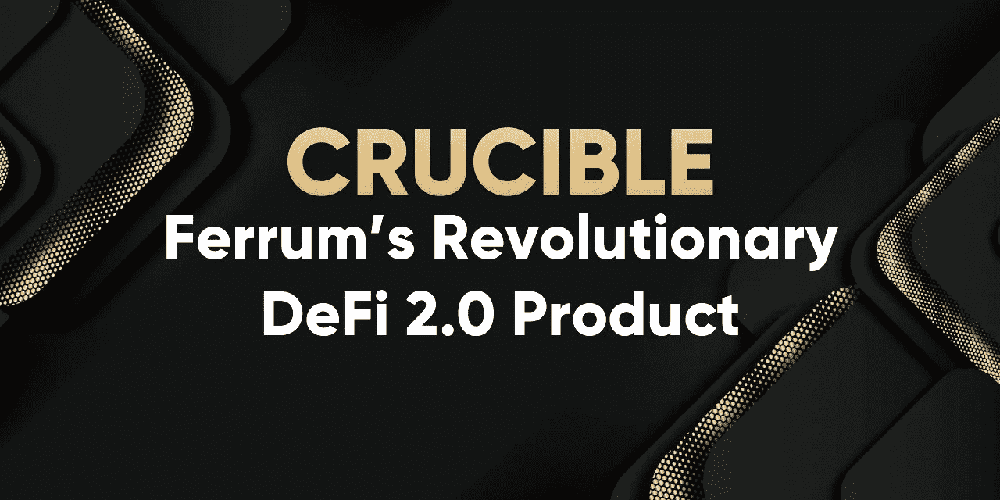
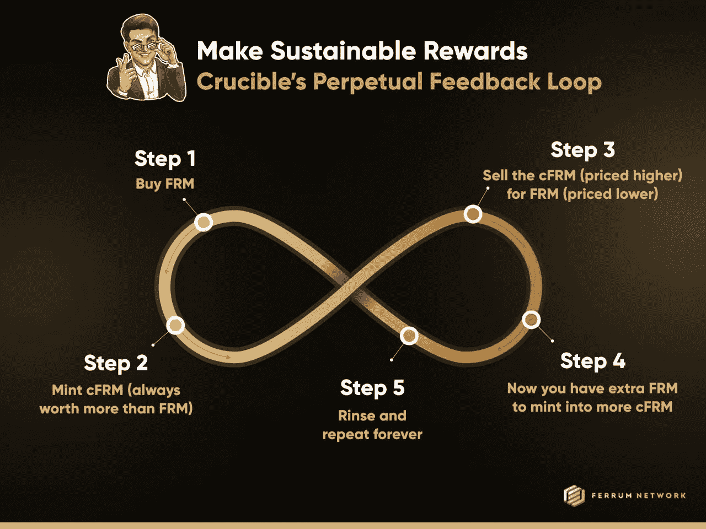

# Crucible:铁网络革命性的 DeFi 2.0 产品，为大众带来可持续的回报

> 原文：<https://medium.com/coinmonks/crucible-ferrum-networks-revolutionary-defi-2-0-e22dd3f7cf6b?source=collection_archive---------23----------------------->

## 铁已经发布了其备受期待的 DeFi 2.0 产品，坩埚。在这里找到你需要知道的一切。

DeFi 是一个令人惊叹的奇观，它只是刚刚开始寻求大规模采用。虽然 DeFi 的价值主张是一项崇高的事业，即通过分散金融工具重塑当前的金融体系，但 DeFi 1.0 协议中固有的某些元素阻碍了该行业的大规模采用。

铁网络的核心使命一直是并将永远是“打破大众采用的障碍。”铁的革命性 DeFi 2.0 产品 Crucible 深深植根于这一原则，因为他们的目标是将这种*可持续*且易于使用的产品带给大众！

# 识别问题

为了真正理解像坩埚这样的产品的重要性，人们必须理解铁在建造它时要解决的问题！由于缺少一个非常重要的属性… *可持续性*，DeFi 1.0 协议的很大一部分未能获得成功。

# 不可持续的奖励模式

*Staking* 是 DeFi 领域最常用的协议之一。投资者被鼓励投资单一资产，并从该资产中获得回报。问题是，为了激励参与，项目经常求助于*通货膨胀*奖励机制，这给被奖励的令牌增加了巨大的*销售压力*。

通常情况下，这些奖励要么来自财政部代币，要么来自营销预算。所有这些场景*都给*充气*循环供给*。因此，虽然它可能会鼓励 TVL(总价值锁定)，但它也带来了巨大的卖出压力，抵消了这两种常用 DeFi 协议的积极经济性。

# 折旧资产

代币的主要目的是用作奖励代币，其问题在于，由于所有的抛售压力，代币的价值受到影响。因此，虽然年利率在开始时可能很高，但随着更多的人进入资金池，导致更多的代币被注入流通供应并最终售出，年利率很快就会枯竭。

# 铁如何解决这个问题？

大多数问题都是出于需要而解决的。自 2018 年以来，铁姆一直是作为服务提供商的首选。虽然这些产品仍然存在，但铁公司希望创造一种解决方案，不仅能抑制象征性排放，还能抑制通货紧缩。Crucible 的底层技术*等离子打桩*——是一套专有的智能合同，可以做到这一点！

# 理解反射标记

铁姆的原生代币是$FRM 和$FRMx。通过 Crucible dashboard，用户可以创建一个名为 cFRM 和 cFRMx 的令牌包装版本。这些包装的版本被认为是反射令牌。反射令牌是独一无二的，因为它们有相关的交易费用。这意味着，每当有人购买、出售或转让代币时，都会有一小部分(通常在 1-4%之间)被扣除，类似于税收。

# 实现可持续的奖励模式

现在我们知道我们在想什么了…税？没人喜欢税！然而，重要的是要理解这些交易费用最终会发生什么。在坩埚的情况下，铁赋予其持有者标桩 cFRM 和/或 cFRMx 的能力。那些下注 cFRM 或 cFRMx 的人分享所有交易费用的 100%,与他们在资金池中的股份成比例。赌注者可以随意进出池中，但请记住，即使转让也会产生费用，这些费用将分配给那些留在池中的人。这激励了长期持有！

这种模式最吸引人的地方是这些奖励的来源。与不可持续的奖励模式不同，这些奖励代币不是来自通胀排放计划、财政部、营销预算或任何其他非流通代币供应。相反，所有产生的回报已经是流通供给的一部分，事实上与交易量直接相关！

# 资产增值

如果被问到，大多数对经济学有基本了解的人会选择通缩资产，而不是通胀资产。以可持续的方式奖励忠诚的代币持有者对铁来说还不够。铁想确保用于奖励股东和流动性提供者的资产也是通货紧缩的！

**烧伤婴儿烧伤！** 坩埚的特点之一，就是交易费用的一部分(10%)都被*烧掉了*。这意味着所有交易量的 0.2%退出流通，从而减少了 cFRM 和 cFRMx 及其未包装交易的供应。

# 创建一个永久的奖励反馈循环

因为 Crucible 参与者获得的奖励金额与交易量直接相关，所以使 Crucible 成功的最重要因素是交易量。幸运的是，铁姆想到了一个独特的方法来确保交易量保持一致。

这里的关键词是*套利。* 在增加流动性时，铁将 cFRM 和 cFRMx 的价格设定为比未包装的交易对手高 50%。由于用户能够以 1:1 的比例铸造 cFRM 和 cFRMx，他们能够销售更有价值的坩埚版本的令牌用于未包装的版本，然后利用所得的 FRM 和 FRMx 铸造更多的 cFRM 和 cFRMx。冲洗。重复…考虑到象征性燃烧的通货紧缩性质，这使得 cFRM 和 cFRMx 的价格更难与 FRM 和 FRMx 达成价格均衡。不断的套利机会创造了一个永久的回报反馈循环。

# 访问坩埚测试版

如果你想了解更多关于 Crucible 的信息，可以观看这些内容丰富的视频，在 Ferrum 圆桌会议播客上收听 Crypto，并 [**注册加入 Crucible Beta，点击这里**](https://ferrum.network/crucible-beta/) 。请记住，铁将选择有限数量的测试人员。

# 最后

铁用坩埚创造的是非凡的。一个真正自我维持的经济，一个永久的回报反馈循环，是 DeFi 领域迫切需要的。铁姆公司下一步将会把这项技术带到这个领域的其他项目中，继续他们的使命，打破大规模采用区块链技术的障碍。要了解 Crucible 计划如何革新 DeFi 2.0，请观看以下视频:

# 关于铁

铁是开创互操作性 2.0 时代的先锋。由 Quantum Portal 提供支持，铁网络的 mainnet 节点和相关基础设施将为行业中的每个链带来价值、数据和功能互操作性。利用铁网络，任何人都可以在一个网络上构建和部署解决方案，并立即启用多链功能，而没有为其 dApps 和项目管理多链基础设施带来的负担或技术债务。

铁姆还专门从事多链区块链即服务 DeFi 公司，为整个加密领域的项目添加紧缩机制、令牌实用程序和咨询服务。

本着打破大规模采用障碍的使命，铁通过减少摩擦，使初创公司和已建立的网络更加紧密，从而为行业提供动力。

# 铁重要环节

[网站](https://ferrum.network/) | [电报](http://telegram.ferrum.network/) | [推特](http://twitter.ferrum.network/) | [YouTube](https://www.youtube.com/channel/UCN658dMRTaH4C4dP32VHi6Q) | [不和](https://discord.gg/HEfKq57asd)