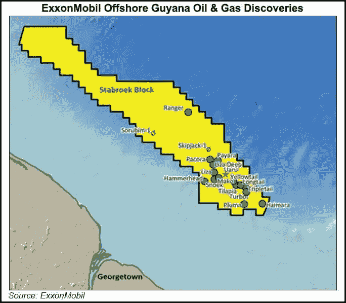

# 原油和铁矿石预示着全球大宗商品超级周期的重启

> 原文：<https://medium.com/coinmonks/crude-oil-iron-ore-are-signaling-a-reboot-in-the-global-commodity-supercycle-2e87325a8a05?source=collection_archive---------0----------------------->

如今，全球经济正在经历许多专家所说的 [**【商品超级周期】**](/@44jmonroe91/goldman-sachs-bull-market-for-battery-metals-is-over-ab3a41e29d48) ，而 [**俄乌冲突**](/@44jmonroe91/russia-and-ukraine-a-backstory-view-of-the-conflict-a93720d11579) 更加剧了这种情况。

这里有两个世界上最大的两家公司的全球商品趋势的例子:埃克森美孚和力拓。圭亚那的海上石油发现和几内亚的铁矿石开采项目都是环境、社会和治理(ESG)以及地缘政治趋势如何在生产方面发挥作用的经典案例。

# 埃克森美孚在圭亚那

圭亚那物流服务公司(GLASS) [**总经理在向记者谈到圭亚那的石油和天然气行业时说**](https://guyanachronicle.com/2022/06/09/we-almost-shut-down-operations-and-then-guyana-struck-oil-a-local-content-success-story/) :

> *“作为圭亚那人，生活在圭亚那，这真是一个激动人心的时刻！”*

那是因为在 2022 年 6 月 5 日****美国能源巨头埃克森美孚在圭亚那发现了两个新的海上油田，据说能够生产大约 1000 万桶石油当量。这两个新发现被称为 Fangtooth 和 Lau Lau，是对 2019 年开始生产原油的 [**Stabroek 区块**](https://www.argusmedia.com/en/news/2288829-exxonmobil-makes-two-further-finds-offshore-guyana) 的补充。埃克森美孚公司将原油产量提高了 10 亿桶油当量后，[**Liza Unity FPSO**](https://www.ogj.com/exploration-development/discoveries/article/14223129/exxonmobil-discovers-more-oil-offshore-guyana)号船于 2021 年 10 月****开始在圭亚那近海作业。********

> ******有关埃克森美孚在 Stabroek 区块和 Liza Unity FPSO 的原油生产的更多具体信息，请点击此处:[https://www . naturalgasintel . com/Exxon Mobil-building-ple sora-of-oil-natural-gas-prospects-in-Stabroek-offshore-Guyana/](https://www.naturalgasintel.com/exxonmobil-building-plethora-of-oil-natural-gas-prospects-in-stabroek-offshore-guyana/)******

******2021 年 10 月在圭亚那近海的最初海上发现导致了迄今为止一些世界上最大的公司的投资热潮。 [**必和必拓集团**](/@44jmonroe91/why-is-the-worlds-largest-metal-miner-bhp-group-pushing-for-future-facing-commodities-on-the-1c6dd34ce681) 获准在海上区块进行三维地震勘探。埃克森美孚还计划在圭亚那海上增加产量，到 2025 年**时，四艘浮式采油储油卸油轮每天可生产 80 万桶石油。由于这些原因，赫斯的首席执行官约翰·赫斯说:********

> *******【离岸圭亚那】【石油】行业最佳投资之一*******

******中国最大的海上石油天然气生产商——中国海洋石油总公司(CNOOC)拥有海上 Stabroek 区块 [**25%的股份**](https://oilnow.gy/featured/cnooc-enjoying-rare-success-on-global-stage-with-guyana-oil-finds/) ，并指出，瓜亚纳海上原油生产是该公司最有价值的国际原油生产投资。另据报道，中海油打算从 2022 年 [**到 2024 年**](https://www.chinadaily.com.cn/a/202202/15/WS620aff7ea310cdd39bc869f7.html) 将油气产量每年提高 6%以上。******

****这意味着海上圭亚那是中国能源安全战略的重要组成部分，原油生产是确保世界上最大的制造国和第二大经济体多样化和稳定的能源组合的主要因素。****

# ****力拓在几内亚****

********

****Source: Mining-Technology, “Simandou Iron Ore Project” 10 June 2014\. [https://www.mining-technology.com/projects/simandou-iron-ore-project-guinea/](https://www.mining-technology.com/projects/simandou-iron-ore-project-guinea/)****

****几内亚东南部 Simadou 矿的铁矿石生产始于 [**2015**](https://www.mining-technology.com/projects/simandou-iron-ore-project-guinea/) 。该项目由力拓集团、中国铝业公司、几内亚政府和国际金融公司共同开发。****

****西芒杜项目要求增加对几内亚基础设施发展的投资，因为该项目在偏远的山区生产。新的横贯几内亚铁路计划将西芒杜与几内亚沿海地区连接起来。此后，中标的西芒杜(WCS)财团成立，负责修建铁路和港口。WCS 聘请中铁十八局集团有限公司负责这项工作。****

****极度濒危黑猩猩 的生态问题引发了人们对铁路和港口建设项目的担忧，但几内亚政府似乎一直对与力拓和中铝的协议条款不满意。****

> ****这个故事的一个重大发展是 2021 年 9 月 5 日几内亚发生的军事政变。在这里阅读:[https://www.bbc.com/news/world-africa-58461971](https://www.bbc.com/news/world-africa-58461971)****

****新的协议条款于 2022 年 3 月 28 日****签订，几内亚政府将在项目完成后完全控制铁路和港口。后来宣布，如果铁矿项目不能在 2024 年 [**到 2025 年**](https://www.reuters.com/business/simandou-iron-ore-mine-developers-risk-penalties-if-timeline-missed-guinea-says-2022-03-29/) 完成，几内亚政府保留取消采矿许可证的权利。********

****戴维·托马斯为《非洲商业》撰稿，声称西芒杜铁矿项目延期的主要原因之一是力拓集团和几内亚政府之间缺乏关于跨几内亚铁路的协议。托马斯表示，该项目的主要目的是开采铁矿石，然后出售给中国，以减少中国对澳大利亚大量铁矿石出口的依赖。****

****因此，西芒杜铁矿项目具有重大的地缘政治影响——不仅对整个非洲地区，而且对中国和澳大利亚之间日益紧张的关系也是如此。****

****另一个问题是由非洲报道的 Diawo Barry 提出的，力拓在该报道中遇到了投资者对的担忧。无法获得建设铁路和港口的资金将影响该公司完成项目的时间表。****

# ****为什么它很重要****

****埃克森美孚和力拓是世界上最大的两家公司。圭亚那和几内亚的例子揭示了每个公司是如何处理环境、社会和公司治理问题的。****

****[**大圭亚那计划**](http://greaterguyanainitiative.gy/media) 由埃克森美孚公司、赫斯公司和中国海洋石油总公司共同设立，旨在为有助于圭亚那经济和人民可持续发展的项目提供资金，包括支持该国现代农业和健康发展工作的区域性计划。****

****埃克森美孚公司的海上发现也将为 3500 名圭亚那人提供就业机会，同时直接与当地的供应商在项目上合作。****

****另一方面，力拓在海外采矿项目上似乎不能为当地政府和人民做任何正确的事情——巴布亚新几内亚、蒙古和几内亚(西非)都是导致力拓遭受重大损失的案例。甚至可以说，所有这些案件都破坏了力拓的形象，并使其成为全球矿业活动中 ESG 企业责任的最重要部分。****

****圭亚那和几内亚的例子确实证明了大宗商品对地缘政治的重要性。圭亚那近海项目的一个方面是，它加剧了与 T21、委内瑞拉、委内瑞拉和委内瑞拉的历史边界争端。****

# ****阅读更多关于全球商品和地缘政治的信息:****

**** [## 巴西和秘鲁的土著群体为钾碱和铜矿展开反击

### 土著团体强烈反对巴西博尔萨诺的国家化肥计划

medium.com](/coinmonks/indigenous-groups-fight-back-in-brazil-peru-over-potash-copper-mines-fd38e0a263f0)  [## 中国青山控股公司的镍交易如何扰乱电动汽车(EV)电池供应

### 我已经为中华人民共和国探索了一些关于铜工业的基本事实。现在…

medium.com](/coinmonks/what-happened-with-chinas-tsingshan-holdings-on-the-lme-eff8b6288fe9)  [## 俄罗斯如何在 2022 年扰乱里海管道财团(CPC)和全球供应

### 我写这篇文章是因为 2022 年 6 月 3 日的一篇报道，报道称哈萨克斯坦将把其重要的石油出口更名为…

medium.com](/@44jmonroe91/how-russia-disrupted-the-caspian-pipeline-consortium-cpc-and-global-supplies-in-2022-9fc1799eca6e)  [## 俄罗斯的行动如何提高了巴西化肥战略的风险

### 我决定写巴西，因为它是联合国大会投票弃权的国家之一…

medium.com](/@44jmonroe91/how-russias-actions-raised-the-stakes-of-brazil-s-fertilizer-strategy-5fb2381a1a2f) 

> 加入 Coinmonks [电报频道](https://t.me/coincodecap)和 [Youtube 频道](https://www.youtube.com/c/coinmonks/videos)了解加密交易和投资

# 另外，阅读

*   [分散交易所](https://coincodecap.com/what-are-decentralized-exchanges) | [比特恩斯 FIP](https://coincodecap.com/bitbns-fip) | [宾邦评论](https://coincodecap.com/bingbon-review)
*   [用信用卡购买密码的 10 个最佳地点](https://coincodecap.com/buy-crypto-with-credit-card)
*   [加拿大最佳加密交易机器人](https://coincodecap.com/5-best-crypto-trading-bots-in-canada) | [Bybit vs 币安](https://coincodecap.com/bybit-binance-moonxbt)
*   [阿联酋 5 大最佳加密交易所](https://coincodecap.com/best-crypto-exchanges-in-uae) | [SimpleSwap 评论](https://coincodecap.com/simpleswap-review)
*   购买 Dogecoin 的 7 种最佳方式 | [ZebPay 评论](https://coincodecap.com/zebpay-review)
*   [最佳期货交易信号](https://coincodecap.com/futures-trading-signals) | [流动性交易所评论](https://coincodecap.com/liquid-exchange-review)****