# CRV:偏爱稳定性和可组合性，而不是波动性和投机性

> 原文：<https://medium.com/coinmonks/crv-favoring-stability-and-composability-over-volatility-and-speculation-5597bd4f1ed5?source=collection_archive---------20----------------------->

自从 2020 年夏天 DeFi 的爆发以来，我们已经在许多分散化金融协议中看到了巨大的 TVL 收益。在撰写本文时，这些 DeFi 协议锁定了约 141 亿美元。DeFi 协议在 DEXes 上蓬勃发展，这些协议依赖于自动做市商(AMMs)发挥作用。

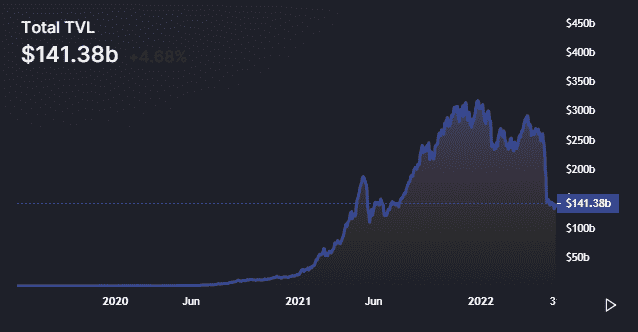

但是这些 AMM 有一个问题。创建 Curve 是为了解决这个问题。

这些 AMM 随着每次加密交换/交易而重新平衡。每次销售，价格都会下降。流动性池中的流动性越多越好，因为价格不会下滑/再平衡太多。对于流动性差的货币对，这意味着买卖双方的交易更差。你有时会在购买微型摄像机时看到这种情况。DEXes 要求你调整滑点容忍度，这基本上意味着你的资产价格由于你的交易而变化。

对于稳定的硬币，流动性甚至更重要，因为它们需要保持 1 美元的价格不变。如果没有足够的流动性，由于滑点和 AMM 再平衡，指数的价格会到处波动。以 0.85 美元交易的 1 美元稳定硬币不是稳定硬币。

**那么什么是曲线金融呢？**

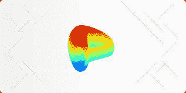

Curve finance 本质上是一个 DEX(分散交易)平台，它向 DeFi 引入了一个不同的、独特的自动做市商(AMM)算法，允许资产之间更低的滑点和更低的交易费用。拥有闲置储备资产的用户也可以将硬币存入 Curve，并与治理令牌一起赚取交易费。

目前，这是 TVL DeFi 的第三大协议。在各种 DeFi 协议锁定的约 141 亿美元中，约 96 亿美元属于曲线融资。

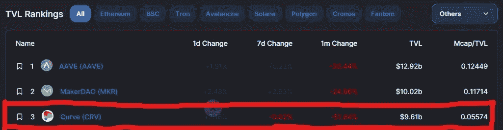

它在以太坊、Avalanche、Arbitrum 和其他连锁店中拥有稳定的货币和储备资产流动性。

曲线与许多其他指数有很多相似之处，例如 Uni。但它也以一种独特的方式与众不同。它通过仅容纳由类似资产组成的流动性池来做到这一点，如稳定债券或类似资产的包装版本，如 wBTC 和 tBTC。这种方法允许 Curve 使用更有效的算法，并以以太坊上任何分散交易(DEX)的最低费用、滑点和非永久性损失为特色。

虽然 CRV 在总交易量上并不占优势，但是当你以每对指数来看的时候，你会发现 CRV 远远超过所有其他指数。这使得它成为提供流动性的一个极具吸引力的地方。

一些协议使用标准模型，通过其本地令牌来激励流动性。但是曲线不同于其他指标。Curve 将 CRV 美元分配给一些流动性池，并允许代币所有者投票决定每个池获得多少 CRV 美元代币(通过计量器)。因此，如果你的资金池获得了足够的选票，你就不必使用自己的代币来激励流动性。你可以用曲线的令牌来激励。这意味着$CRV 持有者的投票允许协议省钱。这使得投票本身是有价值的。

在我们继续之前，让我们快速回顾一下 AMM 是如何工作的，然后我们可以专注于 Curve 如何在 DeFi 生态系统中实现比其他 AMM 更低的风险和更高的效率。

## AMMs 如何工作

自动做市商(AMM)通过使用流动性池而不是在买方和卖方之间进行交易，允许数字资产在没有许可的情况下自动交易。就其核心而言，流动性池就像一锅汤，其配料是由那些想喝的人提供的。将这种类比转移到当前的上下文中，Curve 的用户向流动性池提供代币，池中代币的价格由一个数学公式决定。

通过调整公式，流动性池可以针对不同目的进行优化。任何有互联网连接和一些 ERC 20 代币的人都可以通过向 AMM 的流动性池提供代币来成为流动性提供商。这些流动性提供者通常通过向资金池提供代币来赚取费用。这笔费用由与资金池互动的交易员支付。

还有一个问题是，对于用户来说，用一种分散且简单的方式将一个稳定币换成另一个稳定币。Uniswap 收取 30 个基点的交易费，由于缺乏资本效率，滑点很差。例如，想把 USDC 换成 USDT 的用户需要使用集中交易所、场外交易渠道，或者支付超过 0.3%的利率来获取利差。马厩里没有 AMM。

2020 年初，Curve 引入了一个新的 AMM 不变量，叫做 StableSwap。StableSwap 为用户提供了为类似资产(例如 USDC 和 USDT 或 WBTC 和 renBTC)提供流动性和种子的能力，并以低滑点交易这些资产。

传统 AMM 设计(即 Uniswap 的常数函数/CFMM 模型)的问题在于，它将流动性置于从 0 单位到∞单位的整个曲线上。这对于 99%的时间里彼此交易 100 个基点的同类资产来说没有意义。

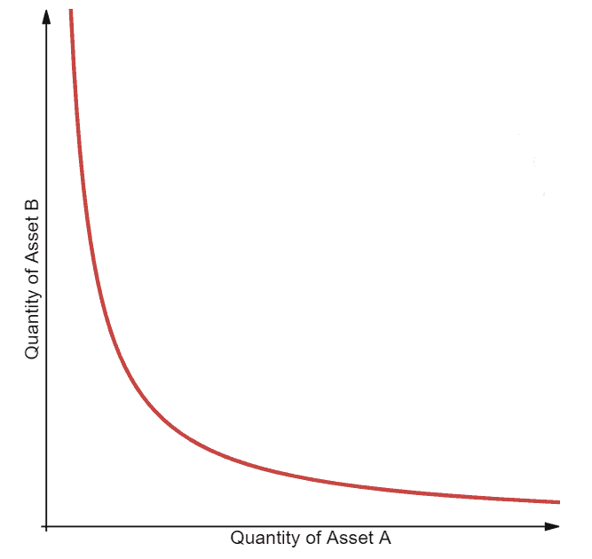

StableSwap 通过将类似资产的流动性集中在 1 附近改变了这一点，提供了比 v2 好两个数量级的接近该范围的流动性。StableSwap 白皮书将其描述为“在 X 杠杆上使用 Uniswap”

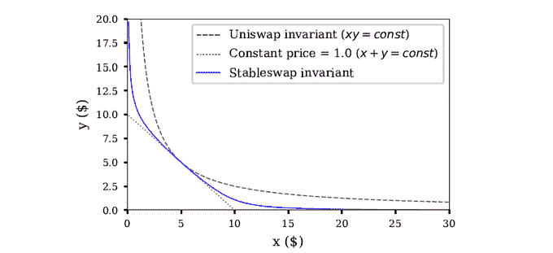

StableSwap 不变量也支持多资产池。其历史上最受欢迎的池“3 池”允许、和戴之间的低滑点互换。其他人允许包装比特币类型、以太坊衍生品和外币稳定币之间的互换。

Curve 团队最近还推出了 Curve v2。Curve v2 引入了一个新的 AMM 不变量，称为 CurveCrypto，它试图将 StableSwap 中的原则应用到没有固定资产的池中。根据设计，曲线 v1 只适用于类似的资产。向一个资产单价差异巨大的资金池注入流动性没有什么意义。v2 引入了非同类资产的流动性集中度(如 WBTC、瑞士联邦银行和 USDT)。

DeFi 协议的这一新版本引入了动态交易费用、内部价格预测和重新定价算法，以围绕市场价格实现更高的资本效率。

## CRV 代币

在 2020 年 8 月，Curve 协议也通过启动一个去中心化的自治组织(DAO)来管理协议的变更，开始了它走向去中心化治理的旅程。大多数 Dao 由治理令牌控制，治理令牌赋予令牌持有者投票权。在这种情况下，曲线刀由 CRV 令牌控制。

CRV 代币既可以购买，也可以通过农业生产获得。通过向指定的曲线流动性池提供 DAI，您可以在费用和利息的基础上获得 CRV 代币。CRV 代币增加了成为曲线流动性提供者的动机，因为你不仅获得了一笔金融资产，还获得了一份强大的 DeFi 协议的所有权。

任何拥有最少数量被*投票锁定的 CRV 令牌*的人都可以提议对 Curve 协议进行更新。更新可以包括改变费用，改变费用的去向，创建新的流动性池，以及调整产量农业奖励。持有者通过锁定 CRV 代币来投票拒绝或接受提议。CRV 代币被锁定的时间越长，它的投票权就越多。

为了更好地理解 Curve.fi 的特性，让我们对照 Curve.fi 所提供的特性，对 Uniswap 和其他 Dex 的一些更广为人知的特性进行对比分析。

**curve . fi vs unis WAP**

Stablecoin Swap: 在 Uniswap 的情况下，只允许与 ETH(以太坊)直接交易。所以，比方说，当你用你的 USDT 去换 USDC 的时候，你基本上要经历两次交易，而不是一次

1.  首先，USDT 被交易到了 ETH
2.  然后 ETH 被交易到 USDC。

Curve.fi 允许稳定的货币之间直接交易，所以当你试图在 USDT 和 USDC 之间交易时，你可以直接通过流动性池来完成。这显然是一种更省事的稳定硬币交换方式。

**曲线与定义中的其他协议:**

1.  Curve 只专注于利基市场，将其作为一种稳定的资产，其公式针对滑点减少进行了优化。
2.  Curve 允许用户通过一种或多种资产提供流动性。Curve 自动将令牌拆分为不同的令牌，这些令牌与池中的速率相匹配。例如，uUSD 池有四项资产:$USDT、$USDC、$TUSD 和$sUSD，利率分别为 22.35%、11.13%、8.54%和 57.98%。用户将 10，000 美元 USDT 存入 sUSD 池，Curve 会自动将 10，000 美元 USDT 分成 2，235 美元 USDT、1，113 美元 USDC、854 美元 TUSD 和 5，798 美元 sUSD。
3.  Curve 是一个收益聚合器，它可以帮助有限合伙人从复利或渴望融资获得交易费和贷款利率。

## 稳定的流动性池

与其他 AMM 平台相比，曲线模型特别保守，因为它试图避免波动和投机，支持稳定。

在 AMMs like 曲线上，流动性池总是试图“低买高卖”。下面我们来回顾一下这种再平衡是如何发挥作用的，这次是与美元挂钩的稳定货币和戴。如果你在曲线上卖戴，你会触发这一系列事件:

*   更多的戴被添加到池中
*   这个群体变得不平衡，因为戴现在比还多
*   与相比，该资金池以略低的折扣出售戴，以鼓励平衡
*   资金池重新平衡了戴与的比例

通过打折出售戴，泳池试图恢复泳池的原状。因为曲线池中的资产彼此价格稳定，所以与其他 AMM 流动性池相比，它们之间的交易引起的波动最小。

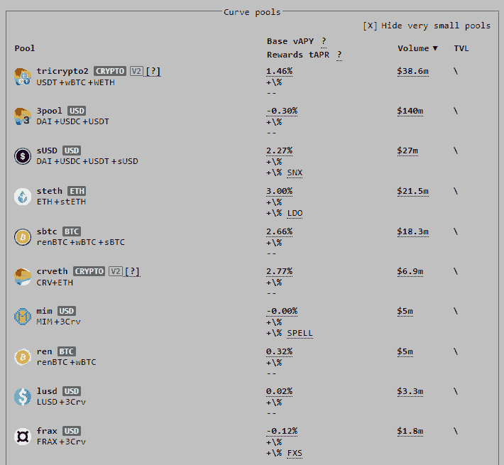

Uniswap 或 Balancer 等资产管理工具的波动性很高，其中流动性池可以由任何令牌组成。通过限制资产池和每个资产池中的资产类型，Curve 最大限度地减少了非永久性损失*(一种 AMM 现象，流动性提供者因流动性池中的波动而遭受代币价值相对于代币市值的损失)*。

然而，非永久性的损失并不总是负面的。波动性和滑点为那些试图在合适的时间进出流动性池获利的用户提供了机会。通过权衡波动性的高风险——有时是高回报——方面，Curve 反而利用所谓的 DeFi 可组合性来吸引流动性提供者。这意味着你可以利用你在 Curve 平台上的投资在 DeFi 生态系统的其他地方获得回报。

与 Uniswap 或 Balancer 不同，Curve 不会试图保持不同资产中保存的值始终相等，或彼此成比例(即平衡)。这使得 Curve 能够将流动性集中在类似定价资产的理想价格附近(1:1 的比例),以便将流动性用于最需要的地方。因此，与这些资产相比，Curve 可以实现更高的流动性利用率。

资产管理系统的类资产方法不仅限于稳定资产。wBTC 和 renBTC 等比特币(BTC)的令牌化版本也构成了 Curve 的流动性池。与稳定的硬币相比，比特币的波动性很高，但曲线方法仍然有效，因为曲线池中的令牌不需要稳定——它们只需要相对于同一池中的其他令牌稳定。换句话说，wBTC 和 renBTC 可以在同一个曲线流动性池中，而 wBTC 和 USDC 不是一个功能组合。

现在，我们来谈谈流动性池。

流动性池本质上是锁定在智能合约中的不同令牌的池(当满足所有预定条款和条件时自动执行的自动化程序)。Curve.fi 有一系列不同的池，提供不同范围的回报风险。

就拿戴和的曲线池来说吧。

现在，戴和都应该持有相同价值的一美元，所以 1 戴= 1(这两种稳定货币的价格保持小幅波动，但通常是相同的。举个例子，在我写这篇文章的时候，1 戴= 1.020100)，并且这个池将会有相似数目的戴和在其中。假设池中有 1000 枚傣族币和 1000 枚币。

假设交易者 X 从资金池中用 100 USDT 换 100 戴。现在池子里有 900 个傣和 1100 个。它不再平衡了。现在发生的情况是，戴的价格下降了一点，这样另一个交易者可能会愿意用他们的戴来交换 USDT，这种情况会继续发生，直到这个资金池回到它所包含的戴和 USDT 之间 1:1 的平衡比例。

在你决定投资哪个池之前，你可以看到每个池中硬币的当前位置，并在能给你带来最大利润的池中交易。目前有各种各样的资金池，每一个都有不同的风险收益。

**流动性提供者如何盈利？**

以下是流动性提供商从 Curve.fi 资金池中获益的几种方式:

1.  每当有人通过资金池交换他们的稳定债券，流动性提供者就会获得交易费。因此，所有 Curve.fi 池都从交易费用中赚取利息。
2.  如果你在流动资金池中存入一枚稳定的硬币，而当时该硬币的数量比其他硬币少，你就赢得了存款红利。
3.  类似地，如果你从池中取出数量较多的稳定币，你将获得一份奖金。基本上，如果你帮助平衡游泳池，你会得到奖金。
4.  当你投资于一些资金池时，它们会给你一些激励。
5.  在一些资金池中，你还可以从贷款中获得利息。

在 Uniswap 这样的 AMM 交易所，无论何时进行交易，你都可以赚取手续费。在 Curve 上，交易费用比在 Uniswap 上低，但你也可以通过可互操作的代币从 Curve 之外获得奖励。

举个例子:在复利平台上把戴借出去，换成一个叫 cDAI 的流动性令牌，自动为持有人累计利息。持有 cDAI 意味着你有权利收回戴的复利。曲线用户能够在其流动性池中使用 cDAI，从而从相同数量的投资中实现第二层效用和潜在收益。

对于$CRV 的每笔交易，流动性提供者(LPs)从 CRV 代币中赚取%的费用，这给了 LPs 额外的收益，进一步刺激了流动性。这些费用的分配取决于$CRV 的治理。

$CRV 持有者可以选择锁定他们的令牌，以换取$veCRV，这是$CRV 生态系统的治理令牌。$veCRV 投票人最终影响$CRV 流动性激励以及资金池的分配。

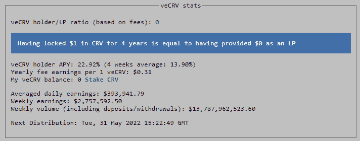

随着曲线金融在 DeFi 中的影响力不断增长，管理协议和控制流动性激励的价值也在不断增长。这种特殊的发展导致许多协议开始囤积$CRV，以增加他们对治理的影响。

还记得我们之前谈到的 Curve 如何将$CRV 分配给一些流动性池，并允许代币所有者投票决定每个池获得多少$CRV 代币(通过计量器)。这个有争议的标准最终控制了$CRV 生态系统中的流动性和激励。因此，试图最大化流动性的协议和 TVL 希望尽可能多地影响这一标准。

现在，这种发展带来了**曲线战争。**

如果你一直在注意，你应该已经猜到这个意思了。曲线战争可以被描述为各种协议之间的竞赛，这些协议不断试图确保它们的首选池提供最高的$CRV 奖励(“贿赂”)。这场战争导致$CRV 的购买压力增加。

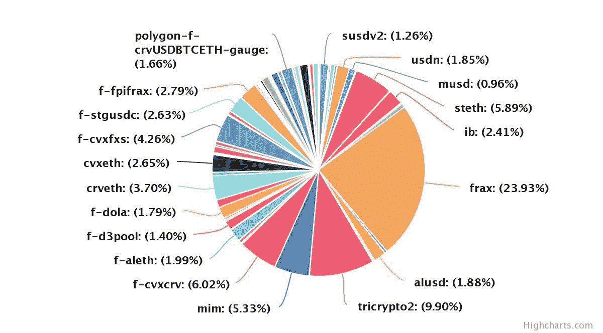

所有这些协议都有一个共同的目标。目标是拥有最大的交易量和流动性。这样做的最简单的方法是简单的；提供最高的收益和激励。

如果收益率上升，TVL 也会跟着上升，最终，代币也会加入进来。

因此，协议已经开始通过提供代币来换取$veCRV 持有者的$veCRV。这让协议对治理有了更大的影响力，也给了$veCRV 持有者额外的收益。

协议还试图积累$CRV。Convex 和向往金融创建了一个金库，用户可以通过存入他们的$CRV 获得比其他方式更多的收益，允许该协议增加其影响力。

## 技术和分析:

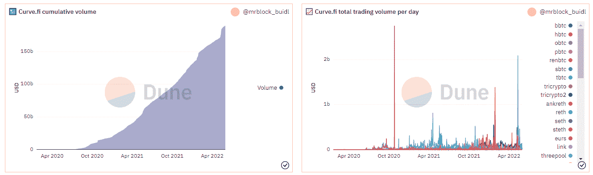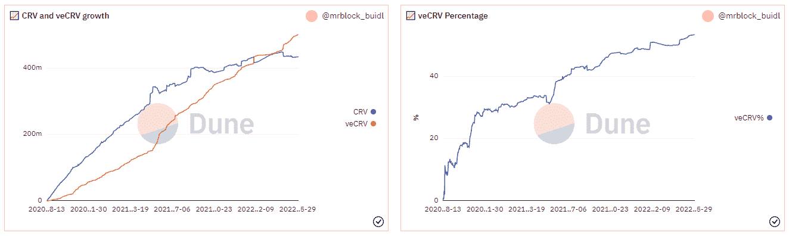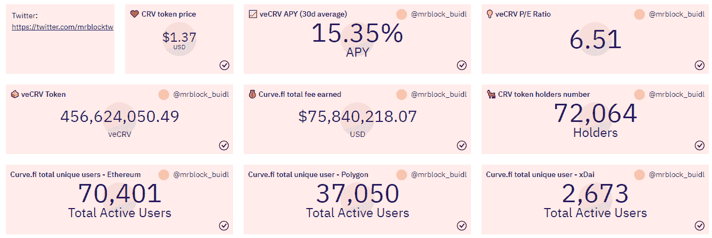

使用 Dune Analytics，我们可以看到曲线金融的核心基本面并没有受到最近下跌的影响，因为增长趋势一直在上升。数量和用户一直在稳步上升。

达到这一点，让我们重申一些曲线。Fi 用例。它们是:

*   桥接:某些跨链桥接(例如 RenBTC 和 REN)需要特定的包装资产来允许转移发生。例如，用户可以将自己的 WBTC 兑换成人民币比特币，然后在比特币主网上兑换成 BTC。
*   利率套利:正如本文前面提到的，货币市场和资金池中类似资产的利率不同。在高利率环境下，利差通常会扩大，曲线可以帮助用户获得最佳利率。
*   消除产量农场的摩擦某些产量农场和协议只接受特定的稳定作物。例如，用户可以将他们的 DAI 换成 USDC，以访问某些产量农场，然后再换回来实现他们在另一项资产中的产量
*   最佳利率的 DEX 交易:由于 DeFi 中流动性的巨大变化，像 USDT 联邦理工学院和 USDC 联邦理工学院之间的利率可能不同。像 1inch 这样的聚合器可以使用曲线池在类似的资产之间进行互换，以实现最佳的交易价格。
*   进入和退出 staked 衍生品:像 Lido 这样的协议引入了 stETH 这样的 Staked 衍生品，它将 ETH 2.0 中获得的收益打包到以太坊主网上的一个基础资产中。用户可以通过曲线池轻松地进入和退出赌注衍生品。

## 你应该投资 Curve.fi 吗？

Curve 现在是 DeFi 中最受欢迎的平台之一，因为它支持稳定性和可组合性，而不是波动性和投机性。它的可组合元素使其成为 DeFi 生态系统的互联枢纽，并且利用 CRV 令牌作为治理机制，它是一个属于其用户的异常分散的组织。尽管有这些积极的方面，我们必须注意到 DeFi 空间仍然相对较新。现在管用的，明天可能就不管用了。因此，所有投资者必须记住以下几点:

*   你应该只投资符合你风险偏好的资金池。
*   安全审计并没有消除所有黑客/欺诈的机会。你永远无法绝对肯定 Curve.fi 智能合约不会受到攻击。如果攻击真的发生，你会损失你的资产。
*   当你加入一个资金池时，你必须知道，你可能还必须应对池中硬币带来的系统性风险。

此外，非常重要的是要知道 Curve.fi 资金池到目前为止已经持有和转移了大约数百万美元，而没有对资金进行任何攻击；可以肯定地说，这并不是因为黑客们不努力，而是因为他们提供了大量的金钱。因此，如果你负担得起，从投资相对低风险的曲线开始。fi 池可能是一个很好的主意。

如果您还想了解更多关于治理机制、令牌学等的知识。你可以点击查看[。文档(文档和白皮书)非常广泛，一开始可能很难理解。因此，在与链上协议交互时，请小心谨慎，并在这样做之前了解所有风险。](https://resources.curve.fi/)

> 加入 Coinmonks [电报频道](https://t.me/coincodecap)和 [Youtube 频道](https://www.youtube.com/c/coinmonks/videos)了解加密交易和投资

# 另外，阅读

*   [最佳网上赌场](https://coincodecap.com/best-online-casinos) | [币安评论](/coinmonks/binance-review-ee10d3bf3b6e) | [BitMEX 评论](https://coincodecap.com/bitmex-review)
*   [麻雀交换评论](https://coincodecap.com/sparrow-exchange-review) | [纳什交换评论](https://coincodecap.com/nash-exchange-review)
*   [美国最佳加密交易机器人](https://coincodecap.com/crypto-trading-bots-in-the-us) | [经常性回顾](https://coincodecap.com/changelly-review)
*   [在印度利用加密套利赚取被动收入](https://coincodecap.com/crypto-arbitrage-in-india)
*   [Godex.io 审核](/coinmonks/godex-io-review-7366086519fb) | [邀请审核](/coinmonks/invity-review-70f3030c0502) | [BitForex 审核](https://coincodecap.com/bitforex-review)
*   [5 款最佳免费加密货币制图工具](https://coincodecap.com/crypto-charting-tools)