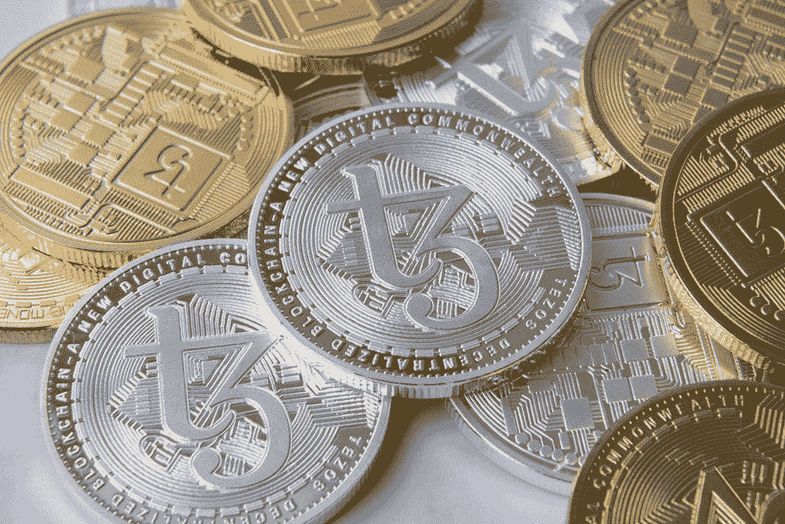
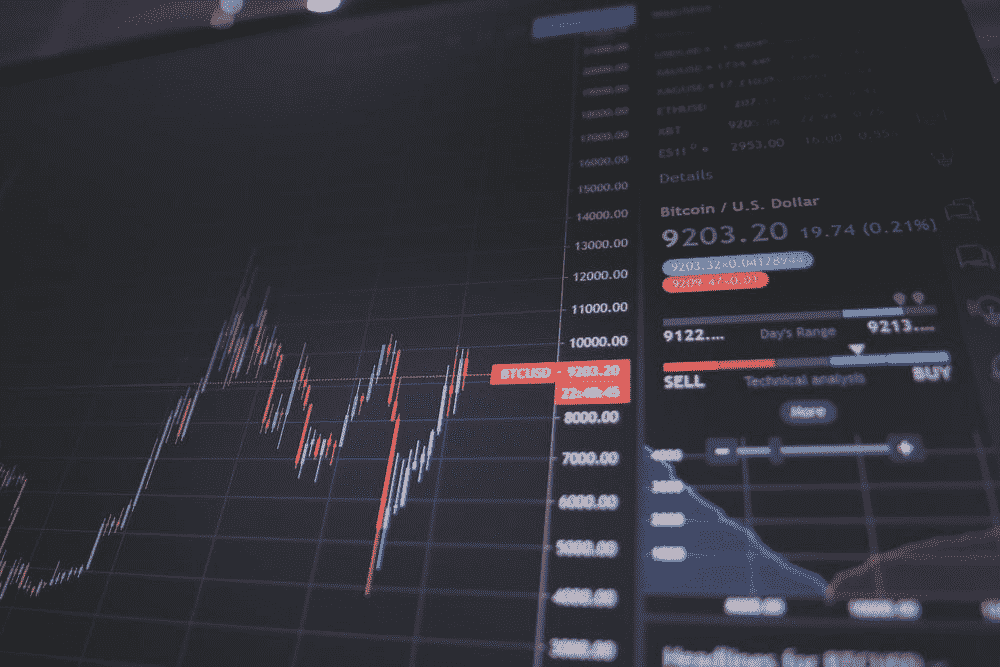
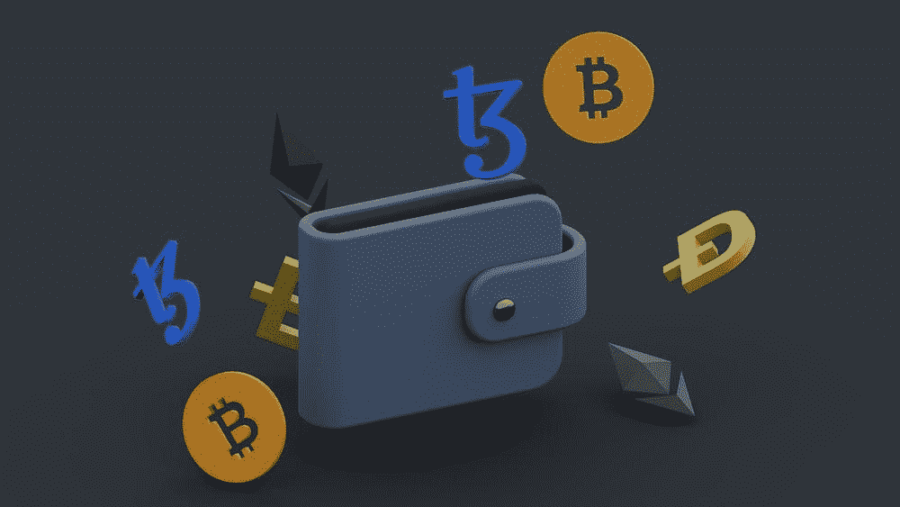
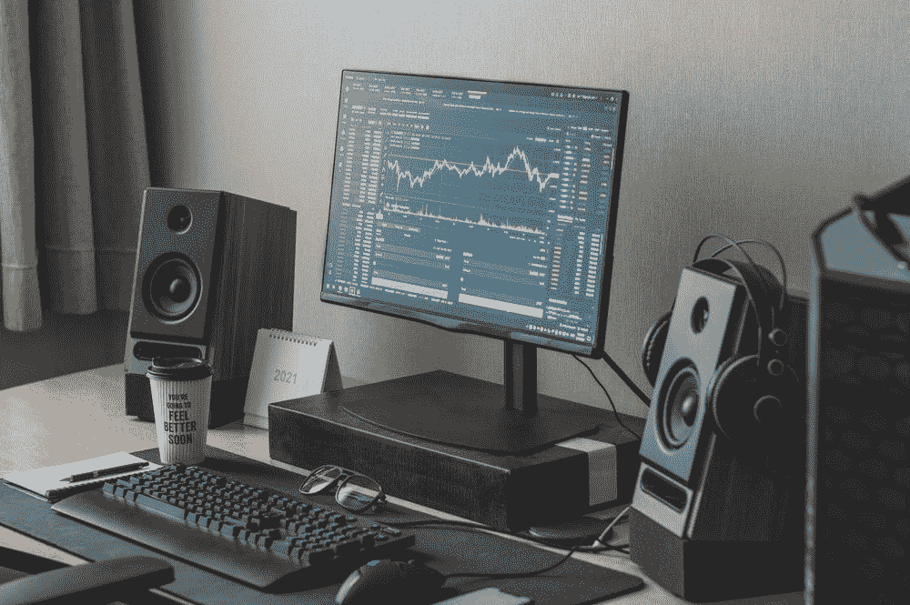

# 加密 101:初学者指南

> 原文：<https://medium.com/coinmonks/crypto-101-a-beginners-guide-345d440bd163?source=collection_archive---------25----------------------->

# 什么是加密

如果你一直生活在岩石下，你可能没有听说过**加密货币**，或者被称为**加密**。

密码是数字货币。我们使用加密货币来购买、出售、交易、利用数字资产。

比特币是加密货币的“*黄金标准*，并设定了固定金额的基准。与现实生活中的黄金类似，比特币的存在数量是有限的。

密码可以用来交换商品和服务。

随着全球越来越多地采用加密技术，我们将更容易在全球范围内将加密技术从一个钱包转移到下一个钱包。

大多数刚开始投资 crypto 的人通常会选择投资，因为他们已经看到了持有某些代币的巨大回报，因为代币价格“股票”的价格会上涨…

**顶级密码市场:** - [币安](https://www.binance.com/)
- [比特币基地](https://www.coinbase.com/)
-[Crypto.com](https://crypto.com/)
-[北海巨妖](https://www.kraken.com/)

*其他新兴市场可能包括:*
- [卡丹诺](https://cardano.org/)
- [雪崩](https://www.avax.network/)
- [埃尔隆德黄金](https://elrond.com/)

如果你是密码新手，你需要一个密码钱包来存放你的密码和 NFT 的密码。大多数钱包通常允许你在一个小型的本地代币兑换市场兑换某些代币。“ [Metamask](https://metamask.io/) ”和“Phantom”web 3 扩展都有钱包(多个)，可以在某些令牌之间交换，而不必去第三方交易所，如 [Sushiswap](https://www.sushi.com/) 或 [Uniswap](https://uniswap.org/) ，或在币安链上， [Pancake Swap](https://pancakeswap.finance/)

在秘密交易市场，你可以用你的代币，比如说阿达的代币，来交换 USDT 的代币。USDT 以 1 美元的稳定比率波动，而 ADA 可能在某一天是 0.40 美元，第二天是 1.4 美元，如果你持有 ADA 而不是 USDT，你会获得很好的利润，因为它仍然是 1 美元…

许多市场也允许密码交易，而且随着 web3 空间的不断发展，未来几年将会有更多的新产品出现。

# **如何用加密制作$ $ $**

*   ***烙*** (低买高卖)
*   *(将你的财富放在某个加密令牌中，你就是在押注该公司会赢，并回馈给支持者)*
*   **(你可以尝试出售自己的数字资产，使用自己的代币……(图片、音乐等……)(创建自己的加密代币很容易，给它们赋予价值才是难的部分)**

# **Crypto 如何帮助您？**

*   *****知识*** (只要置身于加密环境中，你就能获得成功，因为大多数交易都是通过加密传输即时可靠地处理的。你将成为不断进步的文明的先行者)**

*   *******社区*** (成为 crypto 社区的一部分是很神奇的。我们都为同样的事情奋斗；速度、安全、自由、财富、幸福)****

********

# ****加密的使用案例****

*   *******公用事业*** (每当一家企业接受加密技术，为房屋提供电力、水、污水和垃圾，世界就会开始改变。接下来将是杂货店和分销网络……)****

*   *********一切*** (我可以想象一个世界，我们进行的每一笔价值交换交易都可以利用各种性质的加密货币进行数字传输。即时和安全地发送财富给任何人。杂务，汽车，房子，任何东西…)******

# ******加密面临的困难******

*   ********法律**(世界的统治者不希望在他们不知情的情况下发生任何事情，并要求他们的“*分一杯羹*”，我们称之为“*税*”。这导致了大量的官僚主义/立法扯淡)******
*   *********骗局*** (网上任何东西，交换财富，都要小心。我听说过非常有计划的方法来完成一个项目，这很令人不安，但它确实发生了。始终保持警惕)******
*   ********恐惧**(人们害怕变化和不安全感。政府提供安全以换取自由。人们不喜欢波动性，目前加密非常不稳定)******

************

# ******一定要小心！！！******

******我怎么强调都不为过！保持高度警惕，注意你点击的每一个链接，你做的每一笔交易，以及你接触的每一个人，因为骗子在这个空间里比比皆是，最好看的项目都被取消了。******

*******在点击所有链接之前，要再三检查，确保它们是你要找的官方链接。在把任何有价值的东西寄给别人之前，也要仔细检查所有的钱包地址。*******

********跟随我们的密码/NFT/区块链/元宇宙之旅**
[*推特*](https://www.twitter.com/metadadsxyz)[*不和*](https://discord.gg/Cv8v2Ert8m)[*YouTube*](https://www.youtube.com/channel/UC7pbtSBs9nRJHK6coMhCR8g)**[*抖音*](https://www.tiktok.com/@thedudescrypto)[*insta*](https://www.instagram.com/thedudescrypto/)********

 ****干杯，公子哥儿们的密码****

********

> *****加入 Coinmonks* [*电报频道*](https://t.me/coincodecap) *和* [*Youtube 频道*](https://www.youtube.com/c/coinmonks/videos) *了解加密交易和投资*****

# ****另外，阅读****

*   ****[3 商业评论](/coinmonks/3commas-review-an-excellent-crypto-trading-bot-2020-1313a58bec92) | [Pionex 评论](https://coincodecap.com/pionex-review-exchange-with-crypto-trading-bot) | [Coinrule 评论](/coinmonks/coinrule-review-2021-a-beginner-friendly-crypto-trading-bot-daf0504848ba)****
*   ****[莱杰 vs Ngrave](/coinmonks/ledger-vs-ngrave-zero-7e40f0c1d694) | [莱杰 nano s vs x](/coinmonks/ledger-nano-s-vs-x-battery-hardware-price-storage-59a6663fe3b0) | [币安评论](/coinmonks/binance-review-ee10d3bf3b6e)****
*   ****[Bybit 交易所评论](/coinmonks/bybit-exchange-review-dbd570019b71) | [Bityard 评论](https://coincodecap.com/bityard-reivew) | [Jet-Bot 评论](https://coincodecap.com/jet-bot-review)****
*   ****[3 commas vs crypto hopper](/coinmonks/3commas-vs-pionex-vs-cryptohopper-best-crypto-bot-6a98d2baa203)|[赚取加密利息](/coinmonks/earn-crypto-interest-b10b810fdda3)****
*   ****最好的比特币[硬件钱包](/coinmonks/hardware-wallets-dfa1211730c6) | [BitBox02 回顾](/coinmonks/bitbox02-review-your-swiss-bitcoin-hardware-wallet-c36c88fff29)****