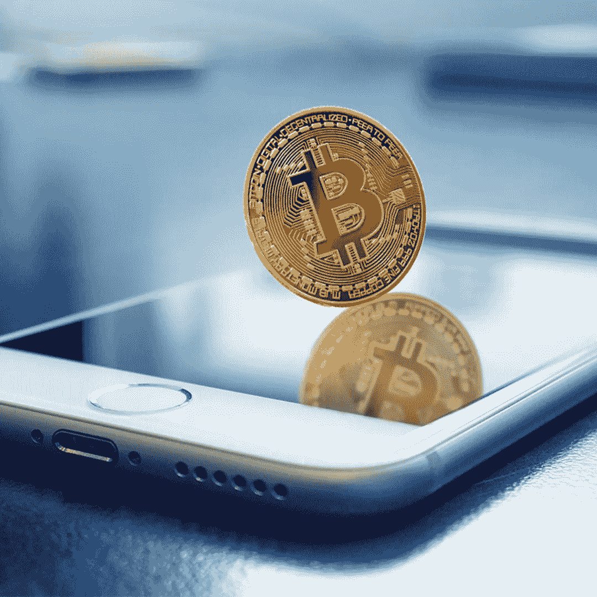
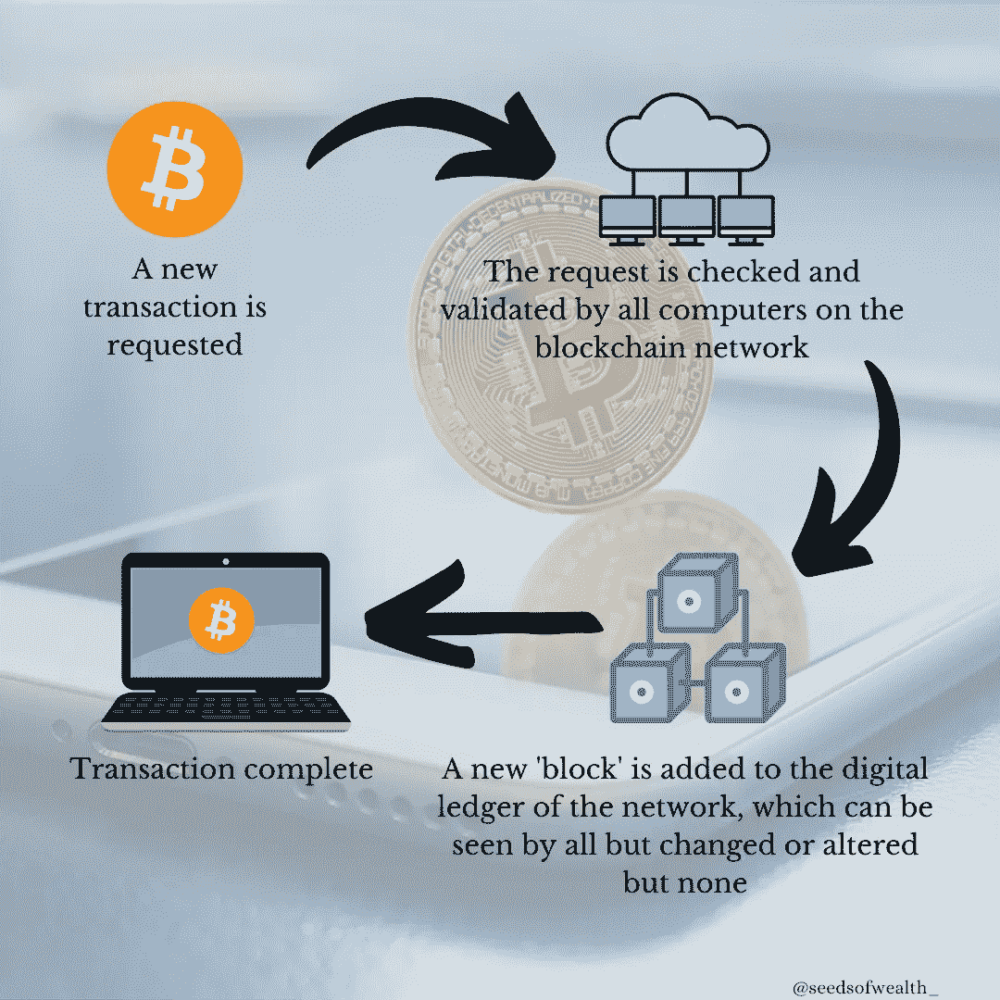

# 密码 101:比特币

> 原文：<https://medium.com/coinmonks/crypto-101-bitcoin-3be1ff6994e4?source=collection_archive---------50----------------------->

*什么是比特币，它是如何工作的？*

到目前为止，我们大多数人都听说过一种叫做加密货币的新型数字货币。对于很多人来说，这是一个全新的概念，有点混乱，难以完全理解。加密货币是一个充斥着炒作、猜测和怀疑的话题。市面上有超过 1500 种不同的加密货币，谁能责怪你不是专家呢。但不用担心，在本文中，我们将探索加密货币这个令人兴奋的新世界，并找到比特币到底是什么的简单答案。我们将研究比特币的一些优点和缺点，这样你就能了解更多信息，更好地驾驭加密世界的黑暗水域。

今天，加密货币的世界是巨大的。这是一个价值超过 ***2 万亿*** ***美元*** 的市场，在过去十年里似乎突然爆发了。那么 crypto 到底是从哪里来的呢？要回答这个问题，我们需要回到第一种加密货币比特币的起源。

*比特币是什么，从何而来？*

现在是 2008 年，在大衰退中，世界金融体系处于全面崩溃的边缘。大银行的贪婪将他们的极限推得太远，结果，数百万人的生活被摧毁。一生的积蓄瞬间化为乌有，许多人再也无法恢复。一些人对银行系统完全失去了信任，这是理所当然的。其他人开始思考也许有更好的方法来解决问题。这种方式不再允许银行对货币体系有太多的控制，并把更多的权力还给人民。

直到今天，没有人知道比特币的真正创造者是谁。他们只知道化名中本聪。2008 年 10 月，他们向一群开发者发布了一份白皮书，概述了一种叫做比特币的数字货币的新提案。2009 年 1 月，比特币区块链网络上线。

*什么是区块链网络，它们如何运作？*

比特币在一种被称为区块链的分散式网络上运行，就信息存储方式而言，这种网络的结构不同于典型的数据库。在区块链网络中，该软件同时在数千台计算机上运行。所以在比特币的例子中，这意味着没有一个人或一个中心团体能够控制网络。相反，网络上的所有用户共同分享控制权。

区块链网络提供了极大的透明度。随着每一笔交易被网络检查和验证，数据被存储在一种所有人都可以看到的数字分类账中，但没有人可以更改或改变。这导致区块链网络上的记录的准确性远远高于典型的数据库。

*比特币有什么优势？*

比特币是解决我们目前在通货膨胀的货币体系中存在的问题的一个好办法。传统上，当情况变得艰难时，政府可以选择简单地印刷数十亿的货币，这可能有助于在短期内缓解局势，但与此同时，它会导致通胀飙升。这意味着，每当一个政府决定印更多的货币，其他人的现金就会损失一些价值。但是，比特币不是通货膨胀的货币。区块链实施了 2100 万比特币的限额，这意味着货币数量有限，以防止通货膨胀的发生。

比特币还能让我们更容易、更快捷、更便宜地向世界各地汇款。这是因为使用比特币将银行排除在金融体系的中间人之外。只需点击一个按钮，你就可以安全地将比特币直接发送给世界上的任何其他人，而不需要缓慢而昂贵的国际银行转账。传统银行根本无法与这项新技术竞争。

*比特币有什么问题吗？*

比特币有一些明显的优势，促使它迅速成为互联网的新现金。为了数百万人的利益，它正在实现货币的民主化和金融的分散化。然而，比特币并不是完全完美的，重要的是要意识到它带来的潜在问题。

比特币区块链涉及的一些过程需要非常高水平的计算能力，这是非常耗能的，目前使用的能源主要来自化石燃料。然而，随着全球去碳化趋势继续加快，这个问题本质上应该只是短期的。

随着比特币成为互联网的新现金，你必须有一个可靠的互联网连接才能使用区块链网络。如果互联网不时出现故障，你也会偶尔遇到存取数字现金的困难。

加密货币行业相对年轻，在很大程度上仍然不受监管，这使得它很难融入现有的经济体系，从而减缓了主流的采用。与任何新的主要技术的采用一样，在这个过程中可能会有一些颠簸，这往往会造成比特币价值和更广泛的加密市场的剧烈波动。

由于区块链和加密货币仍然是一项新技术，随着主流采用的势头不断增强，这些问题可能会随着时间的推移变得不那么突出。在加密货币的故事中，这些仍处于早期阶段，随着这项技术的进一步发展，其未来用途的可能性似乎几乎是无限的。

有兴趣了解更多关于加密货币交易和印度股票市场的信息吗？试试 Ztocks 教育游戏！可从 playstore 购买:[https://play.google.com/store/apps/details?id=com.ztocks](https://play.google.com/store/apps/details?id=com.ztocks)

*免责声明:请注意以上信息仅用于普通教育目的。写这封信时没有考虑到你的任何个人情况。这不是买入、持有或卖出的建议。*

> 加入 Coinmonks [电报频道](https://t.me/coincodecap)和 [Youtube 频道](https://www.youtube.com/c/coinmonks/videos)了解加密交易和投资

# 另外，阅读

*   [加拿大最佳加密交易机器人](https://coincodecap.com/5-best-crypto-trading-bots-in-canada) | [库币评论](https://coincodecap.com/kucoin-review)
*   [火币加密交易信号](https://coincodecap.com/huobi-crypto-trading-signals) | [HitBTC 审核](/coinmonks/hitbtc-review-c5143c5d53c2)
*   [如何在 FTX 交易所交易期货](https://coincodecap.com/ftx-futures-trading) | [OKEx vs 币安](https://coincodecap.com/okex-vs-binance)
*   [OKEx vs KuCoin](https://coincodecap.com/okex-kucoin) | [摄氏替代品](https://coincodecap.com/celsius-alternatives) | [如何购买 VeChain](https://coincodecap.com/buy-vechain)
*   [ProfitFarmers 回顾](https://coincodecap.com/profitfarmers-review) | [如何使用 Cornix Trading Bot](https://coincodecap.com/cornix-trading-bot)