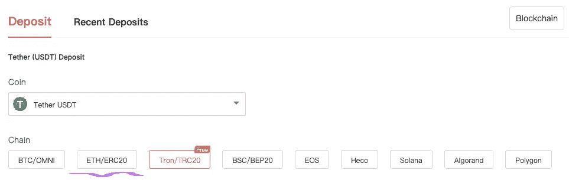

# 密码 101:如何在中央交易所购买另类硬币(CEX)

> 原文：<https://medium.com/coinmonks/crypto-101-how-to-buy-alt-coins-on-a-centralized-exchange-cex-dd215d4d68be?source=collection_archive---------6----------------------->

听说过你想买的另类硬币，但被复杂的交易吓住了？这篇文章将帮助你安全地浏览 CEX。

> 傻瓜忽视复杂性。实用主义者深受其害。有些可以避免。天才移除它——艾伦·珀利斯

# 关于集中交易所的 crytpo(CEX)

每当有人问我如何进入 crypto，我总是让他们先去比特币基地。事实上，我不喜欢比特币基地。我认为这个网站要价太高。它还与以太坊挂钩，以太坊有巨额交易([气](https://ethereum.org/en/developers/docs/gas/))费。

那我为什么要先送新人去那里？因为它对用户友好。我认为比特币基地在简化密码购买过程方面做得非常好。基本上，如果你能建立网上银行，你就能建立一个比特币基地账户。

此外，那里所列的大多数项目都经过了比特币基地的评估。这个过程有助于防止诈骗项目上市。这并不意味着这些项目是好的。这只是意味着一个新手不太可能直接被骗。

不过，人们迟早会想购买未上市的项目。要在比特币基地上市，代币必须通过内部评估，并拥有能够与以太坊链互动的[版本](https://academy.binance.com/en/articles/what-are-wrapped-tokens)。这限制了在比特币基地上可以购买的代币数量(大约 150 个)。

例如，有一个我非常喜欢的项目叫做 Sonar [PING](https://coinmarketcap.com/currencies/sonar/) 。进入比特币基地后，我的朋友们经常会问如何才能到达 PING。对我来说，获得类似 PING 的替代硬币的过程很简单。但是试图向一个新手解释这个过程是困难的。现在我可以把它们发送到这篇文章中；)

## 集中式交易所(CEX)与分散式交易所(DEX)

如果你还没有，我推荐你阅读我关于[流动性池](/coinmonks/crypto-101-liquidity-pools-and-impermanent-loss-feb297ce5fba)的文章。流动性是 CEXs 和 dex 的生命线。了解流动性是如何运作的，将使理解这一过程变得容易得多。这可能有点“技术性”，但我尽力简化了它。

这里有一个快速概述。本质上，CEX 和德克斯在做同样的事情。他们用一种资产交换另一种资产。CEX 倾向于使用[订单簿](https://www.investopedia.com/terms/o/order-book.asp)模式，而 DEX 是[自动做市商](https://academy.binance.com/en/articles/what-is-an-automated-market-maker-amm) (AMM)。

实际上，两者都是自动化的。不同之处在于 CEX 挑选哪些交易对上市，而几乎任何提供流动性的人都可以在 DEX 上创建交易对。这是什么使骗局硬币上市如此容易。

这也是为什么当你买备用硬币时，尤其是在 DEX 上，你必须更加小心。“做你自己的研究”(DYOR)是你现在可能已经看过或听过的一句口头禅。在购买替代硬币之前，你这样做是非常重要的。对你来说幸运的是，我也有一篇关于[如何 DYOR](/coinmonks/crypto-investing-how-to-dyor-1e6dabdb1de9) 的文章。

## 今天的 CEX: Gate.io

我为本文选择了 [Gate.io](https://gate.io) ，因为它是我广泛使用的一个交换。它有很多可用的交易对，所以真的很方便。而且，一旦你知道了如何在 Gate.io 上交易，你应该也能弄清楚其他的交易所。

首先，你必须建立一个帐户。这一过程与其他过程非常相似。你输入你的信息，并通过“了解你的客户”(KYC)的过程。只要按照指示做，你马上就可以上路了。

在我们开始之前，让我列出步骤:

1.  使用菲亚特坡道购买系绳(USDT)
2.  存款或发送 USDT 到 Gate.io 现货账户
3.  在 Gate.io 上查找所需的交易对
4.  输入“止损”或“限价”买单
5.  在 Gate 上保存资产或将其发送到不同的钱包

让我们进入细节。创建帐户后，您的主页将如下所示:

Image: author

## 1.平面入口匝道

除非你已经在某个地方拥有加密资产，否则你必须想办法将你的法定货币转换成系绳( [USDT](https://coinmarketcap.com/currencies/tether/) )。这在比特币基地很容易做到。选择“购买”后找到系绳，然后按照步骤操作。

你也可以通过 Gate.io 用 fiat 购买，但是交易是由第三方处理的。我从来没用过，所以我不能保证。在左上角，有一些链接，如果你将鼠标悬停在它们上面，它们就会展开。这张图片向您展示了菲亚特入口匝道:

Image: author

对于美国消费者来说，信用卡选项可能行不通。据我所知，所有主要的美国信用卡发行商都不允许购买加密卡。你也许可以用借记卡，但是 YMMV。

## 2.存款或发送 USDT 到 Gate.io

一旦有了系绳，就需要发到你的 Gate.io 钱包里，这是你注册的时候创建的。在右上角，您可以将鼠标悬停在“Wallet”链接上，它将如下所示:

Image: author

在那里，选择“存款”，这将带你到这个屏幕:

Image: author

很可能会默认为比特币。你可以将鼠标悬停在上面来显示搜索栏。只需输入系绳，然后从列表中选择它。选中后，您会看到更多选项:

Image: author

理解这一部分非常重要。“Chain(链)”下方的按钮将决定将 Tether 发送到哪个地址。如果你来自比特币基地，你会想要选择 ETH/ERC20。这会给你一个以太坊兼容的地址来发送 Tether。

一定要弄清楚自己使用的是哪种货币链，否则你寄出的硬币可能会被永久弄丢。如果不确定，最佳做法是先发送一个小测试。慢慢来，要小心，每件事都要检查三遍。

不过，请从 Gate.io. On 比特币基地复制存款地址，选择“发送/接收”，然后粘贴刚刚复制的地址。确定要发送多少 Tether，然后按照步骤完成转移。

转账完成后，您应该会在钱包中看到 Tether。如果我没记错的话，Gate.io 会自动将资金存入你的 Spot 账户。要访问该网站，请将鼠标指针置于右上角的“Wallet”上，然后选择“Spot Account”:

Image: author

这将把你带到这里:

Image: author

当转账(或存款)完成时，你应该看到你的余额，而不是星号。现在你可以交易了。

## 3.查找所需交易对

要找到你想买的硬币，你可以把鼠标放在右上角的“Markets”或“Trade”上。这其实无所谓，因为不管怎样，你最终都会出现在交易页面上。以下是“市场”链接揭示的内容:

Image: author

在本练习中，我们将在“Spot Trading”(hover)下使用“Standard”，如下所示:

Image: author

这将带你到这一页，这通常是新手开始崩溃。如果你不习惯看到信息显示这种方式，它可能会显得非常压倒性。就我们的目的而言，圈出的区域是您目前应该关注的:

Image: author

紫色的 T2 圈是下面列出的交易对的搜索栏。**绿**圈**圈**是买入方。红色的**圈**和**圈**是卖出方。右边的数字是实时订单簿交易。

在这个练习中，我将使用 Sonar PING。在搜索框中，我会键入“sonar”，它会告诉我:

Image: author

如您所见，有三对可用。我选择第三个，PING_USDT，因为这是一对我想交易(另外两个是一个完全不同的项目)。

在这里，我们可以很好地指出，美国没有*这个可以利用 USDT 的工具。市面上有成千上万副比特币，所以你想买的比特币可能会和 BTC、ETH、BNB、USDC 或其他货币配对。我只是以 USDT 为例，因为它似乎给出了最多的选择。*

## 输入“停止”或“限制”买入订单

在大多数交易所，你会有四种选择:市场秩序，限制秩序，停止秩序，和停止限制秩序。它们的工作原理如下:

1.  市场:立即按当前市价进行交易
2.  限制:以特定价格进行交易的公开可见报价
3.  止损:私人(公众看不到)触发以特定价格交易
4.  止损-限价:私下触发，在特定价格交易，并对该价格进行限制

**极限示例**:XYZ 代币的市场价格为 1.00 美元。我想在 0.99 美元买入，所以我公开列出 0.99 美元的交易，等到有卖家愿意以 0.99 美元交易。

**止损示例**:XYZ 代币市场价为 1 美元。我想在 0.99 美元买入，所以我设置了一个触发器，如果市价达到 0.99 美元就买入。

**涨停示例**:XYZ 币的市场价格为 0.99 美元。我想买 1.00 到 1.05 美元之间的，不能再高了。1.00 美元是执行价格，1.05 美元是上限。

部署一种策略优于另一种策略的原因各不相同。为了我们的目的，一个简单的限价单就足够了。Gate.io 上 buy 字段中列出的价格默认为略低于市场价格，如下所示:

Image: author

如果你想确保交易快速完成，你可以把价格定在市场价或略高一些。在你确定了你想买的价格后，只需输入你想买的代币的数量。它看起来会像这样:

Image: author

根据您的安全设置，您可能需要在下一个屏幕上输入您的 2FA 代码、电子邮件确认、资金密码或其他信息。虽然这一切都是不言自明的，所以不要担心。

如果订单被执行，你会很快得到确认。不久之后，您的代币将出现在您的现货帐户中。EZPZ。如果你想做止损单或限价止损单，还有几个步骤。

首先，选择“止损单”:

Image: author

这将启动一个如下所示的窗口:

Image: author

“触发价格”是根据我加下划线的小箭头设定的。顶部一个表示当触发价格大于或等于右侧上部价格字段中的价格时，触发价格被满足。底部的一个表示当触发价格低于或等于右边较低价格字段中设置的价格时，触发价格被满足。

“有效期”是一个下拉字段，您可以在其中选择 1-30 天内的任何时间来执行此交易。“订单数量”字段是您说明想要购买多少资产的地方。

如果您想要销售令牌，这些基本步骤同样适用，您只需将其全部反转，并使用“销售”端(显然)。

## 5.在 Gate 上保存资产或将其发送到不同的钱包

在这之后，你基本上就完成了。剩下要做的就是决定你是想把资产放在你的 Gate.io 钱包里，还是把它们转移到别的地方。

你可能会觉得把你的新资产放在你的保管钱包里更安全。或者，您可能希望将它们转移到不同的钱包或平台上，用于下注或收集其他代币奖励。无论哪种方式，恭喜你，你刚刚在 Gate.io 上购买了 crypto:)

## 结论

我希望这篇文章对你有所帮助。我知道当我第一次开始在 Gate.io 上交易时，那是相当可怕的。一旦你掌握了窍门，它几乎成了你的第二天性。不管怎样，一定要慢慢来，而且要非常小心。仔细检查您的数字，尽可能复制/粘贴。

在我的下一篇文章中，我将介绍购买指数期货的过程。在那之前，要安全，要聪明，一定要[拴骆驼](https://www.oxfordreference.com/view/10.1093/acref/9780199539536.001.0001/acref-9780199539536-e-2318)。

> 加入 Coinmonks [电报频道](https://t.me/coincodecap)和 [Youtube 频道](https://www.youtube.com/c/coinmonks/videos)了解加密交易和投资

## 另外，阅读

*   [阿联酋 5 大最佳加密交易所](https://coincodecap.com/best-crypto-exchanges-in-uae) | [SimpleSwap 评论](https://coincodecap.com/simpleswap-review)
*   [购买 Dogecoin 的 7 种最佳方式](https://coincodecap.com/ways-to-buy-dogecoin) | [ZebPay 评论](https://coincodecap.com/zebpay-review)
*   [最佳期货交易信号](https://coincodecap.com/futures-trading-signals) | [流动性交易所评论](https://coincodecap.com/liquid-exchange-review)
*   [火币的加密交易信号](https://coincodecap.com/huobi-crypto-trading-signals) | [Swapzone 审查](/coinmonks/swapzone-review-crypto-exchange-data-aggregator-e0ad78e55ed7)
*   最佳[密码交易机器人](https://coincodecap.com/best-crypto-trading-bots) | [购买索拉纳](https://coincodecap.com/buy-solana) | [矩阵导出评论](https://coincodecap.com/matrixport-review)
*   [Coldcard 评论](https://coincodecap.com/coldcard-review) | [BOXtradEX 评论](https://coincodecap.com/boxtradex-review)|[unis WAP 指南](https://coincodecap.com/uniswap)
*   [比特币基地评论](/coinmonks/coinbase-review-6ef4e0f56064) | [德里比特评论](/coinmonks/deribit-review-options-fees-apis-and-testnet-2ca16c4bbdb2) | [FTX 评论](/coinmonks/ftx-crypto-exchange-review-53664ac1198f)
*   [n 零复习](/coinmonks/ngrave-zero-review-c465cf8307fc) | [Phemex 复习](/coinmonks/phemex-review-4cfba0b49e28) | [PrimeXBT 复习](/coinmonks/primexbt-review-88e0815be858)
*   最佳[区块链分析](https://bitquery.io/blog/best-blockchain-analysis-tools-and-software)工具| [赚比特币](/coinmonks/earn-bitcoin-6e8bd3c592d9)
*   [加密套利](/coinmonks/crypto-arbitrage-guide-how-to-make-money-as-a-beginner-62bfe5c868f6)指南| [如何做空比特币](/coinmonks/how-to-short-bitcoin-568a2d0b4ae5)
*   [比特币基地 vs 瓦济克斯](https://coincodecap.com/coinbase-vs-wazirx) | [比特鲁点评](https://coincodecap.com/bitrue-review) | [波洛涅克斯 vs 比特鲁](https://coincodecap.com/poloniex-vs-bittrex)
*   最好的[加密税务软件](/coinmonks/best-crypto-tax-tool-for-my-money-72d4b430816b) | [硬币追踪评论](/coinmonks/cointracking-review-a-reliable-cryptocurrency-tax-software-5114e3eb5737)
*   [Stackedinvest 评论](https://coincodecap.com/stackedinvest-review) | [北海巨妖评论](/coinmonks/kraken-review-6165fc1056ac) | [bitFlyer 评论](https://coincodecap.com/bitflyer-review)