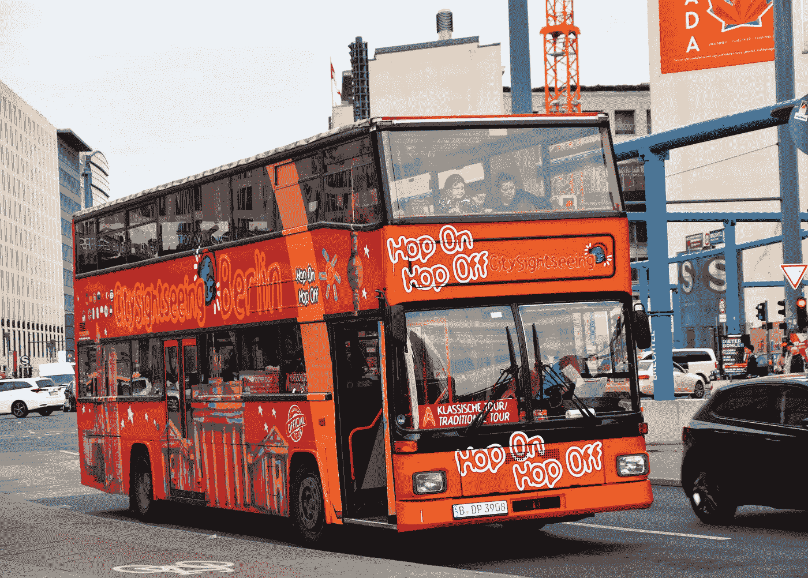

# 密码 101:真的！加密货币现在在旅游交通中被接受作为支付手段。

> 原文：<https://medium.com/coinmonks/crypto-101-really-cryptocurrency-is-now-accepted-as-payment-in-tourism-transportation-6c5c43deac0b?source=collection_archive---------15----------------------->

s Photo by [redcharlie](https://unsplash.com/@redcharlie?utm_source=medium&utm_medium=referral) on [Unsplash](https://unsplash.com?utm_source=medium&utm_medium=referral)

你旅行的时候忘记把法定货币放在口袋里了吗？或者你在萨尔瓦多，你需要支付公共汽车费。你要做什么？如果我们是在 2000 年，也许你可以乞求免费乘车，但没有别的。

今天，我们有了加密货币。

这是一个复习，但对于新手来说，这可能听起来完全超出了这个世界。不完全是。首先让我们了解旅游交通。

# 旅游交通

运输业已经成为全球网络系统的重要组成部分，也是旅游基础设施最重要的组成部分之一。因为有各种各样的交通工具，现在人们从一个地方到另一个地方更容易了。

旅游业需要人们从他们的家到旅游景点的移动，每个游客都必须旅行到感兴趣的地方。因此，旅游业最重要的一个方面就是运输。要建立任何旅游景点，都需要合适、高效和安全的交通路线。

根据研究，旅行者将他们假期预算的 30%到 40%花费在交通上，其余的花费在吃饭、住宿和其他活动上。这一因素再次强调了运输的重要性。

根据上面的陈述，大部分的交易在很大程度上依赖于一个支付系统，比如买票、租车或者用现金支付，或者用借记卡或信用卡支付。所有这些支付系统都由中央银行或政府监管或控制。

# 什么是加密货币？

Investopedia 将其定义为“ ***”一种数字或虚拟货币，通过加密技术进行保护，使其几乎不可能被伪造或重复消费*** *。许多加密货币都是基于区块链技术的分散式网络——由不同的计算机网络执行的分布式账本。”*

它由一个称为“区块链”的对等网络监控和组织，该网络还充当诸如购买、销售和转移等交易的安全数据库。

不受中央银行控制的数字货币。

# 加密货币如何在旅游交通中使用？

Photo by [Waldemar Brandt](https://unsplash.com/@waldemarbrandt67w?utm_source=medium&utm_medium=referral) on [Unsplash](https://unsplash.com?utm_source=medium&utm_medium=referral)

首先，你需要有一个加密钱包。*用此链接阅读我的博客*[*https://blog . cryptostars . is/NFT-101-quick-guide-to-crypto-wallet-f0c 8 ba 692033*](https://blog.cryptostars.is/nft-101-quick-guide-to-crypto-wallet-f0c8ba692033)*。*加密钱包可以让你用加密货币支付交通费用。

加密货币在旅游业中的应用有几种方式。它被用作一种货币来支付诸如房间、食物等项目，在某些情况下甚至是机票。加密货币也被用作旅游项目的主题，例如由数字货币专家举办的专家讲座和研讨会。

Cheapair.com、拉脱维亚航空公司波罗的海航空(Air Baltic)和理查德·布兰森(Richard Branson)的维珍银河早就采用了第一种加密货币比特币，而总部位于柏林的旅游和活动预订服务公司 GetYourGuide 在 6 月份开始接受通过 BitPay 处理的 dogecoin，作为其进入美国的一部分。

# 什么是加密旅游？

这是**一种迎合加密货币爱好者的旅游，提供打包旅游，可以使用数字货币支付，或者在旅行中包括关于加密货币的讲座或研讨会。**简单来说，加密旅游就是旅行者使用加密货币来支付他们的假期。

# 最后的想法！

旅游业似乎正处于一个令人兴奋的增长阶段。加密货币的繁荣将推动旅游业。随着新事物的引入，有一个适应期，其中一些可能对旅游业中加密的重要性至关重要。因此，我将询问您对以下问题的看法:

*   你对加密货币有什么想法吗？你对它在旅游业，尤其是交通行业的利弊有什么看法？
*   在你现在所处的位置，你认为在交通工具中使用加密货币作为支付方式是否适用？

来源:

 [## 什么是加密旅游？

### 加密旅游是一种旅游形式，通过提供一揽子旅游来迎合加密货币爱好者…

www.investopedia.com](https://www.investopedia.com/tech/what-cryptotourism/)  [## 加密货币开始成为支付度假费用的一种方式

### 你可能不得不使用加密货币来支付冻结你笔记本电脑的勒索软件黑客，但还有什么地方…

www.cnbc.com](https://www.cnbc.com/2021/07/31/cryptocurrency-is-taking-off-as-a-way-to-pay-for-vacation-getaways.html) 

***关于作者***

Brayan Nelson 是一名业余爱好作家，目前是一名大学讲师，同时在 NFT 的一个项目中实习。在 Medium 上，他写了他在 NFT 和元宇宙的联系和教育之旅。订阅他的时事通讯，成为第一个阅读他的博客故事的人。你也可以在 bnelsonsep3@gmail.com 通过电子邮件联系到他

> 加入 Coinmonks [电报频道](https://t.me/coincodecap)和 [Youtube 频道](https://www.youtube.com/c/coinmonks/videos)了解加密交易和投资

# 另外，阅读

*   [3 商业评论](/coinmonks/3commas-review-an-excellent-crypto-trading-bot-2020-1313a58bec92) | [Pionex 评论](https://coincodecap.com/pionex-review-exchange-with-crypto-trading-bot) | [Coinrule 评论](/coinmonks/coinrule-review-2021-a-beginner-friendly-crypto-trading-bot-daf0504848ba)
*   [莱杰 vs n rave](/coinmonks/ledger-vs-ngrave-zero-7e40f0c1d694)|[莱杰 nano s vs x](/coinmonks/ledger-nano-s-vs-x-battery-hardware-price-storage-59a6663fe3b0) | [币安评论](/coinmonks/binance-review-ee10d3bf3b6e)
*   [Bybit Exchange 审查](/coinmonks/bybit-exchange-review-dbd570019b71) | [Bityard 审查](https://coincodecap.com/bityard-reivew) | [Jet-Bot 审查](https://coincodecap.com/jet-bot-review)
*   [3 commas vs crypto hopper](/coinmonks/3commas-vs-pionex-vs-cryptohopper-best-crypto-bot-6a98d2baa203)|[赚取加密利息](/coinmonks/earn-crypto-interest-b10b810fdda3)
*   最好的比特币[硬件钱包](/coinmonks/hardware-wallets-dfa1211730c6) | [BitBox02 回顾](/coinmonks/bitbox02-review-your-swiss-bitcoin-hardware-wallet-c36c88fff29)