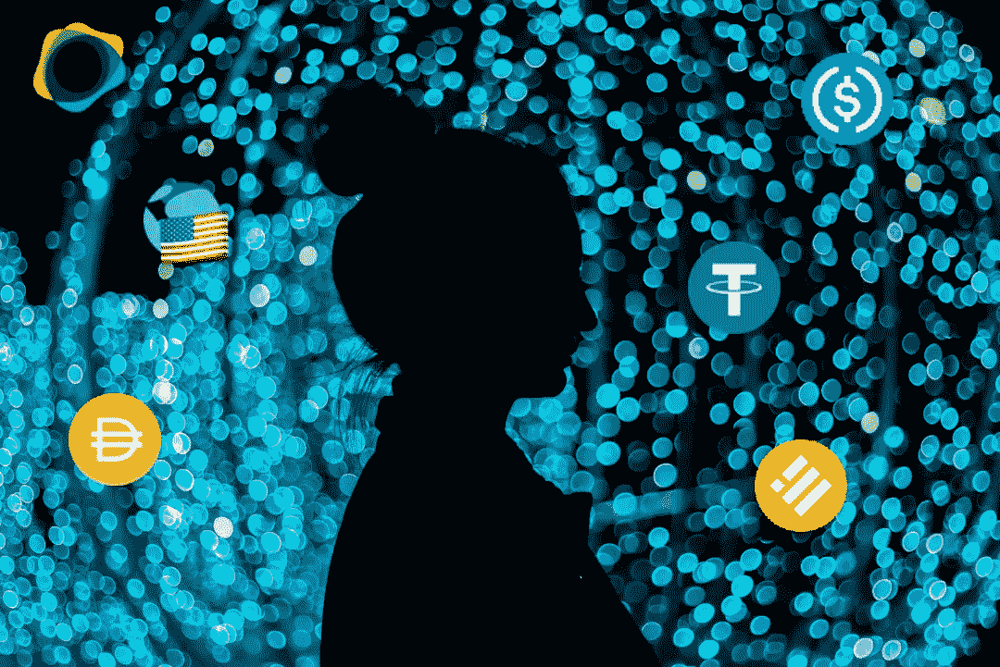

# 密码 101:稳定密码

> 原文：<https://medium.com/coinmonks/crypto-101-stablecoins-81f0669d7e54?source=collection_archive---------13----------------------->

稳定密码是加密交易的生命线，但它们是什么呢？它们是如何工作的，我们真的需要它们吗，为什么？

Image: PixTeller

> 天下没有免费的午餐——未知

# 加密稳定密码:入门

stablecoins 的核心是试图解决密码领域的三个半相关的问题:

1.  资产价格波动
2.  不相关资产的交换
3.  专门为区块链的交易提供便利

前两个问题不是 crypto 独有的。它们是现代金融特有的。它们也(部分地)是现代货币概念中一个根本缺陷的结果。如果你想去那个兔子洞，我写了一个三部曲的系列:[第一部](/crime-justice-media-society/everything-you-know-about-money-is-probably-wrong-c592050590f5)、[第二部](/crime-justice-media-society/everything-you-know-about-money-is-probably-wrong-pt-2-eba774761b98)和[第三部](/crime-justice-media-society/everything-you-know-about-money-is-probably-wrong-pt-3-20dfd76e8c54)。

如果你不喜欢货币历史课，我建议你至少读一读我写的关于[加密流动性池如何工作的文章](/coinmonks/crypto-101-liquidity-pools-and-impermanent-loss-feb297ce5fba)。我认为安全的加密投资需要对流动性和交易有相当好的理解。没有这些知识，就很难确定加密投资的风险。

如果流动性文章有点 TL；对你来说，最简单的说法是:为了交易任何东西，必须有东西可以交易。例如，如果人们想交易苹果和桔子，为了交易，两者都必须足够多。

你拥有的苹果和橘子越多，苹果和橘子市场的流动性就越强。如果一开始只有两个苹果和两个橘子，一个人交易两个苹果会耗尽所有的橘子。如果你有 100，000 个苹果和橘子(高流动性)，一个有两个苹果的人几乎不会做出一个凹痕。

## 价格波动和错配交易

我想大多数阅读这篇文章的人都知道，一项加密资产的价格可能会在每分钟都有大幅波动。这种波动性的一个重要原因是加密的流动性相对较低。在撰写本文时，加密领域以美元计价的总市值(cap)约为[1.84 万亿美元](https://coinmarketcap.com/)。

问题是，大约 7.85 亿美元是比特币(BTC)，另外 3.26 亿美元是以太坊(ETH)。这使得不到一半的加密市值(大约 7 亿美元)分配给所有其他加密项目。从长远来看，这与 T2 的伯克希尔·哈撒韦公司的市值大致相同。

因此，不仅流动性相对较低，而且分散在数千个加密项目中。而且，在 stablecoins 之前，如果你想交易 crypto，你只有两个选择。您可以:

1.  把你的密码换成法定货币(政府支持的货币)；或者
2.  用它换另一个密码

法定货币交易运作良好，但它违背了去中心化数字货币的目的。交易另一个加密也很好，除了加密资产的美元价值因供求关系而不断变化。

想象一下，如果你只能用亚马逊(Amazon)的股票直接交易耐克(Nike)的股票，那会是什么样子。两家公司的股价都在不断变化。如果耐克有创纪录的利润，而亚马逊亏损，在这种情况下，有哪个头脑正常的人会直接用耐克换亚马逊？

当然，每个人都可以跟踪价格变化，并在合适的时机交易。但是这个过程非常耗时且效率低下。更有可能的结果是交易最终会完全停止。

crypto 需要的是区块链的数字美元。由于美国政府没有制造这种货币，退而求其次的是一种与美元“挂钩”的加密代币。在中，stablecoin 协议运营商发行一个令牌，承诺您将始终可以用 1 美元的加密 stablecoin 兑换 1 美元的法定货币。

通过这种方式，某人可以像交易股票一样交易加密资产，只是他们可以在区块链交易一种总是跟随美元价格的菲亚特等价代币，而不是交易菲亚特的加密资产。它必须“跟随”美元的唯一原因是，像加密一样，美元在公开市场上交易。

## 钉住资产并不是一个新想法

据我所知，如今所有现代法定货币都在公开市场上“浮动”。也就是说，法定货币不与任何东西挂钩。大多数主要的国际法定货币交易其他货币，就像加密一样。

法定货币实际上是一种债务工具。你携带的每一美元都是美国政府因持有这些美元而“欠”你的债务。“承诺”(即期票)是美国政府的担保，你可以随时以 1:1 的比例兑换美元，嗯…美元。他们还要求(法定货币法)人们在美国接受美元。

赋予美元价值的是美国的“完全信任和信用”。不过，事情并不总是这样。美元过去常与黄金挂钩。黄金挂钩计划的历史可以追溯到几百年前。许多国家试图维持这些金本位制(但失败了)。

## 美元与黄金挂钩

美国 20 世纪的黄金挂钩政策是这样开始的:美国政府将向你提供一张 20 美元的钞票，你必须接受所有的支付(法定货币法)，但这 20 美元的钞票保证可以兑换(能够兑换回)一盎司黄金。

然而，美国政府无法信守承诺，因为他们没有足够的黄金来支付流通中的美元。为了解决这个问题，他们取缔了私人黄金所有权，收集(偷走)了所有私人持有的黄金，并将赎回费改为 35 美元。

你认为加密有风险。

从这一切中还有一个重要的教训:在任何钉住美元的系统中，无论是黄金对美元*、*苹果对橘子，还是 *x* 美元 *x* 加密代币对美元，如果没有足够的资产来满足赎回需求，该协议迟早会崩溃。

在危机中尤其如此。在危机中，大多数人想要的是有价值的东西，而不是得到它的承诺。如果有足够多的人要求返还挂钩资产(具有实际价值的资产)，而没有足够的资产可供分配，承诺就变得毫无价值。

这就是通常所说的“银行挤兑”,也是导致“钢铁银行”崩溃的原因。这也是导致上世纪 20 年代数千家银行倒闭的原因。在所有情况下，这些崩溃都是资本不足的结果。也就是说，没有足够的储备资产来满足赎回需求。

了解这一点将极大地帮助你找出哪些秘密库比其他库“更好”。

## 按保留机制划分的密码稳定密码的类型

加密资产账户可以分为四个资产储备类别:

1.  **全额储备:**代币与美元 1:1 抵押
2.  **部分准备金:**以美元和商业票据(公司债务)等其他金融资产作为抵押的代币。
3.  **加密储备:**代币被其他加密资产抵押(由于价格波动，通常以 1.5:1 或 2:1 的比例超额抵押)
4.  **神奇的独角兽** **储备:**其中代币由数学(算法)、基于博弈论的激励、有缺陷的推理和/或“[霍普姆](https://www.urbandictionary.com/define.php?term=Hopium)”的混合支持

## 全额储备代币是目前最安全的

币安美元( [BUSD](https://paxos.com/busd/) )、Paxos Standard ( [USDP](https://paxos.com/usdp/) )和 TrueUSD ( [TUSD](https://trueusd.com/) )是三家最大的**全储备**加密银行。这三种代币几乎可以肯定是 1:1 的美元支持。

我说*差不多*是因为我自己没有审计过储备。但值得信赖的第三方有，而且它们都(或多或少)受到美国公认的金融机构的监管。基本上，它们是安全的，至少在兑换美元方面是如此。

## 部分储备代币风险更高，但有些代币比其他代币更安全

系绳( [USDT](https://tether.to/en/) )圈/比特币基地( [USDC](https://www.circle.com/en/usdc) )是**部分储备**。在这两者之间，USDC 是更安全的选择。在泰瑟公司早期的很长一段时间里，他们有几十亿美元的 USDT 未偿贷款，但该公司在世界任何地方都没有一个银行账户。

Tether 在全球最可疑的公司中名列前茅。他们还拥有最高的稳定的币市值，而且差距很大。我经常使用 USDT，因为它是最广泛接受的稳定币。

我还认为它和切尔诺贝利的草莓一样有毒。就目前而言，它非常具有流动性，但不会有太多的多米诺骨牌倒下，让系绳完全内爆。必要时我会使用它，但除此之外我会尽可能避免使用它。

Tether 的绝大部分“储备”是商业票据。他们一度持有这个星球上最多的商业票据。问题是，像高盛和大通银行这样经常从事商业票据交易的公司从未听说过 Tether。这可能是一个危险信号——只是说说而已。

USDC 的储备由国债、证券、商业票据、现金和大宗商品组成。这些资产由声誉良好的公司定期审计。它们也比美元更不稳定，来自足够大的外部冲击(主要战争、自然灾害、外星人入侵等)的压力也足够大。)可能会让 USDC 的抵押贷款不足。可能性不大，但绝对有可能。

## 加密保留令牌是实验性的

MakerDAO ( [DAI](https://makerdao.com/en/) )是一种**加密储备**代币，使用一些**神奇独角兽**算法来维持其与美元挂钩。就风险而言，该协议在很大程度上是一项实验，但它在一些相当动荡的市场条件下很好地支持了 peg。

在我想找到的所有成功的稳定的偶像中，戴可能是第一个。到目前为止，这似乎是最接近真正的分散稳定的方式，即*可能*真的会起作用。为了获得 DAI，基本上用户锁定以太坊(或一些其他加密资产)来借用 DAI。

然后，他们可以用借来的 DAI 购买其他加密资产。聪明的小蜜蜂经常用它来购买更多的 ETH，然后再存进去借更多的 DAI。卖点是你可以拥有自己的 ETH，也可以使用它。

不利的一面是，如果你的杠杆率过高(DAI 债务超过 ETH)，你可能会被清算(失去你的抵押存款)。如果 ETH 是稳定的，这不会有太大的风险。但是 ETH 并不稳定，在波动性很大的时候，很容易被烧毁。

DAI 协议有一个内置的“紧急刹车”，理论上可以防止银行挤兑。如果锁定的总资产价值下降到某个点，所有戴交易都被“冻结”，因此每个投入资产的人都可以取回资产。我不想成为这种情况的测试案例。

不幸的是，我的直觉告诉我，这种情况迟早会发生。但与此同时，我不介意用一点氦来为戴实验加油。

## 神奇的独角兽储备代币是迄今为止风险最高的玩法

泰拉( [UST](https://www.terra.money) )是一种“稳定币”令牌，它与协议发行的卢纳令牌一起支持自己，以维持与美元的挂钩。这是通过套利(价格失衡的利润激励)和铸币税(降低货币价值)实现的。这个方案最大的问题是——行不通。

这些协议失败的方式(已经失败了很多次)是这样的:

1.  稳定币由于操纵、外部冲击、非理性投资者行为、僵尸启示录等带来的卖出压力而失去盯住。
2.  对治理/债券/股票令牌(UST 的 LUNA)的信心直线下降，因为挂钩被打破了
3.  治理/债券/股票价值下降
4.  随着投资者试图减少损失，稳定币面临更大的抛售压力
5.  死亡逐渐被遗忘

所有神奇的独角兽协议都有一个国库机制，该机制旨在收购稳定的硬币，并在向下抛售的压力下烧掉它们以收回 peg。但是正如著名经济学家约翰·梅纳德·凯恩斯曾经指出的:

> 市场保持非理性的时间可能比你保持偿付能力的时间长得多

事实上，治理/债券/股票象征是一种幻觉。稳定的货币唯一真正的后盾是国库储备。如果你没有从这一课中学到什么，请记住，人们总是希望能够将挂钩资产兑换为有价值的资产。

挂钩资产能够始终偿还债务的唯一方法是拥有 1:1 的准备金。你不能让第三(或第四)种无担保资产“回到”挂钩状态。这些神奇的独角兽协议能够继续保持联系汇率的唯一方式是新的资金(傻瓜)进入。

如果你知道要进去，你就可以在那些笨蛋的背上赚钱。如果你不知道进入并接受“印钞机开动了”的想法，迟早你会成为傻瓜。

## 怎样才能用稳定的积分赚钱？

在我看来，最安全的(也是我最青睐的策略)是提供**全额储备**或**部分储备** [稳定的一对流动性](/coinmonks/crypto-101-liquidity-pools-and-impermanent-loss-feb297ce5fba)。我最近经常使用的一个协议是[行星金融](https://blue.planetfinance.io/pools)。

现在，在行星金融上，你可以为和提供 12%的年利率，为和分别提供 10%和 8%的年利率。我知道这不是 3000%的德根收益率。我也知道他们可能不会在一夜之间崩溃。

平心而论，我在 Terra 和 Anchor 赚 20%上做得相当不错。我也知道这是一场赌博，当我写这篇文章的时候，我正在撤出我的 LUNA 股份。我在最近的价格波动中做得很好，前提是在 21 天的解禁期到期前价格不会下跌。我也从其他神奇的独角兽协议中获得了稳定的收益，比如[墓穴财务](/coinmonks/defi-conservative-goes-full-degen-ape-how-i-doubled-my-bag-in-a-week-b8efd9129df0)。

如果你能承受风险，他们有相当惊人的年利率。坟墓现在看起来还不错，但我知道他们拉床只是时间问题。我太不喜欢冒险，不会在这些项目上呆超过一两个星期。我绝对不会给他们任何大笔的钱。

我希望这对你有所帮助。当然，这些只是我 ***的观点*。**我不是财务顾问，这不是财务建议，而且总是 [DYOR](/coinmonks/crypto-investing-how-to-dyor-1e6dabdb1de9) 。遵循这些想法中的任何一个都可能会让你失去所有的钱。我对此 100%认真。我喜欢摆弄这些东西，但我公开表现得像个彻头彻尾的狒狒。相应投资。

直到下一次，安全，聪明，一定要[绑骆驼](https://www.oxfordreference.com/view/10.1093/acref/9780199539536.001.0001/acref-9780199539536-e-2318)。