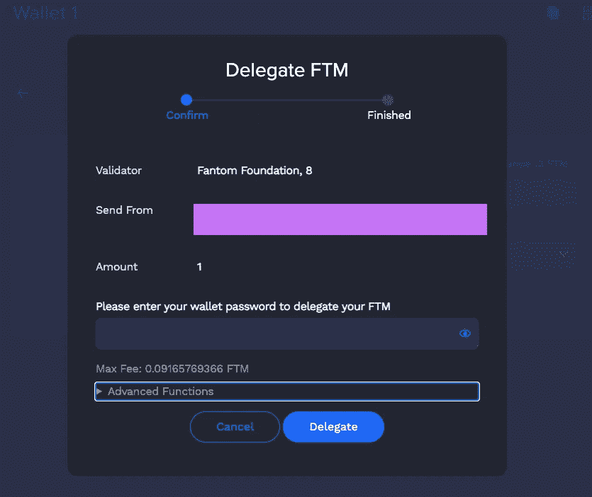

# 加密 101:赌注池

> 原文：<https://medium.com/coinmonks/crypto-101-staking-pools-78a68c5f7cbf?source=collection_archive---------14----------------------->

如果你是一个加密新手，你可能已经看到了无处不在的赌注选项。这意味着什么，它是如何工作的，有什么风险？

Image: PixTeller

> 作为一名新企业家，你需要在游戏中占有一席之地，但你不能孤注一掷

# 底线在前面(又名 TL；博士)

1.  赌注加密通常是指锁定令牌以获取奖励
2.  赌注回报并不丰厚，而且存在风险
3.  赌注可以是一个有效的赚取收入的策略
4.  最佳实践是从简单开始并保持安全

## 赌注加密资产意味着什么？

从最广泛的意义上来说，当你下注 crypto 时，你是在创建一个智能合约，为使用你的代币产生回报。有三种常见的方法可以下注获得奖励:

1.  **共识(验证者)赌注**
2.  提供流动性
3.  放款

每一种都有其独特的功能和要求。他们也有各种各样的风险和回报。有些需要很高的知识水平才能安全地完成。其他的可能很简单。

对于这篇文章，我们将只关注**共识(验证器)锁定**。

## 共识赌注

主要区块链通常使用两种机制来验证交易真实性:工作证明(PoW)和利益证明(PoS)。

比特币和以太坊(目前)使用的是工作证明模型。这意味着网络运营商，通常被称为“矿工”，将与其他矿工竞争，以正确解决高度复杂的数学方程。

因此，矿工必须*工作*到*证明*他们的方程解是正确的。这赋予了矿工在区块链上添加新区块的权利。矿工创造一个区块得到的奖励是新铸造的比特币或以太币。

有了利害关系证明，验证器必须通过*锁定*(锁定)令牌来操作验证器节点，从而*证明*它们是可信的。当交易被发送到网络时，验证器验证交易是否可信以及交易发生的顺序。

如果某个阈值的验证者(通常是三分之二)同意，那么系统已经就网络状态达成了*共识*。如何选择验证器来添加块因共识机制而异。这篇文章提供了一个很好的概述。

## 委托股权证明

为了确保验证器诚实地运行，区块链网络通常需要大量的令牌参与。如果验证者试图欺骗，惩罚是丢失验证者已经下注的部分或全部令牌。

问题是，这将验证器节点限制在拥有大量资金的实体中。解决这个问题的一个方法是允许验证者从很多人那里收集代币，然后*将奖励分配给*每个贡献者。这有助于增加能够参与网络的验证者的数量。

这也是你，作为一个代币持有者，可以从共识赌注中获得回报的地方。几乎所有主要的 PoS 网络，如 NEAR、Terra、Avalanche、Fantom 和(即将推出的)Ethereum，都为用户提供了用验证器标记令牌的方法。

## 奖励的验证程序赌注

虽然它们在细节上有所不同，但基本原理大体上是相同的。首先，你必须购买本地链令牌(例如，LUNA 代表 Terra，MATIC 代表 Polygon，FTM 代表 Fantom，等等。).

一旦您购买了令牌，您可能必须将其发送到连锁本地钱包(例如，Terra Station、Polygon Wallet、Fantom Wallet 等。).这是 Fantom 的一个例子:

Image: Author

创建一个钱包非常简单。就像创建元掩码或信任钱包帐户一样，您可以下载或标记链本机钱包，生成种子短语和密码，然后就可以开始了。

和往常一样，确保将您的种子短语和密码存储在一个安全的地方。不要与任何你不信任的人分享你的密码或种子短语(即使这样，也要三思！).

在上图的左侧，您可以看到一个用于标桩的链接。要开始下注，只需点击该链接。这将带您进入如下所示的屏幕:

Image: Author

在那里，您将选择“添加委托”这将带您进入以下屏幕:

Image: Author

选择显示“选择一个验证器”的下拉菜单，这将显示一个如下所示的列表:

Image: Author

您需要从该列表中选择一个验证器。对于您应该在验证器中寻找什么，没有硬性规定。根据你下注的网络，可能会有一些变量。

您需要寻找的一些常规信息包括:

1.  自我授权的级别(验证者在游戏中有多少“皮肤”)
2.  服务器的正常运行时间(正常运行时间百分比越高=越好/越安全)
3.  验证者的信誉(检查不和谐/电报/ Reddit /网站)
4.  验证程序收取的费用(越低并不总是越好)

Fantom 很好，因为 Fantom 基金会运行他们自己的验证器。虽然他们可能不会支付绝对最高的回报，但与他们一起下注肯定会减少你必须做的功课。

一旦您选择了验证器，您将输入您想要下注的代币数量，然后(在这种情况下)单击继续。这将带您进入以下屏幕:

Image: Author

如果你的钱包需要密码或其他安全措施，你可能必须在这里输入。一旦完成，选择“委托”，你就可以上路了。

## 赌注风险

一般来说，验证程序的风险很低。如果你找到了一个运行时间很长的信誉良好的验证器，你可能不会遇到任何问题。

但是，如果验证器节点出现故障(断电、硬件故障等)。)你的一部分授权股份可能会被削减(从你手中拿走)。通常，这些损失非常小(例如 0.1%)。

你可能面临的更严重的风险是双重签名。对于双重签名的惩罚要高得多(例如，5%)。这种情况最常见的发生方式是，如果一个验证器关闭了，但是有一个自动备份节点在不合适的时间上线。

委托给恶意的验证器也有很小(但非常严重)的风险。虽然可能性极小，但可能性仍然很小。恶意的操作者很可能会收到 100%的斜杠，所以在向验证器提交大量令牌之前做一些研究是值得的。

最佳实践是只选择具有良好声誉的验证者，并将你的股份分散到不同的验证者。

最后，您必须知道一些验证器有一个解锁期，从几个小时到几个星期不等。例如，NEAR 有 56 小时的解锁期，而 Terra Station 将锁定您的股份 21 天。

由于加密市场的发展速度非常快，你会面临代币价格大幅上涨的风险，但随后由于代币被锁定而无法出售。

如果你打算长期持有，这应该不是什么大问题。但是在你的钱包里放一些以防你想在合适的时候卖掉，这可能是值得的。对于锁定期非常长的令牌来说尤其如此。

## 利益和回报的赌注

要知道，你可能不会因为赌代币而变得富有。一些网络会用你下注的代币以外的代币支付奖励(例如，下注 Terra LUNA，获得 UST)。其他的，像 Fantom，直接用原生令牌支付(stake FTM，receive FTM)。

第三方标桩服务近年来如雨后春笋般出现。有些会自动复合你的收入，以增加你的年收益率。许多提供立即解锁令牌的能力。

其他人将允许您生成一个不同的令牌，您可以使用或交易，以取代您的赌注令牌。虽然这些服务超出了本文的范围，但是认识到使用它们会增加许多风险是很重要的。换句话说，应该谨慎使用它们。

无论你决定在哪里下注，你都有可能获得 5-10%的共识赌注代币年收益率。如果你打算长期持有代币，这可能是赚取一点被动收入和增加持股的好方法。

但是，如果你在做空代币，或者只是希望价格快速上涨，下注可能不是最好的选择。此外，像 FTM 这样的一些代币在链上具有非常完善的 DeFi 协议，并且一些代币可以为贷款或提供流动性提供显著更高的 apr。

当然，这些协议也会带来相当高的风险。如果你是密码新手，最好一开始就避开这些。如果你决定开始试验，最好的做法是只使用少量，先做****批次**** *的研究。*

*一旦您理解了协议的工作原理，并且完全理解了风险，那么探索其中的一些选项将是有益的。但是要非常小心。在那些高风险的协议上，不乏有人被烧伤，或者输掉了很多钱。*

## *结论*

*共识赌注主要链令牌可以是一个伟大的方式来赚取被动收入。虽然比简单地在钱包里放一个代币有更多的风险，但你也可以相对安全地增加你的持有量。*

*如果你真的看好某个特定的令牌，并打算长期持有，共识赌注可能是一个不错的选择。如果你计划经常交易或使用代币进行其他创收策略，共识赌注可能不是正确的方式。*

*无论你决定做什么，请确保你负责任地去做。不要做出超出你承受能力的承诺，一定要先做好调查和尽职调查。*

*对我来说，我倾向于使用混合策略，这取决于我的时间范围。我押了露娜一段时间，但当价格翻倍，我被锁定了 21 天时，我真的开始出汗了！*

*其他的，像行星金融上的 AQUA 和 Frax 金融上的 FXS，在我获得奖励的时候可能会被锁定很多年。我曾经把我所有的 FTM 都押上了，但是发现和 DeFi 一起玩更有趣。*

*我仍然超级看好 FTM，但现在我把它用于其他协议。显然，我不能告诉你什么最适合你，但如果你一直想知道赌注，我希望这篇文章有所帮助！*

*当然，这些只是我的 ***意见*。**我不是财务顾问，这不是财务建议，而且总是 [DYOR](/coinmonks/crypto-investing-how-to-dyor-1e6dabdb1de9) 。遵循这些想法中的任何一个都可能会让你失去所有的钱。我对此 100%认真。我喜欢摆弄这些东西，但我公开表现得像个彻头彻尾的狒狒。相应投资。*

*直到下一次，安全，聪明，并确保[绑骆驼](https://www.oxfordreference.com/view/10.1093/acref/9780199539536.001.0001/acref-9780199539536-e-2318)。*

> *加入 Coinmonks [电报频道](https://t.me/coincodecap)和 [Youtube 频道](https://www.youtube.com/c/coinmonks/videos)了解加密交易和投资*

# *另外，阅读*

*   *[3 商业评论](/coinmonks/3commas-review-an-excellent-crypto-trading-bot-2020-1313a58bec92) | [Pionex 评论](https://coincodecap.com/pionex-review-exchange-with-crypto-trading-bot) | [Coinrule 评论](/coinmonks/coinrule-review-2021-a-beginner-friendly-crypto-trading-bot-daf0504848ba)*
*   *[莱杰 vs n rave](/coinmonks/ledger-vs-ngrave-zero-7e40f0c1d694)|[莱杰 nano s vs x](/coinmonks/ledger-nano-s-vs-x-battery-hardware-price-storage-59a6663fe3b0) | [币安评论](/coinmonks/binance-review-ee10d3bf3b6e)*
*   *[Bybit Exchange 审查](/coinmonks/bybit-exchange-review-dbd570019b71) | [Bityard 审查](https://coincodecap.com/bityard-reivew) | [Jet-Bot 审查](https://coincodecap.com/jet-bot-review)*
*   *[3 commas vs crypto hopper](/coinmonks/3commas-vs-pionex-vs-cryptohopper-best-crypto-bot-6a98d2baa203)|[赚取加密利息](/coinmonks/earn-crypto-interest-b10b810fdda3)*
*   *最好的比特币[硬件钱包](/coinmonks/hardware-wallets-dfa1211730c6) | [BitBox02 回顾](/coinmonks/bitbox02-review-your-swiss-bitcoin-hardware-wallet-c36c88fff29)*