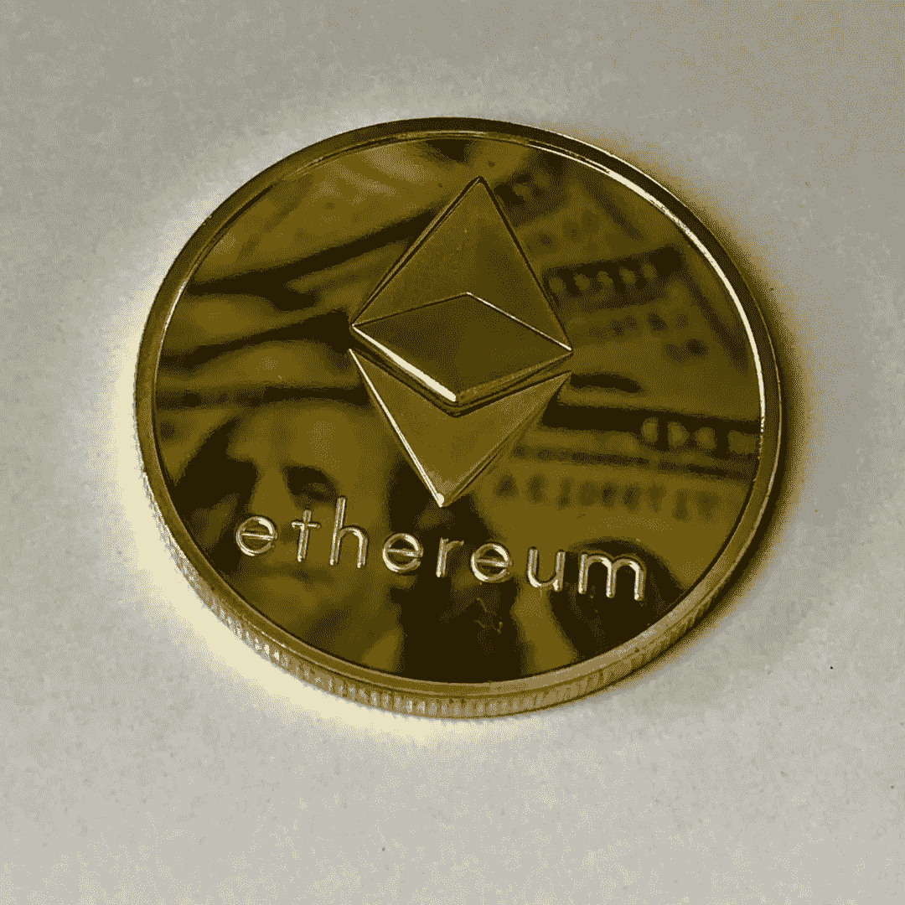

# 密码 101:以太坊是什么？

> 原文：<https://medium.com/coinmonks/crypto-101-what-is-ethereum-f0bed17e9df5?source=collection_archive---------73----------------------->

*以太坊——数字货币和全球应用的家园:*

加密货币和区块链技术的世界是巨大的。比特币可能是第一个也是最受欢迎的加密技术，但它绝不是唯一存在的加密技术，也不是你应该熟悉的唯一加密技术。区块链技术的可能性远远超出了数字货币和去中心化金融。在本文中，我们将介绍第二种最受欢迎的加密货币，它进一步建立在推动比特币的区块链技术之上，这就是以太坊。

要理解以太坊区块链，首先要理解它与比特币有何不同。比特币运行在一个只有一个目的的区块链网络上，这个目的就是为这种数字货币存储价值。以太坊与此不同，它运行在通用区块链上，随之而来的可能性似乎是无限的。以太坊区块链是一个完整的网络，可以继续建设。它就像区块链科技的瑞士军刀。以太坊是世界上第一个可编程的区块链，它允许开发者在这个网络上构建和运行分散的应用程序。它进一步建立在比特币的创新基础上，可以用于比数字支付更多的用途。

比特币已经被打上了一种 ***数字黄金*** 的烙印，以太坊可以被认为是第一台 ***世界计算机。它建立在一个共享的区块链网络上，世界上的每个人都可以使用，由于网络是分散的，它不依赖于任何单一的服务器来运行。这使得黑客攻击变得非常困难，因为没有一台服务器可以控制整个网络，这也意味着你不能被审查。***

以太坊是一种社区运营的技术，为数千个分散的应用程序(也称为 Dapps)提供动力。网络对世界上的每个人开放，使用这些 Dapps 时不需要提供您的个人详细信息，这使得区块链的使用比典型的网络更加私密和安全。以太坊上的所有 Dapps 都是开源的，彼此兼容，这意味着所有开发人员都可以在彼此的工作基础上进行构建和添加。这创造了一个创新的整体景观，区块链以太坊在其中不断发展和完善。许多人称之为互联网的下一个阶段。

你可能听说过不可替代令牌，或 NFT，这是一种具有所有权证明的非金融数字资产。艺术、音乐或视频都是非功能性翻译的例子。最近有很多关于 NFT 的炒作，它们只是人们越来越兴奋的以太坊区块链的一个方面。

*如果 uber 这样的 app 跑上以太坊会怎么样？*

驱动以太坊的技术是一个新概念，一开始真的很难完全掌握，所以现在不要进入更混乱的细节，也许最好是我们举一个你可能已经熟悉的应用程序的例子，并展示如果它在以太坊区块链上运行它将如何工作。

就优步而言，该平台由优步公司集中运营。当你订购一辆车时，请求首先会发送到优步，他们会为你匹配一名司机，然后司机会带你上路，然后你向优步付款，后者会向司机支付一定比例的费用，同时为自己保留一些利润。

然而，如果优步的应用程序在以太坊区块链运行，它将变得分散，这意味着优步公司不再对平台拥有完全的控制权，而是所有的司机将共同分享控制权。当你订购一辆车时，请求会发送到区块链网络而不是优步公司，系统会自动为你连接一个带你上路的司机，然后你直接用乙醚(区块链以太坊使用的货币)支付给司机。

这种技术有可能从各种交易中剔除不必要的中间人，使所有其他相关方受益。所有的司机将能够民主地投票决定 Dapp 将如何运行，并决定收费标准和司机应该遵守的规则。与此同时，他们可能会从自己的工作中获得更大份额的利润。

*不仅仅是炒作，以太坊正在创造真正的价值:*

以太坊区块链已经超越了比特币的功能。根据一些消息来源，它已经允许超过 20 万开发者创建数千个分散的应用程序。随着开发人员继续在现有框架上构建，以太坊在不断发展，变得更加高效。这是一个真正的全球区块链网络，可以为使用它的每个人提供许多好处。

从投资角度来看，随着以太坊区块链的不断发展和使用量的增加，以太的价值可能会增加。区块链上分散的应用创造价值，随着主流应用的进一步发展，整个以太坊生态系统的价值也将增长。

有兴趣了解更多关于加密货币交易和印度股票市场的信息吗？试试 Ztocks 教育游戏！可从 playstore 获得:【https://play.google.com/store/apps/details?id=com.ztocks 

*免责声明:请注意以上信息仅用于普通教育目的。写这封信时没有考虑到你的任何个人情况。这不是买入、持有或卖出的建议。投资涉及风险。*

> *加入 Coinmonks* [*电报频道*](https://t.me/coincodecap) *和* [*Youtube 频道*](https://www.youtube.com/c/coinmonks/videos) *了解加密交易和投资*

# 另外，阅读

*   [Bookmap 评论](https://coincodecap.com/bookmap-review-2021-best-trading-software) | [美国 5 大最佳加密交易所](https://coincodecap.com/crypto-exchange-usa)
*   最佳加密[硬件钱包](/coinmonks/hardware-wallets-dfa1211730c6) | [Bitbns 评论](/coinmonks/bitbns-review-38256a07e161)
*   [新加坡十大最佳加密交易所](https://coincodecap.com/crypto-exchange-in-singapore) | [购买 AXS](https://coincodecap.com/buy-axs-token)
*   [红狗赌场评论](https://coincodecap.com/red-dog-casino-review) | [Swyftx 评论](https://coincodecap.com/swyftx-review) | [CoinGate 评论](https://coincodecap.com/coingate-review)
*   [投资印度的最佳密码](https://coincodecap.com/best-crypto-to-invest-in-india-in-2021)|[WazirX P2P](https://coincodecap.com/wazirx-p2p)|[Hi Dollar Review](https://coincodecap.com/hi-dollar-review)
*   [加拿大最佳加密交易机器人](https://coincodecap.com/5-best-crypto-trading-bots-in-canada) | [库币评论](https://coincodecap.com/kucoin-review)