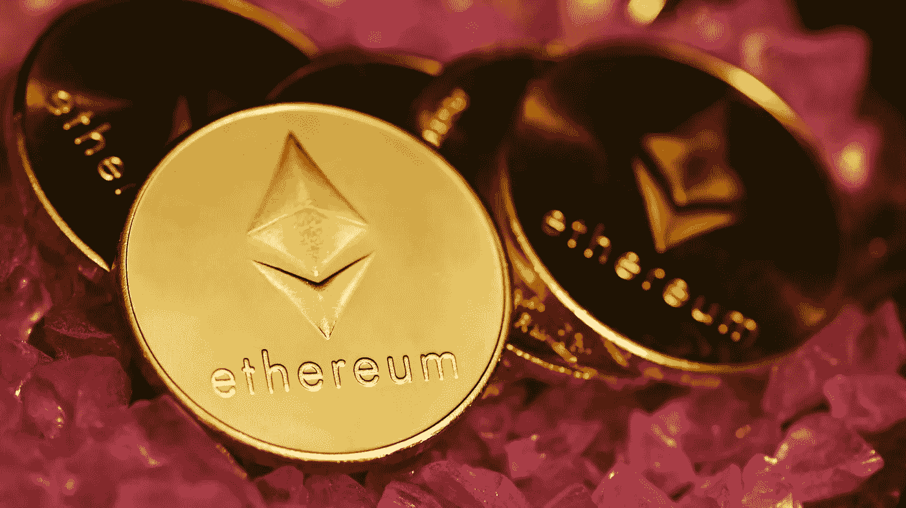

# 加密的采用和监管:我对 2022 年的加密展望

> 原文：<https://medium.com/coinmonks/crypto-adoption-and-regulation-my-crypto-outlook-for-2022-8d917c9c04bb?source=collection_archive---------8----------------------->

当我在笔记本电脑上为这个有趣的 [BitYard](https://www.bityard.com/account/register?ru=AebNkR&f=Medium) 写作比赛打字的时候，正好是 2022 年 1 月 22 日密码崩溃后的几天。据说，这次加密崩溃抹去了超过 1 万亿美元的市值，超过 239，000 个交易者头寸被平仓，变现约 8.74 亿美元。

对于最大的数字资产比特币来说，这次崩盘只是自去年 11 月创下历史新高(ATH)以来的众多崩盘之一。此后，比特币价值下跌。对于替代硬币来说也是如此。据说，自 2021 年底以来，这一长串下跌是由多种事件引起的，例如，大多数国家即将出台的加密法规，对数字货币施加压力的国家，以及围绕工作证明(PoW)的环境问题，最近俄罗斯因此威胁禁止加密。

2022 年以这样的方式开始！带着这些想法，我分享我对 2022 年的加密展望。

**加密项目的主流采用将继续**
2022 年，将继续采用区块链相关的技术和解决方案，如区块链游戏、NFTs 和 metaverses。这些将把密码市场引入主流。更多的用户意味着更多的流量(买方或卖方)，因此，更多的交易活动。因此，我认为这是 2022 年加密市场的牛市。

区块链游戏自 2017 年以来一直存在，但直到 2021 年才开始受到关注，因为 Axie Infinity 在新冠肺炎疫情期间被媒体曝光。区块链游戏公司的“游戏赚钱”计划吸引了希望通过游戏赚取一些利润的玩家。但自那以来，人们的反应不一，游戏行业的玩家和开发者对此提出了批评，因为与市场上的优质视频游戏相比，区块链游戏的吸引力和可玩性有限。

NFTs 在 2020 年受到关注，但它惊人的成功实际上是因为 2021 年初有争议和高调的 NFTs 销售和拍卖。一个例子是艺术家 Beeple 的“*Everydays:the First 5000 Days*”，它以 6930 万美元的价格被拍卖。此外，在 2021 年，随着大型机构带着自己的数字艺术和 NFT 收藏品进入 NFT 空间，将 NFTs 纳入主流的势头越来越大。预计这种情况将持续到 2022 年。

2021 年也见证了虚拟世界和虚拟土地的崛起，这将持续到 2022 年。如果你愿意，你可以在月球或火星上购买虚拟土地，在那里你可以展示你在游戏中的作品或购买的 NFT，或者你可以只是玩来赚钱。大型机构也开始进入元宇宙市场，购买虚拟土地。以及建立虚拟商店来销售他们商品的虚拟版本。

分散金融(DeFi)将在 2022 年蓬勃发展。尽管由于《反洗钱法》( AMLA)的风险，该领域可能会受到打击，但情况仍然如此。你将能够赚取、借入、借出和入股，而不需要中介，例如银行。这将是以太坊和所谓的 ETH 杀手的下一个战场，因为对前两个位置(继比特币之后)的争夺将在 2022 年继续。

**欺诈、诈骗和小把戏越来越多**
预计 2022 年将有更多的开发者建立自己的区块链游戏和 NFT 项目。2022 年的新投资者将寻找新的投资机会，加密空间对他们来说将是一个令人兴奋的空间。然而，对加密空间缺乏适当的监督使这些新的投资者和用户暴露于骗局。但是，由于利润的承诺，用户和玩家仍然会加入这些项目。随着我们看到越来越多的用户进入加密领域，预计 2022 年将会有更多的骗局和阴谋(图片来源[此处](https://www.google.com/imgres?imgurl=https%3A%2F%2Fwww.cryptotimes.io%2Fwp-content%2Fuploads%2F2021%2F06%2FScam-1.jpg&imgrefurl=https%3A%2F%2Fwww.cryptotimes.io%2Frug-pull-scam-absconding-with-investors-money%2F&tbnid=sXrx3zeXPfBLwM&vet=12ahUKEwisz_yljM71AhVbmtgFHTKGB4YQMygHegUIARDKAQ..i&docid=FsR_8qRUzN8AvM&w=800&h=500&itg=1&q=crypto%20rugpull%20scam&ved=2ahUKEwisz_yljM71AhVbmtgFHTKGB4YQMygHegUIARDKAQ))。

对于玩家来说，入门就像在银行开存折一样容易，但不像投资股市那么枯燥。此外，你的潜在利润受到你的想象力的限制。你可以选择掷骰子(基于机会)，玩游戏(基于技能)，赌注(赌注)，借或贷(借和贷)来获利。

对于开发人员来说，在区块链上创建自己的令牌并将其作为某种“通用硬币”进行销售是非常容易的。我预测 Coingecko 目前的硬币数量(发帖时为 12，837 枚)将在 2022 年翻一番。分析人士和学者都指出了加密世界的假名性质以及缺乏保护投资者的强制性检查。因此，这是加密空间现在受到监管的原因之一。

**新的加密法规并不牵强**
迟早，加密将进入主流，我们需要接受法规将紧随其后。每个国家对密码产业的看法都不一样。世界各国要么禁止要么接受加密货币。有些国家被认为是“加密友好的”，如瑞士、德国、新加坡、马耳他、葡萄牙、斯洛文尼亚、百慕大和白俄罗斯。当萨尔瓦多接受比特币作为法定货币时，它获得了胜利。

另一方面，禁止加密货币的国家实施了全面禁止或有限禁止(禁止支付，但允许用于交易或投资目的)。这些国家包括中国、埃及、伊拉克、卡塔尔、摩洛哥、阿尔及利亚、突尼斯、孟加拉国、玻利维亚、尼日利亚、土耳其和印度尼西亚。

一段时间以来，政府一直在以这样或那样的形式追逐密码行业。目前处于困境的一些领域是:

*   因环境问题而进行的工作证明(PoW)采矿。
*   一般来说，稳定是对本币的潜在威胁。
*   加密开发者、挖掘者和验证者的潜在税收(美国基础设施法案)。
*   分散金融(DeFi)和加密钱包，因为反洗钱法案(AMLA)欺诈的潜在风险。

新法规会阻碍密码行业的主流应用吗？是也不是。可以肯定的是，任何监管要求，例如税收，都会得到用户群的负面反应，甚至可能导致市场或闪电崩盘。但是，我怀疑它会阻止围绕区块链技术的创新或限制区块链游戏，NFTs 或元宇宙的主流采用。此外，没有人知道在这个时候将会出台什么样的法规。虽然，我期待某种形式的数字身份证或标识符或 did 必须是其中之一。

因此，虽然我认为这将对我的前景产生初步的负面影响，但总的来说，随着更多的用户对加密空间建立信任以及主流采用的进展，我们应该会看到市场最终会有所改善。

**Altcoins 与比特币的脱钩还没有出现**
去年 2021 年，我们看到 ETH 的指数增长超过了 BTC，一些人认为 ETH 很快就会超过 BTC。这背后的原因可能是游戏、NFTs、元宇宙和 DeFi 的增长。我们认为我们开始看到实用币(如以太坊)和储值币(如比特币)之间的区别。不幸的是，最近的崩盘与此相悖。

如果比特币下跌或上涨，altcoins 也会跟着下跌。似乎跑赢比特币并不直接等同于脱钩。因此，2022 年替代币将继续依赖比特币。如果你是一名交易员，请确保你监控比特币的价格走势，因为每次你的替代币都会试图相应地与比特币保持一致。

**2022 年流行的代用币**
当然，2022 年将会有新的、闪亮的硬币和代币占据头条。无论好坏，我相信 2022 年对于**以太坊**会有很多的喋喋不休以及期待。

首先，由于围绕区块链博彩、NFT、元宇宙和分散金融(DeFi)的狂热，新闻将总是包括另一个硬币——以太坊，不管 L1·区块链涉及什么。这会进一步产生对以太坊的兴趣。

第二，2022 年是 ETH 最重要的升级年。即 ETH 2.0 或共识层(最近更名)。目标是在 2022 年 6 月前部署。这是一个漫长的旅程，自 2020 年以来，创建了一个独立的 ETH 网络，称为信标链，以建立 ETH 作为区块链的股份证明(PoS)。下一步是共识层部署，然后最终进入利益证明“*合并*”，其中 ETH 工作证明区块链将与信标链合并。

第三，合并后，释放的锁定的 ETH 将受到限制，因此不会在市场上泛滥 ETH(参见下图，了解 ETH 2.0 的总价值(TVS))。然后，向前看，我们将会看到更多的 ETH 被标上，但更少的 ETH 被创造出来。市场上的 ETH 越少越好。总体而言，我的预期是，这将推动 ETH 的价格呈上升趋势。

第四，我喜欢大屠杀。这比星球大战绝地对西斯的戏还好看！有很多竞争者反对 ETH gearing 的头把交椅(效用方面)。这些所谓的 ETH 杀手和 ETH-killer 杀手围捕我的帮派。我这么说是什么意思？我有$ETH，但也有$LUNA，$SOL，$AVAX 和$MATIC 包套期保值，以防 ETH 失信。

**ETH 杀手**:不幸的是，预期中的大规模改进不会在“合并”后立即生效。通过碎片链的扩展改进要到 2023 年才能实现。因此，其他 L1·区块链仍有机会抢走 ETH 的风头。所谓的“ETH 杀手”，如 Terra ( *$LUNA* )、Fantom ( *$FTM* )、Solana ( *$SOL* )、Avalanche ( *$AVAX* )都在伺机从 ETH 手中接过第二的位置。

**ETH-黑仔杀手**:在交易速度和容量方面，ETH 第二层系统为 *Dapps* 提供了另一种选择。以太坊第 2 层系统使用汇总技术在以太坊区块链上引入缩放。自 2021 年 9 月以来，L2 联邦理工学院系统的 Dapp 活动不断增加，目前 L2 联邦理工学院系统的总价值(TVL)为 53.2 亿美元。领先的第二层硬币包括多边形( *$MATIC* )、Arbitrum 和乐观。

抛开以上，另一个荣誉奖是 **WAX 区块链。**蜡像区块链协议令牌($WAXP)显然是“玩赚”领域的领跑者之一。Coingecko 榜单[中排名前四的 metavens(Axie Infinity、沙盒、分散地和 Gala)在这里](https://www.coingecko.com/en/categories/play-to-earn)都是建立在以太坊区块链之上的。但是，蜡像区块链名列前五，骄傲地在人群中昂首挺胸。WAX 中一些受欢迎的项目包括《异形世界》、《玉米卷》、《农民的世界》、《夹板岛》、《诸神与传说》( GNL)、Maxylab 和《WAX Arena》。WAXP 在 2022 年也是一个有希望的象征，这就是为什么我也有我的 *$WAXP* 包。把 WAXP 当成我的黑马吧！

**BitYard Exchange**
说起一大堆硬币，我就手心痒痒。当我的手掌发痒时，我会有交易的冲动。自从股市崩盘后，我就有了购买 BTD 股票的冲动。好了，既然我现在基本上向你们所有人展示了我自己，我可以与你们分享的另一件事是关于 [BitYard 的。](https://www.bityard.com/account/register?ru=AebNkR&f=Medium)

[BitYard](https://www.bityard.com/account/register?ru=AebNkR&f=Medium) 是一个买卖数字货币和法定货币的流行交易所。它允许 100 多种加密货币的交易。其总部位于新加坡，自 2019 年 11 月开始运营。BitYard 受以下四个国家/地区的监管:

*   美国:美国金融服务公司(AMSB)
*   新加坡:会计和公司监管局(ACRA)
*   澳大利亚:澳大利亚交易报告和分析中心
*   爱沙尼亚:Majandustegevuse 登记册(MTR)或爱沙尼亚经济事务和通信部保存的经济活动登记册。

他们说 BitYard 的品牌概念是“ *BitYard = Simple* ”。我同意——这个平台非常容易使用。这些功能很简单(市场、期货和现货)，费用对交易者非常友好，还增加了一点乐趣。BitYard 有一个“*神秘盒子*”，你可以随机获得，并在完成特定任务后获得免费密码。最重要的是，BitYard 在其平台[这里](https://www.bityard.com/en-US/mining)提供了一个“每日采矿”活动，在这里你可以从山上收获硬币。然后，您可以将这些收获的硬币作为 USDT 转入您的“礼金余额”，一旦您下订单，这些硬币将被自动扣除。不幸的是，你不能收回 USDT，也不能把它换成其他硬币，但它达到了它的目的。与其他交易所相比，您的交易费用大大降低。

我喜欢 BitYard 的另一个特点是，它允许你提取多达 10 万 USDT，而且没有强制清算。你能相信吗？你为什么不自己去看看？你将在这里得到更多关于 BitYard 的细节。

等等，还有呢！我是不是忘了说 BitYard 是有心脏的？对于每个参与帖子，BitYard 将通过 Giving Block 向慈善机构捐赠 5 万美元 SHIB。你还在等什么？现在就拿起笔或开始在你布满灰尘的笔记本电脑键盘上打字吧！分享您的想法，赢取大奖！

Giving Block 于 2018 年在美国成立，是非营利组织和加密货币捐赠者之间寻找彼此的桥梁。自成立以来，Giving Block 现在提供了 1000 多个非营利选项，可供加密货币捐赠者选择。你可以在这里找到更多关于捐赠板块及其社交媒体链接[的细节。](https://thegivingblock.com/about/)

**结论**

总体而言，尽管 2022 年初面临挑战，但我对加密市场的前景总体上是积极的。加密技术的主流应用将会继续，相关法规将会出台。我认为比特币在今年剩下的时间里会波动，其走势仍将主导替代币。但是，在所有这些之下，ETH 和其他替代硬币之间正在进行激烈的竞争。谁知道谁会登顶？但是，你可以打赌，我会靠在沙发上，手里拿着爆米花，密切关注着。就像在加密的世界里一样，激动人心的时刻就在前方，我们将全速前进！

**免责声明**
本文是作为#MyCryptoOutlook2022 与#BitYard 竞赛的投稿而写的。作者在这篇文章发表时持有 *$ETH，$WAXP，$SOL，$LUNA，$AVAX，$MATIC* 。

希望我能提供一些有用的见解。你还有什么要补充的吗？请留下你的评论。如果你看到了这篇文章的结尾，谢谢你。请用赞、评论或提示来表示你的支持。将不胜感激！

*原载于*[*https://www.publish0x.com*](https://www.publish0x.com/everything-about-cryptos/crypto-adoption-and-regulation-my-crypto-outlook-for-2022-xvyxljj)*。*

阅读更多信息:

 [## 超级碗里的加密货币？加密货币在大舞台上的影响有多大。

### 加密货币在超级碗上引起了轰动，这是最受关注和最受瞩目的广告事件之一…

medium.com](/bityard/cryptocurrency-in-the-super-bowl-how-big-of-an-impact-cryptocurrency-is-on-the-big-stage-be567735766)  [## Web 3.0，去中心化的互联网及其重要性。

### 尽管如此，如果历史教会了我们什么的话，这些变化还是很重要的。

medium.com](/bityard/the-web-3-0-decentralized-internet-and-why-it-is-significant-c9b0474d30ca) 

_____________________________________________________

**比特码交易所:**【BitYard.com 

**客户支持:** [支持@bityard.exchange](mailto:support@bityard.exchange)

**业务请求:** levi@bityard.exchange

**比特码电报社区**

BitYard 新闻和事件—[https://t.me/BITYARDNEWS](https://t.me/BITYARDNEWS)

英语—[https://t.me/BityardEnglish](https://t.me/BityardEnglish)

越南语—[https://t.me/BitYardVietNamChat](https://t.me/BitYardVietNamChat)

印度尼西亚语—[https://t.me/bityardindonesia](https://t.me/bityardindonesia)

https://t.me/BityardPhilippines

**BitYard 官方社交媒体**

YouTube—[https://www.youtube.com/c/BityardOfficial/](https://www.youtube.com/c/BityardOfficial/)

https://www.facebook.com/Bityardofficial 脸书

推特—[https://twitter.com/Bityard_Global](https://twitter.com/Bityard_Global)

中等—[https://medium.com/bityard](https://medium.com/bityard)

## 【平台 BitYard 入驻】

[Coincodex](https://coincodex.com/exchange/bityard)——[https://coincodex.com/exchange/bityard](https://coincodex.com/exchange/bityard)

[辣椒粉](https://coinpaprika.com/exchanges/bityard/)——[https://coinpaprika.com/exchanges/bityard/](https://coinpaprika.com/exchanges/bityard/)

[神秘冒险](https://cryptoadventure.com/discover/exchanges)——【https://cryptoadventure.com/discover/exchanges 

> 加入 Coinmonks [电报频道](https://t.me/coincodecap)和 [Youtube 频道](https://www.youtube.com/c/coinmonks/videos)了解加密交易和投资

# 另外，阅读

*   【Capital.com】|[港加密借贷平台](https://coincodecap.com/crypto-lending-hong-kong)
*   [如何在 Uniswap 上交换加密？](https://coincodecap.com/swap-crypto-on-uniswap) | [A-Ads 评论](https://coincodecap.com/a-ads-review)
*   [WazirX vs CoinDCX vs bit bns](/coinmonks/wazirx-vs-coindcx-vs-bitbns-149f4f19a2f1)|[block fi vs coin loan vs Nexo](/coinmonks/blockfi-vs-coinloan-vs-nexo-cb624635230d)
*   [本地比特币审核](/coinmonks/localbitcoins-review-6cc001c6ed56) | [加密货币储蓄账户](https://coincodecap.com/cryptocurrency-savings-accounts)
*   [什么是保证金交易](https://coincodecap.com/margin-trading) | [美元成本平均法](https://coincodecap.com/dca)
*   [支持卡审核](https://coincodecap.com/uphold-card-review) | [信任钱包 vs 元掩码](https://coincodecap.com/trust-wallet-vs-metamask)
*   [Exness 回顾](https://coincodecap.com/exness-review)|[moon xbt Vs bit get Vs Bingbon](https://coincodecap.com/bingbon-vs-bitget-vs-moonxbt)
*   [如何开始通过加密贷款赚取被动收入](https://coincodecap.com/passive-income-crypto-lending)
*   [BigONE 交易所评论](/coinmonks/bigone-exchange-review-64705d85a1d4) | [电网交易机器人](https://coincodecap.com/grid-trading)