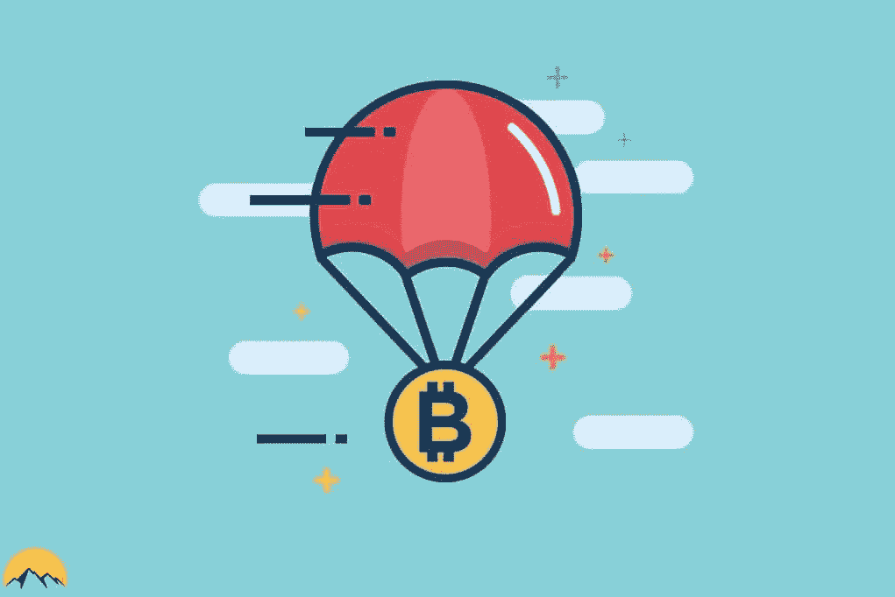

# 加密空投:初学者指南

> 原文：<https://medium.com/coinmonks/crypto-airdrops-a-beginners-guide-be6becaf6df5?source=collection_archive---------27----------------------->

什么是空投？

空投可能是推出代币或加密货币的最引人注目的促销形式。那就是，在一个像加密货币这样普及的生态系统中，免费的资产共享是让自己出名的最佳方式之一。

加密货币领域最突出的活动之一是空投。他们背后的想法是向对加密货币感兴趣的社区提供加密货币或代币；这种情况无疑吸引了许多人的注意力，因为这是一个轻松赚钱的好机会。虽然这是一种基于相当传统的计划的促销活动形式，但事实是在实践中它有些不同。在空投过程中，令牌被发送到这些事件的管理者决定的地址。例如，如果你的地址已经被选定，即使你没有要求他们，你仍然会收到令牌。这个细微的差别使得分发格式类似于邮寄。

**空投完成的原因**

在这种公开加密货币和代币的分发背后，社区增长和经济目标非常明显。

其中包括:

1.吸引媒体和人们的注意力。空投，尤其是那些来自严肃项目的空投，经常会得到媒体的大量关注。这很好，因为它让这个项目为人所知，更多的人会对它感兴趣。
2。确保加密货币或代币到达尽可能多的人手中，让他们开始使用。通过使用收到的加密货币或代币，项目的经济活动得到促进。这对项目的成长有积极的影响，有利于它的发展。它还确保了令牌的更好分配，从而分散了对令牌的控制。

如您所见，空投被用作一种宣传工具，因此被视为一种旨在扩大目标受众和促进相关项目经济活动的宣传手段。

**空投的种类**

空投有不同的类型，每一种都有自己的特点。其中我们可以举出:

1.任务/赏金空投:这是最常见的任务和目标，要求用户完成特定的任务才有资格参加活动。通常，要执行的任务集中在社交媒体或类似的活动上。出于这个原因，许多人有条件关注该项目的社交媒体账户或与其推广相关的其他账户。通过这种方式，试图在项目的初始阶段接触到一定数量的用户。或者换句话说，越多人了解和谈论这个项目越好。

2.交换空投:这是另一种非常常见的空投方式。在这种情况下，管理空投系统的是与之相关的项目和交易所。该项目选择了一些交易所，允许您在您的平台上管理加密货币或令牌。因此，负责接收用户以及通知和管理使他们有资格使用 airdrop 的必要要求的是交换机。

这种空投方式的一个例子可以在比特币基地和恒星计划这样的交易所中看到。这两家公司进行空投，允许向通过其平台的整个 KYC 识别过程的人交付 50 美元的流明(XLM)。只有完成整个过程，用户才有资格领取空投奖励。

3.带钱包的空投:这是另一种相当常见的空投形式，被加密钱包平台广泛用于推广他们的项目。通常情况下，这些空投会在特定情况下向安装或使用钱包的人提供加密货币或代币。这样做的目的很明确:把你的钱包带给尽可能多的用户。所有这些都是为了增加你的社区规模和利润。这是因为这些钱包通常提供其他相关的支付服务。如信托钱包空投

4.持有人空投:这是一种罕见的空投形式。当接收空投的要求是在个人钱包中有一定数量的加密货币时，就会发生这种情况。通常情况下，空投收到的金额与您拥有的加密货币或代币的数量有关。这样，您拥有的代币和加密货币越多，获得的奖励就越多。

5.独家空投:独家空投只发送加密到指定的钱包。通常情况下，收件人在项目中有既定的历史，例如是一名活跃的社区成员或项目的早期支持者。

**你如何参与空投？**

通常情况下，参与空投并不是特别困难。首先，你需要了解即将推出的项目。有很多网站致力于此，如 airdrops.io 和 Airdrop Alert，显示世界各地不同的空投。

在这些网站上，所有必要的步骤都被标明，以便能够参与各种注册的跳伞活动。一般来说，这些允许您执行非常简单的任务，例如:

1.  加入加密货币项目的社交网络
2.  制造某种信息来突出这个项目
3.  使用户有资格使用 airdrop 的一些特定任务。

了解 airdrops 的另一种方式是查看新项目的新闻，并关注他们的官方网站。诚然，这需要一些工作，但一般来说，这通常是一个更安全和无中间人的方式来完成这样的任务。

您还需要了解空投要求才能领取奖品。通常，项目会推出他们的作品集，或者解释如何创建作品集来获奖。在这一点上，你必须仔细按照步骤，以获得空投奖，如果选择。

**空投的危险**

空投对于项目来说可能是一项强大而有趣的活动。然而，你应该小心，因为他们不是没有某些风险。在这种情况下，最好保持警惕，不要被情绪冲昏头脑。有些空投可能是一种骗局。尤其是那些需要以用户的经济成本来执行动作的应用。

因此，检查此类行动的有效性并检查官方或社区媒体以了解是否有任何投诉或报告非常重要。当然，你永远不应该接受要求你把钱转到一个账户或要求控制你的私人钥匙的空投。这两种情况对你的隐私都是非常危险的，也是你失去资金的一个很好的起点。

还有，记住黑客和骗子也在寻找这些机会。其原因是，许多参与这些活动的人都是新手，这使得骗子更容易进行不诚实的活动。

面对这些危险时，请始终牢记以下安全注意事项:

1.切勿为了参与空投而向某个地址汇款。不管那个人自称是维塔利科·布特林还是中本聪，都不要紧。空投的妙处在于免费领取，而不是交钱才能参与。

2.永远控制好你的私人钥匙，不要和任何人分享。记住这些钥匙只能给你看。

3.如果可能的话，为参与空投准备不同的社交媒体资料和不同的钱包。保持这种隔离将有助于确保您的隐私和安全。

4.不要轻装第三方 app。始终检查软件是安全的，不是恶意的应用程序。最起码要用杀毒软件保证自己的安全。

**空投是加密货币项目的一种投资形式吗？**

这是一个我经常听到的问题，答案是否定的！一点也不。

空投是加密货币或代币的免费礼物，提供给用户是希望它们能被使用并促进项目的经济发展。在任何情况下，它们都不应被视为项目中的一种投资，因为您可能会被要求以盈利或参与项目为交换条件来获得资金。出于筹资和投资目的，该项目将利用 ICO(首次发行硬币)，这是一套完全不同的规则。

**空投能赚多少钱？**

空投的收入潜力可以有很大的不同，但通常他们通常至少是 10 美元。也有一些情况下，支出可以高得多。例如，2016 年 1 月，Decred 空投了 258，000 DCR，以选择早期成员和爱好者，他们报名参加。最大空投价值为 32，500 美元。这是你能从空投中得到什么的最明显的例子之一。此外，许多空投还有额外的奖励活动。有了它们，你可以将空投第一阶段的利润增加 2 到 5 倍，从而实现利润最大化。因此，这个系统是一种奖励用户对项目忠诚度的手段。

如果你有任何问题，你可以在评论里告诉我，我很乐意帮忙。

> 加入 Coinmonks [电报频道](https://t.me/coincodecap)和 [Youtube 频道](https://www.youtube.com/c/coinmonks/videos)了解加密交易和投资

# 另外，阅读

*   [如何获得自己的。XYZ 领域？](https://coincodecap.com/xyz-domain)
*   [最佳加密交换平台](https://coincodecap.com/best-crypto-swap-platforms) | [最佳加密交易所](https://coincodecap.com/crypto-exchange)
*   [购买比特币印度](/coinmonks/buy-bitcoin-in-india-feb50ddfef94) | [Pionex 评论](/coinmonks/pionex-review-exchange-with-crypto-trading-bot-1e459d0191ea) | [加密交易机器人](/coinmonks/crypto-trading-bot-c2ffce8acb2a)
*   [n ave 零点回顾](/coinmonks/ngrave-zero-review-c465cf8307fc) | [Phemex 回顾](/coinmonks/phemex-review-4cfba0b49e28) | [PrimeXBT 回顾](/coinmonks/primexbt-review-88e0815be858)
*   最佳[区块链分析](https://bitquery.io/blog/best-blockchain-analysis-tools-and-software)工具| [赚比特币](/coinmonks/earn-bitcoin-6e8bd3c592d9)
*   [Cloudbet 赌场评论](https://coincodecap.com/cloudbet-casino-review) | [点火赌场评论](https://coincodecap.com/ignition-casino-review)
*   [加密套利](/coinmonks/crypto-arbitrage-guide-how-to-make-money-as-a-beginner-62bfe5c868f6)指南| [如何做空比特币](/coinmonks/how-to-short-bitcoin-568a2d0b4ae5)