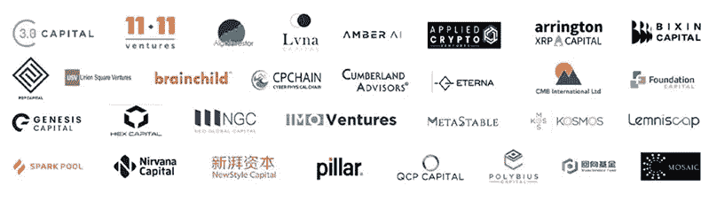
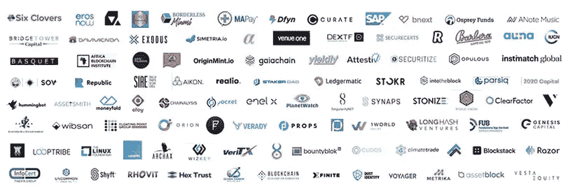

# 密码货币分析:Algorand

> 原文：<https://medium.com/coinmonks/crypto-analysis-algorand-290dcd59e5a8?source=collection_archive---------12----------------------->

是什么让 Algorand 在这个高度竞争的密码货币领域独一无二？

# 介绍

algorrand(ALGO)是股票代码为 ALGO 的区块链协议的第 1 层证明。阿尔戈兰德基金会由前麻省理工学院教授、图灵奖获得者希尔维奥·米卡利于 2017 年创建。在本文撰写之时，它的交易价格为 0.8 美元，市值为 50 亿美元。尽管与区块链的大型项目相比，这个市场上限很小，但仍足以成为一个相对成熟的项目。

Algorand 将自己标榜为一项现代区块链技术，该技术专注于增强功能、生态系统和扩展，同时实现了分散式金融的核心承诺。由于这纯粹是区块链利益的证明，阿尔戈兰德公司以其可持续性和低能源需求而自豪，并且拥有一个不断发展的生态系统。由于其创始人的优点和影响，该项目获得了投资者和风险资本家的大量资金支持，这预示着该项目的长寿。

Algorand Key Stakeholders([https://www.algorand.com/ecosystem](https://www.algorand.com/ecosystem))

# 网络功能

Algorand 对用户的主要价值主张之一是其交易速度。据报道，该网络每秒钟大约完成 1300 个事务，比以太网快得多，达到 14.44 个事务。此外，阿尔戈兰特没有任何汽油费，而是将交易费固定在大约 0.001 ALGO(0.00077 美元)。这两个因素结合在一起，使区块链格外轻便易用。此外，这为用户提供了更大的经济激励，促使他们从传统项目(如 Ethereum)迁移到 Algorand，ether eum 因网络速度极慢、交易耗时长且天然气费用高而臭名昭著，每笔交易的天然气费用在 10-30 美元之间。因此，Algorand 将为从这些老区块链移民过来的用户提供更高的财务价值。

此外，阿尔戈兰特提供了现代区块链所需的所有功能。它具有智能合同和 DAPP 能力。algorrand 还提供独特的 algorrand 虚拟机(AVM)技术。这使得开发人员可以用各种常用的语言如 Python 和 Javascript 来开发智能合同。这意味着开发人员可以在链上用他们熟悉的任何语言进行开发。这对生态系统的进一步发展是个好兆头。

# 生态系统发展

Algorand 是一个相对年轻的项目，其生态系统处于早期开发阶段。然而，它有健康数量的即将到来的项目正在开发中。目前有 500 多个组织参与该生态系统，根据区块链的速度和功能，这个数字可能会显著增加。最终，如果这些趋势和发展继续下去，Algorand 在未来将有很大的增长潜力和更高的效用。

此外，由于 Algorand 是由公认的行业专业人士创立的，并且有风险投资家的大量资金支持，这意味着有大量的资金和专业知识在发展生态系统。这预示着 Algorand 的进一步发展，因为这种支持表明，主要利益相关者有信心和承诺发展整个项目。

Algorand Ecosystem of Applications ([https://www.algorand.com/ecosystem](https://www.algorand.com/ecosystem))

# 价格机会

ALGO 目前的交易价格为 0.8 美元。这明显低于 2.94 美元的历史高点，因此硬币有很大的上涨潜力。它目前处于小市值硬币和中等市值硬币之间的位置，这意味着存在投资机会和整体潜在回报，而没有极低市值硬币所具有的极端风险。基于其利益相关者和项目的质量，市值可以合理地增长到相当于中等规模的项目，如 Cardano、Terra Luna 等。如果这种情况发生，Algorand 的价格将增长到目前价值的 5 倍，这真正显示了其潜在的回报。如果 Algorand 继续向用户提供其生态系统和效用，这种情况可能会发生。

# 成功的障碍

为了发挥 Algorand 的潜力，它需要在市场上获得更高的知名度。阿尔格兰德具备一个项目的所有要素。然而，它缺乏社会的认可。此外，创始人和开发者需要实现他们的承诺和潜力，这将使他们获得这种认可。如果他们继续保持他们的交易速度，并且生态系统提供所有需要的效用，Algorand 将能够显著增长。

# 结论

总的来说，Algorand 是一个独特的项目，它以坚实的基础和快速的网络为参与者提供了很多价值。它的生态系统有很大的潜力，有大量的资金支持，它的工作得到了行业领导者的支持，这激发了投资者和社区的信心。然而，该项目仍处于起步阶段，因此在开发中这样的项目存在风险。但与低市值硬币相比，这些风险相对较低，同时具有相当的潜在回报。最终，Algorand 确实需要执行其愿景并提供效用，这将使其获得所需的认可和成功。

> *加入 Coinmonks* [*电报频道*](https://t.me/coincodecap) *和* [*Youtube 频道*](https://www.youtube.com/c/coinmonks/videos) *了解加密交易和投资*

# 另外，阅读

*   [3 商业评论](/coinmonks/3commas-review-an-excellent-crypto-trading-bot-2020-1313a58bec92) | [Pionex 评论](https://coincodecap.com/pionex-review-exchange-with-crypto-trading-bot) | [Coinrule 评论](/coinmonks/coinrule-review-2021-a-beginner-friendly-crypto-trading-bot-daf0504848ba)
*   [莱杰 vs n rave](/coinmonks/ledger-vs-ngrave-zero-7e40f0c1d694)|[莱杰 nano s vs x](/coinmonks/ledger-nano-s-vs-x-battery-hardware-price-storage-59a6663fe3b0) | [币安评论](/coinmonks/binance-review-ee10d3bf3b6e)
*   [Bybit Exchange 审查](/coinmonks/bybit-exchange-review-dbd570019b71) | [Bityard 审查](https://coincodecap.com/bityard-reivew) | [Jet-Bot 审查](https://coincodecap.com/jet-bot-review)
*   [3 commas vs crypto hopper](/coinmonks/3commas-vs-pionex-vs-cryptohopper-best-crypto-bot-6a98d2baa203)|[赚取加密利息](/coinmonks/earn-crypto-interest-b10b810fdda3)
*   最好的比特币[硬件钱包](/coinmonks/hardware-wallets-dfa1211730c6) | [BitBox02 回顾](/coinmonks/bitbox02-review-your-swiss-bitcoin-hardware-wallet-c36c88fff29)