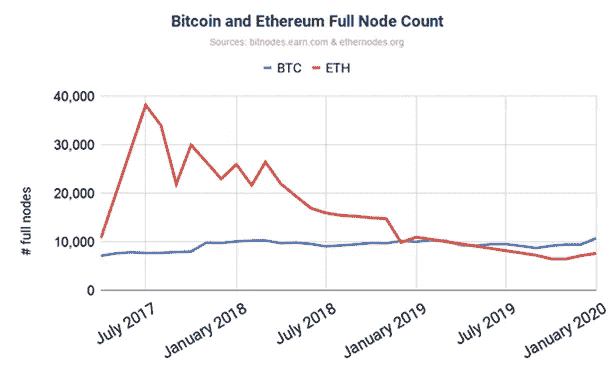

# 加密货币分析:MINA 协议

> 原文：<https://medium.com/coinmonks/crypto-analysis-mina-protocol-13993924102f?source=collection_archive---------8----------------------->

Mina 是什么，它是做什么的，它如何改变加密货币空间？

# 介绍

Mina 协议(MINA)是第 1 层区块链技术。它的主要目标是成为一个高度可扩展的、去中心化的区块链，用于去中心化的支付和信任。它的交易代码为 MINA，截至本文撰写之时，其交易价格为 2.1 美元，市值为 8.49 亿美元。这使得这个项目处于另类投资领域，具有潜在的巨大优势和相当大的投资风险。

Mina 最大的与众不同的因素是它的可扩展性和它如何承诺增加去中心化。Mina 的区块链有 22KB 的固定大小，不管它包含多少事务。相比之下，比特币目前的大小为 300GB，而且这个数字还在不断增加。比特币和以太坊等其他类似区块链面临的问题是，作为一个全节点验证器，计算成本越来越高。即使比特币使用率上升，完整节点的数量也保持不变——这带来了严重的可扩展性问题。然而，Mina 通过允许任何拥有智能手机同等计算能力的人都可以成为全节点验证器来解决这个问题。这提高了速度和可伸缩性，因为任何人都可以在任何地方验证该链，只要他们有互联网连接和电话。

Bitcoin and Ethereum Full Node Count over the years

# SNARKs 和 SNAPPs

Mina 通过一种称为 SNARK(一种简洁的非交互式知识论证)的技术实现了这种固定的区块链大小。本质上使用零知识证明来验证其区块链。这个新系统意味着 Mina 的验证过程与平常略有不同。首先，需要有人创建一个新的块，然后必须有人将这个链转换成一个 SNARK，然后可以用它来进行验证。使用 SNARKs 来验证其区块链也为其生态系统中的各种机会打开了大门。Mina 有几个提议的 SNARK 应用程序(SNAPPS)，在其智能合同中利用这项技术进行更广泛的使用。

这方面的一个例子是在网络上开发的名为 Teller 的 defi 贷款平台。它将使用零知识证明来验证用户的信用评分，没有任何直接的信息共享。系统将向贷方发送信用评分令人满意的验证，而贷方不必查看借款者的数据。这提供了极其独特的 DeFi 机会，增加了隐私，同时也允许资金自由流动。这也可以应用于其他领域，具有无限的应用。

当谈到自我主权身份和元宇宙的实现时，这些零知识证明的使用在未来将是极其重要的。这种加密技术对于在因特网上建立信任的实现是必不可少的。Mina 可能会通过其 SNAPPs 生态系统在这种自我主权身份的采用中发挥重要作用。SNAPPs 和 Mina 可以在身份和数据隐私方面发挥重要作用。

# 成功的障碍

然而，Mina 面临着一些风险和不利因素。在交易速度方面，米娜确实面临挑战。它相对较低，一些消息来源称它约为 22 TPS，比比特币快，但它还赶不上更现代的区块链，如 Solana 或 Ripple。如果 Mina 协议团队能够提高交易速度，这个项目将会有很大的潜力。

Mina 还使用极其新颖的技术作为其区块链的基础。他们将需要继续证明其有效性，并展示他们的新技术的有效性，以使整个项目取得成功。这将是该议定书今后面临的主要挑战。如果他们被证明是正确的，并且市场接受了他们的技术，投资者的回报将是巨大的。

# 结论

最终，Mina 处于开发的早期阶段。它提供了极其独特的价值主张，具有一致的区块链尺寸，并可进行全面验证。此外，它对 SNARKs 和 SNAPPs 的使用对整个生态系统和未来的采用具有很大的潜力。尤其是在自我主权身份和零知识证明成为一项重要技术的情况下。

这与这种规模的项目固有的一些风险形成对比，但如果 Mina 协议能够克服这一点。早期投资者的机会将是巨大的。

> 加入 Coinmonks [电报频道](https://t.me/coincodecap)和 [Youtube 频道](https://www.youtube.com/c/coinmonks/videos)了解加密交易和投资

# 另外，阅读

*   [加密复制交易平台](/coinmonks/top-10-crypto-copy-trading-platforms-for-beginners-d0c37c7d698c) | [如何在 WazirX 上购买比特币](/coinmonks/buy-bitcoin-on-wazirx-2d12b7989af1)
*   [CoinLoan 评论](https://coincodecap.com/coinloan-review)|[Crypto.com 评论](/coinmonks/crypto-com-review-f143dca1f74c)
*   [如何在加拿大购买加密货币？](https://coincodecap.com/how-to-buy-cryptocurrency-in-canada)
*   [无聊猿游艇俱乐部(BAYC)评论](https://coincodecap.com/bored-ape-yacht-club-bayc-review)
*   [5 款最佳加密交易终端](https://coincodecap.com/crypto-trading-terminals) | [最佳 DeFi 应用](https://coincodecap.com/best-defi-apps)
*   [最佳网上赌场](https://coincodecap.com/best-online-casinos) | [币安评论](/coinmonks/binance-review-ee10d3bf3b6e) | [BitMEX 评论](https://coincodecap.com/bitmex-review)