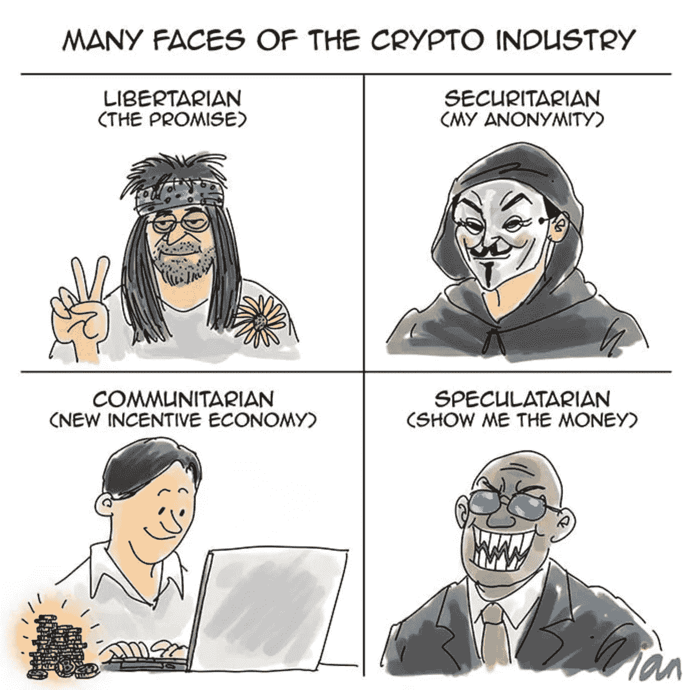
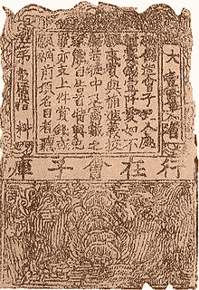
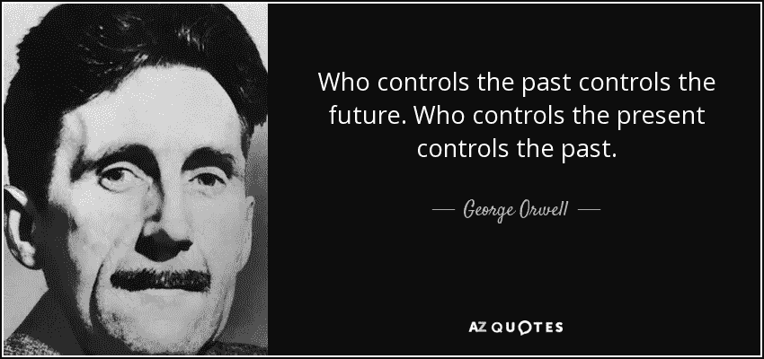
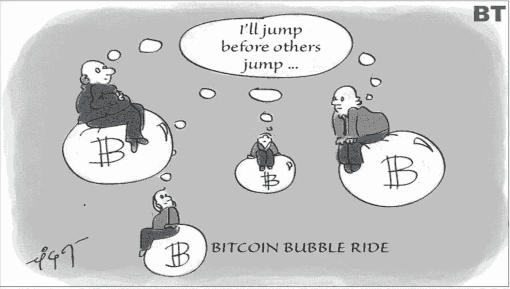
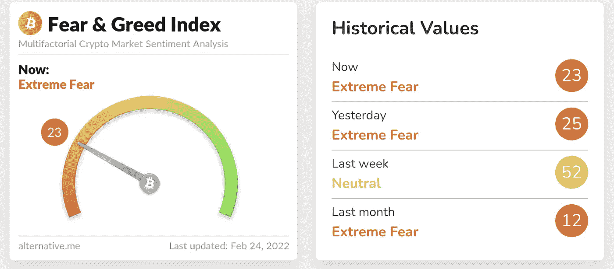
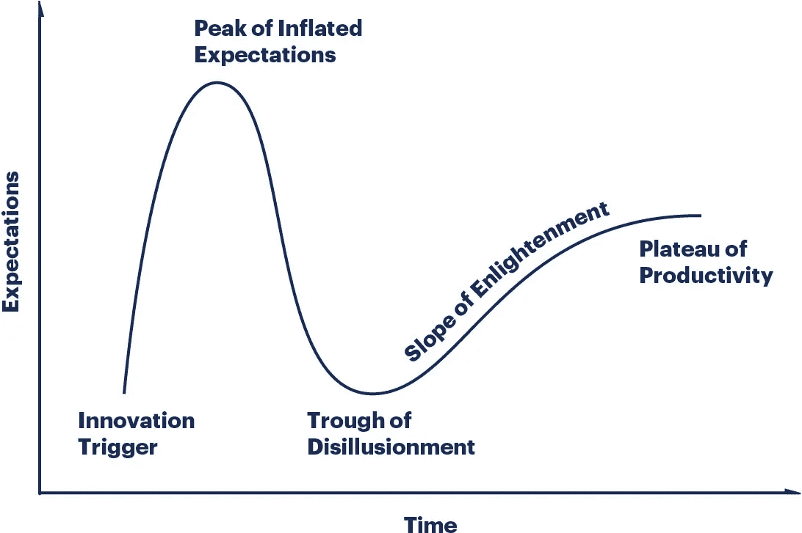
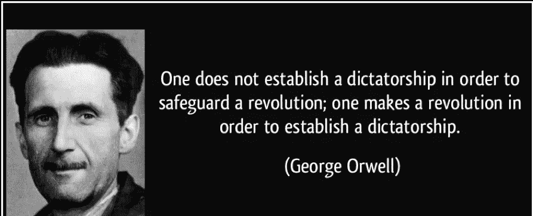
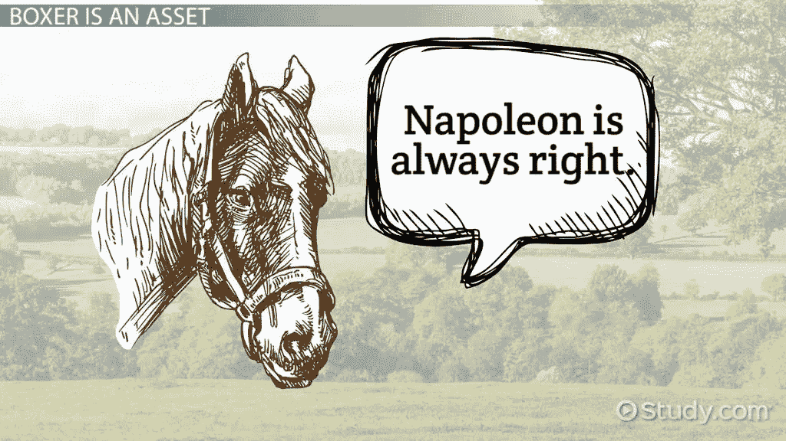
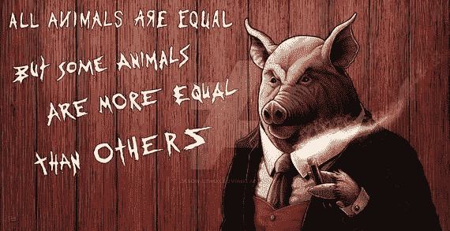
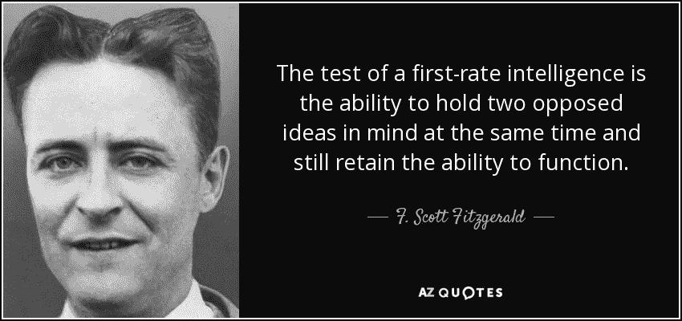

# Cryptos 和我们的社会

> 原文：<https://medium.com/coinmonks/crypto-and-our-society-c958467805a3?source=collection_archive---------14----------------------->

Credits (Google search)

密码和相关技术预示着经济/社会和政治结构的巨大变化。

中心思想是用不变的数字签名链结合“困难”数学问题解决(工作证明)来消除中介第三方。区块链有效地解决了数字资产常见的**双花问题。**

**区块链有很多高价值的用例，有可能给许多行业带来根本性的变化。**

**这篇文章是关于加密作为传统货币和资产的替代品。**

# **金钱**

**据说钱是继火之后人类最大的发明之一。它促进了大规模的合作和经济繁荣。纸币是在公元 1100 年左右由宋朝引入中国的。有趣的是，在蒙古统治结束后(大约公元 1300 年)，它从中国消失了**

****

**马可波罗在公元 1300 年左右访问了中国，把纸币的想法带到了欧洲。回来后，他进了监狱，并向监狱官员讲述了纸币的故事。当时的官员和知识分子很难接受纸币可以作为货币使用的事实。在马可波罗死后，我们花了将近 800 年的时间，才从黄金/白银和一系列银行本票转变为我们今天看到的单一统一美元。**

**今天的纸币是存在于使用者头脑中的一个共同的神话。它很快就会变成一张不值钱的纸。一个最好的例子就是印度政府如何在一个公告中让 1000/500 卢比变得一文不值，这导致了无尽的痛苦(甚至经济放缓)。**

**货币可以被定义为供将来使用的价值的临时储存。**

# **视力**

****

**加密传播者和许多社交媒体影响者声称，加密货币可以**

*   **取代传统货币。**
*   **银行等中央集权机构的终结。**
*   **股票交易结束(在加密世界中，股票可以作为初始硬币发行)**
*   **给个人更多的权力/隐私/匿名。**

**这些都是极其理想主义和善良的。问题是，这场革命会扭转反对传统机构和民族国家概念的潮流吗？**

# **加密作为传统货币的替代品**

## ****政府和密码。****

**政府和政策制定者反应迟缓，大多数人都不知道比特币及其发展。这项技术仍然掌握在少数精英程序员和大学生手中。**

> **“密码是自由主义者，人工智能是共产主义者”彼得·泰尔**

## **独裁政府**

**中国是一个共产主义独裁国家，禁止所有类型的加密货币。毫无疑问，集权国家讨厌比特币/密码。[他们都喜欢 AI/Ml，并有效地使用它来监控自己的公民，压制批评者..等等]**

## **民主**

**大多数民主政府允许密码发挥作用。决策者正在处理一件他们以前从未遇到过的事情。缺乏明确性，许多机构的说法相互矛盾。**

**政府完全控制着所有国家的货币。各国政府都采用货币政策来控制通货膨胀、贸易逆差等。这引发了基于通货膨胀的经济。一个基于通货膨胀的经济需要维持现代经济所遵循的信用体系。**

**如果一个农民以 10%的利率获得 1000 卢比的贷款，那么在年底，他可能需要偿还 1100 卢比。他可能不得不提高产品的价格以满足银行的利率，或者他可能不得不投资于技术以降低生产成本。**

**这给基于通货膨胀的经济模式带来了一个更大的问题。技术的进步会使东西变得更便宜，而他可能永远无法偿还他的贷款吗？。价格下降可能不会增加对这些商品的需求[在这种情况下，需求弹性很低]。未来每个国家都可能不得不研究基于通货紧缩的经济模式，并采取相应的制度。**

**从传统货币向更广泛、更少加密的纯数字货币的过渡将会非常混乱。**

# **加密资产**

**加密被认为是一种资产。大多数主要货币对 crypto 都在贬值，这使得对冲基金公司将资金从美元/欧元转移到 crypto 非常有吸引力。**

**流动性是任何资产的主要问题之一。Crypto 的流动性取决于将资产转换为美元或其他数字资产的速度/难易程度。集中式加密交换需要 KYC 过程，就像银行一样。crypto 承诺的匿名性在这个过程中丢失了。**

**许多资产为投资者提供持续的现金流。密码作为资产将不能为投资者带来任何收入。密码的升值使其具有吸引力，现金流可能不是一个重要因素。为了保持这种势头，加密一直在上升，否则人们会发现一些更有吸引力的东西，并将资金转移出加密世界。比特币的供应量上限为 2100 万枚。这可能有助于维持比特币的升值速度**

****

**Image Credits businesstoday**

**央行采取的货币政策会造成流动性紧缩。这最终会导致资金从加密世界流向传统货币。这可能会给投资者带来巨大损失。**

**极度恐惧统治着密码世界。总有遭受巨大损失的风险。**

****

**Credits([https://alternative.me/](https://alternative.me/))**

# ****黑天鹅事件等因素****

**可能会有一些不可预见的事件削弱民族国家的力量，给社会带来根本性的变化。以下事件可能会产生不可预测的变化**

*   ****恶性通货膨胀:**美元贬值和稳定**
*   ****地缘政治问题和重组:**后疫情世界可能会与我们今天的世界大不相同。可以有三组国家。首先是权威国家，如中国、俄罗斯、朝鲜等。许多与中国有贸易往来的国家可能会加入这个组织。第二组可能是自由主义国家，他们高度尊重个人权利，比如美国和欧盟。第三个可能是金砖国家(不包括俄罗斯和中国)。他们将在各自的组内进行更多的合作，crypto 可能会将他们聚集在自己的组内。**
*   ****代与代的冲突:**大多数制度是由婴儿潮一代制定的，由 X 世代和 Z 世代维持。千禧一代出生于一个与前几代人完全不同的世界。熵慢慢地摧毁了这些机构，既得利益者正在利用它为自己谋利。许多已经无法修复，可能需要以全新的面貌彻底重建。千禧一代可能会发现这些价值观和制度与他们的价值观不相容。
    ***每一代人都想象自己比上一代人更聪明，比下一代人更聪明*:乔治·奥威尔****
*   **互联网不是黑天鹅，但它是人类创造的最具破坏性的力量之一。大多数旧的意识形态(如宗教)在互联网上消亡了。20 世纪初，人们开始寻找利用电力的方法。发电机和电动机被发明出来供公众使用。当时的制造公司和他们的装配线都设计成使用蒸汽动力。电力的采用需要彻底的变革，并扰乱了当时的工业世界。类似地，互联网和围绕它的各种技术还没有被完全采用，采用它将需要法律和制度的彻底改革。DiFi，DAOs，令牌化的网络需要彻底的重组或者去除传统的制度和法律**
*   **民主的死亡:民主的维持缓慢而昂贵。民主对多个机构进行制衡。随着时间的推移，当选的高管开始获得更多的权力，这导致其他机构的价值观受到侵蚀。社交媒体的兴起提升了民粹主义领袖的地位。这些领导人大多信奉右翼民族主义和宗教极端主义。为了继续掌权，他们需要向大众提供更多的民族主义和宗教宣传。这将最终导致法西斯独裁和社会崩溃。民主的崩溃可能会导致一个自由主义的单一政府，其中包括拥有统一加密货币的共同价值观的国家**

****去中心化与人类社会****

**人类从狩猎采集社会进化到更大的部落、农业社会、小国和我们今天看到的大国。在大群体中合作是人类独有的(蚂蚁和蜜蜂确实在大量合作，但它们不会推翻蚁后并建立政治秩序)。尤瓦尔·赫拉利在他的三本书中都详细描述了人类的这些特征。**

**去中心化的方法与人类社会不相容吗？或者，我们需要一种新的方式，通过互联网在大群体中进行合作？。这是一个悬而未决的问题，围绕蛋白质和生命的形成有许多科学(和不那么科学)的理论，从简单的化合物到具有大社会的多细胞有组织的生命形式。**

**区块链的炒作周期和最终采用。**

****

**毫无疑问，区块链最终可以改变许多现存的过程。回顾历史，我们会发现很多这样的创新创造了不切实际的期望，导致了崩溃，然后最终采用了这项技术**

*   ****20 世纪 20 年代**内燃机的发明导致大量资金流向每一家以“汽车”命名的公司。泡沫破灭了，少数人幸存了下来。内燃机是一项极其有用的创新(如此之好，以至于近 100 年来设计没有太大变化)，但巨大的期望导致许多公司的创建，并产生了泡沫。**
*   ****20 世纪 60 年代**集成电路创新导致又一次泡沫。任何拥有“tronics”的公司最终都会获得大量投资，最终泡沫也会破裂。在英特尔公司破产后，德州仪器公司开创了一场数字和计算革命**
*   ****2000s** 。网络崩溃。崩溃导致以更好的方式采用互联网(谷歌，亚马逊，贝宝等)。**
*   ****2022 年及以后。许多有用的技术，如人工智能/人工智能、移动应用、加密，都被大肆宣传。许多移动应用已经存在了 8-10 年，它们还没有达到收支平衡。未来收入预期导致大量资金流入这些公司，并由此产生了多重资产泡沫。美联储极具争议的货币政策火上浇油。Next crash 将有助于为这些技术带来价值。****

# ****动物农场和密码革命****

**不讨论奥威尔和他的作品，关于社会变革的讨论是不完整的。**

****

**《动物庄园》是乔治·奥威尔根据 20 世纪 20 年代的俄国革命创作的讽刺小说。**

**《动物庄园》以一个农场里的动物计划推翻其残酷的主人，建立一个基于平等的规则为开端。**

**猪是最聪明的，他们经常谈论改变和革命的需要(当今世界的密码传播者😁) .**

> ***英国的野兽们，爱尔兰的野兽们，
> 每一片土地和气候的野兽们，
> 倾听我关于黄金未来时间的快乐消息
> 。这一天迟早会到来，***
> 
> ***暴君将被推翻，
> 英格兰富饶的土地***
> 
> **为了自由，所有人都必须努力工作。英格兰的野兽，爱尔兰的野兽，
> 世界各地的野兽，**
> 
> ***听好了，传播我的消息
> 金色未来的时光***

**革命是从一句简单的口号“**一切动物都是平等的**”开始的(*我想没有人没听过这句名言*)。他们在一夜革命中推翻了人类的主人，建立了自己的统治。**

**聪明的猪被指派在狗的帮助下管理复杂的农场。突然，他们意识到没有法律很难管理农场。猪开始制定法律，所有的动物都相信法律是为了保护他们和他们的权利而制定的。拿破仑是猪中的领袖，他建立了自己的独裁政权。**

****

**猪慢慢变得更强大，动物社会出现了很多阶层。新的社会秩序开始看起来像他们在革命前的秩序。猪取代了人，狗成了猪的奴隶。所有其他动物要么接受命运，要么被猪狗精英阶层压制。**

**猪修改了宪法，增加了新的一行。**

**所有的动物都是平等的，但有些动物比平等更重要**

**这个社会开始于一种非常自由的观念，平等以更加残酷和不平等而告终。这在大多数革命中反复出现(最近的例子是阿拉伯之春。法老被另一套法老取代)**

****

# **结论**

**很难预测加密技术的未来，我的许多观点是相互矛盾的。**

**一方面，需要有一个不可变的分类帐，它有可能改变各种旧的做法和机构，另一方面，围绕它的宣传和福音。**

**人脑有一种独特的能力，可以同时接受两种相反的观点。我认为我们需要更多的时间来忍受这种不确定性。**

****

> ****感谢阅读😊****

> **加入 Coinmonks [电报频道](https://t.me/coincodecap)和 [Youtube 频道](https://www.youtube.com/c/coinmonks/videos)了解加密交易和投资**

# **另外，阅读**

*   **[投资印度的最佳加密软件](https://coincodecap.com/best-crypto-to-invest-in-india-in-2021) | [WazirX P2P](https://coincodecap.com/wazirx-p2p)**
*   **[7 个最佳零费用加密交换平台](https://coincodecap.com/zero-fee-crypto-exchanges)**
*   **[最佳网上赌场](https://coincodecap.com/best-online-casinos) | [期货交易机器人](/coinmonks/futures-trading-bots-5a282ccee3f5)**
*   **[分散交易所](https://coincodecap.com/what-are-decentralized-exchanges) | [比特 FIP](https://coincodecap.com/bitbns-fip) | [宾邦评论](https://coincodecap.com/bingbon-review)**
*   **[用信用卡购买密码的 10 个最佳地点](https://coincodecap.com/buy-crypto-with-credit-card)**
*   **[加拿大最佳加密交易机器人](https://coincodecap.com/5-best-crypto-trading-bots-in-canada) | [Bybit vs 币安](https://coincodecap.com/bybit-binance-moonxbt)**
*   **[阿联酋 5 大最佳加密交易所](https://coincodecap.com/best-crypto-exchanges-in-uae) | [SimpleSwap 评论](https://coincodecap.com/simpleswap-review)**
*   **购买 Dogecoin 的 7 种最佳方式**
*   **[最佳期货交易信号](https://coincodecap.com/futures-trading-signals) | [流动性交易所评论](https://coincodecap.com/liquid-exchange-review)**