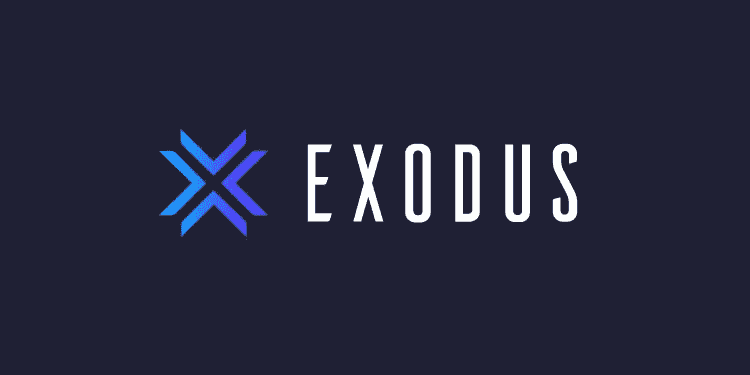

# 加密—初学者指南

> 原文：<https://medium.com/coinmonks/crypto-beginners-guide-e902b84fd4d4?source=collection_archive---------46----------------------->

(更新于 2020 年 3 月 4 日)

Photo by [Michael Förtsch](https://unsplash.com/@michael_f?utm_source=medium&utm_medium=referral) on [Unsplash](https://unsplash.com?utm_source=medium&utm_medium=referral)

# 什么是加密？

加密是将加密技术用于可用于买卖商品的货币的领域。如果你已经知道如何使用银行账户和交易证券，开始使用 crypto 是相当容易的。主要区别在于，你信任加密技术和分布式计算来跟踪你的余额和交易，而不是银行。这意味着银行提供的大部分服务，在加密中会有一些等价的服务。因此，如果你知道如何在网站上安装软件/应用程序和注册帐户，你应该很容易开始使用 crypto。在这篇文章中，我们将通过基本的开户，购买密码，转让密码和交易密码。因此，任何使用网上银行和交易的人都可以很容易地将这些技能转移到 crypto。

**警告:**确保你浏览的是官方网站，而不是恶搞网站。1.检查您使用的是 https。2.您会在 URL 旁边看到一个锁图标。3.网址中没有错别字。

# **获取密码**

获得密码最简单的方法是通过零售商，比如比特币基地。你可以很容易地在那个网站上买到一些密码，从而得到一种加密货币。

警告:确保你浏览的是比特币基地的官方网站，而不是恶搞网站。1.检查您使用的是 https。2.您会在 URL 旁边看到一个锁图标。

1.  **为比特币基地创建新账户**。点击这个链接，你可以注册一个新账户:[https://www.coinbase.com/signup](https://coinbase.com/join/sung_w6)。
2.  **向比特币基地转账。**一旦签约，需要转账到账户。您可以将任何美国银行账户与您的比特币基地账户关联。一旦链接，就可以转账了，就像另一家银行一样。
3.  **购买密码。**可以点击左侧导航栏，点击“贸易”二字。将出现一个弹出窗口。选择您想要购买的加密和支付方式(Google Pay 关联借记卡、银行账户转账或电汇)。
4.  **免费加密。为了推广一些鲜为人知的密码，比特币基地有一些学习和赚取模块(左边导航栏的“学习和赚取”)，如恒星和放大器硬币。你也可以尝试他们的钱包应用程序，并在 ETH 中赚取 4 美元。**

这就是了。您现在是 crypto 的骄傲拥有者！这就像你在网上买其他东西一样。在下一节中，我们将介绍钱包的高级概念以及如何将加密货币转移到您的钱包中。

# 传输密码

安全存储加密货币的一个常见标准是创建您自己的钱包，以便您可以保护自己免受交易所、您的计算机或移动设备的漏洞的影响。因此，大多数长期投资者或霍德勒将他们的加密货币“储存”在自己的软件钱包中。对于最有安全意识的霍德勒来说，他们使用硬件钱包。我们将介绍使用软件钱包的步骤，这对初学者来说更容易。

在这个例子中(2022 年 2 月)，我们将使用一个流行的多货币钱包， [Exodus](https://www.exodus.com/) 。它适用于所有桌面操作系统、iOS 和 Android。它支持 150 多种加密货币和代币。您还可以在某些国家/州购买和交换钱包中的权利，您也可以下注一些硬币。

1.  安装软钱包。你可以从相应的商店下载桌面软件(【https://www.exodus.com/download/】T2)或者直接安装到你的移动设备上。此安装的一部分将要求您输入密码来解锁 Exodus。有一个生成和恢复你的钱包的选项，以防你的电脑死机。这是一组“种子”字。确保将它存储在一个安全的地方(比如在纸上、云中的加密文件等。).如果您丢失了这个，您将无法访问您的 Exodus 钱包，也就是说，您将失去您的加密资产。
2.  **转移基础知识。**首先，你要明白，钱包只是一个由钱包应用为你管理的号码。为了发送和接收加密硬币，你需要有一个发送者地址和接收者地址，就像银行账号一样。其次，你必须确保你使用的是正确的区块链，例如比特币或以太坊。这相当于一个路由号。因此，您实际上是选择区块链(路由号码)，然后粘贴(或二维码读取)目的地钱包。
3.  **送硬币。**对于收款地址，选择您要转账的货币，然后有一个接收按钮。您可以通过点击复制图标来复制接收地址。然后去比特币基地，点击“发送/接收”。将出现一个弹出窗口。点击“发送”。在这里，您可以选择密码(“支付方式”)，粘贴您的钱包地址(“收件人”)并输入金额。
4.  **验证交易。你应该能在《出埃及记》中看到你钱包的交易。您还可以在任意数量的公共块浏览器中验证您的交易，例如 [coinmarketcap 的浏览器](https://blockchain.coinmarketcap.com/)。**

现在你已经成功地完成了你的第一次加密交易！你的加密货币从比特币基地到你的个人钱包

**其他流行钱包**

*   [Coinomi](https://www.coinomi.com/en/) —一款支持多达 1770 种加密资产的移动应用。这对于使用不同的加密资产进行研究很有帮助。
*   [Metamask](https://metamask.io/) —一个 web3 钱包，用于 web3 网站，如[沙盒](https://www.sandbox.game/en/)和[分散](https://decentraland.org/)用你的钱包登录，而不是电子邮件或第三方 SSO(谷歌/脸书)。

# 交易密码

加密货币交易与任何证券和商品交易一样。如果你交易过股票，这些术语和用户界面会看起来很熟悉，因为它们是一样的。有几条规则需要注意，一些细微的差别需要记住。在本节中，我们将讨论这些内容。

和任何交易一样，你需要注册一个平台。由于我们之前使用了比特币基地，我们可以通过比特币基地专业版，这是来自比特币基地的交易平台。它符合美国监管机构的要求，并遵守所有法规。对你来说，它向美国国税局报告你的密码销售，所以你需要在你的税收中报告这些。

1.  **高级贸易。**比特币基地的高级版拥有所有大家熟悉的证券交易工具，绘制价格，添加趋势、指标等。点击左侧导航“交易”，然后点击顶部“交易”的下拉菜单。您现在可以选择“高级交易”。
2.  **选择交易对。**您可以选择一个默认配对，也可以搜索自定义配对。
3.  **下单。**在页面的右侧，你会看到你可以在哪里购买或出售选中的鞋子。截至 2022 年 2 月，您可以下达限价单或市价单。
4.  **价格图表。**就像在任何在线交易平台上一样，你可以选择图表类型(线/蜡烛线)，选择区间(1 分钟到 1 天)，添加指标(如 EMA、MA、布林线)，以及区间(1 天到 5 年)。

现在你知道在比特币基地交易密码的步骤了！你可以通过把密码转移到你的 Exodus 或另一个钱包里，开始买入 dip，卖出 spikes 或 HODL。

# **结论**

一开始，进入 crypto 似乎因为许多不熟悉的术语而变得复杂。然而，只有少量的术语可以帮助您入门。此外，加密中的许多术语在银行和交易平台的工作方式中具有类似的作用(例如，路由号->网络、账号->钱包地址)。希望这对学习加密有用。请评论这是否有帮助，或者你有改进这份初学者指南的建议。

# **参考文献**

*   [2021 年 11 月 3 日高级交易公告](https://blog.coinbase.com/bringing-advanced-trading-tools-to-coinbase-1fd5a590113b)
*   https://coinmarketcap.com/
*   【https://www.coinbase.com/dashboard 