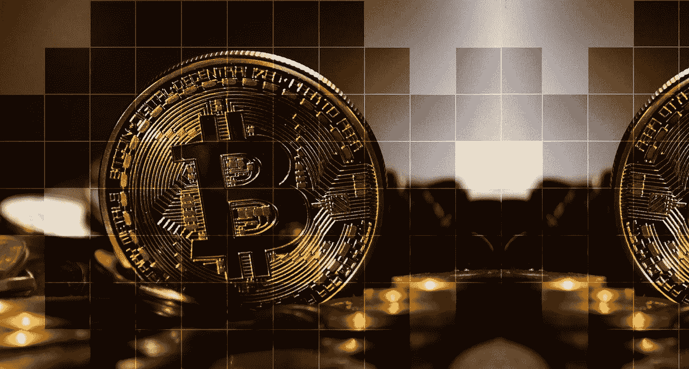

# 秘密血浴；比特币的末日到了吗？

> 原文：<https://medium.com/coinmonks/crypto-blood-bath-is-this-the-end-for-bitcoin-d40c5ebaa669?source=collection_archive---------15----------------------->

Source: Pixabay.com

自 5 月初稳定币崩溃以来，所有的目光都集中在比特币上。(BTC)。在本周大幅下跌之前，比特币(BTC)的价格一直徘徊在 28000 美元左右。然而，负面压力并不仅限于比特币。自 2022 年 1 月以来，以太坊(ETH)和卡尔达诺(ADA)等加密货币的价值已损失超过 50%。

2022 年，比特币已经延续了 2021 年 11 月开始的下跌趋势。一次发生在 5 月初，另一次发生在过去的 24 小时内，这两次大幅度的暴跌使美元的价值跌至不到 11 月份高点 40，000 美元的三分之一。

目前，比特币的价值与 2017 年 12 月创下 19，363.16 美元的历史新高时大致相同。谈论历史重演。

比特币和其他加密货币不得不对抗金融市场飙升的通胀。与此同时，股市也没有被排除在外。在最近为期两天的政策制定会议后，预计本周晚些时候将公布美联储关于加息的最新经济前景。

**参见:** [**你可能正在与加密上瘾做斗争的 10 个迹象。**](https://wire.insiderfinance.io/10-signs-you-might-be-struggling-with-crypto-addiction-d14206302936)

加密市场最终崩溃了吗？

Source: Pixabay.com

“加密冬天”指的是加密货币价格下跌并长时间保持不变的时期。在 2022 年初，分析师们表示，加密冬天的车轮已经开始运转。

双子座的联合创始人卡梅隆和泰勒·文克莱沃斯预测了“加密冬天”，他们说这个行业即将进入可能会持续的动荡的市场环境。该交易所最近裁员 10%。

比特币目前的价格是每枚 19081 美元。由于崩溃，比特币的市值在 24 小时内暴跌了约 400 亿美元。在撰写本文时，目前的市值为 8863.7 亿美元，比前一天的数字减少了 0.87%。

> **另见:** [**Terra 的 LUNA 2.0 Testnet 现已上线。**](https://wire.insiderfinance.io/terras-luna-2-0-testnet-is-now-live-ec63bb60eff6)

**什么因素导致了崩盘？**

Source: Pixabay.com

“恐惧和贪婪”指数已降至 6，这是可能的最低水平，表明投资者对市场情绪非常悲观。

加密货币价格暴跌，表明投资者承担风险的意愿下降，对高风险投资的厌恶明显。加密货币因其固有的不确定性和波动性，被视为最具波动性的投资资产之一。

“最近几个月，为对抗通胀而提高利率给加密市场带来了压力。统计数据显示，美国通胀达到 40 年来的最高水平，导致全球抛售，拖累了比特币、以太坊和大多数其他加密货币，导致投资者遭受重大损失。

许多分析师认为，这种看跌趋势预计将在未来几天持续下去。谈到加密市场，加密货币交易所的首席执行官 Shivam Thakral 表示，比特币和以太网最近两位数的损失是食品、天然气和能源成本上涨的直接结果。

> **另见:** [**以太坊 2.0 会让索拉纳不那么受欢迎吗？**](https://wire.insiderfinance.io/will-ethereum-2-0-make-solana-less-popular-7d9944f12a31)

“在消费者价格指数显示了自 1981 年以来最大的通货膨胀后，全球金融市场遭受了显著的下滑，”Thakral 补充说。“预计未来几周市场将保持波动，预计全球通胀将继续上升。我们预计经验丰富的投资者将利用目前加密定价的低迷，这允许投资者以 2021 年的价格购买加密，”他继续说。

此外，在区块链·泰拉的倒闭破坏了投资者对其他加密项目的信心后，有报道称，加密借贷平台 Celsius 已经停止了所有消费者的提款和账户之间的转账。据他说，当 TerraUSD 和 Luna 倒下并在加密世界引发多米诺骨牌效应时，加密冬天正式开始了。

根据许多投资者的预测，加密的冬天不会很快消失，因为比特币可能会在未来几天触及更低的低点。

> **另见:** [**买比特币前要看的 3 个指标。**](/@bitxmiblog/3-indicators-to-watch-before-buying-bitcoin-be994ffcb4cd)

**加密货币市场会反弹吗？**

大多数专家认为“更强的密码”将在当前的危机中幸存下来。另一方面，一些投资者欢迎经济低迷，认为这是一个增加市场长期投资的机会，可以折价购买比特币。同时希望全球经济和政治危机将很快结束。

> 加入 Coinmonks [电报频道](https://t.me/coincodecap)和 [Youtube 频道](https://www.youtube.com/c/coinmonks/videos)了解加密交易和投资

# 另外，阅读

*   最佳[区块链分析](https://bitquery.io/blog/best-blockchain-analysis-tools-and-software)工具| [赚比特币](/coinmonks/earn-bitcoin-6e8bd3c592d9)
*   [Cloudbet 赌场评论](https://coincodecap.com/cloudbet-casino-review) | [点火赌场评论](https://coincodecap.com/ignition-casino-review)
*   [加密套利](/coinmonks/crypto-arbitrage-guide-how-to-make-money-as-a-beginner-62bfe5c868f6)指南| [如何做空比特币](/coinmonks/how-to-short-bitcoin-568a2d0b4ae5)
*   [如何在加拿大购买加密货币？](https://coincodecap.com/how-to-buy-cryptocurrency-in-canada)
*   [无聊猿游艇俱乐部(BAYC)回顾](https://coincodecap.com/bored-ape-yacht-club-bayc-review) | [拜比特 vs 比特币基地](https://coincodecap.com/bybit-vs-coinbase)
*   [5 款最佳加密交易终端](https://coincodecap.com/crypto-trading-terminals) | [最佳 DeFi 应用](https://coincodecap.com/best-defi-apps)