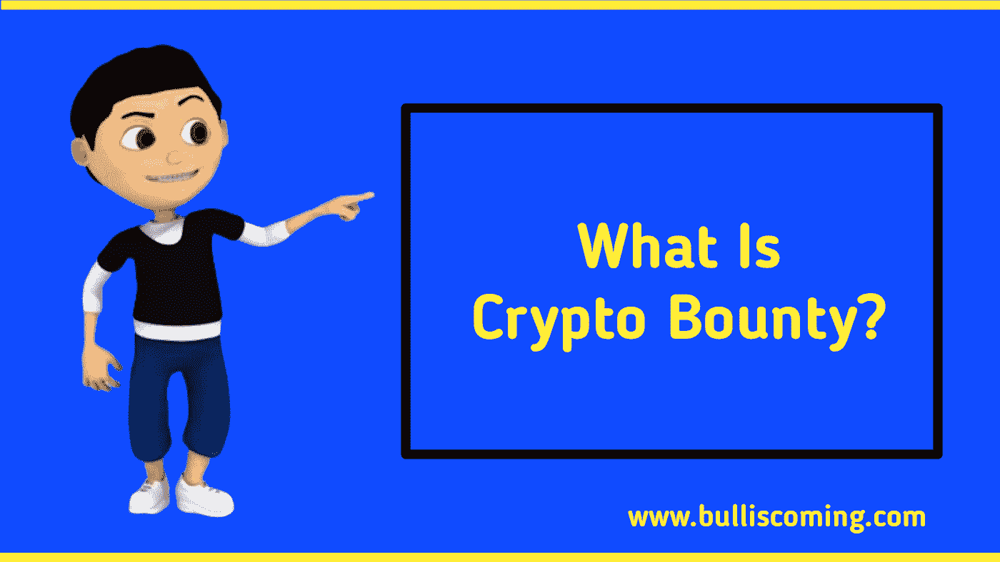
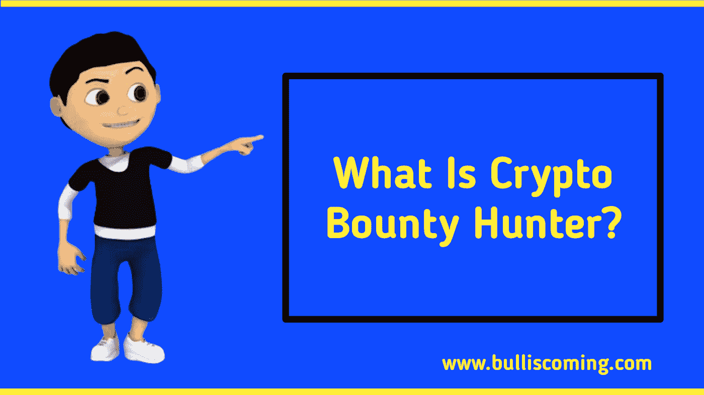
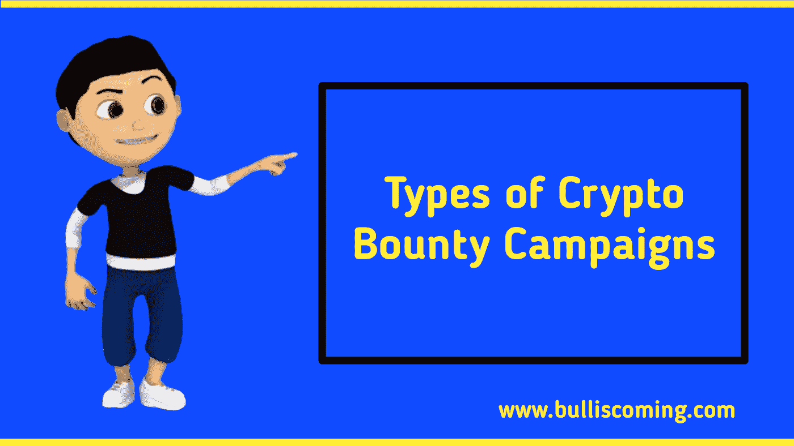
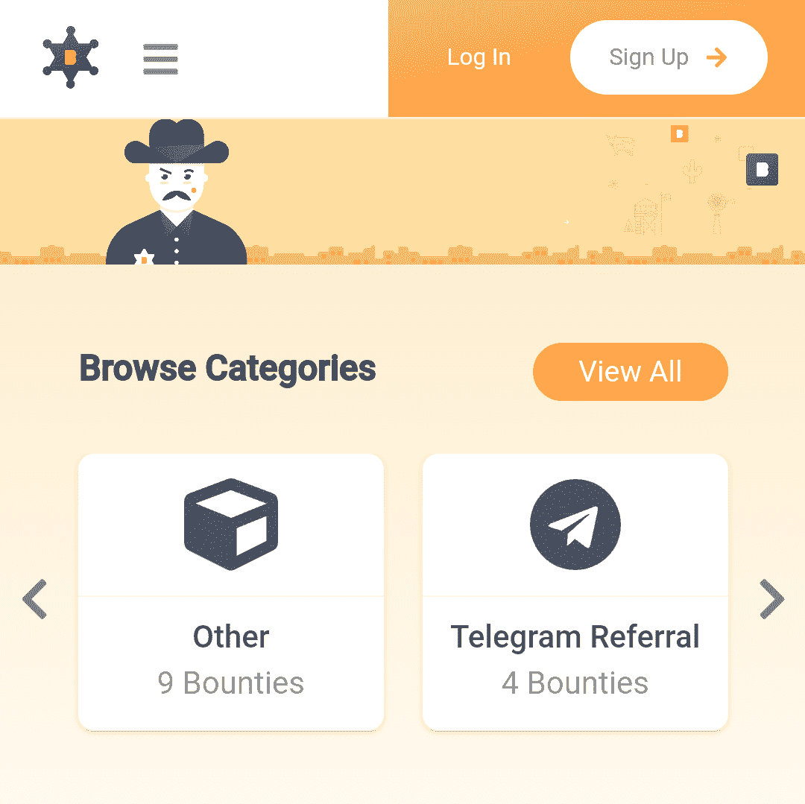
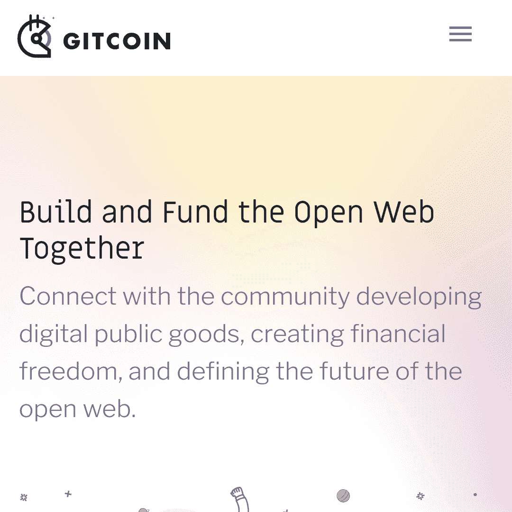
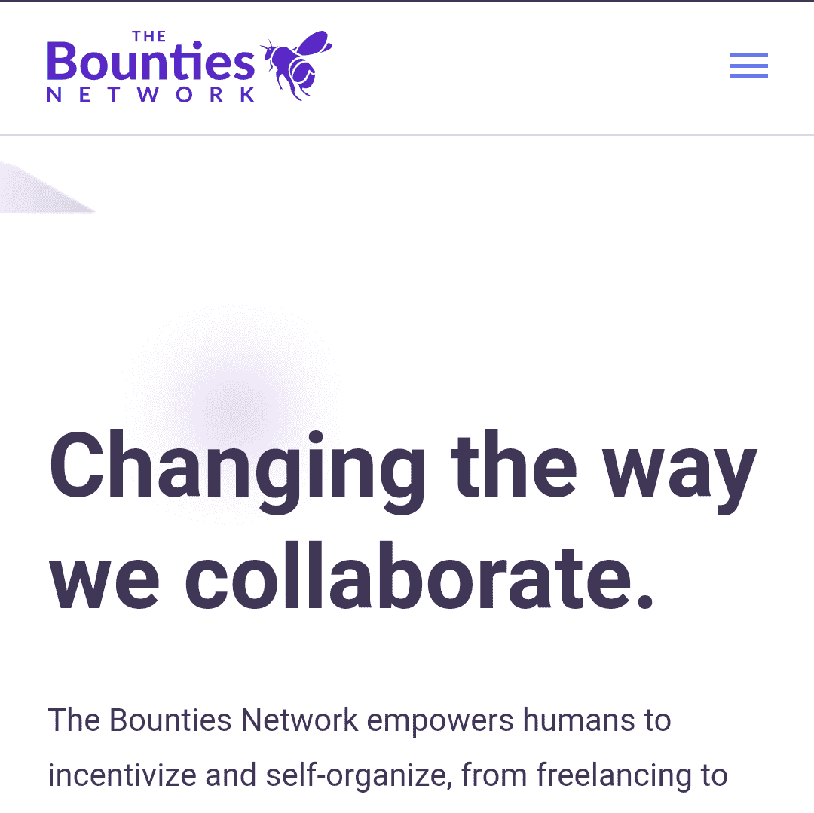
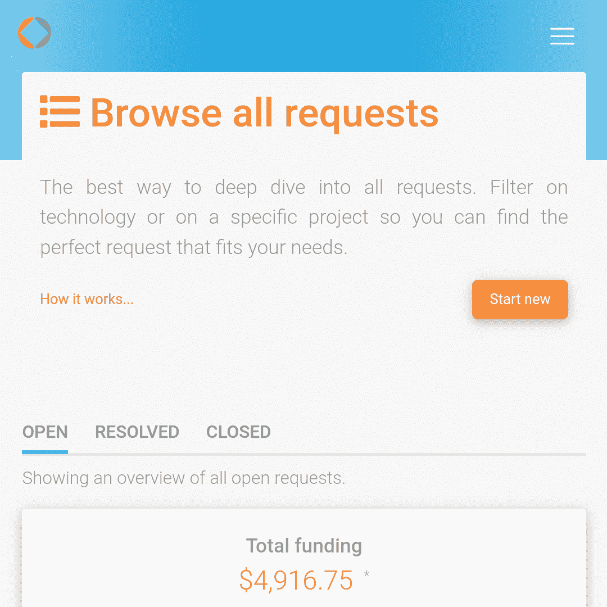
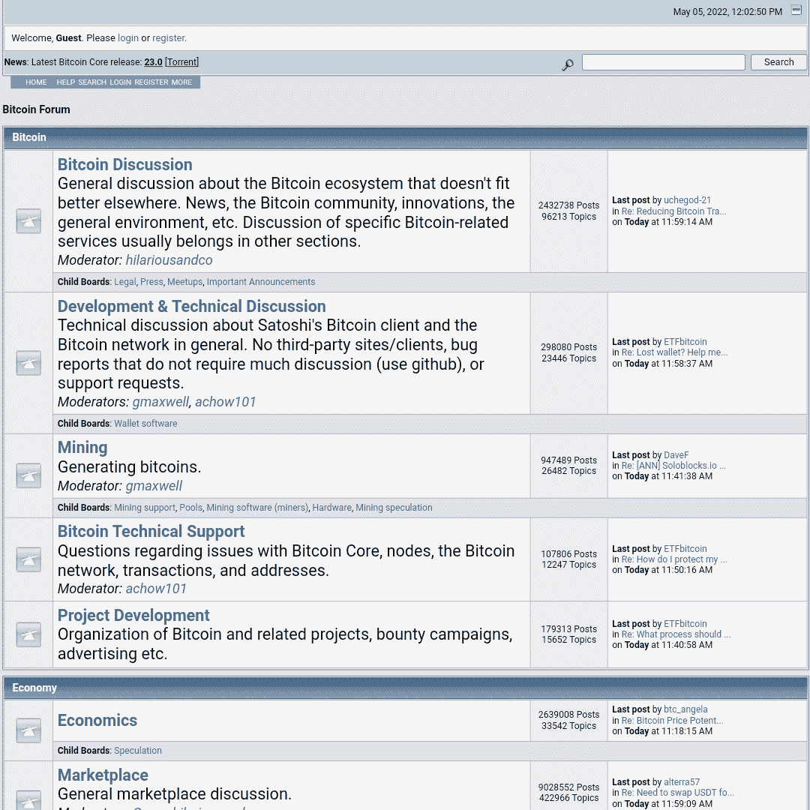

# 加密奖金——您需要了解的一切以及加密奖金的来源

> 原文：<https://medium.com/coinmonks/crypto-bounty-everything-you-need-to-know-and-sources-for-crypto-bounties-34e2aef79cae?source=collection_archive---------2----------------------->

密码赏金是另一种从密码货币中赚钱的方式。除了交易和投资密码硬币，由于一两件事，许多人仍然发现很难利用区块链和密码领域。如果你想学习这个过程并实施你所学到的东西，有很多方法可以利用这个区块链行业并从中赚到很多钱。

与此同时，密码赏金是从密码货币中赚钱的方法之一，它几乎没有风险。成为一名赏金猎人所需要的只是你的时间和赏金是如何运作的知识

没有那么多麻烦，我将揭示你如何利用这个秘密赏金猎人的机会，以及你如何定位自己成为一个秘密赏金猎人，根据你的严肃性和一致性来赚取大量的钱。

# 什么是密码赏金？

加密奖励是指用户因执行简单任务而获得的奖励，而不是在营销中帮助加密项目或编写详细描述项目的创造性内容，这在某种程度上类似于空投的方式；执行小任务并获得令牌奖励

密码奖励是一种重要的奖励机制，区块链项目利用这种机制从社区获得团队/网络所需的特定和必要任务的帮助。

许多加密项目经常通过提供奖金来推广他们的初始硬币产品(ICO)，以获得购买 ICO 的加密发烧友和投资者的认可。他们所需要做的就是发起一场运动，对他们的奖金感兴趣的用户将完成任务并获得一定数量的代币

在 2017 年和 2018 年的 ICO 热潮中，赏金奖励活动是一场巨大的盛宴，在一些可疑的活动之后，许多项目制造了假代币，并向用户提供赏金；密码发烧友对参与密码赏金变得非常全面

**亦称“读”；**[NFTs——超越数字艺术，NFT 的一些用例是什么？](https://bulliscoming.com/nfts-beyond-digital-art/)

# 什么是密码赏金猎人？

密码赏金猎人是追求各种奖励计划并试图同时从中获利的个人，这更像是通过多次空投从密码项目中获得大量令牌。

然而，那些喜欢帮助一个加密项目或参考推广一个项目来获取一些令牌的用户被称为加密赏金猎人，很多获得加密赏金的人都属于这一类。

# 秘密赏金活动的类型

正如我之前解释的什么是加密赏金和它的战役，我将揭示加密赏金战役的类型如下；**社交媒体活动**、**内容创作活动**和**翻译活动。**

# 社交媒体活动

这涉及到一个加密项目，需要用户推广他们的项目或公开谈论它，以获得社会的关注，大多数加密项目通常在 ICO 方面这样做。

该项目只需要看到参与，如喜欢，评论，转发和分享，他们通常需要像脸书，推特，YouTube，Instagram 等社交媒体

# 内容创建活动

在这方面，博客作者、作家和视频内容创建者是创建内容的目标，而加密项目鼓励用户创建独特的博客帖子、文章和视频内容。

大多数加密项目的目的是运行这种类型的运动；就是把 ICO 推向更大的社交媒体受众，创造认知。奖励取决于内容的长度、独特性、吸引力和创造性。

# 翻译活动

这种类型的活动类似于内容创作，但重点是翻译；这包括将内容从一种语言翻译成另一种语言，例如从英语翻译成西班牙语等

加密项目经常做这种活动，以达到不同国家的更多受众，它可以翻译他们的文档，白皮书，网站，甚至他们的博客帖子或内容。

# 加密赏金网站列表

如果想转赏金猎人；寻找奖金并参与，然后在项目批准后获得奖励，或者如果你想将奖金狩猎变成一个实际的来源，这将引导你通过网站加密项目张贴加密奖金。

# 奖金 0x

Bounty0x 是一个加密奖金平台，用户可以在这里找到简单的加密项目奖金任务进行竞争，每天都有大量奖金发布，供用户参与并获得奖励。

你可以使用 Bounty0x 快速找到与你的技能匹配的有趣的赏金任务，而不是在论坛、博客和社交媒体中挖掘。

例如，通过“文章”过滤会显示一个奖金列表，该列表将奖励您完成内容创作奖金的加密货币。

该网站允许奖励用户不同类型的硬币/令牌，如 Eth，Wave，Vet 和其他加密项目令牌，您需要在 Bounty0x 上创建您的个人资料后立即设置您的钱包地址。这个平台是免费使用的，它不向使用这个平台的用户收取任何费用。

# Gitcoin

Gitcoin 是一个为开源软件社区发布奖金的工具。

它有几十个面向软件的奖励，来自不同的区块链公司和项目，包括像 MetaMask 和 Decentraland 这样的知名公司。

它之所以成为一个有趣的平台，是因为它专注于软件相关的奖金。你只会找到开源开发任务，而不是一堆可能不适合你的技能组合的奖金。

唯一的缺点是奖励只能用 ETH 和 ERC-20 代币支付。对于一个主要专注于以太坊生态系统的平台来说，这是可以理解的，但对于想要赚取其他加密货币的个人来说，这可能有点不方便。

然而，Gitcoin 是一个很好的平台，对于那些想通过贡献开源来赚钱的开发者来说。

# 奖金网络

Bounties.network 赋予人类激励和自我组织的能力，从自由职业到基层社会行动，以及任何介于两者之间的事情。

无论是研究、内容翻译还是视频制作，Bounties.network 都可以让您创建项目、协作，并通过在任何领域的出色工作获得报酬。

不幸的是，Bounties.network 也只支持 ETH 和 ERC-20 代币奖励支付。

# 资金请求

[Fundrequest](https://fundrequest.io/) 是一个开源协作的分散市场。与 Gitcoin 类似，它面向开源开发者，支持将奖金与 GitHub 问题挂钩。

赏金猎人可以很容易地在请求上留下评论，以获得问题的答案或分享观察结果。

# Bitcointalk 奖金

[Bitcointalk](https://bitcointalk.org/) 是一个加密货币论坛，有一个“奖金”板块。

Bitcointalk 论坛的奖金委员会最初因缺乏像样的替代品而受到欢迎，但它很快被其他更方便用户的奖金狩猎平台所取代。

虽然界面不是最友好的，赏金猎人通常通过“谷歌表格”提交工作，并在“电子表格”上跟踪工作，但每周仍有数十份奖金发布在 Bitcointalk 上，值得一查。

**退房；** [NFT 盈利—如何入门|初学 NFT](https://bulliscoming.com/nft-profit-how-to-get-started-with-nft/)

# 结论

有了关于赏金和获得赏金的网站列表的信息，任何人现在都可以查看他或她喜欢利用的合适网站，并通过狩猎赏金赚钱，但本文中列出的任何公司/网站都与 bulliscoming 没有任何关系。

奖金几乎没有风险。有些项目可能很快就有回报，或者不需要很长时间就有回报，而有些项目没有回报，但最好在做了一些研究后再参与。

> *加入 Coinmonks* [*电报频道*](https://t.me/coincodecap) *和* [*Youtube 频道*](https://www.youtube.com/c/coinmonks/videos) *了解加密交易和投资*

# 另外，阅读

*   [Bookmap 评论](https://coincodecap.com/bookmap-review-2021-best-trading-software) | [美国 5 大最佳加密交易所](https://coincodecap.com/crypto-exchange-usa)
*   最佳加密[硬件钱包](/coinmonks/hardware-wallets-dfa1211730c6) | [Bitbns 评论](/coinmonks/bitbns-review-38256a07e161)
*   [新加坡十大最佳加密交易所](https://coincodecap.com/crypto-exchange-in-singapore) | [购买 AXS](https://coincodecap.com/buy-axs-token)
*   [红狗赌场评论](https://coincodecap.com/red-dog-casino-review) | [Swyftx 评论](https://coincodecap.com/swyftx-review) | [CoinGate 评论](https://coincodecap.com/coingate-review)
*   [投资印度的最佳密码](https://coincodecap.com/best-crypto-to-invest-in-india-in-2021)|[WazirX P2P](https://coincodecap.com/wazirx-p2p)|[Hi Dollar Review](https://coincodecap.com/hi-dollar-review)