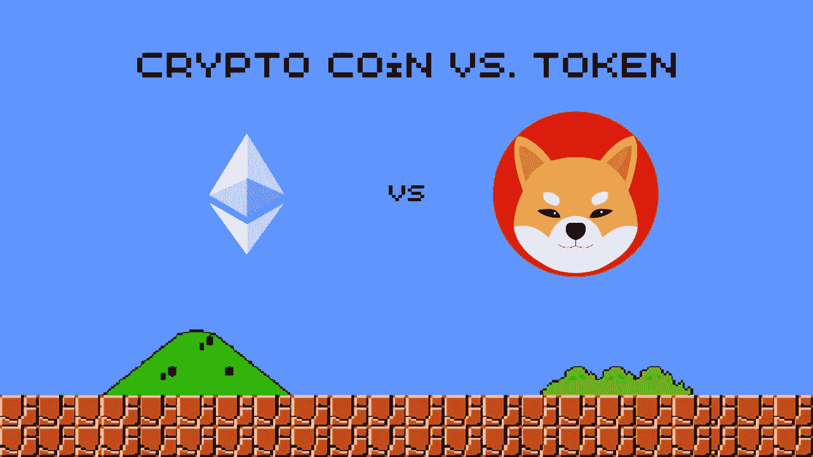

# 加密币 vs 代币 60 秒讲解:有什么区别？

> 原文：<https://medium.com/coinmonks/crypto-coin-vs-token-explained-in-60-seconds-whats-the-difference-414f2eb6d600?source=collection_archive---------55----------------------->

有些人可能会对加密硬币和代币之间的区别感到困惑。这是因为这两个术语经常互换使用。然而，两者之间有重要的区别。

加密硬币和代币的主要区别在于加密硬币使用自己的区块链，而加密代币不使用。

本质上，硬币是一种加密货币，在其自身的区块链网络中充当记账单位。例如，比特币在自己的区块链上运行，以太网也是如此，以太网在自己的以太坊区块链上运行。

硬币开发了自己的基础设施，并可以选择如何保护自己免受攻击，以及如何处理和记录交易。

一种常见的代币是 Tether，一种托管在以太坊和比特币区块链等平台上的稳定币。Tether 是美元的加密表示。它最常用于交易其他加密货币，而不必担心价格波动。因此，与硬币不同，代币可以选择不“绑定”于特定的区块链，这给了它们更多的自由，也让交易变得更简单。

 [## 你准备好迎接加密经济了吗？加密派

### 每次你打开新闻，阅读报纸，或者浏览你的推特，你很可能会看到一些故事…

www.thecryptopie.com](https://www.thecryptopie.com/)