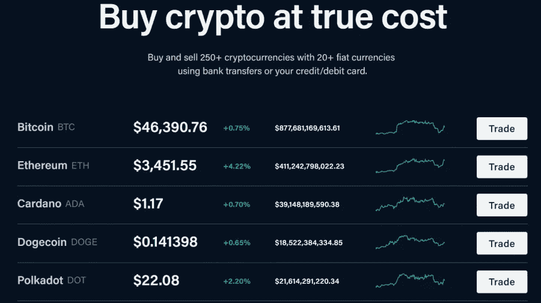
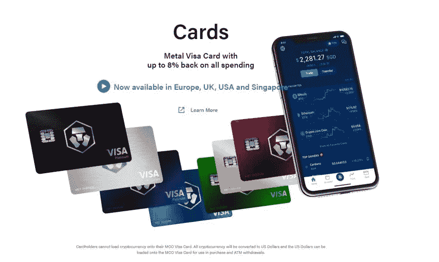
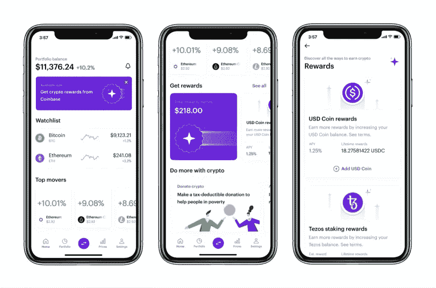
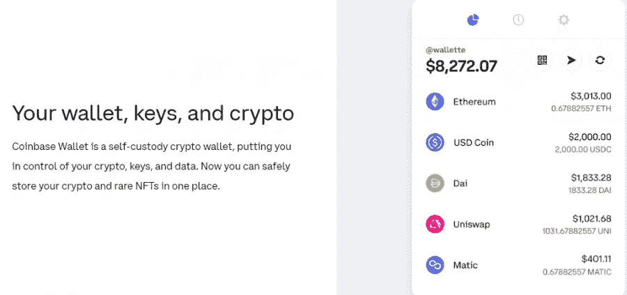
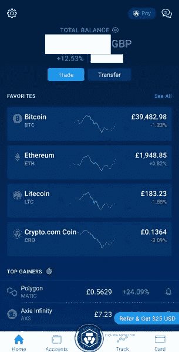
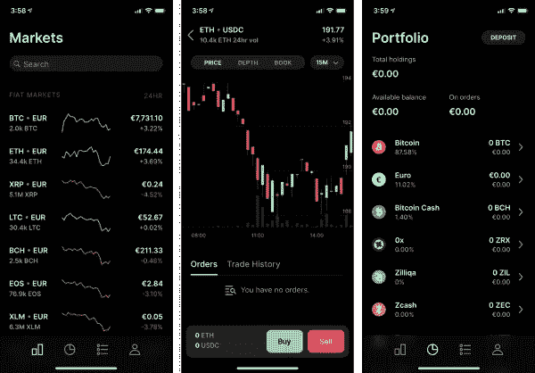
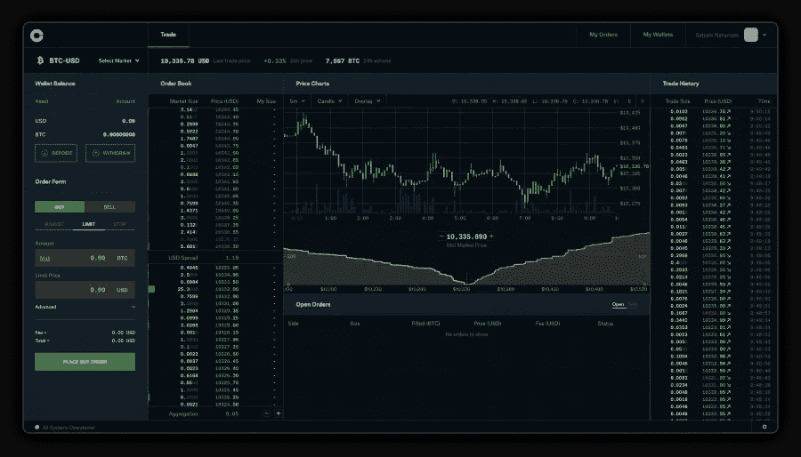

# Crypto.com 对比特币基地——哪个最好？

> 原文：<https://medium.com/coinmonks/crypto-com-vs-coinbase-which-is-best-d1ae1ce0c570?source=collection_archive---------55----------------------->

在 2022 年进入加密货币比以往任何时候都更容易和更容易，但选择最佳平台来购买加密——或交易你已经拥有的加密——似乎令人生畏。

在众多可供投资者和交易者使用的加密交易所中，有两家很受欢迎的交易所进入了我们的十大名单——Crypto.com 和比特币基地交易所。但是哪个平台更好呢？

Crypto.com 对比特币基地摘要

说到加密交换，Crypto.com 和比特币基地在新老用户中非常受欢迎。

这些平台是确保用户以安全高效的方式购买、交易和出售加密货币的绝佳方式。

*   比特币基地是一个平台，在事物的广阔的一面。然而，增加的资源和额外的安全性弥补了这些额外的损失。此外，比特币基地是许多密码领域新手的首选投资模式。它也被称为有一个更好的和易于使用的界面。
*   许多用户认为 Crypto.com 更具成本效益，因此他们采用它来购买、出售和交易加密货币。它有更多的加密货币选择，更低的费用和各种令人兴奋的独家功能。所以有人，可能是密码领域的老手，可以选择 Crypto.com 而不是比特币基地。

虽然这两种平台都有各自的优势，但在本指南的后面部分，我们将从各个方面进行比较，以了解各种平台的优劣。

[**> > >获得即时访问 CoinBase**](https://yazing.com/deals/coinbase/kingcormac)

为了进行比较，我们还将添加我们最推荐的 eToro，这是一个更受监管的加密平台，具有 copytrading 等独特工具。

**> > >获得即时访问 Crypto.com**

加密资产是一种高度不稳定的不受监管的投资产品。

特色 Crypto.com 比特币基地货币 100+ 250+手续费，每笔交易高达 0.50%的利差，信用卡购买 3.99%，比特币基地钱包或银行账户购买 1.49%，0.04%至 0.4%的做市商费，0.1%至 0.4%的收款人费；2.99%用于信用卡购买离线存储 98% 100%支持交易购买、销售、发送、接收、提取和交换购买、销售、发送、接收、提取和交换模拟帐户无模拟帐户无模拟帐户钱包规格 AES-256 加密钱包和多签名钱包提供私钥、本地加密、多因素身份验证(MFA)、生物特征

加密资产是一种高度不稳定的不受监管的投资产品。

什么是 Crypto.com？

[**> > >现在加入 Crypto.com**](https://yazing.com/deals/crypto/kingcormac)

自 2016 年 6 月推出以来，Crypto.com 已发展成为一个受欢迎和受信任的加密交换平台。Crypto.com 的母公司是 Forix DAX Asia Pte Ltd .该平台目前拥有 3000 名员工和 1000 多万用户。该公司由 Gary Or、Bobby Bao、Rafael Melo 和 Kris Marszalek 创建。

Crypto.com 允许其客户购买、出售和交易不同的加密货币。用户可以以比其他加密交易所相对更低的价格进行加密货币相关的购买、出售和交易活动。

其平台上有超过 250 种加密货币，为潜在投资者和用户购买加密货币和交易提供了广泛的选择。

此外，该交易所还提供加密货币信用卡、分散式交易所、独立的加密钱包，甚至 NFT 市场等功能。Crypto.com 的用户也可以选择将他们的密码存入 Crypto.com 钱包，获得 14.5%的利息。

平台上的费用较低，限制在 0.40%，并随着交易量的增加或持有大量 CRO 而减少。总而言之，对于那些希望更多地利用自己持有的加密货币而不仅仅是投资和持有的人来说，Crypto.com 是一个很好的平台。

Crypto.com 的特色

Crypto.com 有各种各样的特点，使它成为一个令人兴奋的投资平台。该交易所的最大特色之一是它自己的本土硬币——克罗诺斯(CRO)，原名 Crypto.com 硬币。用户可以直接从平台上购买硬币(在其他交易所也有售)。

让 CRO 独一无二且相当受欢迎的是，它可以以每天 10%左右的年利率为 Crypto.com 用户赢得一些丰厚的利息。

除此之外，如果您使用 CRO 支付交易费用，您将获得回扣，如果使用加密支付，还会获得额外的现金返还。

在 Crypto.com 移动应用上下注 CRO 还可以帮助你获得一张高级金属 Visa 卡，使用 CRO 支付的购物可以获得高达 8%的返现，网飞和 Spotify 订阅以及通过 Expedia、Airbnb 预订可以获得回扣。除此之外，还有专属机场休息室使用权，以及定期存款 2%的额外利息。

一旦你开始下注 CRO 硬币，就可以从应用程序中请求优质外观的 Crypto.com 金属 Visa 卡。这张卡也可以作为普通卡使用，除了您的加密货币之外，还可以加载法定货币。

此外，投资者可以投资 40 多种不同的加密货币，除了 CRO。

Crypto.com 的一些其他基于产品的功能包括

*   加密支付:该功能允许 Crypto.com 用户使用加密购买礼品卡，或者在某些零售商的收银台选择加密支付，以使用加密货币支付。
*   加密赚取:用户可以赚取高达 14.5%的 Crypto.com 加密存款。
*   加密信贷:非美国用户在 Crypto.com 可以使用这一功能。它允许用户借用高达 50%的加密抵押品作为加密贷款。

什么是比特币基地？

[**> > >现在加入币库**](https://yazing.com/deals/coinbase/kingcormac)

比特币基地是一个加密货币交易平台，加密投资者使用它来购买、出售和交易加密货币。它由 100 多种加密货币组成，投资者可以研究这些货币。比特币、以太坊、Dogecoin 等主要加密货币都在平台上列出。

它拥有超过 8900 万用户和 2890 亿美元的资产，是世界上最大的加密货币交易所之一。开始进入加密生态系统的用户会特别喜欢比特币基地，因为它的易用性和简单的用户平台。

该公司还为想要进一步探索高级功能的用户提供了比特币基地专业版的选项。任何人都可以使用专业版，只要建立一个比特币基地帐户，然后使用相同的凭证登录。它为用户提供了更多的交易类型、限价单和止损单，这些都是比特币基地平台所没有的。

比特币基地成立于 2012 年，是一个发送和接收比特币的场所。自那以来，该公司已成倍扩大了平台上可用的加密货币列表，并拥有约 2700 名员工。

它在 100 多个国家开展业务，每个季度的交易量为 3270 亿美元，是世界上第二大交易所，仅次于币安。

除了独立的加密货币钱包服务之外，该公司还运营着两个独立的交易平台。

比特币基地的特色

比特币基地是一个加密交换平台，由一系列用户友好和初学者友好的功能组成。

添加到比特币基地的独特功能列表中的一个功能是，只需观看一个短视频，就可以帮助您获得加密。用户在观看一个 3 分钟长的教育视频后，可以获得免费的加密。这些视频有双重好处，既能帮助你从现有的教育资源中学习，又能让你赚到 3-10 美元。

比特币基地还推出了适用于 iOS 和 Android 设备的手机钱包。据谷歌 Play 商店称，下载量超过 100 万次，评分为 4.3 星。

除了加密货币，比特币基地钱包还允许用户研究许多创新。它允许用户参与空投和 ico，收集和交易 NFT，浏览和探索分散式应用程序(dApps)，并向世界各地的任何人发送加密。

与 Crypto.com 类似，比特币基地也有一张 Visa 借记卡——比特币基地卡，于 2021 年秋季公开，允许用户每次购物获得高达 4%的奖励。此外，比特币基地也有自己的本土硬币，称为 USDC，或美元硬币。持有 USDC 能为客户赚取 0.15%的平均百分比收益。

可在 Crypto.com 和比特币基地交易的货币

近年来，比特币基地一直在逐步扩大该平台上可用的加密货币列表。然而，Crypto.com 在平台上提供了更广泛的加密货币和资产。

Crypto.com 支持 250 多种加密货币，而比特币基地有 100 多种。这两个平台都支持主要的法定货币，包括美元、欧元、英镑以及硬币。

值得注意的是，比特币基地没有列出 Vechain，Avalanche，XRP 或币安硬币。由于符合美国证券交易委员会的规定，比特币基地没有将 XRP 列为美国证券交易委员会与 Ripple 的诉讼的结果仍悬而未决。

可用的账户类型

许多密码交易所倾向于根据用户的用途和功能向他们提供不同类型的账户。通过这种方式，Crypto.com 和比特币基地这两个平台提供了对其平台上不同类型账户的访问。

在 Crypto.com 的情况下，有一个主要帐户，可供平台上的每个用户使用，具有一整套不同的功能和特性，包括技术图表、DeFi access 等。此外，可以在 Crypto.com 平台上访问一系列高级功能。

其中包括购买、销售和交易 NFT(不可替代的令牌)等功能的服务，访问 DeFi 钱包，允许交换和种植 DeFi 令牌，同时保持对自己私钥的所有权，以及“为企业支付”功能，使企业能够接受加密作为一种支付形式。

最近，Crypto.com 在该交易所平台上发布了保证金和现货交易的子账户。子账户允许用户在其主账户内创建多个账户，以独立的余额、保证金和头寸促进交易。

然后，用户可以通过隔离资金和探索不同的密码来多样化他们的交易策略。这一功能也对机构和个人投资者开放。

在比特币基地，任何加密投资者需要的大部分基本特征都存在。随着时间的推移，该平台增加了如下功能:

*   一些赌注凭证硬币的自动赌注服务
*   和戴的生息钱包
*   密码借阅服务
*   价格提醒
*   关于加密的教育材料

随着许多专家和用户声称该平台的功能不够先进，比特币基地发布了比特币基地专业版。它允许比特币基地用户访问专业版，给他们更多的交易类型，限制和止损单。比特币基地专业版还允许用户以较低的价格使用主要功能。

Crypto.com 费用 vs 比特币基地费用

与任何其他加密货币交易所或平台一样，使用 Crypto.com 或比特币基地时需要付费。

然而，可以立即注意到的事实是，Crypto.com 比比特币基地更具成本效益。

比特币基地的费用结构稍微复杂一些，包括固定费用和可变费用。

固定费用比特币基地 10 美元或以下 0.99 美元 10 至 25 美元 1.49 美元 25 至 50 美元 1.99 美元 50 至 250 美元 2.99 美元

加密资产是一种高度不稳定的不受监管的投资产品。

这两个平台都遵循做市商收取费用的结构，一旦交易完成就要支付费用。这些费用也随着交易量的变化而变化。

在 Crypto.com，做市商支付 0.04%到 0.4%之间，而做市商支付 0.1%到 0.4%之间。Crypto.com 不涉及任何额外的借记卡或信用卡购买费用。

另一方面，比特币基地对交易指令收费，而不是对完整交易收费。做市商支付 0.04%-0.5%之间，做市者支付 0%-0.5%之间。

比特币基地对使用借记卡或信用卡购物收取 3.99%的额外费用。为了让用户获得最少的比特币基地费用，他们需要在一个月内交易超过 5 亿美元。

任何交易金额超过 5 亿美元的用户将被收取 0.05%的收取费用，不涉及做市商费用。

费用类型 Crypto.com 比特币基地银行账户免费 1.49%借记卡/信用卡 2.99% 3.99%钱包转换费免费 1.49%电汇免费，最低 1000 美元 10 美元存款，25 美元取款用户体验:Crypto.com vs 比特币基地

Crypto.com 和比特币基地一直致力于确保他们的客户体验是一流的。

比特币基地在设计其应用程序的界面时采取了一种简单的方法，这使得它非常容易使用和浏览网站，以确定下一步该做什么。

Crypto.com 的网站可能会在一开始就有点让人不知所措，因为有些地方涉及了太多的元素。因此，专家们通常把比特币基地作为新手应该探索和习惯的第一个交易所。

当考虑用户体验时，最重要的因素之一是可访问性。比特币基地可在 100 多个国家使用，包括美国、加拿大和 39 个欧洲国家。

但是，这里需要注意的是，夏威夷(美国)的居民可能无法使用它，而纽约的居民可能会面临某些限制。

另一方面，虽然纽约州居民不能使用 Crypto.com，但夏威夷州居民可以。但是，总的来说。美国居民不能获得 27 枚硬币。

这两个平台都提供基于网络或应用程序的交易功能。

移动应用:Crypto.com vs 比特币基地

说到移动应用，这两个平台都有一个强大的移动应用。

比特币基地移动应用程序在 Android 和 iOS 上都可用。总的来说，该应用程序有一个易于使用的界面，并提倡最少点击的方法，每一个购买，出售或交易行为都可以在几下点击。

Crypto.com 的移动应用也可以在 Android 和 iOS 上使用。随着更多技术功能的到位，Crypto.com 移动应用程序对于经常通过移动应用程序进行股票交易的人来说可能非常熟悉。

Crypto.com 和比特币基地有模拟账户吗？

模拟账户是一种由交易平台提供的账户，允许潜在客户在将他们真正的血汗钱投入交易平台之前对其进行实验。

密码交易所使用模拟账户作为推广工具，让更多的人参与进来，并帮助他们的潜在用户体验该平台。

Crypto.com 和比特币基地这两个平台都没有向他们的用户提供模拟账户选项。

然而，如果你想在深入加密货币世界之前试水，并对在探索之前开始投资持怀疑态度，模拟账户可能会非常有帮助。

eToro 是为数不多的为用户提供在平台上开设模拟账户功能的平台之一。eToro 上的模拟交易账户有 10 万美元的虚拟货币，用户可以用它进行交易。此外，投资者可以随时重置模拟账户，让他们重新开始。

此外，一个模拟账户允许用户访问 eToro 的所有功能，包括复制交易，技术图表等。

加密资产是一种高度不稳定的不受监管的投资产品。

Crypto.com vs 比特币基地—最低存款和付款方式

在 Crypto.com 和比特币基地的比较中，我们发现两个平台都在不同领域接受广泛的支付方式。

先说比特币基地，该平台要求最低存款 2 美元，才能在平台上开始交易、购买或出售。另一方面，Crypto.com 有 1 美元的最低存款额。

Crypto.com 和比特币基地都向用户提供多种支付平台。

支付平台 Crypto.com 比特币基地银行转账是是 ACH 是 Apple Pay 是否借记卡/信用卡是 PayPal 是是 SWIFT 是加密货币是是

加密资产是一种高度不稳定的不受监管的投资产品。

客户服务

说到客户服务，Crypto.com 往往占上风。客户服务是用户向比特币基地反映的最重要的问题之一。客户的申诉补救系统是如此的复杂，以至于你几乎不可能接触到真正的人。

比特币基地官方客户服务选项包括比特币基地帮助页面、电子邮件支持的机票、自动电话系统和聊天机器人。

另一方面，Crypto.com 官方有一个帮助页面、电子邮件和实时聊天。与比特币基地和其他各种加密交换平台类似，Crypto.com 客户没有电话支持。

Crypto.com vs 比特币基地法规与安全

随着许多安全漏洞和黑客攻击的发生，加密交易所有责任建立强大的安全系统来保护用户的投资。Crypto.com 和比特币基地都部署了安全功能和措施。

让我们从安全的角度来看这两个平台。

安全功能 Crypto.com 比特币基地冷库共享 98% 100%多重身份认证是是附加措施对员工进行背景调查。没有敏感数据存储在线合规性和安全认证到位。外部公司进行审计最高 250，000 美元的保险最高 250，000 美元

加密资产是一种高度不稳定的不受监管的投资产品。

Crypto.com 安全

Crypto.com 是一个非常安全的平台，他们将用户的加密货币 100%离线存储在冷库中，这是通过使用 Ledger Vault 的机构级托管实现的。

该交易所甚至在 2020 年获得了著名的 ISO/IEC 27701:2019 认证。这不仅使 Crypto.com 成为进行加密货币交易的安全实体，也是世界上第一个这样做的加密交易所。

Crypto.com 仍然继续推行其安全政策、严格的政策、程序和控制。这使得 Crypto.com 成为许多爱好者和资深投资者的首选加密货币交易所。

除了安全功能和策略之外，在违规或黑客攻击可能导致客户损失的情况下，为其加密资产投保也是一个额外的好处。

比特币基地安全

比特币基地使用多层次系统，如双因素认证、生物识别登录和数据加密，以及 USB 驱动器和纸质备份。这些驱动器和备份在地理上分布在世界各地的保险箱和保险库中。

为了维护整体的安全环境，交易所还强制要求通过犯罪背景调查，他们的硬盘都是加密的。

比特币基地将其 98%的数字资产离线存储在冷库中，并有一份犯罪保险，以在发生网络安全违规或任何其他损失时保护数字资产。

Crypto.com 对比特币基地——判决

从一长串可用选项中选择最佳加密交换可能会令人困惑。

在评估了所有的特点，Crypto.com 和比特币基地的优缺点后，最终的结论是你作为投资者或交易者的需要。如果你进行保证金交易，选择将是 Crypto.com。

如果你是新投资者，简单的界面比什么都重要。同样，对于投资加密货币已经有一段时间的人来说，加密货币的数量是必不可少的，以使他们的投资组合多样化。Crypto.com 列出了更多的硬币，而比特币基地是最容易使用的。

虽然这两个加密交易所近年来广受欢迎，但像 eToro 这样的交易所已经活跃了更长时间，从 2007 年开始，拥有额外的独特工具，如复制交易和智能投资组合，无论你投资什么市场(股票和大宗商品也上市)，都有一种方法可以复制专业投资者的交易。

加密资产是一种高度不稳定的不受监管的投资产品。

常见问题

Crypto.com 和比特币基地哪个好？

这两个平台都有自己的一套好处——比特币基地的易于使用和理解，而 Crypto.com 有更多先进的功能，如杠杆交易的永续期货对。我们也给予 Crypto.com 更高的评级，因为它列出了更多的密码。当你选择第一个加密货币交易所时，这是要考虑的因素——你的专业水平，你需要什么功能，你想买什么硬币。

谁应该使用 Crypto.com？

那些期待拥有广泛功能和更多样化硬币的加密交易平台的投资者可以去 Crypto.com。此外，如果你期待更具成本效益的加密交换平台，那么 Crypto.com 是你的首选平台。

谁应该使用比特币基地？

比特币基地是一个更易于使用的平台，让初学者记住。如果你最近开始投资加密货币，那么比特币基地提供了一个非常直观和容易理解的平台。虽然总体成本有点偏高，但教育资源和其他功能弥补了这一点。

Crypto.com 和比特币基地哪个更适合日内交易？

Crypto.com 似乎是日内交易的一个更好的选择，因为它的做市商定价策略，更低的费用等等。你也可以在 eToro 上模仿专业的日内交易者。

Crypto.com 和比特币基地之间哪个加密交换更便宜？

Crypto.com 比比特币基地便宜得多。如果你是一个期待在有限的语料库中开始探索加密货币的人，你可能会愿意尝试 Crypto.com 而不是比特币基地。

这两个平台有没有一个具备复制交易能力？

这两个加密交易所都没有在平台上提供拷贝交易功能。然而，如果你期待探索和实现拷贝交易，eToro 可能是你的首选平台。

两个加密交易所中哪一个有更多的可用货币？

Crypto.com 以平台上可用的货币数量取胜。它由平台上可用的 250 多项资产组成，而比特币基地由大约 100 项资产组成。

[**> > >报名去 Crypto.com**](https://yazing.com/deals/crypto/kingcormac)

[**> > >报名到 CoinBase**](https://yazing.com/deals/coinbase/kingcormac)

> 加入 Coinmonks [电报频道](https://t.me/coincodecap)和 [Youtube 频道](https://www.youtube.com/c/coinmonks/videos)了解加密交易和投资

# 另外，阅读

*   [Bookmap 点评](https://coincodecap.com/bookmap-review-2021-best-trading-software) | [美国 5 大最佳加密交易所](https://coincodecap.com/crypto-exchange-usa)
*   最佳加密[硬件钱包](/coinmonks/hardware-wallets-dfa1211730c6) | [Bitbns 评论](/coinmonks/bitbns-review-38256a07e161)
*   [新加坡十大最佳加密交易所](https://coincodecap.com/crypto-exchange-in-singapore) | [购买 AXS](https://coincodecap.com/buy-axs-token)
*   [红狗赌场评论](https://coincodecap.com/red-dog-casino-review) | [Swyftx 评论](https://coincodecap.com/swyftx-review) | [CoinGate 评论](https://coincodecap.com/coingate-review)
*   [投资印度的最佳密码](https://coincodecap.com/best-crypto-to-invest-in-india-in-2021)|[WazirX P2P](https://coincodecap.com/wazirx-p2p)|[Hi Dollar Review](https://coincodecap.com/hi-dollar-review)