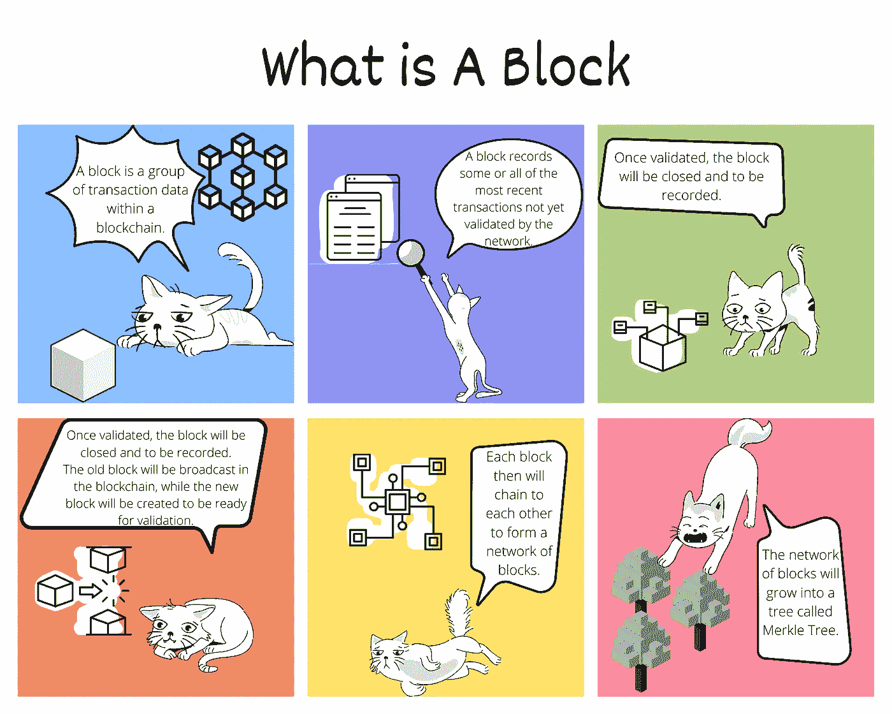

# 加密漫画-什么是块

> 原文：<https://medium.com/coinmonks/crypto-comics-what-is-a-block-68b427817cdd?source=collection_archive---------45----------------------->

Photo by [Xavi Cabrera](https://unsplash.com/@xavi_cabrera?utm_source=unsplash&utm_medium=referral&utm_content=creditCopyText) on [Unsplash](https://unsplash.com/s/photos/block?utm_source=unsplash&utm_medium=referral&utm_content=creditCopyText)

我试图解释连环漫画中的街区是什么。

**TL；博士**

我解释了什么是区块，以及区块与区块链和 Merkle 树的关系。

