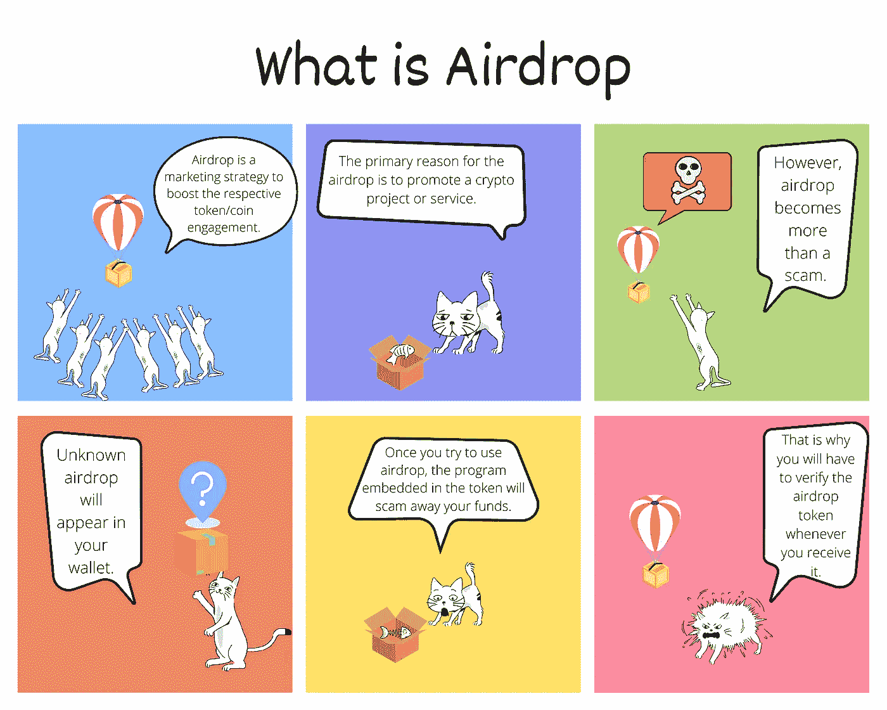

# 加密漫画——什么是空投

> 原文：<https://medium.com/coinmonks/crypto-comics-what-is-airdrop-2a5c2c5b7207?source=collection_archive---------70----------------------->

Photo by [Philip Myrtorp](https://unsplash.com/@philipmyr?utm_source=unsplash&utm_medium=referral&utm_content=creditCopyText) on [Unsplash](https://unsplash.com/s/photos/airplane?utm_source=unsplash&utm_medium=referral&utm_content=creditCopyText)

我试图解释连环画中的空投是什么。

**TL；博士**

我解释了什么是 Airdrop，以及如何在特定情况下使用它。

