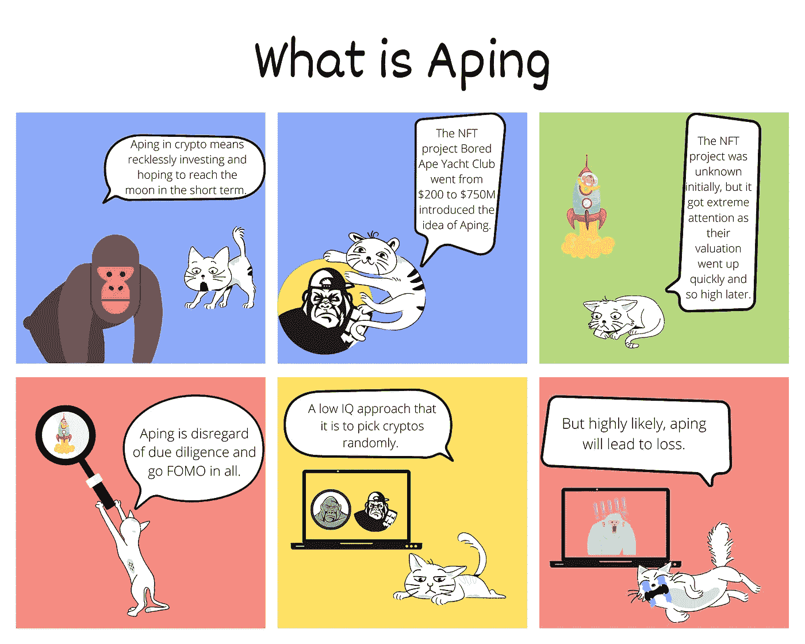

# 加密漫画——什么是模仿

> 原文：<https://medium.com/coinmonks/crypto-comics-what-is-aping-be8d4c3b67c5?source=collection_archive---------39----------------------->

Photo by [Rishi Ragunathan](https://unsplash.com/@rishiragunathan?utm_source=unsplash&utm_medium=referral&utm_content=creditCopyText) on [Unsplash](https://unsplash.com/s/photos/ape?utm_source=unsplash&utm_medium=referral&utm_content=creditCopyText)

我试着解释漫画里的阿平是什么。

**TL；博士**

我解释了什么是阿平。

**一些外卖**