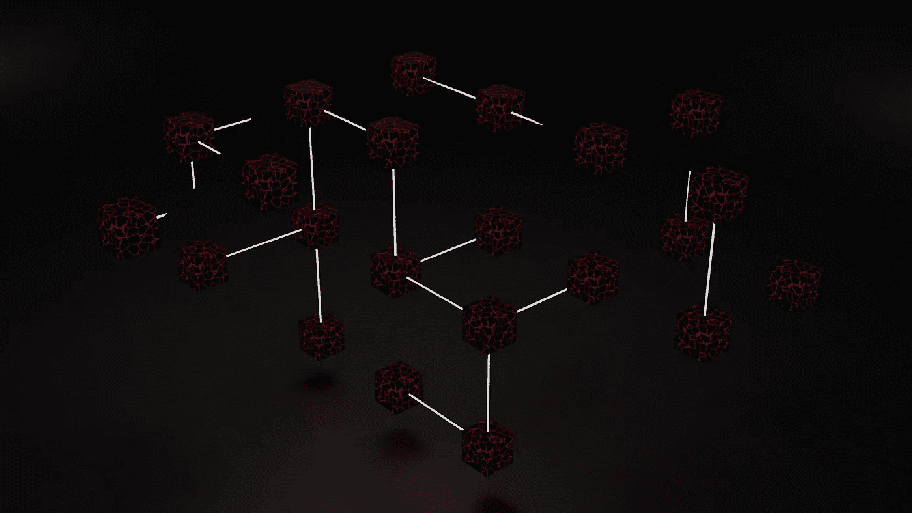

# 加密漫画——什么是去中心化

> 原文：<https://medium.com/coinmonks/crypto-comics-what-is-decentralization-7afc66d14a19?source=collection_archive---------86----------------------->

Photo by [Shubham Dhage](https://unsplash.com/@theshubhamdhage?utm_source=unsplash&utm_medium=referral&utm_content=creditCopyText) on [Unsplash](https://unsplash.com/s/photos/decentralization?utm_source=unsplash&utm_medium=referral&utm_content=creditCopyText)

我试图在漫画中解释什么是去中心化。

**TL；博士**

我解释了什么是去中心化，以及如何在加密领域应用去中心化。