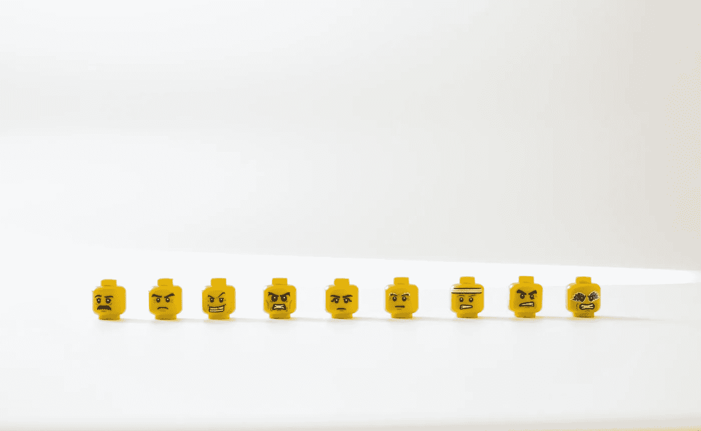

# 加密漫画——什么是网络 3 中的剽窃

> 原文：<https://medium.com/coinmonks/crypto-comics-what-is-plagiarism-in-web3-ff79bd773f68?source=collection_archive---------56----------------------->

Photo by [Hello I’m Nik](https://unsplash.com/@helloimnik?utm_source=unsplash&utm_medium=referral&utm_content=creditCopyText) on [Unsplash](https://unsplash.com/?utm_source=unsplash&utm_medium=referral&utm_content=creditCopyText)

我和一个剽窃的受害者分享了我的经历，并防止将来的剽窃。

**TL；博士**

我分享了在 Web3 中如何防止抄袭的步骤。