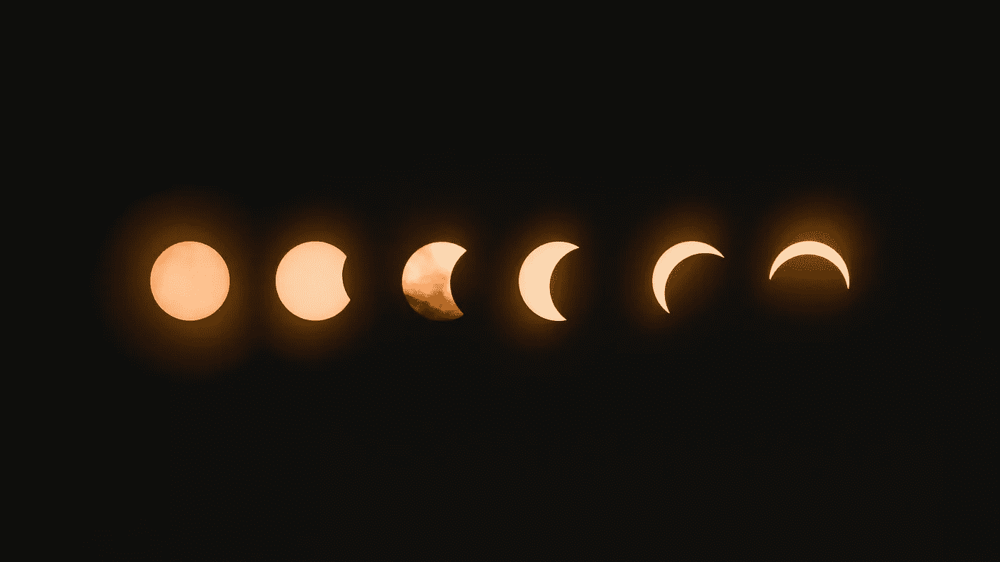

# 加密漫画——月球是什么

> 原文：<https://medium.com/coinmonks/crypto-comics-what-is-to-the-moon-62f23a402dd3?source=collection_archive---------70----------------------->

Photo by [Mark Tegethoff](https://unsplash.com/@tegethoff?utm_source=unsplash&utm_medium=referral&utm_content=creditCopyText) on [Unsplash](https://unsplash.com/s/photos/moon?utm_source=unsplash&utm_medium=referral&utm_content=creditCopyText)

我分享了我对“到月球”的研究和它的原始历史的可能性。

**目录**

一些外卖

什么是月亮月亮

Doge 模因

去月球

迷因是一种营销工具

最后