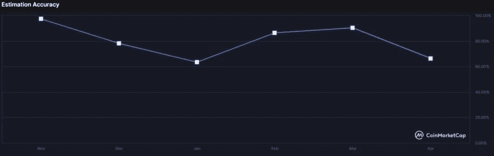
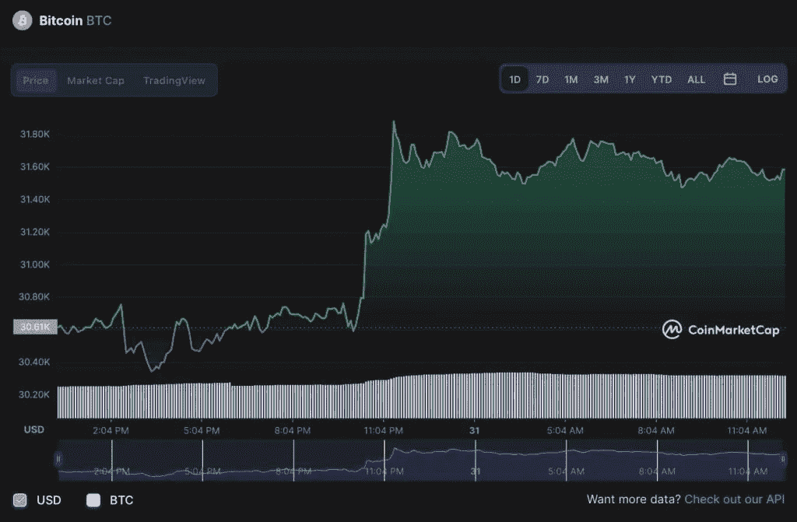

# 历史准确率达 80%的加密社区设定比特币价格为 2022 年 6 月 30 日

> 原文：<https://medium.com/coinmonks/crypto-community-with-80-historical-accuracy-sets-bitcoin-price-for-june-30-2022-433b732fe556?source=collection_archive---------39----------------------->

比特币(BTC)的价格在此前一周攀升了 8%以上，比今年早些时候的最低点 26，700 美元高出约 18%。5 月 12 日，加密市场崩溃，引发崩溃的原因是稳定的 USDT 货币与美元脱钩。

鉴于所有金融市场(不仅仅是加密货币行业)的波动性，许多散户投资者都在犹豫将资金投向何处，因为预测旗舰数字资产的未来价格非常困难。

特别是，CoinMarketCap 加密社区认为，2022 年 6 月 30 日，比特币将从当前价格飙升 30.06%，交易价格为 41，175 美元，目标是基于 34，436 名成员的平均投票。

价格预测是基于 crypto 社区提供的最近六次预测的平均值，该社区历史上预测比特币价格的准确率为 80.3%。

根据 CoinMarketCap 的数据，在本月大部分时间陷入熊市后，世界上最大的加密货币的价格目前为 31，564 美元，在过去 24 小时内上涨了 3.16%，上周上涨了 8.07%，总市值为 6，010 亿美元。

然而，这仍然比加密货币的历史最高价格低 50%以上，去年 11 月的最高价格超过 67，000 美元。

本月早些时候，加密货币市场出现下跌，导致损失近 1.5 万亿美元。一些专家警告说，另一个类似于 2018 年发生的“秘密冬天”可能即将到来。

由于加密货币市场的崩溃，比特币恐惧与贪婪指数(Bitcoin Fear & Greed Index)显示出“极度恐惧”，这导致该指数跌至 2019 年初以来的最低水平。

在崩溃后的一周，比特币开始显示出一些复苏迹象，到 5 月 30 日星期二，它已经恢复了 6000 亿美元的市值。

积极的是，摩根大通(纽约证券交易所:JPM)的策略师声称，加密货币具有“巨大的上行潜力”，这有助于改变本周的市场情绪。