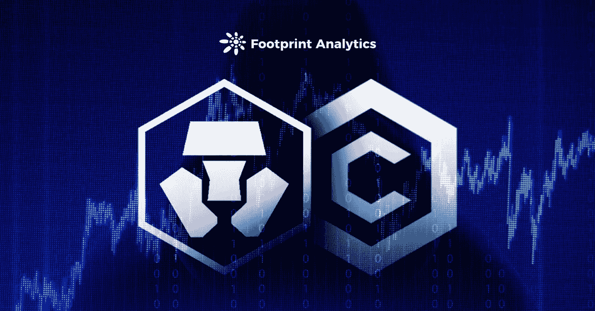
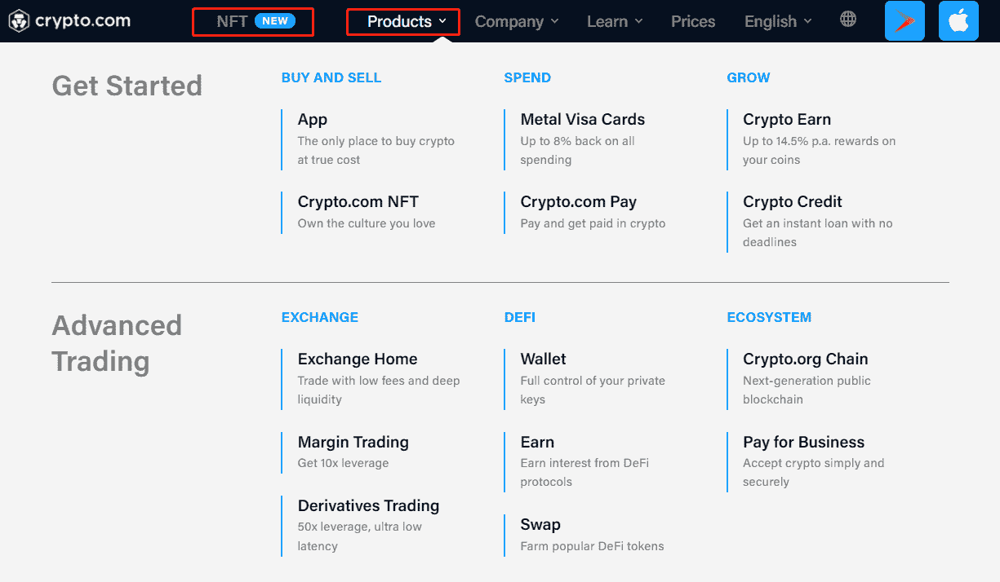
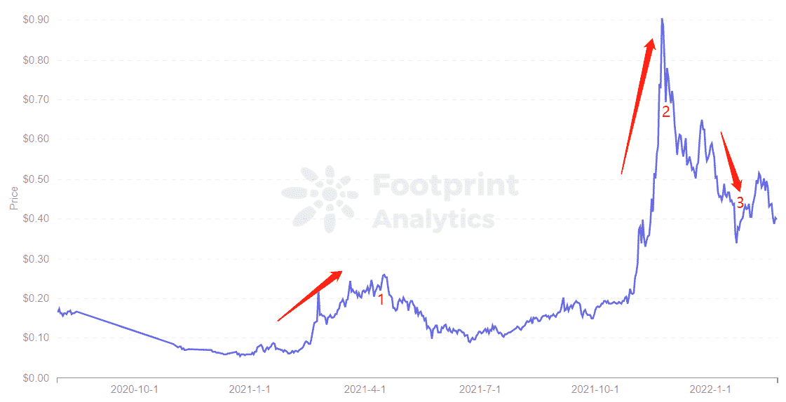
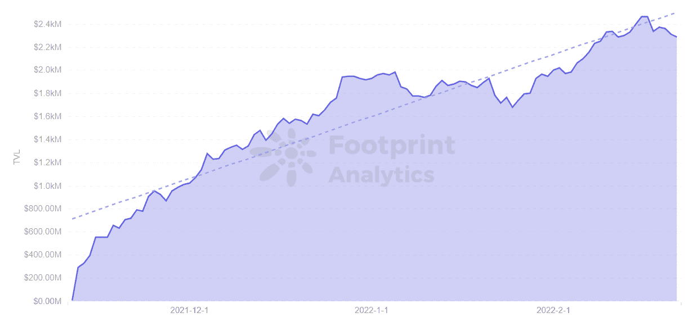
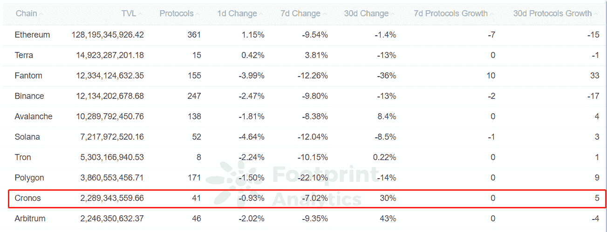
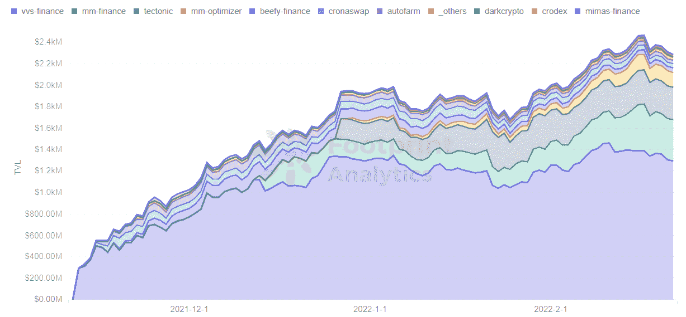

# Crypto.com 的兴衰凸显了安全的重要性

> 原文：<https://medium.com/coinmonks/crypto-coms-ups-and-downs-highlight-importance-of-security-716abf98c626?source=collection_archive---------89----------------------->

Crypto.com 支付 7 亿美元重新命名 NBA 湖人主场，将其 CRO 价格推至历史新高。

2022 年 2 月

数据来源:足迹分析— [Cronos 仪表板](https://www.footprint.network/guest/dashboard/cronos-dashboard-fp-505d1c5f-07cd-4b2c-9a64-14c3e43b93e0?date=past90days&chain=Cronos&symbol=CRO&channel=u-QytebM#secret=40568828E2164109DE264D3E1A5FA5BB)

自 2016 年 6 月成立以来，Crypto.com 一直是媒体关注的焦点。

除其他事项外，该公司还:

*   在 2021 年 3 月启动 mainnet Crypto.org 链之前，在流通中烧掉了大约 700 亿 [CRO](https://www.footprint.network/guest/chart/crypto-com-coin-cro-price-fp-85a11bf4-95b7-4e49-bd04-567f668fb699?channel=u-QytebM#secret=D9CB4D0CBA4E70360536A34694980A04)
*   推出了侧链[克罗诺斯](https://www.footprint.network/guest/dashboard/cronos-dashboard-fp-505d1c5f-07cd-4b2c-9a64-14c3e43b93e0?date=past90days&chain=Cronos&symbol=CRO&channel=u-QytebM#secret=40568828E2164109DE264D3E1A5FA5BB)
*   以 7 亿美元买下了 NBA 湖人主场 20 年的冠名权。

这些策略使其 CRO 价格上涨了数倍，并提高了公众对该公司以及更广泛的加密货币的认识。

但是后来遇到了挫折。

1 月 17 日，据透露网络遭到攻击，用户损失约 3500 万美元。这导致 CRO 的价格再次下跌。

在这篇文章中，我们将探索从那时起发生了什么，Crypto.com 的未来可能会怎样。

# 关于 Crypto.com

Crypto.com 是一个拥有 1000 万用户的平台，允许用户购买、出售和交易超过 250 种加密货币，并享受比在以太坊上更低的交易费用。此外，该平台还提供加密货币信用卡、独立加密钱包、分散式交易所，并支持基于以太坊的 [NFT](https://www.footprint.network/guest/dashboard/nft-dashboard-fp-b374b358-6e2f-4587-a52b-a69ebbb91bfa?channel=u-QytebM#secret=DA601985B1CD8DCF912829C1188A05AA) 。

*Screenshot Source — crypto.com Website*

什么是 CRO？

CRO 是 Crypto.com 发行的本土代币，燃烧前总供应量为 1000 亿，目前流通中超过 253 亿。该平台提供多种服务，主要由 CRO 提供，包括申请 CRO Visa 卡、赌博、加密收入、流动性挖掘以及出售和购买 NFT。

*   Visa 卡:用户可以下注一定数量的 cro，在下注 180 天后申请不同级别的 Visa 卡。符合条件的交易在消费后会立即获得 1%到 8%的 CRO 奖励。
*   Crypto Earn:更类似于传统的银行定期存款，但 Crypto Earn 的回报比银行高得多。根据交叉赌注的数量，您可以享受 10%到 14%的硬币存款利率。
*   支付交易费用:在 Crypto.com 交易所内，CRO 可用作支付费用，并享受费用折扣。Crypto.com 的费用会比以太坊低。

尽管用户押注 CRO 有诸多好处，但如果 CRO 货币价格下行，就有贬值的风险。通常不建议在平台上存放过多的货币。

## CRO 的三个转折点

Footprint Analytics 的数据显示，截至 2 月 22 日，CRO 的价格为 0.40 美元，同比上涨 81%。

*Footprint Analytics — CRO Price*

三个主要事件影响了它的价格行为:

1.到 2021 年 3 月，Crypto.com 为准备全面分权烧掉了 700 亿 CRO，这也使 CRO 的流通率从 24%提高到 83%。3 月 25 日，Crypto.com 推出了其主要的 Crypto.org 连锁店，将 CRO 从 0.16 美元推至 0.26 美元，涨幅为 62.5%。

2.2021 年 11 月，Crypto.com 推出了与 EVM 兼容的 Cronos，以及与各种球队和名人的营销合作伙伴关系，并支付了 7 亿美元购买 NBA 湖人队主场(斯台普斯中心)20 年的冠名权。这将 CRO 价格推升至 0.9 美元的历史高点。相比 2021 年 1 月初，涨幅为 1451%。

3.2022 年 1 月中旬，Crypto.con 被曝遭遇网络攻击，导致用户损失近 3500 万美元。平台已经修复了漏洞，并对所有受影响的用户进行了赔偿。CRO 的价格预计会超过 1 美元，但在袭击后，它一再下降到 0.4 美元。

因此，即使 Crypto.com 通过烧钱机制和营销合作关系获得人气，一旦资金安全出现问题，硬币价格也会受到一定程度的影响。

# 侧链 Cronos 的价格影响

2021 年 11 月 8 日，Crypto.com 推出了自己的以太坊兼容 Cronos，这是 Crypto.org 的一个侧链，两者同时运行。

CRO 也是克罗诺斯人的本土象征。根据 Footprint Analytics 的数据，Cronos 的 TVL 自推出以来一直在攀升，TVL 没有受到 CRO 硬币价格下跌的影响。这也意味着在 Cronos 上使用 CRO 作为交易费用会更便宜。

*Footprint Analytics — TVL of Cronos*

此外，Cronos 在推出后的 4 个月内已经跻身区块链前 9 名，这意味着推出比以太坊更便宜、更快的区块链至关重要。

目前 Cronos 上有 41 个协议，Cronos TVL 中占比最大的是 [VVS 金融](https://cryptoslate.com/what-is-vvs-finance-the-largest-project-on-crypto-coms-cronos-chain/)，这是大多数用户使用的 DeFi 协议。用户可以使用其 VVS 令牌提供流动性挖掘，可获得 50%至 70%的年化回报。

*Footprint Analytics — Top 10 TVL Rankings*

*Footprint Analytics — Cronos TVL by Protocols*

总之，Crypto.com 已经上线 5 年多了，而 mainnet 和 sidechain 是在 DeFi 热潮之后上线的。如果 Cronos 早一点推出，根据 TVL 目前的增长趋势，它可能会超过其他区块链如 [Tron](https://www.footprint.network/guest/dashboard/tron-dashboard-fp-8cfaa1a7-b3c3-418e-915c-fe76167d879a?date=past90days&chain=Tron&symbol=trx&channel=u-QytebM#secret=C797D0D94820DB123E20853F89910449) ，而不是像现在这样与许多区块链竞争。

# 摘要

对 Crypto.com 的攻击使其 CRO 硬币价格呈下降趋势，而侧链克罗诺斯的 TVL 暂时没有受到影响。Crypto.com 团队也迅速采取行动修复漏洞，并赔偿用户损失。

随着 Cronos 连锁店的扩张以及对安全性的新关注，Crypto.com 可以继续看到 TVL 的增长。

本文由[足迹分析](https://www.footprint.network/)社区提供。

> 加入 Coinmonks [电报频道](https://t.me/coincodecap)和 [Youtube 频道](https://www.youtube.com/c/coinmonks/videos)了解加密交易和投资

# 另外，阅读

*   [加密货币储蓄账户](/coinmonks/cryptocurrency-savings-accounts-be3bc0feffbf) | [YoBit 评论](/coinmonks/yobit-review-175464162c62)
*   [Botsfolio vs nap bots vs Mudrex](/coinmonks/botsfolio-vs-napbots-vs-mudrex-c81344970c02)|[gate . io 交流回顾](/coinmonks/gate-io-exchange-review-61bf87b7078f)
*   [CoinFLEX 评论](https://coincodecap.com/coinflex-review) | [AEX 交易所评论](https://coincodecap.com/aex-exchange-review) | [UPbit 评论](https://coincodecap.com/upbit-review)
*   [AscendEx 保证金交易](https://coincodecap.com/ascendex-margin-trading) | [Bitfinex 赌注](https://coincodecap.com/bitfinex-staking) | [bitFlyer 审核](https://coincodecap.com/bitflyer-review)
*   [Bitget 回顾](https://coincodecap.com/bitget-review) | [双子座 vs BlockFi](https://coincodecap.com/gemini-vs-blockfi) cmd| [OKEx 期货交易](https://coincodecap.com/okex-futures-trading)