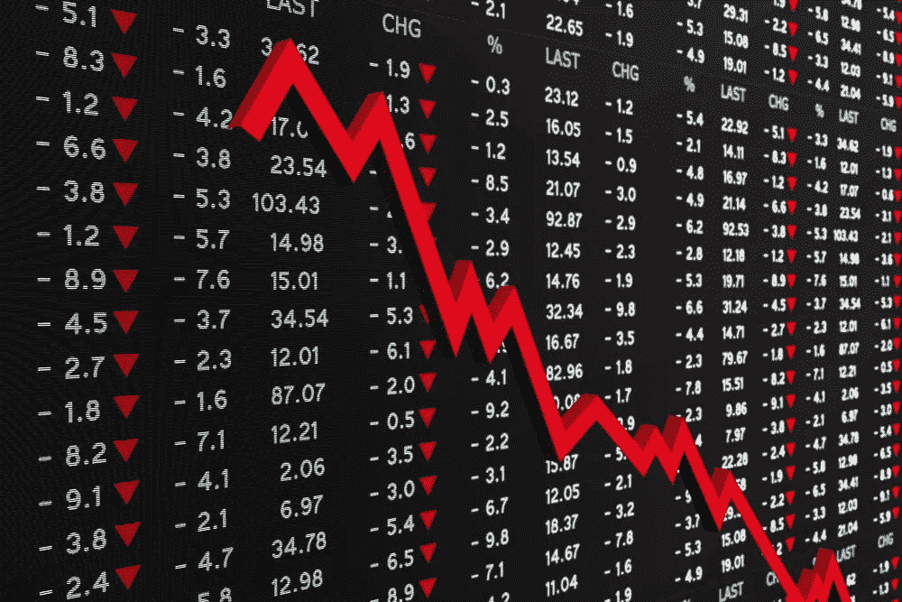

# 加密崩溃，放弃所有希望？

> 原文：<https://medium.com/coinmonks/crypto-crash-abandon-all-hope-af22bc17327b?source=collection_archive---------34----------------------->

~dwulf

**Rekt 重新确认**

Crypto 关闭，对于某些人来说，它已经过时了。通货膨胀、战争和监管暴君的结合不仅摧毁了他们的旧世界经济，还试图摧毁新世界经济。

残酷甚至不足以形容对市场的无情轰炸，每个人都在变得贪婪。如果你从事加密工作，无论是哪种工作，你都有可能失败。

Rekt 侦察就要开始了。

**那现在怎么办？**

所以这就引出了一个问题，如何前进。菲亚特部长们赢了吗？监管机构粉碎了加密反叛吗？我们会被迫屈膝接受 CBDC 黑色药丸吗？传统加密有机会吗？

UST 和露娜是黄金标准，即使有了波尔卡多特的 para-chains，桥梁仍在为它建造。但在撰写本文时，稳定硬币 UST 的价格为 0.55 美元，比 1.00 美元低了一半，这对那些将毕生积蓄投入锚定协议的人来说是一个重大打击。

稳定的硬币，USDT 和 USDC 似乎是一致的，但它们也不是没有问题。戴作为一个稳定的硬币，似乎也持有。

但加密市场正在下跌，如果你运气好，你只损失了 60%左右的持股，如果你运气不好，如果你进行杠杆操作，你会损失 100%或更多。

**重新校准比率**

这次崩盘让我看清了在这个市场上配置资产的多样性。我曾经认为 100%都是加密的，不包括稳定的硬币，因为我觉得它们附属于一个垂死的法定标准，事实如此，但法定标准仍然是一个标准，法定灵活性仍然可以购买更多的东西，而不会像猴子一样从一个硬币转移到另一个硬币，然后转移到另一个稳定的硬币，然后转移到你的银行账户。

然后，我默许了，允许 1%的菲亚特液体和 99%的加密，以实现最大的资本效率。1%用于房租、食品、煤气、水电等日常开支。而其余的资本 100%的工作在赌注和赚取利息，以建立其原则。

我仍然对这个比率感到满意，但我不得不重新评估营运加密资本。

**我失去的故事**

对我来说，我在 Acala 上过度举债。铸造澳元(Acala 的稳定硬币)，购买 ACA 和 DOT 与一些澳元放入流动性对池，并赌注抵押品。在早期，我觉得铸造澳元贷款的 1/3 杠杆是安全的，有 2/3 的抵押品支持。

但是当 DOT 上的价格从 11 美元/点跌至 8 美元/点时，我被清算，失去了我所有 DOT 抵押品的 60%。下跌如此之快，以至于在清算发生之前，我没有时间去平衡贷款，这进一步惩罚了我 15%的损失。

当所有该说的都说了，该做的都做了，我崩溃了，看起来像是安全杠杆的东西并不是，而是真实的形式，Acala 平台确实做了它被设计要做的事情。

我的圆点金库消失了，连同里面的圆点。过了一会儿，差额退还给了我，在清算和罚款后，这是微薄的一笔钱。我很幸运，我拿回了一些东西。因为我从来没有把所有的鸡蛋放在一个篮子里，我有 ATOM holdings，但即使它没有被杠杆化，我仍然损失了 50%的价值。

这不是我唯一的损失，甚至我的复合持股也归零了，支持我用来交换 DOT 的戴贷款，在清算后损失了。彻底清洗。

**收拾残局**

捡起剩余的和贬值的密码的碎片，把它们放入生产协议中，仔细研究可用的稳定硬币以及如何利用它们。

仍然需要密码策略的拼图来完成拼图。

**监管用火的燃料**

没有人会拒绝落井下石，监管机构无疑会为其 CBDCs 提供“安全”的避风港。当你 KYC 到他们的 CBDC 地狱时，以成为他们的奴隶为代价出卖保护和安全的承诺。

毫无疑问，这是一个浮士德式的交易，因为当你让魔鬼处理你的细节时，这是一个肯定的赌注，这些细节永远不会对你有益。监管者、税务当局和政府暴君对此垂涎三尺。

结论

不要放弃希望，crypto 或者至少是 BTC，已经存在了。我会用我仅有的一点液体在这个血腥的战场上捡便宜的点，原子，和 BTC，在这种时候你应该总是有一些火药。

这不会让我完全回到原来的状态，至少在最初不会，但它会让我在经济复苏时处于一个良好的战略位置。

恢复？哦，是的，这也会过去的。尽管作为货币具有灵活性，但菲亚特的购买力仍在下降，而 cbdc 是监管者想要提供的唯一解决方案，cbdc 中没有自我托管人。

回到基础，运行一个 BTC 节点(我在我的 Raspberry Pi 上运行 MyNode)，坚持使用强大的基于实用程序的区块链、Polkadot 和 Cosmos，只是要小心选择分片和副链。

UST 和卢娜是教训，即使是深思熟虑和支持的协议也可能出错，我肯定会深入挖掘 UST 与美元标准脱钩的原因。我觉得这比看起来要复杂得多。