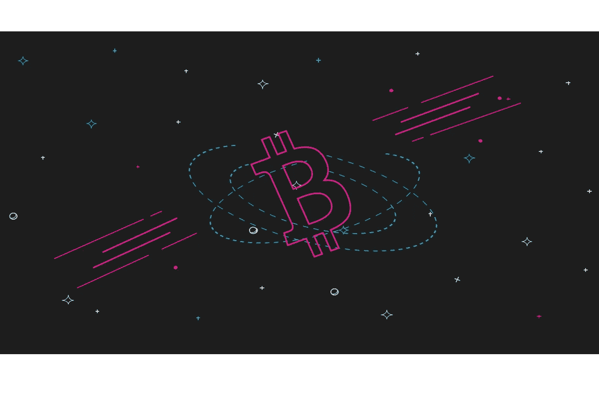

# 加密崩溃:2022 年来临？

> 原文：<https://medium.com/coinmonks/crypto-crash-coming-in-2022-6a78553e3dab?source=collection_archive---------3----------------------->

最近，加密货币在市场上暴跌，引发了行业参与者的担忧，好像我们可能正处于另一场加密崩溃之中。尽管前景黯淡，但像 2013 年、2018 年、2020 年和 2021 年这样的每次加密崩溃总有一线希望。下一次加密崩溃是什么时候？比特币会崩溃到零吗？什么样的加密技术会在加密崩溃中幸存？加密崩溃的原因是什么？2022 年是否会出现另一次加密崩溃？让我们来了解一下！

# 当 Crypto 崩溃时会发生什么？

最近，金融稳定监督委员会报告了金融稳定面临的一系列挑战。数字货币也不例外，尽管它对金融稳定的影响微乎其微。

例如，美国经济经历的最后一次危险程度的动荡是 T2 次级抵押贷款。这是一系列复杂因素累积的结果。这一事件中的大多数积极参与者都是来自主流经济的行动者。

另一方面，总的来说，比特币和所有加密货币都无法超越它们在主流金融服务生态系统中的反叛地位，因为价格波动是通过不受监管的交易所在受监管机构的确认之外发生的。然而，加密崩溃的影响在全球范围内并不被认为是灾难性的。

根据[最近的报道](https://www.investopedia.com/news/what-happens-if-bitcoin-price-crashes/#:~:text=What%20Will%20Happen%20To%20The%20Cryptocurrency%20Ecosystem%3F&text=The%20current%20rise%20in%20prices,in%20their%20prices%20as%20well)，个人投资者和机器人是大多数加密交易的幕后黑手。大多数大型企业和政府机构对加密货币仍无动于衷。这在一定程度上有助于将灾难性的加密崩溃对全球经济的影响降至最低。在线出版物" [Axios](https://www.axios.com/) "估计[像 2013 年比特币崩盘](https://www.axios.com/a-quarter-trillion-dollars-is-at-risk-when-bitcoin-crashes-and-thats-just-for-starters-1513388544-6653145e-00a4-4704-892e-2d68875e6b1a.html)一样，比特币崩盘的货币影响总计为 2500 亿美元。

# 为什么会发生加密崩溃？

浏览加密崩溃历史记录；以下是加密崩溃背后的一些可能原因:

**1。加密投资者的杠杆率过高。**

1 月初，加密数据公司 CryptoQuant 的 BTC 杠杆率创下历史新高，这表明加密投资者在加密市场上承担了更多风险。“Simon Peters”eToro 高级客户经理表示，有了这些杠杆，加密货币的短期波动可能是不可避免的。

彼得还补充道:“价格下跌可能会导致长期头寸的平仓”。当价格下跌时，这种清算会使价格急剧下跌。看看 1929 年和 2008 年的股市发生了什么。如果由于流动性不足而经历这样的崩溃，加密市场可能无法承受这样的场景。

**2。加密货币市场缺乏流动性。**

加密货币将永远受到杠杆投资者清算其大部分资产的困扰，这将破坏市场平衡。与股票市场不同，加密市场并不总是挤满了等待购买大量发行的囤积硬币的买家。

这解释了为什么加密崩溃大多发生在周末，因为当几乎所有其他投资者都在抛售时，很少有投资者愿意购买。

**3。加密货币监管。**

根据彼得的说法，在 2021 年 6 月中国禁止地下开采后，矿工们不得不搬迁到一个对矿工友好的管辖区。这对加密投资者来说意义重大，因为网络的散列率大幅下降。

对于新手来说，散列率是每秒执行的计算次数。除了对加密价格的影响，散列率对矿工开采硬币也非常重要。因此，散列率的下降意味着价格的下降，这有助于分析下一次加密崩溃的时间。

**4。密码安全漏洞引起恐惧。**

加密崩溃的另一个原因是区块链和网络安全。这可以类比为政府机构对监管的干扰，这种干扰产生了恐惧，导致人们疯狂抛售。通过这种方式，我们将使市场供应超过需求而饱和。这是又一次加密崩溃的原因。

**5。导致波动的加密影响因素。**

情绪也对加密货币产生影响。彼得提醒投资者要记住加密倡导者和有影响力的人，他们可以通过推特引起资本流入。一个臭名昭著的例子是，埃隆·马斯克(Elon Musk)通过推特支持 Dogecoin，导致其价格爆炸性上涨，有时甚至出现爆炸性下跌。这样的例子产生了我们喜欢称之为“加密泡沫”的东西。

# 加密崩溃历史

查看加密崩溃历史记录；以下是一些疯狂的例子。

# 2013 年比特币崩盘

由于这个项目的成功，2013 年的比特币崩盘发生了，成千上万的投资者涌入这个新的赚钱机会。Mt.Gox 比特币交易所收到如此强烈的交易量，以至于崩溃。黑客们立即攻击了这个弱点，迫使 Mt.Gox 陷入空前的全面关闭状态。

事后，比特币的价格从 260 美元暴跌至 50 美元。《卫报》还报道称，2013 年底比特币在中国的禁令导致其价值一夜之间损失了约 50%。迄今为止，中国与加密货币保持着动荡的关系，新的限制定期出台。

# 加密崩溃 2018

[2018 年——加密货币崩溃](https://en.wikipedia.org/wiki/Cryptocurrency_bubble#:~:text=The%202018%20cryptocurrency%20crash%20(also,most%20cryptocurrencies%20from%20January%202018.&text=By%20September%202018%2C%20cryptocurrencies%20collapsed,%2Dcom%20bubble%27s%2078%25%20collapse)既有比特币崩溃，也有大加密崩溃。2018 年的大加密崩溃是因为 2018 年 1 月开始的大部分加密货币的抛售而发生的。崩盘发生在 2017 年前所未有的繁荣之后。接下来发生的是 2018 年 1 月 6 日至 2 月 6 日期间价值下跌约 65%。

其他加密货币在 2017 年 12 月至 2018 年 1 月达到新高峰后，在危机中紧随其后。到 2018 年 9 月，几乎所有加密货币都比 1 月份的峰值下降了 80%。

据报道，2018 年的加密货币崩溃远比[网络泡沫 78%的崩溃](https://en.wikipedia.org/wiki/Dot-com_bubble)更糟糕。到 11 月 26 日，比特币在此前一周损失了近三分之一的价值后，进一步从历史高点暴跌 80%。与 2013 年的比特币崩盘相比，2018 年的比特币加密崩盘更加剧烈。

# 加密崩溃 2020

2020 年对于包括加密货币市场在内的市场空间来说是剧烈的。比特币的崩盘更加令人身临其境，因为它在短短两天内就贬值了一半。这枚硬币损失了超过 50%的价值。比如从 2 月份的 10000 美元以上跌到 3 月份的 4000 美元以下，也就一个月左右的时间。2020 年的加密崩溃不是儿戏，投资者可以证明这一点。

# 加密崩溃 2021

到目前为止，2021 年是加密货币最好的一年，但也是灾难性的一年。今年 4 月，比特币达到了 64000 美元的新 ATH，成为投资界的头号话题话题。

不幸的是，仅一周时间，全球加密市场就蒸发了约 1 万亿美元的 BTC 市值。在整个危机中，埃隆·马斯克拒绝了他接受比特币作为特斯拉汽车支付形式的计划。

接下来，中国出现了新的加密打击行动，公众也开始了解到比特币挖矿不仅对环境不利，甚至是毁灭性的。所有这些媒体的嗡嗡声让加密投资者看着命运的手，因为他们看着[加密崩溃 2021](https://www.gobankingrates.com/investing/crypto/7-biggest-bitcoin-crashes-history/?utm_campaign=1101534&utm_source=yahoo.com&utm_content=12&utm_medium=rss) 。

# 2022 年是否会出现另一次加密崩溃？

[由于加密货币价格暴跌，自 11 月初以来，约 1 万亿美元的市值被抹去。根据 CoinMarketCap](https://www.protocol.com/bulletins/crypto-crash-january-2022) 的数据，2000 多亿美元在短短 24 小时内被抹去。不出所料，这加剧了投资者对另一场加密崩溃的担忧。

11 月初，加密货币的总市值从 3 万亿美元跌至约 1.7 万亿美元。随着时间的推移，比特币的价值进一步从 41，000 美元跌至 36，000 美元(约为 11 月初以来价值的近一半)。这可能是 2013 年比特币崩溃的重演，还是我们将目睹像 2018 年加密崩溃那样更广泛的加密崩溃？

《福布斯》资深撰稿人克莱姆·钱伯斯也声称，牛市趋势对牛市来说是困难的，因为熊市占主导地位。因此，现在人们对 2021 年的加密崩溃仍然记忆犹新，因此担心 2022 年的加密崩溃。投资者有时认为这是在价格下一轮上涨之前进场的最佳机会。

# 为什么加密系统现在崩溃了？

最近，加密货币的兴衰更像是过山车。然而，加密货币并不是唯一一个经历了 2021 年疯狂终结的货币。由于对新新冠肺炎变种高通胀的担忧，全球股市经历了低迷，这种担忧在进一步的加密监管中蔓延到了加密货币行业。

2021 年 12 月初，各种知名数字资产价格下跌。加密货币在 2022 年初进一步贬值，1 月 21 日，BTC 的价格降至每枚 4 万美元左右。一些新手交易员甚至在问:“[比特币会不会崩盘到零](https://www.thetimes.co.uk/money-mentor/article/is-bitcoin-crash-coming/#:~:text=A%20downturn%20in%20global%20stocks,at%20the%20start%20of%20December)？”然而，这种情况不太可能发生。

[加密崩溃的原因之一](https://www.nationalworld.com/lifestyle/money/will-crypto-recover-when-cryptocurrency-market-and-price-of-bitcoin-could-bounce-back-2022-crash-explained-3243971)是特斯拉决定背叛使用 BTC 作为支付形式。中国对加密货币的打压也进一步降低了加密市场的价值。

中国的限制扩大到禁止所有银行和金融机构向客户提供任何围绕加密货币的服务。中国还警告不要进行投机交易，这也是一些用户担心另一场加密崩溃即将到来的原因。

中国银行业协会、中国支付清算协会和中国国家互联网金融协会就加密问题发布了一份联合声明。像这样的紧迫问题是市场正在经历的加密崩溃的原因之一。

# 下一次加密崩溃:什么时候？

 [## 加密崩溃:2022 年来临？交换区

### 最近，加密货币在市场上暴跌，引发了行业参与者的担忧，好像我们可以…

swapzone.io](https://swapzone.io/blog/crypto-crash-coming-in-2022) 

[上一篇:无感觉加密:如何节省交易？](https://swapzone.medium.com/feeless-cryptocurrencies-transfer-and-save-e5c05730fef9)

> 加入 Coinmonks [电报频道](https://t.me/coincodecap)和 [Youtube 频道](https://www.youtube.com/c/coinmonks/videos)了解加密交易和投资

## 也阅读

 [## 杠杆代币[多头代币]终极指南

### 杠杆化令牌是具有杠杆化风险敞口的 ERC20 令牌，不考虑保证金、要求、管理…

medium.com](/coinmonks/leveraged-token-3f5257808b22)  [## 最佳加密交易所| 2022 年十大加密货币交易所| CoinCodeCap

### 哪一个是最好的加密交换？在本文中，我们将根据多种加密货币列出 10 大加密货币交易所

coincodecap.com](https://coincodecap.com/crypto-exchange)  [## 2022 年 2 月值得关注的三大游戏代币| CoinCodeCap

### 排名前 3 位的游戏也占交易总量的 85%以上。Defi 王国、Axie Infinity 和 Pegaxy…

coincodecap.com](https://coincodecap.com/top-3-gaming-tokens-to-look-out-for-in-february-2022)  [## 2022 年最佳加密交换平台| CoinCodeCap

### 随着时间的推移，我们大多数人将转向 dex 以获得更好的安全性和隐私。因此。在这里，我们将讨论…

coincodecap.com](https://coincodecap.com/best-swap-platforms)  [## 10 大最佳在线赌场|赢得并赢取免费 BTC 2022 | CoinCodeCap

### 接收、支付和赚取加密货币| |有各种各样的最佳在线赌场可供选择，有可能…

coincodecap.com](https://coincodecap.com/best-online-casinos)  [## 2021 年最佳加密借贷平台| 6 大比特币借贷平台

### 获得比特币和其他加密货币的最佳贷款利率

medium.com](/coinmonks/top-5-crypto-lending-platforms-in-2020-that-you-need-to-know-a1b675cec3fa)  [## 2021 年 6 大最佳硬件钱包|顶级加密硬件钱包[更新]

### 最好的加密货币硬件钱包是绝对必要的。我们将在 NGRAVE、Ledger Nano X 和…

medium.com](/coinmonks/the-best-cryptocurrency-hardware-wallets-of-2020-e28b1c124069)  [## 加密交易机器人——19 款最佳免费加密交易机器人

### 2022 年币安、比特币基地、库币和其他密码交易所的最佳密码交易机器人。四进制，位间隙…

medium.com](/coinmonks/crypto-trading-bot-c2ffce8acb2a)  [## 最佳 4 个加密交易信号电报通道

### 这是乏味的找到正确的加密交易信号提供商。因此，在本文中，我们将讨论最好的…

medium.com](/coinmonks/best-crypto-signals-telegram-5785cdbc4b2b)  [## 2022 年 2 月将购买的五大加密技术| CoinCodeCap

### 加密货币是不受任何中央机构监管的数字货币，并且不稳定。有些日子…

coincodecap.com](https://coincodecap.com/top-5-crypto-to-buy-in-february-2022)