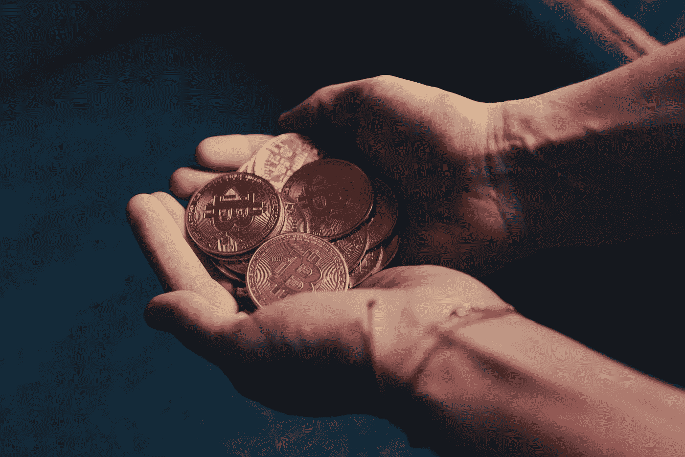

# 加密崩溃:我的想法

> 原文：<https://medium.com/coinmonks/crypto-crash-my-thoughts-on-it-b44309592df6?source=collection_archive---------10----------------------->

Photo by [olieman.eth](https://unsplash.com/@moneyphotos?utm_source=medium&utm_medium=referral) on [Unsplash](https://unsplash.com?utm_source=medium&utm_medium=referral)

对 Crypto 来说，这一周简直是血洗。每个人都处于恐慌状态，并考虑出售，尖叫着这是加密的末日，它不可能是一种可靠的支付方式。

老实说，每次我听到这样的声明，我都不知道他们在说什么。如果我们谈论的是另类硬币(我不喜欢)——我看到了恐慌的原因。如果硬币没有多少…