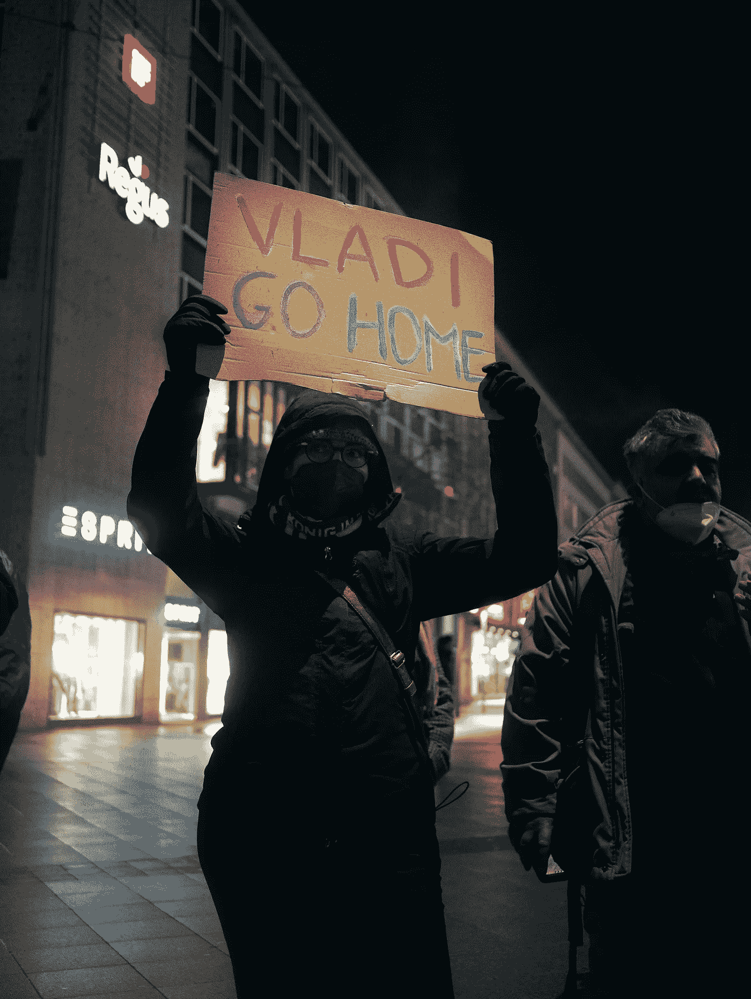
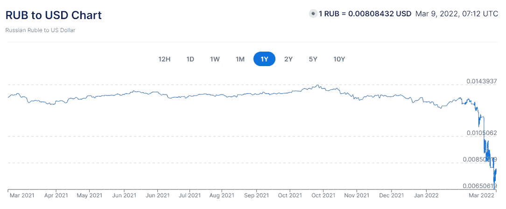

# 战争期间的加密

> 原文：<https://medium.com/coinmonks/crypto-during-war-d8d48ad4e3df?source=collection_archive---------50----------------------->

## 加密如何影响俄罗斯和乌克兰之间正在进行的战争？

除非你生活在岩石下，否则你可能听说过目前正在进行的俄罗斯-乌克兰战争。

Photo by [Loris](https://unsplash.com/@loriskskp) on [Unsplash](https://unsplash.com?utm_source=medium&utm_medium=referral)

我不支持俄罗斯参战，我希望尽快达成和平解决方案。今天，我探索了俄罗斯使用加密技术赢得战争的可能性，这种情绪在许多 Twitter 圈子中普遍存在。

过去几周，乌克兰出现了许多令人毛骨悚然的场景。捐款正从世界各地涌来。乌克兰已经正式要求比特币和以太坊的捐赠。这是因为通过加密向全球汇款很容易。

These are verified publicly verified Wallet Addresses

北约对俄罗斯实施了几项金融制裁，作为施加经济压力的手段。这导致俄罗斯卢布大幅贬值。

The ruble has lost considerable value since the start of the war

俄罗斯拥有第五大外汇储备。弗拉基米尔·普京可能会用这些外汇储备购买卢布，以稳定卢布。

俄罗斯的另一个选择是购买大量密码。

## 就其本质而言，加密货币资产很难被冻结。俄罗斯可以利用密码来规避经济制裁，对吗？这可能比你想象的要困难得多。

即使俄罗斯不能被单方面禁止进入比特币区块链，但在西方国家开展业务的加密交易所可以禁止俄罗斯账户。因此，使用加密交易所批量购买比特币的选择可能行不通。

每天都需要大量的流动资金来资助战争。俄罗斯可以使用非法方式购买比特币，但由于区块链是公开的，只能兑换有限数量的货币。

现在用比特币洗钱越来越难了。就在几周前，一对有影响力的人被抓到试图清洗价值数十亿美元的比特币。是的，与俄罗斯国家网络安全相比，他们是业余的，但是你明白了。

Image Courtesy: The Telegraph

## 因此，普京通过交易所和黑市积累密码的两种选择可能不会像大多数人想象的那样有效。

还有一个选择:盗取比特币。俄罗斯在勒索软件攻击方面领先世界。在勒索软件攻击中，攻击者通常会访问受害者的计算机并加密文件。然后，他们要求比特币归还文件。2021 年，俄罗斯黑客声称 74%的勒索软件攻击。这也不会解决普京的问题。使用勒索软件攻击，俄罗斯人赚了 4 亿美元，这是一笔相当大的钱，但不足以资助每天需要数十亿美元的战争努力。

尽管普京很想使用加密技术来规避经济制裁，但看起来他做不到。俄罗斯需要发展的规模与当今的加密市场不相适应。

免责声明:这纯粹是我的观点，不应被视为主要来源。我不是财务顾问。建议读者自行判断。

*参考:*[*【https://www.bbc.com/news/technology-60378009】*](https://www.bbc.com/news/technology-60378009)

> 加入 Coinmonks [电报频道](https://t.me/coincodecap)和 [Youtube 频道](https://www.youtube.com/c/coinmonks/videos)了解加密交易和投资

# 另外，阅读

*   [德国最佳加密交易所](https://coincodecap.com/crypto-exchanges-in-germany) | [Arbitrum:第二层解决方案](https://coincodecap.com/arbitrum)
*   [币安交易机器人](/coinmonks/binance-trading-bots-d0d57bb62c4c) | [OKEx 评论](/coinmonks/okex-review-6b369304110f) | [Atani 评论](https://coincodecap.com/atani-review)
*   [最佳加密交易信号电报](/coinmonks/best-crypto-signals-telegram-5785cdbc4b2b) | [MoonXBT 评论](/coinmonks/moonxbt-review-6e4ab26d037)
*   [如何在 Bitbns 上购买柴犬(SHIB)币？](https://coincodecap.com/buy-shiba-bitbns) | [买弗洛基](https://coincodecap.com/buy-floki-inu-token)
*   [CoinFLEX 评论](https://coincodecap.com/coinflex-review) | [AEX 交易所评论](https://coincodecap.com/aex-exchange-review) | [UPbit 评论](https://coincodecap.com/upbit-review)