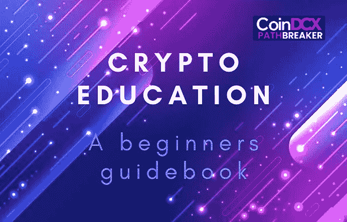
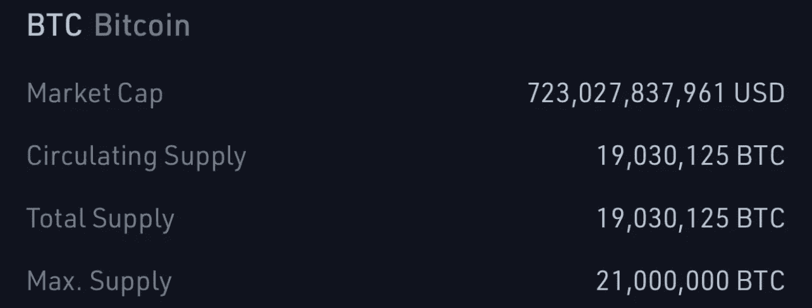
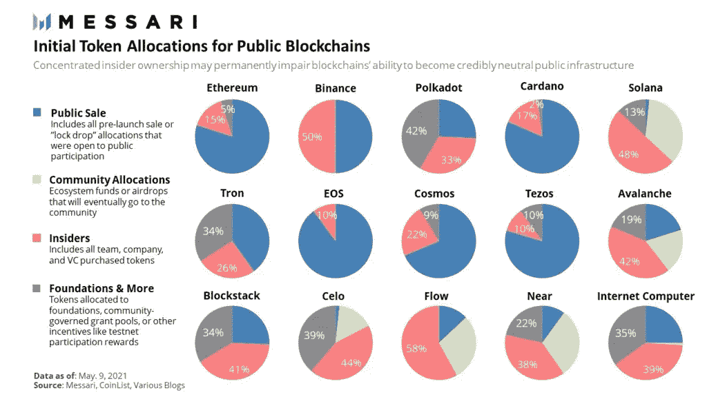
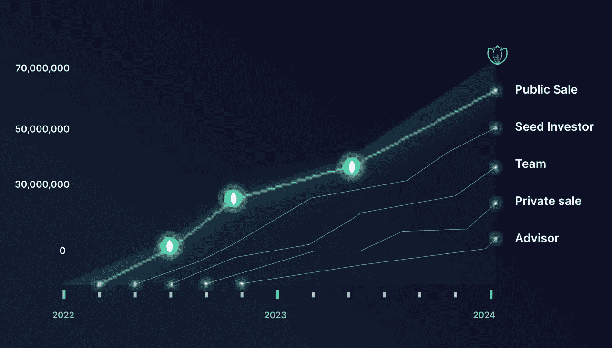
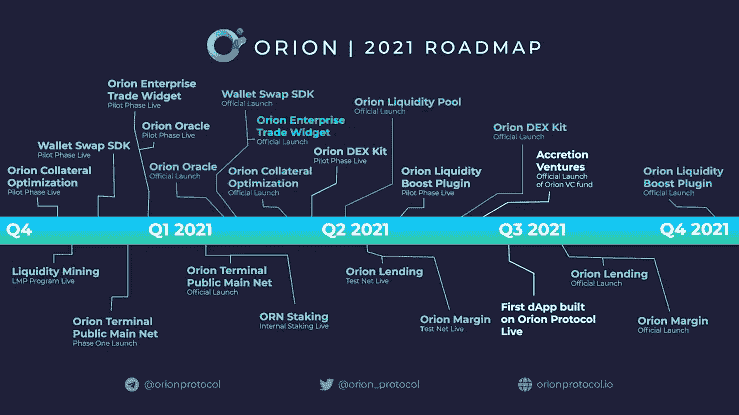
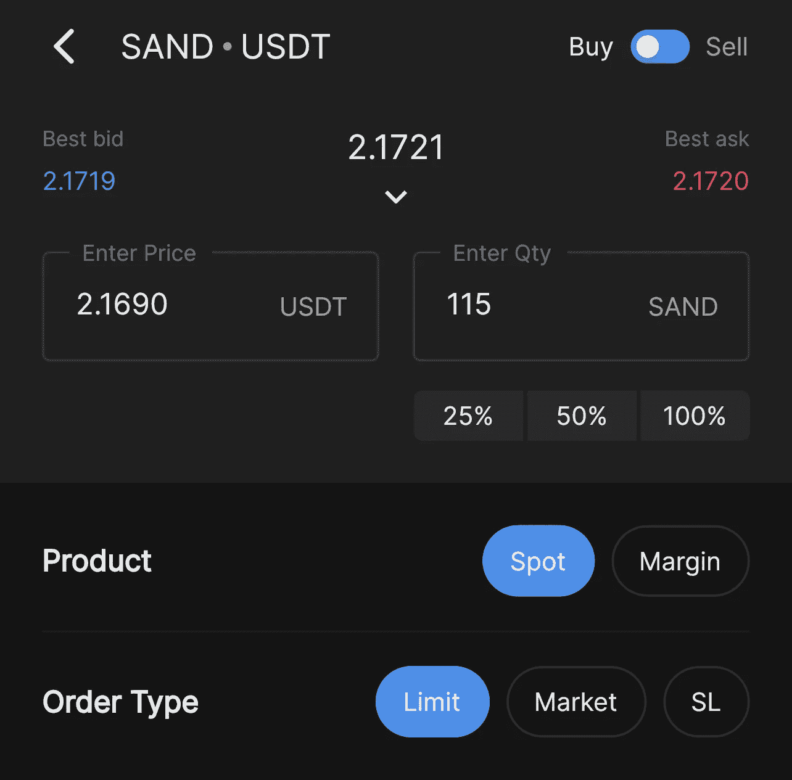

# 加密教育:初学者指南

> 原文：<https://medium.com/coinmonks/crypto-education-a-beginners-guidebook-38c4b8e155f8?source=collection_archive---------38----------------------->

# CoinDCXpathbreaker

嘿，新交易员…你好吗？对加密空间的所有晦涩难懂的东西感到超级困惑？想为 100 倍的收益拿你的资本冒险，并向电报集团寻求建议吗？😵‍💫在 Twitter 上盲目追随影响者的电话？🥶…Well，如果你正在做以上任何一件事，**祝贺你** 🥳 …你是 **NGMI(不会成功)** …

我下面的指南将尝试把你扔进密码教育的世界，这样你就可以成功地从 **NGMI** 帮走到 **WAGMI(我们都会成功)**帮。准备好了吗？？？？请继续阅读…

## 令牌组学:

这一定是绝对的圣杯👑你的秘密教育。每个加密项目都有多个层次，令牌组学是首屈一指的……这部分学习将让你了解项目的原生硬币和以下内容:

*   最大供应量:总共能铸造多少。BTC 有史以来就有 2100 万枚硬币。
*   **流通供给**:目前市场上有多少代币未锁定。毫无疑问，流通供应量将对代币价格产生最大影响——解锁并集中到一个持有者手中的代币越多，市场抛售的风险就越高。一些代币被授予一段时间并以系统的方式解锁，这些代币是更好的长期投资(不是财务建议)

Bitcoin tokenomics figure

*   **令牌分配模型**:这个分配会清楚的告诉你项目的令牌是如何分配的。请参见下面的示例…

Token allocation with percentage breakup

来自 [Messari](https://medium.com/u/7cf93d3c3400?source=post_page-----38c4b8e155f8--------------------------------) 的上述信息将为您提供对各类投资者分配的全面概述。

*   **授权时间表**:这是一个潜在骗局项目的另一个关键指标。授权是锁定已分配代币的时间段。因此，如果一个项目的授权时间表是 6 个月，在该期限后每月有 20%的解锁，这意味着该分配的 100%供应将在 11 个月内进入市场——6 个月+ 20% x 5 个月。🚩🚩🚩如果所有股票同时解锁，在 CEX 上市后，初始投资者的股价将上涨 10 倍至 100 倍，而且很有可能会把他们的袋子扔给你。

An detailed example of a Vesting Schedule

*   **USPs** :代币的主要用途是什么？本质上是通货膨胀还是通货紧缩？它是否充当了持有者的治理令牌？

## 社区支持:

有时最没有价值的项目伴随着最疯狂的涨价行动，这种狂热是由社区推动的。听说过比特币最大化主义者吗？ShibArmy？疯子？他们都是项目社区，与硬币如此相关，以至于这些人最终与他们的包结婚。请 DONT 成为那个人/女孩。像下棋一样玩加密空间，慢而稳且有策略。这不是任何形式的比赛。一个强大的社区绝对可以为黄牛带来短期的看涨势头和交易机会，但在缺乏效用的情况下，这种抛物线增长轨迹如何可持续？我认为根本不可持续。

## 项目开发和实施:

这个领域对我来说超级关键，一直都很重要。如果没有逐步淘汰的路线图，那就是自动的🚩为了我的研究。如果路线图时间段在解锁团队令牌分配的同时结束，则自动🚩🚩又来了。如果预发布项目的路线图只持续很短的时间(比如说 3 个月)，那么自动🚩🚩🚩一次又一次。

Eg: Orion Protocol Roadmap 2021

**如果**路线图包括‘泵’活动，自动红旗。根据经验，泵运动就是泵和倾卸。团队和选定的社区成员/合作伙伴将推动价格泵，导致普通投资者 FOMO(害怕错过)，然后他们将以双方同意的价格出售自己的股份，最终价格将暴跌。有疯狂的数字支持我的理论，这在加密领域经常发生。如果你设法找到并突出这些项目，那么你可以节省很多人的血汗钱，并防止他们的精神在加密空间打破。

项目路线图越长越好。如果团队非常专注于开发，这通常会反映在路线图中。

现在你不必成为一名技术工程师，但是随着时间的推移，你将开始更深入地理解项目技术的确切含义以及 laidout 目标的可实现程度。如果路线图看起来非常不现实，您应该将其视为🚩🚩🚩。例如，我在 2021 年 12 月遇到了一个项目……这个项目奖励了 BUSD，作为对他持有项目令牌的回报，更不用说，我在那个无聊的🥲中损失了 300 美元

## 对项目进行深入研究:

你应该在这里浏览项目媒体页面、Twitter 个人资料、研究白皮书、路线图实施、CoinMarket Cap 的价格历史。

## 如何购买:

接下来从哪里买，接下来是怎么做的？对于刚接触加密的人来说，这是一个非常复杂的过程。我个人比较关注像 [CoinDCX](https://medium.com/u/a30fa2b03c2f?source=post_page-----38c4b8e155f8--------------------------------) 这样在 CEX 上市的币，为什么？因为我知道已经进行了尽职调查，所以不会有小摩擦，我可以专注于研究上面提到的其他变量，而不是担心我可能甚至不理解的技术方面。

Buying SAND/USDT on CoinDCX Pro app

我已经通过投资于**dex**上的硬币烧掉了资本，比如**Uniswap**&**Pancakeswap**，但是它们真的不值得它们与投资一起属于的压力。

如果你在做你自己的内容，或者写你的指导手册，尽可能保持简单。按照指南进行操作，就好像你正在向其解释基础知识的人是第一次进入 crypto。所以，避免行话，保持简单明了。

## 总结:

如果你想研究这个项目，并把你的发现放在一个平台上，比如 Medium、SubStack、concept 或者你自己的网站上……详细列出利弊，突出你的研究中最重要的部分。对于你认为这个项目可以做得更好的地方，提出你自己的建议。也要小心你的语言，保持它的专业性，因为你永远不知道谁会读到它。也要小心直截了当地说你认为这个项目或团队是一个骗局。

最后一点，永远不要在你的报告中包括购买或不购买的建议…这可以被认为是财务建议(不管你的免责声明可能会说什么)。相反，我会把这个项目作为一个技术分析放在那里，有相关的支持:阻力水平。这使得它成为纯粹的教育内容，我永远不会谈论我投资的项目。记住，它是关于创建教育内容和让用户意识到一个项目的潜力。DONT·希尔什么的。

…
非常感谢 [CoinDCX](https://coindcx.com/) 给我这个机会撰写如此详细的报告，并成为# CoinDCXpathbreaker 计划的一部分，使我能够与加密领域的每个人分享这些知识。

> 加入 Coinmonks [电报频道](https://t.me/coincodecap)和 [Youtube 频道](https://www.youtube.com/c/coinmonks/videos)了解加密交易和投资

# 另外，阅读

*   [Bookmap 点评](https://coincodecap.com/bookmap-review-2021-best-trading-software) | [美国 5 大最佳加密交易所](https://coincodecap.com/crypto-exchange-usa)
*   最佳加密[硬件钱包](/coinmonks/hardware-wallets-dfa1211730c6) | [Bitbns 评论](/coinmonks/bitbns-review-38256a07e161)
*   [新加坡十大最佳加密交易所](https://coincodecap.com/crypto-exchange-in-singapore) | [购买 AXS](https://coincodecap.com/buy-axs-token)
*   [红狗赌场评论](https://coincodecap.com/red-dog-casino-review) | [Swyftx 评论](https://coincodecap.com/swyftx-review) | [CoinGate 评论](https://coincodecap.com/coingate-review)
*   [投资印度的最佳密码](https://coincodecap.com/best-crypto-to-invest-in-india-in-2021)|[WazirX P2P](https://coincodecap.com/wazirx-p2p)|[Hi Dollar Review](https://coincodecap.com/hi-dollar-review)