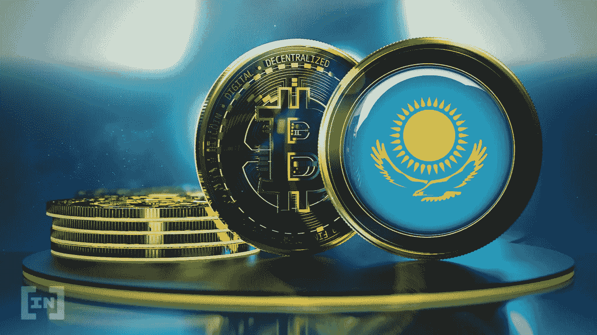

# 哈萨克斯坦现已批准加密交易账户

> 原文：<https://medium.com/coinmonks/crypto-exchanges-accounts-now-approved-in-kazakhstan-a9b7426d0291?source=collection_archive---------63----------------------->

2022 年，交易平台将有机会在阿斯塔纳国际金融中心合法运营。

除了在监管加密开采方面取得的快速进展，哈萨克斯坦还将在阿斯塔纳国际金融中心的经济特区启动一个加密交易所试点项目。

哈萨克斯坦共和国数字发展、创新和航空航天工业部周四宣布了一项加密交易所与一些当地银行合作的试点项目。

该工作组制定了合作准则，由数字发展部、国家银行、金融监督机构、金融家协会、阿斯塔纳国际金融中心以及金融和加密市场利益攸关方的代表组成。

该试点项目将运行到 2022 年底，包括已经从新成立的阿斯塔纳金融服务管理局(AFSA)获得许可证的交易所。它将为哈萨克斯坦作为区域加密中心的后续发展绘制蓝图。关闭指南将很快在 AIFC 网站上公布。

AFSA 的负责人 Nurhat Kushimov 宣称，他的委员会的使命是为可靠和可持续发展的公司创造一个运营环境:

> *“阿斯塔纳金融服务管理局是负责监管金融科技公司在哈萨克斯坦活动的唯一实体。在向金融科技公司发放许可证之前，我们会进行深入彻底的背景调查，之后会保持对它的持续监督。"*

数字发展部长 Bagdat Musin 表达了哈萨克斯坦从加密交换中获利的目标:

> *“有必要创建一个完整的生态系统，这样利用哈萨克斯坦电能开采的数字资产将最大限度地在当地交易所交易，利润将留在哈萨克斯坦”。*

5 月 25 日，哈萨克斯坦议会一读通过了国家税法修正案，征收与采矿实体消耗的电价挂钩的加密采矿税。

> 加入 Coinmonks [电报频道](https://t.me/coincodecap)和 [Youtube 频道](https://www.youtube.com/c/coinmonks/videos)了解加密交易和投资

# 另外，阅读

*   [5 款最佳加密交易终端](https://coincodecap.com/crypto-trading-terminals) | [最佳 DeFi 应用](https://coincodecap.com/best-defi-apps)
*   [最佳网上赌场](https://coincodecap.com/best-online-casinos) | [币安评论](/coinmonks/binance-review-ee10d3bf3b6e) | [BitMEX 评论](https://coincodecap.com/bitmex-review)
*   [麻雀交换评论](https://coincodecap.com/sparrow-exchange-review) | [纳什交换评论](https://coincodecap.com/nash-exchange-review)
*   [美国最佳加密交易机器人](https://coincodecap.com/crypto-trading-bots-in-the-us) | [经常性回顾](https://coincodecap.com/changelly-review)
*   [在印度利用加密套利赚取被动收入](https://coincodecap.com/crypto-arbitrage-in-india)
*   [Godex.io 审核](/coinmonks/godex-io-review-7366086519fb) | [邀请审核](/coinmonks/invity-review-70f3030c0502) | [BitForex 审核](https://coincodecap.com/bitforex-review)
*   [5 款最佳免费加密货币制图工具](https://coincodecap.com/crypto-charting-tools)