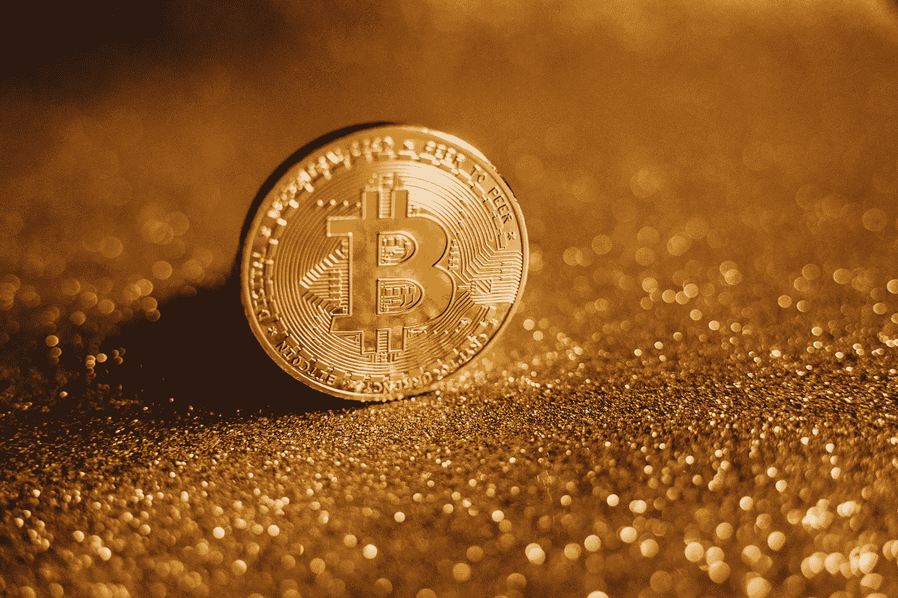

# 密码——时尚还是未来？

> 原文：<https://medium.com/coinmonks/crypto-fad-or-the-future-3d80c07b4f84?source=collection_archive---------46----------------------->

你是任何团体的密码专家吗？或者你是怀疑论者，认为我们都被骗了？

从区块链到 Web3 和 NFTs，技术正在迅速发展。然而，仍然有一个持续的争论——加密是时尚还是未来？

# 比特币

首先上市的是比特币。

它由中本聪创造，并于 2009 年初首次开采。我们不会进入本质，但硬币的价格已经飙升。它已成为全球交换的强大媒介，并被视为价值储存手段。

萨尔瓦多是第一个在 2021 年采用比特币作为法定货币的国家。其他国家可能会步他们的后尘，巴拿马、汤加、巴拉圭和古巴可能是下一个谈判对象。

许多零售商也加入进来，开始接受比特币作为一种支付方式。一些大公司包括贝宝、星巴克、美国电话电报公司、亚马逊和全食超市。用加密货币支付还没有在收银台完成，至少现在还没有。最好向该公司核实，但这可能是通过他们的移动应用程序、网站或 Flexa 等第三方平台完成的。

不管怎样，这都是朝着一个全新方向迈出的一步。然而有些人仍然怀疑，这是正确的吗？比特币会改变未来的货币体系吗？

用例非常有前途，但只有时间能证明一切。

# **机构 FOMO**

数据不会说谎。机构投资者肯定注意到了这一数字现象。

让我们不要忘记——这些现在的参与者中有许多也是最强烈的反对者。

摩根大通董事长兼首席执行官杰米·戴蒙(Jamie Dimon)在 2017 年将比特币称为“欺诈”。尽管他持怀疑态度，但这家知名银行此后对区块链科技进行了战略投资，甚至在美国证券交易委员会(SEC)注册了一只比特币基金。

摩根大通并不孤单。许多其他知名企业如富国银行、高盛、MicroStrategy 和特斯拉也加入了这一行动。

在支持加密货币的名单中，MicroStrategy 名列榜首。这家总部位于弗吉尼亚州的公司指出，2020 年 8 月，它总共拥有 125051 个比特币。首席执行官迈克尔·塞勒自豪地公开支持硬币，并对其未来寄予厚望。

FOMO 已经推动许多公司积累比特币和其他数字资产。市场已经看到了影响。这些巨鲸和机构在最近的许多 BTC 上涨中发挥了重要作用，操纵了价格的暴涨和暴跌。

奇怪的是，来自机构参与的流动性被认为创造了一个波动较小的市场，并增加了整体的普遍采用。此外，当他们真的到来时，让他们加入可以等同于友好的监管。

越来越多的银行家、机构、资产管理公司和风险投资公司都在寻找被称为加密的摇钱树。尽管舆论如此，他们的参与确实告诉我们一些事情——数字资产肯定让他们的存在为人所知，未来看起来是有利可图的。

# 【memecoins 呢？

当人们质疑任何加密的东西时，往往会提到两样东西——比特币和 Dogecoin。

我们已经谈到了比特币的现实生活用途和机构吸引力。而它的概念往往是最容易理解的。毕竟，比特币实际上旨在充当现实生活中的货币。

altcoins，特别是 memecoins，带来了更多的困惑。鉴于许多 sh * tcoins 缺乏实际的技术，这是理所当然的。迷因币是基于炒作，因此，可能比未来更时尚。

迷因币的未来是一个争论的话题。它们会经受住时间的考验，还是会像许多病毒模因一样很快被遗忘？目前，支持社区仍然很强大。如果说 crypto 教会了我们一件事，那就是一切皆有可能！

加密热潮每天都在增长。这项技术很有前途，未来看起来很光明，但目前的风险仍然广泛存在。这是一个不稳定的市场，就像他们说的，永远做你自己的研究。

好奇我是怎么找到潜在投资的？[这里的**一探究竟。**](https://learn.block6.tech/how-to-find-a-100x-altcoin-665c2985975c)

—秘密金发女郎

> 加入 Coinmonks [电报频道](https://t.me/coincodecap)和 [Youtube 频道](https://www.youtube.com/c/coinmonks/videos)了解加密交易和投资

# 另外，阅读

*   [OKEx vs KuCoin](https://coincodecap.com/okex-kucoin) | [摄氏替代品](https://coincodecap.com/celsius-alternatives) | [如何购买 VeChain](https://coincodecap.com/buy-vechain)
*   [ProfitFarmers 点评](https://coincodecap.com/profitfarmers-review) | [如何使用 Cornix Trading Bot](https://coincodecap.com/cornix-trading-bot)
*   [如何匿名购买比特币](https://coincodecap.com/buy-bitcoin-anonymously) | [比特币现金钱包](https://coincodecap.com/bitcoin-cash-wallets)
*   [瓦济里克斯 NFT 评论](https://coincodecap.com/wazirx-nft-review)|[Bitsgap vs Pionex](https://coincodecap.com/bitsgap-vs-pionex)|[Tangem 评论](https://coincodecap.com/tangem-wallet-review)
*   [如何使用 Solidity 在以太坊上创建 DApp？](https://coincodecap.com/create-a-dapp-on-ethereum-using-solidity)