# 加密特征对深度强化学习的重要性

> 原文：<https://medium.com/coinmonks/crypto-feature-importance-for-deep-reinforcement-learning-38416616c2a36-8416616c2a36?source=collection_archive---------5----------------------->


本文由开源项目 AI4Finance 的核心团队成员 Berend Gort & [Bruce Yang](https://ai4finance.medium.com/) 撰写。这个项目是一个共享金融 AI 工具的开源社区，是纽约哥伦比亚大学的一部分。GitHub 链接:

[](https://github.com/AI4Finance-Foundation) [## ai4 金融基金会

### 一个共享金融 AI 工具的开源社区。FinRL:第一个用于财务强化的开源项目…

github.com](https://github.com/AI4Finance-Foundation) 

**结果**

在我的新文章中，我们展示了使用此管道的一些结果:

[](/@CoderBurnt/best-technical-indicators-for-bitcoin-fromta-lib-fa5518560e) [## 来自 TA-lib 的比特币最佳技术指标

### 本文由开源项目 AI4Finance 的核心团队成员 Berend Gort & Bruce Yang 撰写。这个…

medium.com](/@CoderBurnt/best-technical-indicators-for-bitcoin-fromta-lib-fa5518560e) 

**简介**

本教程旨在对深度强化学习(DRL)过程中使用的神经网络进行特征重要性分析。部署传统的机器学习技术来决定最佳特征。

**简而言之，这条管道是为了:**

1.  **确定价格上涨或下跌的高度可预测性特征(在本笔记本中)**
2.  **为 DRL 建立相应的网络(在本笔记本中)**
3.  **插入 DRL 的(不在本笔记本中)**

该管道是 Lopez de Prado，M. (2018)在《金融机器学习进展》中提出的想法的组合。本教程遵循类似的方法，但不同之处在于神经网络用于分类无所事事，短期或长期。本文分为五个主要部分:

*   Ch2:改编的币安下载器
*   Ch3:三重屏障法
*   Ch5:分数微分
*   Ch6:建模(在我们的例子中是神经网络)
*   Ch8:功能重要性

ai4 finance foundation FinRL-Meta repo 上提供了一款实用的 Google Colab 笔记本:

[](https://github.com/AI4Finance-Foundation/FinRL-Meta/blob/master/Demo_Crypto_Feature_Importance.ipynb) [## FinRL-Meta/Demo _ Crypto _ Feature _ importance . ipynb at master ai4 finance-Foundation/FinRL-Meta

### FinRL -Meta:数据驱动的金融强化学习的宇宙。🔥 …

github.com](https://github.com/AI4Finance-Foundation/FinRL-Meta/blob/master/Demo_Crypto_Feature_Importance.ipynb) 

**Ch2:改编的币安下载器**

如果你没有使用烛台(或蜡烛线)数据的经验，我们推荐这个视频:

Beginner’s guide to Candlestick data (klines)

首先，需要无限的数据。这个处理器对你想下载的 klines 的数量没有限制。然而，[它需要来自币安的数据 API 密钥](https://www.youtube.com/watch?v=qg-oboAY8rM)。

好了，回到处理器。该类有五个重要的方法:

1.  运行()
2.  下载数据()
3.  添加技术指标()
4.  目标阵列()
5.  get _ 币安 _ 酒吧()

要使用这个类，只需创建它的一个实例，然后应用 run()方法。因此，我们将按顺序解释 run 方法。从那里开始。BinanceProcessor()的一个实例只需要 API 信息。

之后，您可以在实例上调用 run 方法。运行方法要求:

*   *ticker_list* :您要下载的交易对列表。这些必须可以在任何一个[币安市场](https://www.binance.com/en/trade/BTC_USDT?layout=basic)买到。
*   *start _ date*/*end _ date*:正确格式的两个字符串(Y%-M%-D% h%:m%:s%)。指示下载的开始和结束
*   *time_interval* :开始日期和结束日期之间的数据采样。格式应符合[币安文件](https://python-binance.readthedocs.io/en/latest/binance.html)。
*   *technical _ indicator _ list*:目前还不支持为币安下载器添加自定义技术指标。**这意味着为了分析额外的特征，必须手动将它们添加到处理器中。**或者，其他数据源也可以集成到处理器中，以获得额外的功能。这超出了本文的范围，留给读者作为练习。
*   *if_vix* =False。暂时忽略它。

读者现在理解了 run()方法的输入。之后，调用 download_data()。

```
data = self.download_data(ticker_list, start_date, end_date, time_interval)
```

它循环遍历 *ticker_list* ，为每个 ticker 创建一个单独的数据帧，并将它们附加在一起。建议这款 Google Colab 笔记本将您的分析限制在一种加密货币上。剩下的代码还没有为多重加密分析而构建。

通过 *ticker_list* 的循环将*get _ 币安 _bars()* 应用于 *ticker_list 中的每个股票。*这个方法使用币安客户端来获取 klines，丢弃我们不感兴趣的 klines，并将时间戳标签更改为索引。好了，现在我们回到 run() 方法。我们得到了我们的数据框架。我们清理它并应用方法*添加技术指标*。

```
data = self.add_technical_indicator(data, technical_indicator_list)
```

这就是 TA-lib 发挥作用的地方(技术分析库)。此处显示了受支持指示器的列表。你可以在数据处理器中添加 TA-lib 的任何功能，就像相对强弱指数(RSI)、移动平均收敛背离(MACD)、商品通道指数(CCI)和方向移动指数(DX)一样。这些指标中的大部分都是根据曲线(或开盘-盘高-盘低-收盘交易量数据，OHLCV)计算出来的。这一部分留给读者作为练习。

熊猫数据框现在可以进行进一步的分析了。方法 *df_to_array()* 将数据帧转换为 Numpy 数组，该数组可以直接输入到 AI4Finance GitHub 中的深度强化学习(DRL)算法。这不是本文的目标，因此我们的数据现在已经准备好了。

**Ch3:三重屏障法(第 43 页，洛佩斯·德·普拉多博士)**

考虑一个特征矩阵 *X* 和一个 *I* 行。特征矩阵存在于 OHLCV 数据和增加的技术指标中。一个例子:

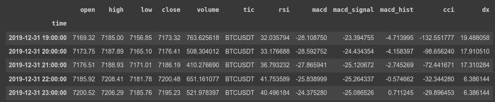

Example of data frame obtained by the BinanceProcessor class

让我们首先研究一下你的直觉。和我待在这里。考虑下面的 BTC/USDT 图表。我们从 2017 年 8 月 30 日抽取一个红盒子，价格是 4580。我们如何画这个盒子现在并不重要。盒子上有三条重要的线:

*   如果价格首先触及箱体底部，我们将观察值标记为 y = 0(价格触及止损)。
*   如果价格首先触及箱体的顶部，我们将观察标记为 y = 2(价格触及获利回吐)。
*   如果价格达到盒子的右侧，我们将观察值标记为 y = 1，赌注超时(在盒子的时间范围内没有显著的价格变化)

想象一下，我们已经执行了这个标记，现在我们可以根据我们所拥有的特征进行预测了！0:做空，1:什么都不做，2:做多。

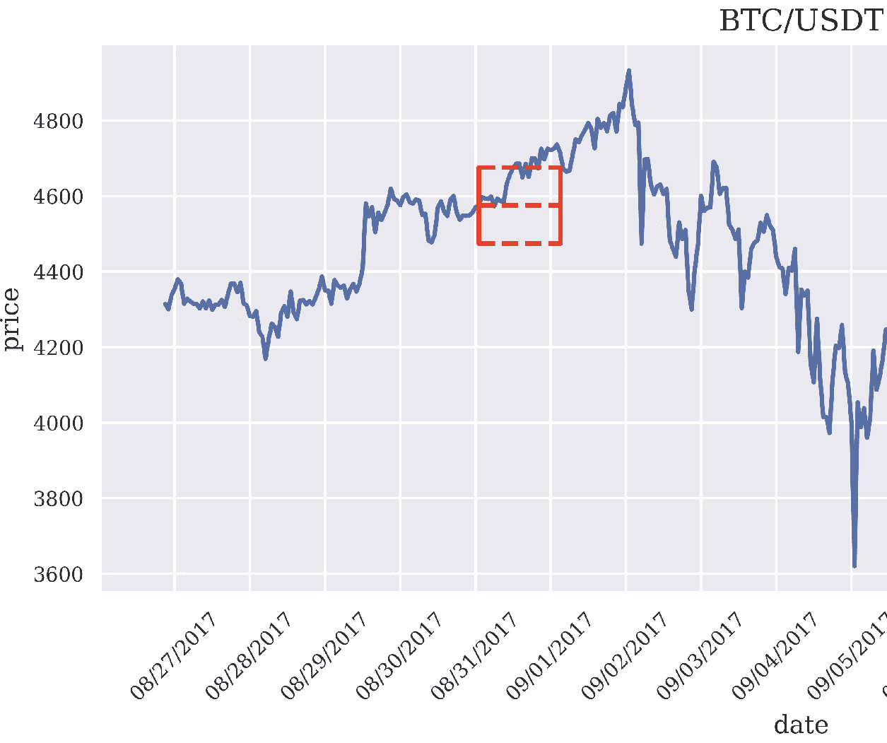

BTC/USDT chart and a box

现在让我们找到一个合理的方法来得到盒子的形状。数学形式的等价标记规则是:

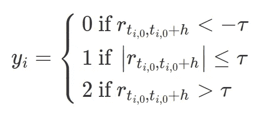

在这里，𝜏是一个预定义的阈值，我们将在稍后确定。t(i，0)是第 X(i)次观测的时间索引。t(i，0) + h 是 t(i，0)之后第 h 条的索引。现在用英语；从某个日期开始，比如 2017 年 8 月 30 日，添加 *h* 数据点。如果收益低于前面描述的底部横线，标记为 0。当返回的绝对值在上下横条之间时，标记为 1。最后，如果返回超过顶栏标记为 2。

因此，r(t，h)是一个棒线水平 h 的价格回报:

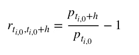

我们希望将止盈/止损水平条设置为每日波动的函数。**波动性是衡量价格上下波动程度的指标，如果我们在设定价格箱之前没有根据这些价格波动进行调整，我们的价格箱将会太大或太小，以至于价格无法以相当一致的方式触及价格箱。**

下面的函数遍历上面代码片段产生的时间戳和相应的波动性。通过的数据点数是自第一次观察以来通过了多少次观察。

然后，让我们首先产生障碍值。垂直障碍是时间戳，另外两个障碍是价格。

*   垂直屏障是由 *t_final* 根据通过的数据点定义的超时。因此，如果仍然有足够的数据点，并且设置了超时，垂直障碍就是波动率指数的指数(时间戳)加上超时。

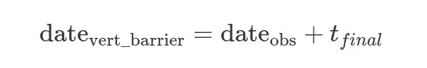

*   然后在第二个 if 语句中设置顶部屏障。上限是作为每日波动率的动态函数计算的，从当前价格乘以乘数。这个乘数是一个常数，并且是预先设定的。

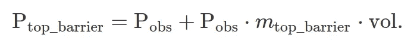

*   对于底障，与顶障相同，但方向相反。

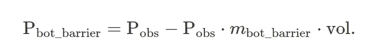

新创建的数据帧的一个例子*障碍:*

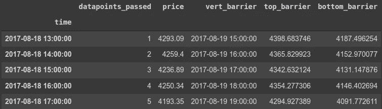

Example of the barriers dataframe

好了，我们现在有目标了。我们可以相应地开始标记。这个函数遵循前面定义的标签规则。首先，我们得到开始和超时日期，它对应于索引和设置的垂直屏障。然后，我们找到盒子极值的价格。之后，我们检查条件，如果有任何顶部或底部障碍击中。最后，如果没有障碍物撞击，它将撞击垂直障碍物。

**Ch5:分数微分(第 75 页)，！可选！**

**这是一个数据转换的例子，你可以测量它的效果。您也可以*跳过*进入 Ch8:特性重要性，并使用我们在前面章节中构建的数据框架。这是一个数据转换的例子，我们可以在下一节量化其效果。**

在最后一部分，Ch8:特征重要性，对数丢失误差被形式化。因此，我们可以直接测量分数微分等数据变换对对数损失误差的影响！当然，您可以测试您的数据转换。

好，让我们开始分数微分:

*机器学习*喜欢平稳的数据。因此，如果我们有非平稳数据(如 2015 年以来的 BTC 价格，可以用指数函数拟合)，我们可以做的是对它进行微分。然而，因为价格总是一个时间序列，当前价格依赖于以前水平的长期历史，这被称为记忆。

What is stationarity

所以我们想通过微分得到稳定的数据。然而，完全区分数据将导致**信息**的丢失。因此我们希望**对**数据进行分数微分，即不用整数对数据进行微分(如一阶微分；1)，但分数约为 0.20。

**目标:我们想要静态数据，同时尽可能多地保留过去的记忆！**

分数微分使用二项式展开来估计原始数据，但阶数较低。目标是使数据更加稳定，同时尽可能多地保留内存:

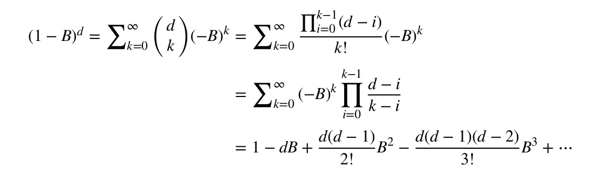

所以我们在这里微分 w.r.t. *d .* 让我们看看一个实数(非整数→分数)的正 d 是如何保持记忆的。这个等差数列由一个点积组成。上面的系列被赋予某些变量名，最后被简化；它只是二项式展开的一种变换:

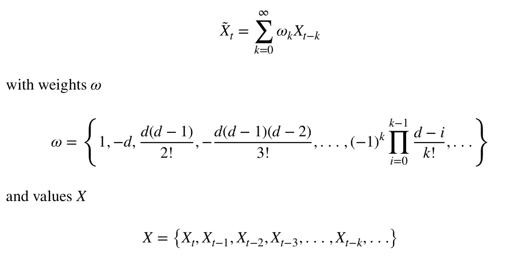

因此，权重可以描述为:

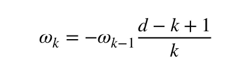

好吧，这是怎么回事？见下图。y 轴上是权重值 *w* 。图例描述了分数微分变量 *d.* 最后，x 轴上是迭代器 k。

关于这个数字，你只需要明白三件事:

*   如果 d = 0 →除 w_0 外所有权重为零。因此，不发生微分，估计值等于原始序列。
*   如果 d = 1 → w_0 = 1 且 w_1 = -1。其余权重为零！看看下面的方程，看着眼熟？由于 X(t)和 X(t-1)的步长差为 1，所以是一阶导数！

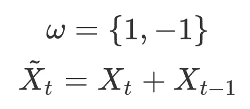

*   **d 越低，随着 k 的增加，仍然具有非零值的权重越多。**这意味着记忆被保留(因为考虑了高阶项)

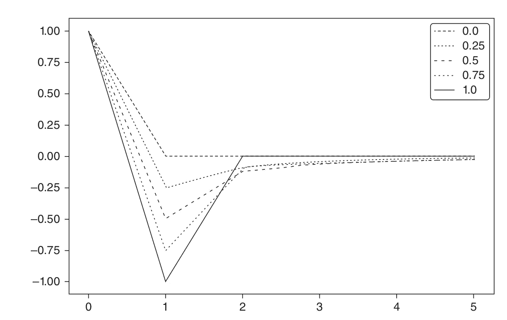

𝜔 k (y-axis) as k increases (x-axis). Each line is associated with a particular value of d ∈
[0,1], in 0.1 increments.

就是这样，你刚刚理解了分数阶微分(简而言之)。所以现在出现了一个新的重要问题:**什么值的 *d* 是可接受的？**

将固定宽度窗口 fracdiff (FFD)方法应用于时间序列，我们可以计算最小系数 d，使得所得的分数微分序列{ X ̃ t } t=l，…，t 是平稳的。这个系数 d 量化了需要移除以实现稳定的内存量。

*我们将使用 ADF 统计检验来跟踪时间序列中是否存在单位根，单位根表示时间序列是否平稳。如果你有兴趣观看* [*这个视频*](https://www.youtube.com/watch?v=2GxWgIumPTA) *。*

下一个表格+图显示了关于 BTC/USDT 原木价格的 [ADF](https://www.youtube.com/watch?v=1opjnegd_hA) 统计数据。在 x 轴上，它显示用于生成序列的 *d* 值，在该序列上计算 ADF 统计数据。

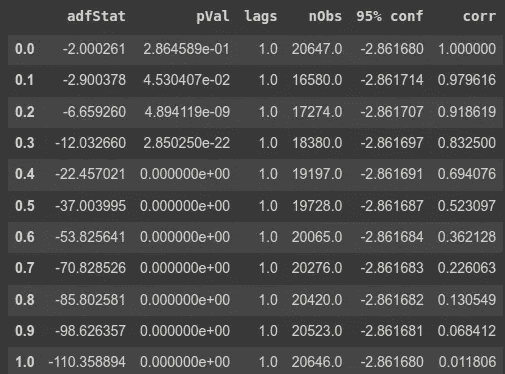

ADF stat

原始系列的 ADF 统计值为–2.0(蓝线左侧)，而退货系列的 ADF 统计值为–110.35(蓝线右侧)。在 95%的置信水平下(红色虚线)，测试的临界值是 0.1832(蓝色穿过红色虚线)。左边的 y 轴表示原始序列(d = 0)和不同 d 值的微分序列之间的相关性。在 d = 0.1832 时，微分序列和原始序列之间的相关性仍然非常高，为 0.993。在那之后，我们会失去很多记忆。

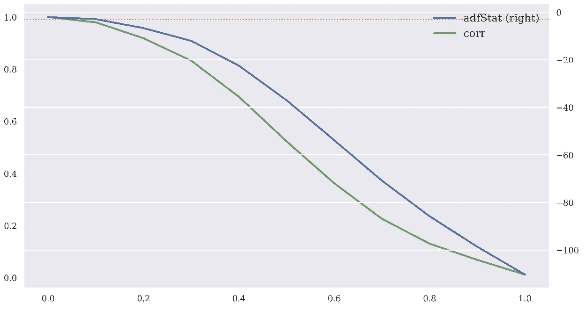

ADF statistic as a function of d, on BTC/USDT log-prices

这证实了在这一章中介绍的过程已经成功地实现了静止而没有放弃太多的内存。相比之下，原始序列和收益序列之间的相关性只有 0.011806，因此表明标准整数微分几乎完全消除了序列的记忆。

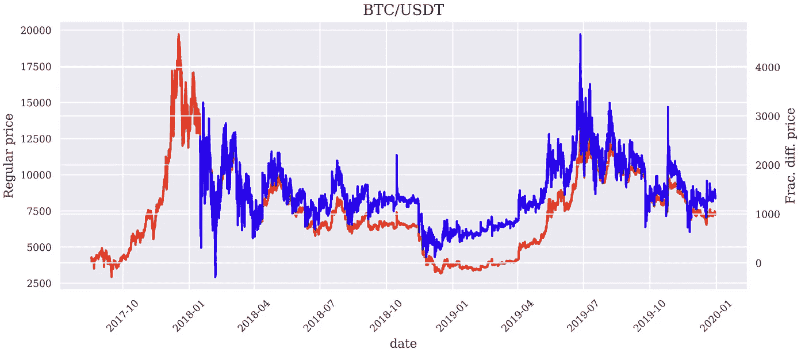

Original price and fractionally differentiated price for BTC/USDT

**Ch6:用神经网络模拟分类器来预测 0，1，2 标签**

这就是深度强化学习(DRL)发挥作用的地方。**如果你没有使用 DRL 加密的经验，这个视频教程(也是我做的)详细解释了如何使用 AI4Finance DRL 框架有效地培训加密领域的代理。**这是一个非常强大的框架，看起来很容易进入。

**！注意:我们想在这里强调，理解下面的视频并不是理解/关注这篇中等帖子的必要条件！**

所以，AI4Finance 提供了一个预编码 DRL 代理的框架。在 *net.py* 文件中定义了对应于每个代理的所有神经网络。

[](https://github.com/AI4Finance-Foundation/ElegantRL/tree/master/elegantrl/agents) [## ElegantRL/elegantrl/ai4 金融硕士代理-基金会/ElegantRL

### 使用 PyTorch 的可扩展和弹性深度强化学习。请开始。🔥—ElegantRL/ElegantRL/master 上的代理…

github.com](https://github.com/AI4Finance-Foundation/ElegantRL/tree/master/elegantrl/agents) 

当使用我们之前定义的特征时，我们想要测试神经网络的预测性能。比如我对 ActorPPO 感兴趣，我在 *net.py* 文件中找到。我复制了这个特定神经网络的一份拷贝(格式有点不同)。因为我们有一个多类问题，所以我们不做 *tanh()* 最终输出，而是卖/不做/买输出。

之后，在下一部分，有许多指南，如果你想更详细地在网上找到它们，我们推荐你。

我们需要一个虚拟类，将数据转换成可迭代的项，这样 PyTorch 数据加载器就可以遍历它并获得长度:

下面的代码

*   做一个简单的训练测试。
*   MinMaxScaler()将输入数据从 0-1 进行缩放。*训练数据上的 fit_transform()* 和测试数据上的*transform()*(Google 这是你不知道的)。
*   创建两个*分类数据集()的实例。*
*   将这些输入 PyTorch 的 DataLoader 类，以获得可迭代的 ite # Set optimizer
    criteria = nn。CrossEntropyLoss()
    optimizer = optim。Adam(model_NN1.parameters()，lr=0.0001)毫秒
*   多类问题的判据是 CrossEntropyLoss()(记住最后已经有一个 softmax 了)。我们使用 Adam 优化器:

```
criterion = nn.CrossEntropyLoss()optimizer = optim.Adam(model_NN1.parameters(), lr=0.0001)
```

关于训练和测试功能的说明如下:

*   *输出=模型(数据)，*这里输出的是一个*批处理 _ 大小*类*矩阵。类别维度是短/什么都不做/长的对数概率。
*   *nn。CrossEntropyLoss()* 准则要求将对数概率作为输入，并将目标作为类(0，1，2)的向量。
*   剩下的就不言自明了

那么火车环看起来非常简单

```
model_NN1.to(device)# State fold (no PurgedKFold build yet, ignore thisfold = 0for epoch in range(1, epochs + 1):correct_train, train_loss = train(fold, model_NN1, device, train_loader, optimizer, epoch)test(fold, model_NN1, device, test_loader, correct_train, train_loss)
```

**重要的最后说明:**

**现在比如你可以在一定的学习率下训练 300 个纪元。训练准确率保持缓慢收敛到 100%(如预期)。然而，在 150 个时期之后，测试精度不超过 60%。这意味着在纪元 150 之后，我们已经完全超负荷了。如果在现有的 ActorPPO 网络上增加一些基本层，准确率已经可以达到 75%。**

主要问题是:

*我们现在是否可以得出结论，ElegantRL 中的 ActorPPO 神经网络在 DRL 训练期间使用这些特定特征不足以捕获给定数据集中的所有信息？*

我把这留给读者(和我自己)作为一个假设，因为这本身就是一个完整的研究问题。

**Ch8:特征重要性**

现在，使用经过训练的神经网络来测量特征的重要性就很容易解释了。用 PyTorch 来做就不那么容易理解了。

方法如下:

1.  对于功能中的每一列，洗牌。
2.  用打乱的列做一个预测。
3.  找出实际目标和新预测目标之间的 log_loss 误差(用混排的列)
4.  将这些错误附加到列表中
5.  对列表排序
6.  确定哪个错误是最大的，这是由于列重排造成的
7.  衡量特征重要性

阅读下面的代码。

最终结果如下所示:

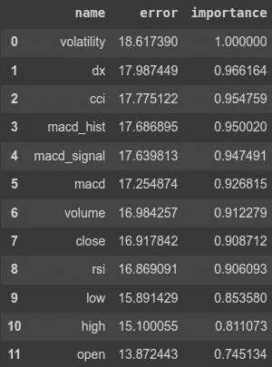

Feature importance

现在您可以开始使用这个管道了！

*   你想要分数微分特征吗？
*   你想要哪些技术指标？
*   哪些数据转换做得好会增加混洗时的错误？
*   您的网络规模应该是多少？
*   你希望 DRL 特工的神经网络有哪几层？

**结果**

在我的新文章中，我们展示了一些结果

[](/@CoderBurnt/best-technical-indicators-for-bitcoin-fromta-lib-fa5518560e) [## 来自 TA-lib 的比特币最佳技术指标

### 本文由开源项目 AI4Finance 的核心团队成员 Berend Gort & Bruce Yang 撰写。这个…

medium.com](/@CoderBurnt/best-technical-indicators-for-bitcoin-fromta-lib-fa5518560e) 

*感谢您了解加密功能对 DRL 的重要性！*

*~贝伦德&布鲁斯*

**参考文献**

0:洛佩兹·德·普拉多，男(2018)。金融机器学习进展。约翰·威利的儿子们。

[1:ai4 金融基金会](https://github.com/AI4Finance-Foundation)

[2:采用三重屏障标签的最优交易规则检测](https://www.youtube.com/watch?v=U2CxilKFue4)

[3:数据标注，三重关口法](https://towardsdatascience.com/the-triple-barrier-method-251268419dcd)

[4:金融机器学习第 1 部分:标签](https://towardsdatascience.com/financial-machine-learning-part-1-labels-7eeed050f32e#:~:text=Adding%20Path%20Dependency%3A%20Triple%2DBarrier,%3A%20the%20triple%2Dbarrier%20method.)

[5:元标记:解决非平稳性和位置大小](https://www.youtube.com/watch?v=WbgglcXfEzA)

[6:金融机器学习的进展](https://github.com/JackBrady/Financial-Machine-Learning/blob/master/USDJPY_Notebook.ipynb)