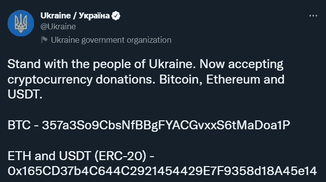

# 控制你的钱的密码

> 原文：<https://medium.com/coinmonks/crypto-for-control-of-your-money-3d7249e03417?source=collection_archive---------40----------------------->

如果政府因你的捐款而冻结你的资产，你会认为这不合适吗？如果银行发生挤兑，没有现金可用，你的信用卡也不能用了，你会怎么办？如果通货膨胀率达到 20%或 30%，你会如何保护你的钱？

不幸的是，由于乌克兰的 wan，加密货币受到了关注，因为它被证明是一种在银行关门，ATM 机没有现金时移动和存储货币的好方法，也是为乌克兰政府采购商品的好方法。从 Blockain Ukrain 的负责人 Michael Chobanian 到参议院银行委员会讨论他们如何使用捐款，“我们立即收到钱，我们可以立即花钱。我们可以吸引来自世界上几乎任何地方的捐款，甚至是那些没有银行服务的国家，但是他们有加密技术。”

Click [here](https://twitter.com/BankingGOP/status/1504820202126589958) for the video

## 为什么乌克兰使用加密技术？

他们用它来抵抗，购买粮食，因为它易于使用，易于转移，并为全世界人民所接受。通过允许以几种不同的加密货币的形式进行捐赠，乌克兰已经收到了近[1 亿美元](https://time.com/6155209/ukraine-crypto/)。事实证明，加密是一种简单、高效的跨境价值交换方式，是现金的体面替代品，也是一种在全球范围内快速筹集资金的方式。政府用它来采购战争所需的物品，乌克兰公民用它作为交换的工具，如果他们逃到其他国家，也可以带走他们的钱。你可以通过 BTC、瑞士联邦理工学院、交通部和许多其他机构向乌克兰捐款。

[Twitter](https://twitter.com/Ukraine/status/1497594592438497282?ref_src=twsrc%5Etfw%7Ctwcamp%5Etweetembed%7Ctwterm%5E1497601610775769094%7Ctwgr%5E%7Ctwcon%5Es2_&ref_url=https%3A%2F%2Fdecrypt.co%2F93931%2Fcrypto-twitter-millions-donated-russia-ukraine-conflict-dominates-conversation)

## 为什么加拿大的卡车司机使用密码？

你能想象向某项事业捐款，却因为一笔小额捐款而被冻结所有资产的情形吗？例如，你捐了 50 美元给像卡车司机运动或 BLM 抗议这样的事业，而你银行账户中辛苦赚来的存款被冻结了。如果你认为这听起来很荒谬，这就是刚刚发生在加拿大的事情，一个传统上温和民主的国家，没有经过正当程序就采取了行动。总理 Trudeae 说这是一个紧急情况，但它表明，如果政府(包括西方民主国家)不同意你，你的钱正在通过 GoFundMe、交易所或银行转移，那么如果公司或政府官员认为你的事业不符合国家或政党的目标，它可能会受到制裁或停止使用。

加拿大卡车司机开始通过 GoFundMe 筹资，然而，GoFundMe 没收并冻结了他们的资金，并冻结了相关的银行账户。在他们的银行账户被冻结后，加拿大卡车司机以加密方式筹集了 100 万美元以避免制裁，然而，一些外汇账户被冻结，通过这种方法提供的资金被停止。但是，仍然有分散的钱包和筹款来源来避开这些停工，避免这种情况的一个简单方法是拥有自己的钱包和保管自己的硬币。这是一个分散的钱包提供商在安大略省法院命令他们冻结和披露运动中使用的资产信息后的回复。

## 为什么俄罗斯公民使用加密技术？

普通俄罗斯人正利用它来逃离卢布和他们的股票市场，这些市场已被战争和西方的制裁摧毁殆尽。为了维持他们的购买力和储蓄，逃到安全的地方是必须的。我全心全意地谴责乌克兰战争，但我确实同情那些不想卷入这场战争的俄罗斯人，然而，由于他们的领导，他们将忍受痛苦和苦难，以及潜在的巨大经济损失。因此，如果他们有可能将卢布换成另一种货币，他们很可能会选择一个方向，让他们能够控制自己的货币，并帮助他们避免通胀。也就是说，这使得加密成为一个简单的选择。

为什么正常的俄罗斯人没有被禁止？简单地说，他们不是制裁中提到的寡头。乌克兰确实要求禁止普通的俄罗斯人，然而，主要的密码交易所在后与[反驳道，“我们没有先发制人禁止所有俄罗斯人使用比特币基地，”首席执行官 Brian Armstrong](https://www.cnet.com/personal-finance/crypto/amid-ukraine-war-should-ordinary-russians-be-banned-from-trading-crypto/)[3 月 3 日在推特](https://twitter.com/brian_armstrong/status/1499622462903914499)上写道。“我们认为，除非法律另有规定，否则每个人都应该获得基本的金融服务。”在收到费多罗夫的信几个小时后，币安发言人[告诉](https://www.cnbc.com/2022/02/28/binance-will-not-block-russian-accounts-after-ukraine-request.html)美国消费者新闻与商业频道，“我们不会单方面冻结数百万无辜用户的账户。加密旨在为全球人民提供更大的金融自由。单方面决定禁止人们访问他们的密码将会违背密码存在的理由。“交易所遵循着许多货币的原始使命，即在灾难发生时为那些保护其货币的人提供生命线。

## 俄罗斯寡头使用 crypto 能避免制裁吗？

俄罗斯寡头可以使用密码来避免制裁吗？这是非常不可能的，即使有，也是非常小的规模，因为没有足够的流动性，而且很少有人愿意与他们做生意。此外，以卢布命名的密码对非常少，拥有密码对的较大资产是那些拥有公共账本的资产。我知道一些参议员，比如伊丽莎白·沃伦，一直反对，但是专家们说，就像财政部副部长的顾问托德·康克林(Todd Conklin)说的那样，“他们必须移动的规模，以及他们必须从哪里移动东西，[密码]不一定会那么令人担忧”。

再说一次，任何交易所都不会与受到美国制裁的个人进行交易。人们认为加密交易所仍然像西部荒野一样运营，然而，与银行和其他金融机构类似，拥有此类资本流动性的主要参与者拥有强大的合规部门和了解客户(KYC)流程，这使得不良行为者很难以这种方式运营。

那么，他们将如何转移资金，[专家](https://www.nbcnews.com/tech/crypto/bitcoin-putins-economic-savior-s-unlikely-experts-say-rcna17724)推测，将通过传统的方法。其他外币、空壳公司和地下银行可能允许他们转移部分资本，以避开西方的制裁。

你可以从区块链协会政策负责人 [New Your Times](https://www.nytimes.com/2022/02/03/world/europe/putin-sanctions-proofing.html) 和 [NBC](https://www.nbcnews.com/tech/crypto/bitcoin-putins-economic-savior-s-unlikely-experts-say-rcna17724) 了解更多信息。《泰晤士报》在普京准备被切断的文章中没有提到加密，其他资源也阐述了为什么加密不是转移俄罗斯和寡头们想要转移的资金量的好方法。

## 为什么拉丁美洲的人们使用密码？

通货膨胀和货币贬值。例如，巴西人不能在他们的银行账户中持有美元，但是，他们可以持有稳定的货币而不用支付外币税(1%-6%)。主要的交易所都在寻求扩展到这个市场，监管正在巴西出现，因为它现在为政府官员创造了有意义的浪潮。我发现来自巴西中央银行的这个[数据](https://www.coindesk.com/business/2022/01/21/why-brazil-is-the-big-latin-american-bet-for-global-crypto-exchanges/)特别有趣，“截至 2021 年 8 月，巴西人持有 500 亿美元的密码，相比之下，美国股票持有 160 亿美元”。每年都有越来越多的巴西人逃向这些资产，以至于政府正在迅速制定法规，设置护栏来保护他们的公民。

下面是我以前写的一个故事，但我认为它适合这里。这里有一段来自 [fxempire](https://www.fxempire.com/education/article/can-crypto-really-beat-inflation-869570) 的引言，它很好地抓住了这一点，“土耳其人每天进行一百万次加密交易，路透社[上个月](https://www.reuters.com/markets/us/exclusive-turkeys-cryptocurrency-trades-top-1-million-day-amid-lira-woes-2021-12-21/)报道。在阿根廷，甚至总统都称[crypto 为“某种程度上的硬通货”，具有“消除通货膨胀”的能力。“另一个例子是里约热内卢，他们最近分配了一些年度预算来持有比特币，以防未来通货膨胀。如果萨尔瓦多的实验成功，各国将被迫跟进，因为它们不想落在后面，而且越来越有可能的是，[插入高通胀国家]的公民将选择以一种不会削弱其购买力的货币持有他们的资金。](https://www.youtube.com/watch?v=VBlKECPQ3Wo)

## 下一步是什么？

世界各地涌现出许多用例，将激励个人对自己的金钱拥有绝对的控制权。加密是一种对抗通货膨胀的工具，它能让你的钱自由流动，并能支持你相信的事业，如果银行发生挤兑，它也是一条生命线。比特币最大主义者会告诉你，这是有史以来创造的最好的货币形式，我越是看到我们的世界陷入混乱，就越相信他们可能是对的。它和 stablecoins 提供了人们想要的东西。

干杯，

透视加密

> 加入 Coinmonks [电报频道](https://t.me/coincodecap)和 [Youtube 频道](https://www.youtube.com/c/coinmonks/videos)了解加密交易和投资

# 另外，阅读

*   [3 商业评论](/coinmonks/3commas-review-an-excellent-crypto-trading-bot-2020-1313a58bec92) | [Pionex 评论](https://coincodecap.com/pionex-review-exchange-with-crypto-trading-bot) | [Coinrule 评论](/coinmonks/coinrule-review-2021-a-beginner-friendly-crypto-trading-bot-daf0504848ba)
*   [莱杰 vs n rave](/coinmonks/ledger-vs-ngrave-zero-7e40f0c1d694)|[莱杰 nano s vs x](/coinmonks/ledger-nano-s-vs-x-battery-hardware-price-storage-59a6663fe3b0) | [币安评论](/coinmonks/binance-review-ee10d3bf3b6e)
*   [Bybit Exchange 审查](/coinmonks/bybit-exchange-review-dbd570019b71) | [Bityard 审查](https://coincodecap.com/bityard-reivew) | [Jet-Bot 审查](https://coincodecap.com/jet-bot-review)
*   [3 commas vs crypto hopper](/coinmonks/3commas-vs-pionex-vs-cryptohopper-best-crypto-bot-6a98d2baa203)|[赚取加密利息](/coinmonks/earn-crypto-interest-b10b810fdda3)
*   最好的比特币[硬件钱包](/coinmonks/hardware-wallets-dfa1211730c6) | [BitBox02 回顾](/coinmonks/bitbox02-review-your-swiss-bitcoin-hardware-wallet-c36c88fff29)