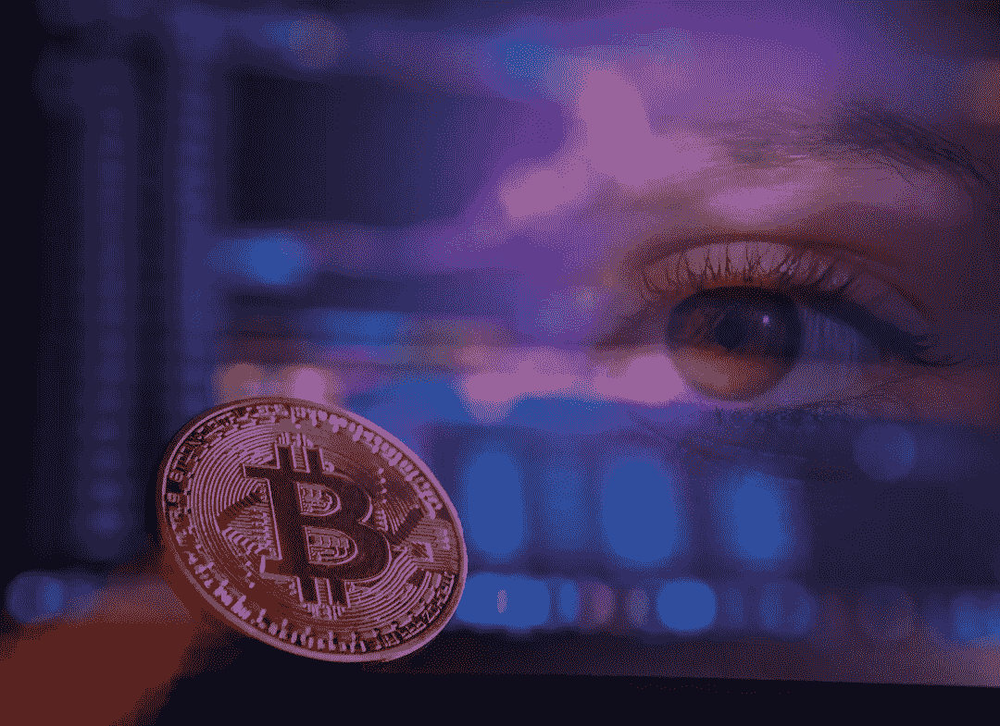

# 对加密欺诈的担忧被夸大了

> 原文：<https://medium.com/coinmonks/crypto-fraud-fears-are-overblown-a95bbe517e57?source=collection_archive---------16----------------------->

似乎有永无止境的负面头条新闻警告加密欺诈。但是真的有那么糟糕吗？

Image: Pixteller

> 合法的机构在历史上面对赤裸裸的欺诈是毫无防备的——加里·韦斯

# 加密欺诈正在激增？

随着传统新闻媒体继续其缓慢的死亡螺旋，它们在小报新闻业的根基真正开始显现。在对新闻机构的信任度方面，美国将[排在最后](https://www.poynter.org/ethics-trust/2021/us-ranks-last-among-46-countries-in-trust-in-media-reuters-institute-report-finds/)。你怎么能责怪我们呢？

右翼媒体面无表情地说，对美国国会大厦[的袭击并没有发生。左翼媒体面无表情地说骚乱是和平的。不知何故，双方似乎都认为密码欺诈是一个巨大的问题。](https://www.rollingstone.com/politics/politics-news/jan-6-conspiracy-theories-capitol-riot-antifa-1278597/)

美国国税局真的看到了密码欺诈的大山吗？加密欺诈在加拿大真的会爆发吗？有可能这都是真的。真正的问题是:与什么相比？

欺诈的“山”看起来像什么？我们谈论的“爆炸”有多大？换句话说，如果我损失了 10，000 美元，那对我来说可能是一个“爆炸性”的损失。如果谷歌损失了 1 万美元，那几乎没有任何意义。

如果我们担心成为欺诈的受害者，重要的是我们成为受害者的可能性。例如，如果有 1000 万笔交易和 10 起欺诈事件，那就相当安全了。但如果有 1000 万笔交易，其中 200 万笔是欺诈性的，我们就需要非常小心了。

加密领域是否存在欺诈活动？绝对的。它比信用卡更糟糕吗？或者一般的银行业。或者社会保障骗局，身份盗窃，房地产欺诈，门廊海盗，或任何数以千计的方式，人们可以用来窃取你的钱？让我们来了解一下！

# 密码欺诈有多严重？

首先，我们来看看标题以外的内容。根据来自 Coinmarketcap 的数据，2020 年，整个加密领域的交易量约为 54 万亿美元。相比之下，据[尼尔森](https://nilsonreport.com/mention/1515/1link/)称，主要信用卡公司在 2020 年完成了价值约 42 万亿美元的交易。

虽然不能完全相提并论，但至少交易量大致相当。那么，它们是如何叠加的呢？好吧，我不想把它透露给 [FUD](https://en.wikipedia.org/wiki/Fear,_uncertainty,_and_doubt) 博伊斯(和记者们)，但是对我来说 crypto 看起来更安全。

**2020 年信用卡:**

*   信用卡交易:42 万亿美元
*   信用卡欺诈:280 亿美元
*   欺诈率:0.06%

**2020 年的 Crypto:**

*   加密交易:54 万亿美元
*   加密欺诈:[19 亿美元](https://ciphertrace.com/2020-year-end-cryptocurrency-crime-and-anti-money-laundering-report/#summary)
*   欺诈率:0.0035%

我试着做了一个图表，但与交易量相比，两者的欺诈率都很低，你看不到欺诈数字。同样值得一提的是，与 2019 年相比，加密欺诈[下降了*超过 50%。尽管同期交易量出现“爆炸式”增长。*](https://ciphertrace.com/2020-year-end-cryptocurrency-crime-and-anti-money-laundering-report/#summary)

*与此同时，2020 年信用卡交易量下降了 0.08%，但欺诈行为年复一年几乎没有变化。从这个角度来看，每 100 美元的信用卡交易中，0.06 美分是欺诈性的。对于加密，每 1000 美元要 0.03 美元。*

*此外，加密领域的大部分欺诈来自于[地毯式](https://coinmarketcap.com/alexandria/glossary/rug-pull)和[退出骗局](https://www.investopedia.com/tech/whats-cryptocurrency-exit-scam-how-spot-one/)。对于那些不知道的人来说，通过拉地毯和退出骗局，创始人从一个项目中拿走了资金并跑路了。它们只是在执行方式上略有不同。*

*反过来，信用卡领域的大多数欺诈是[好的老式欺诈](https://www.ftc.gov/system/files/documents/reports/consumer-sentinel-network-data-book-2020/csn_annual_data_book_2020.pdf)。伪造、身份盗窃、伪造账户、退款、电话诈骗、暗网名单等。这些都是信用卡公司 50 多年来一直面临的基本问题，他们最多只能忍受每年 6%的欺诈。*

*Crypto 没有这些限制。你可以写合同，防止地毯拉和退出骗局。你可以教人们如何识别这些骗局。这是密码领域的欺诈行为从 2019 年到 2020 年下降 50%的重要原因。修正代码，强化基础设施，教育用户，问题会变得更好。*

*你今天读到的绝大多数“黑客”都是由社会工程创造的[，这是有原因的。就目前的网络和软件技术而言，攻击正确配置的网络和计算机系统是非常困难的。这确实发生了，但更多的时候，这是一个民族国家，而不是一些俄罗斯孩子在他妈妈的地下室。](https://usa.kaspersky.com/resource-center/definitions/what-is-social-engineering)*

*诚然，黑客攻击确实发生在加密领域。但是在 2020 年，黑客攻击只造成了大约 5 亿美元的损失[。考虑到 54 万亿美元的交易量，我们谈论的是由于黑客攻击造成的 0.00093%的欺诈率。](https://ciphertrace.com/2020-year-end-cryptocurrency-crime-and-anti-money-laundering-report/#_ftn1)*

*因此，一个 3 亿美元的黑客攻击当然会成为头条新闻。孤立起来听起来很恐怖。但在上下文中，受害的风险是如此之低，几乎不值一提。更大的问题在于退出骗局，但即便如此，与信用卡相比也微不足道。与信用卡不同，加密诈骗有可行的解决方案。*

# *但是银行是安全的…*

*这里有一个小小的思想实验。如果你走进银行，存入一张 25 万美元的支票，然后要求向海外电汇 5 万美元，会发生什么？我可以给你一个主意。*

*光是存款就会触发一份可疑活动报告(SAR)送到执法部门。这是联邦政府对任何大额或异常交易的要求。电汇也会触发一个单独的 SAR。您必须提供发件人和收件人信息，包括 ID、帐号和路由号。你可能会回答银行出纳员、银行经理和反欺诈部门的许多问题。*

*电线不可能在同一天熄灭。在支票清算自动票据交换所(ACH)系统时，您将一直等待。这可能需要至少 3-4 天，但出于“谨慎”，可能需要更长时间。然后，电线必须传输和清除，这将是另一个几天，也许一周取决于国家。*

*将有一个出境电汇费，这可能是相当高的海外。您的收件人可能还会收到一笔电汇费用。银行有义务向美国财政部外国资产控制办公室(OFAC)报告该交易。如果你的收件人在一个“被禁”的国家，你的电汇资产可能会被 OFAC 冻结。*

*如果触发反洗钱(AML)风险算法，电汇也可能被冻结。这里有一段[的引言总结了](https://papers.ssrn.com/sol3/papers.cfm?abstract_id=2912458)当局必须做的事情:*

> *“全面地——但也是动态地——从近 200 个前提罪行的清单中选择，主观地将它们与近 200 个不同的政治、经济、社会、技术、环境、立法和体制因素联系起来，然后将其与一个不确定的后果清单进行比较，这些后果可能会发生，也可能不会发生，因为仍然不确定的风险正在显现”*

*如果你的资产因为触发了错综复杂的反洗钱法规而被冻结，你的资金将会被冻结一段时间。几个月，或者几年。事实上，你可能永远也拿不回来，因为法律费用可能不值得。*

*即使这些都没有发生，你的收款人也可能被收款银行或在那里工作的人敲诈。这在低收入和不发达国家很常见。或者接收国当局可能会没收它。没有什么能真正阻止他们，你又能做些什么呢？*

# *密码差异*

*让我们看看如果我使用一枚[稳定硬币](https://www.investopedia.com/terms/s/stablecoin.asp)，这个过程会如何进行。我会打开钱包，输入收件人地址，然后按下发送键。大约一分钟后，他们就拿到了 5 万美元。我唯一真正的风险是丢失钱包的钥匙，或者输入错误的地址。*

*就是这样。*

*嗯，我想稳定的硬币可能会崩溃。不过话说回来，[美元](/coinmonks/the-rise-and-fall-of-financial-empires-8e4bc3d7d5f8)也可以。诸如此类的事情是存在的，但它们是[尾部概率](https://www.sciencedirect.com/topics/computer-science/tail-probability)。无论如何都很难防范。*

*所有这一切的要点是，加密比标题可能暗示的要安全得多。真正的风险是相对的，应该始终放在上下文中。但是加密也需要个人的责任感。*

*这种交易给你带来了比 legacy finance 梦寐以求的更安全的交易。更不用说几乎即时结算，没有中间人，没有勒索或贿赂来获得资金，也没有第三方的干扰。*

*我提到低费用了吗？*

## *外卖*

*忽略标题。对加密欺诈的担忧被夸大了。它肯定比信用卡安全，而且我不会因为这两种信用卡而失眠。暂时就这样吧，下次见，注意安全，聪明点，一定要[拴骆驼](https://www.oxfordreference.com/view/10.1093/acref/9780199539536.001.0001/acref-9780199539536-e-2318)。*

> *加入 Coinmonks [电报频道](https://t.me/coincodecap)和 [Youtube 频道](https://www.youtube.com/c/coinmonks/videos)了解加密交易和投资*

## *另外，阅读*

*   *[买 PancakeSwap(蛋糕)](https://coincodecap.com/buy-pancakeswap)|[matrix export Review](https://coincodecap.com/matrixport-review)*
*   *[最佳免费加密信号](https://coincodecap.com/free-crypto-signals) | [YoBit 评论](/coinmonks/yobit-review-175464162c62) | [Bitbns 评论](/coinmonks/bitbns-review-38256a07e161)*
*   *[OKEx 回顾](/coinmonks/okex-review-6b369304110f) | [Kucoin 交易机器人](/coinmonks/kucoin-trading-bot-automate-your-trades-8cf0ca2138e0) | [期货交易机器人](/coinmonks/futures-trading-bots-5a282ccee3f5)*
*   *[AscendEx Staking](https://coincodecap.com/ascendex-staking)|[Bot Ocean Review](https://coincodecap.com/bot-ocean-review)|[最佳比特币钱包](https://coincodecap.com/bitcoin-wallets-india)*
*   *[霍比审核](https://coincodecap.com/huobi-review) | [OKEx 保证金交易](https://coincodecap.com/okex-margin-trading) | [期货交易](https://coincodecap.com/futures-trading)*
*   *[比特币基地赌注](https://coincodecap.com/coinbase-staking) | [热点评论](/coinmonks/hotbit-review-cd5bec41dafb) | [库币评论](https://coincodecap.com/kucoin-review)*
*   *购买 Dogecoin 的 7 种最佳方式*
*   *[iTop VPN 审查](https://coincodecap.com/itop-vpn-review) | [曼陀罗交易所审查](https://coincodecap.com/mandala-exchange-review)*
*   *[比特币基地 vs 瓦济克斯](https://coincodecap.com/coinbase-vs-wazirx) | [比特鲁点评](https://coincodecap.com/bitrue-review) | [波洛涅克斯 vs 比特鲁](https://coincodecap.com/poloniex-vs-bittrex)*